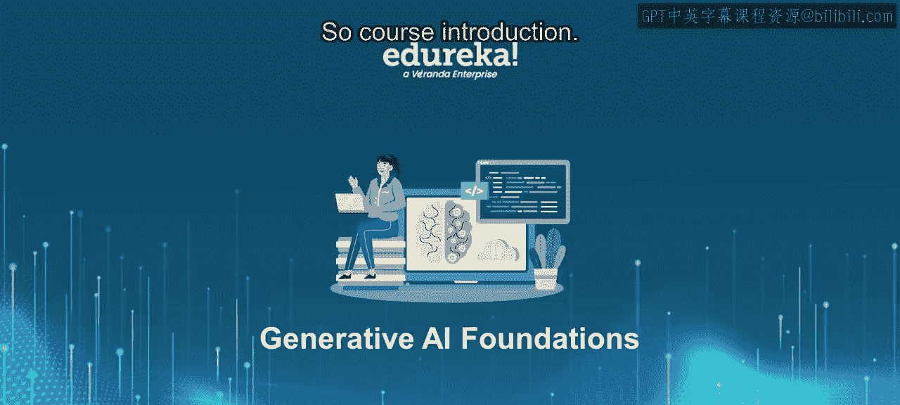
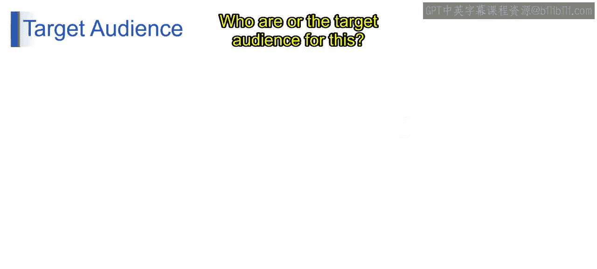
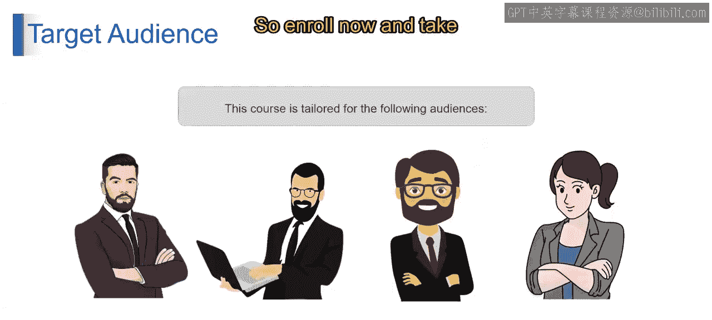
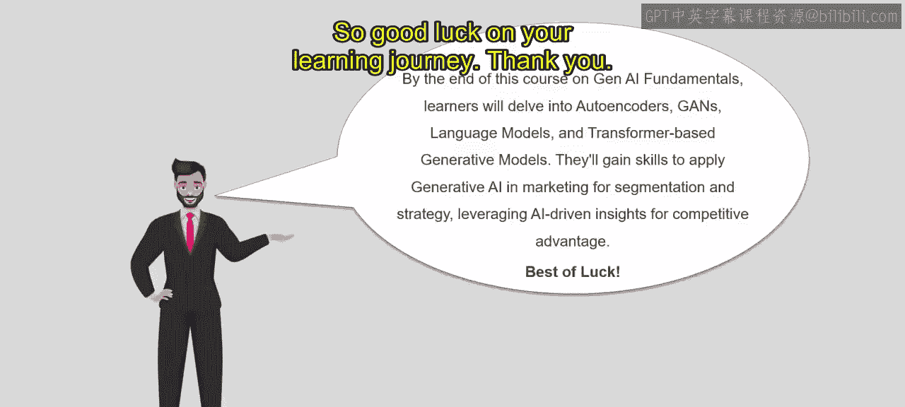

生成式人工智能与大型语言模型：第1：课程介绍

在本节课中，我们将开启生成式人工智能世界的探索之旅，快速了解课程的核心内容与目标受众。

课程将引导我们深入生成式人工智能的核心概念与技术。以下是课程将要涵盖的主要内容。

**生成式人工智能基础**
我们将首先建立对生成式人工智能的基础理解，从了解其定义开始，到探索其在各领域的应用。本节将提供一个全面的概述。

**自编码器与生成对抗网络**
接下来，我们将深入生成式人工智能的基础技术，即自编码器和生成对抗网络。你将学习这些模型的工作原理，以及它们如何被用于生成具有卓越真实感的新数据。课程不仅涉及GANs，我们还将理解所有生成式人工智能大型语言模型。

**语言模型与基于Transformer的生成模型**
随后，我们将探索语言模型的变革性力量，包括革命性的Transformer架构。你将发现这些模型如何重塑自然语言处理和生成任务。

**课程总结与评估**
最后，我们将通过总结关键要点并讨论如何应用新获得的基础知识来结束本次旅程。此外，我们还将进行课程评估，以巩固你的理解并追踪学习进度。

那么，本课程的目标受众是谁呢？以下是主要人群。

**AI或机器学习工程师**
如果你已在AI或机器学习领域工作，并希望加深对生成式人工智能技术的理解，本课程非常适合你。你可以深入了解前沿方法，将技能提升到新的水平。

**初学者**
如果你是AI领域的新手，并渴望探索其可能性，无论你是应届毕业生还是希望转型进入AI领域的人士，本课程都提供了坚实的生成式人工智能基础，以启动你的学习之旅。

**数据科学家**
寻求扩展技能并将生成式人工智能技术纳入其工具包的数据科学家将从此课程中受益匪浅。你将学习如何利用生成模型来生成合成数据、增强数据增强技术等。

**研究人员**
如果你从事AI研究，并希望了解生成式人工智能的最新进展，本课程为你量身定制。你可以深入高级主题，探索前沿研究论文，并获得启发以推动自己的研究。

无论你的背景或专业水平如何，本课程都为每个人提供了有价值的内容。在本课程结束时，你将探索自编码器、GANs、语言模型和基于Transformer的生成模型。你将学习如何在营销等领域应用生成式人工智能，例如进行受众细分和利用AI驱动的洞察来规划策略，从而在竞争中保持领先。

祝你在学习旅程中一切顺利。