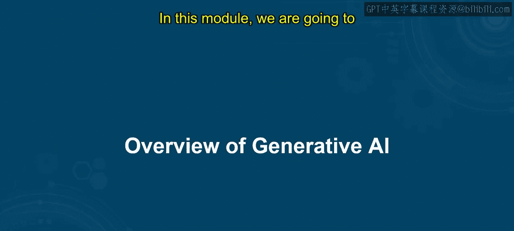
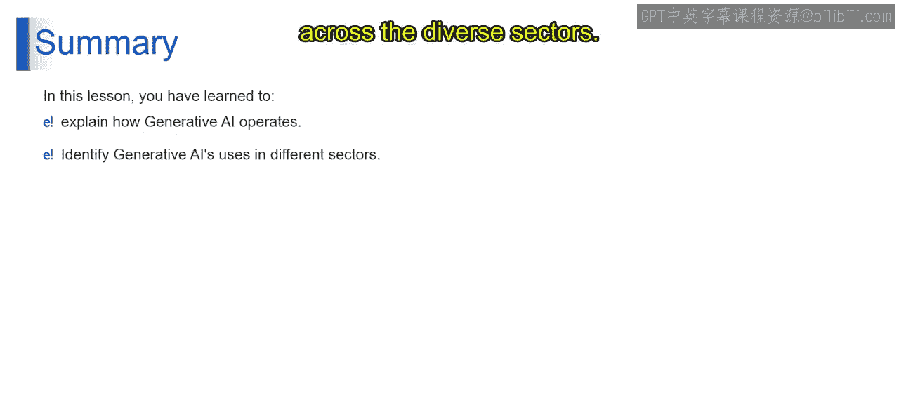

# 第二三四部分 2：生成式AI概述 🚀

在本节课中，我们将深入探索生成式AI的迷人世界，了解它是什么以及它是如何工作的。

## 概述

在充满各种技术进步的世界里，为什么生成式AI能成为焦点？我们将探讨其备受关注的原因，并理解为何在众多技术中，生成式AI能脱颖而出，吸引全球目光。接下来，我们将了解围绕生成式AI的巨大热潮，世界为何如此着迷于这项技术，以及是什么让它成为游戏规则的改变者。在本模块中，我们将一起揭开这份激动。

## 生成式AI简介

生成式AI因其无与伦比的创造力而脱颖而出，它跨越行业界限，在艺术、音乐和内容创作方面展现出类人的能力。其适应性激发了全球的兴趣，预示着在各个领域的创新。该技术的革命性个性化能力迎合了个人偏好，使其在追求以人为中心的体验中扮演关键角色。生成式AI的持续评估和创新，维持了人们对突破性进展的期待氛围。除了作为工具，它还致力于解决社会挑战，在医学研究和环境问题方面提供解决方案。这种动态特性，加上其对全球产生积极影响的潜力，共同促成了其过热关注，并捕获了全世界的想象力。

## 什么是生成式AI？

那么，它究竟是什么？简单来说，生成式AI指的是能够生成新颖多样内容的人工智能应用。这可能包括从文本、图像到音乐，甚至代码的任何内容。其真正非凡之处在于，它生成的内容通常与人类创造的内容难以区分。为了更好地理解这个概念，让我们考虑一个实际例子。

## 生成式AI的关键方面

这些方面对于理解生成式AI如何实现其惊人能力起着非常重要的作用。以下是其关键方面：

**复杂模型**
可以将这些模型视为生成式AI背后的“大脑”。想象一个具有层层互连节点的神经网络，类似于人脑。这种复杂性使AI能够从学习的数据中捕捉复杂的模式和细节。从技术上讲，这些复杂模型指的是复杂的神经网络，通常使用诸如**GANs（生成对抗网络）** 或 **LSTMs（长短期记忆网络）** 等架构。这些模型使生成式AI能够理解并复制其在训练过程中接触到的内容。

**创新输出**
生成式AI不仅仅是复制，更是创造新颖和创新的内容。想象一个AI系统生成一件突破我们以往所见界限的艺术品或音乐。这方面与AI不仅模仿现有模式，还能生成新颖和创造性输出的能力相一致。模型的复杂性使生成式AI能够探索和实验，产生超越其训练数据所见的内容。

**大型数据集**
可以将这些数据集视为生成式AI的“燃料”。数据越多样、越广泛，AI的理解就越丰富，其输出也就越令人印象深刻。从技术上讲，大型数据集对于有效训练生成式AI模型至关重要。这些数据集作为基础，为AI提供了大量学习样本，帮助其进行泛化，并创造出能捕捉数据本质的内容。

**定制化内容**
生成式AI不是一种“一刀切”的工具。它可以被训练来生成特定风格、流派或主题的内容。这就像拥有一个理解你偏好并据此创建内容的个人助手。这涉及对AI模型进行微调，通过有针对性的训练，使其产生符合特定标准的输出，展示了其定制化能力。

**伦理考量**
虽然生成式AI开启了令人兴奋的可能性，但也带来了伦理挑战。例如，一个AI系统可能生成被恶意使用或用于不道德目的的内容。从技术角度来看，伦理考量涉及在开发过程中建立保障措施和负责任的AI实践。这可能包括实施机制以防止生成有害或不适当的内容，并确保AI系统运行的透明度。

**可扩展性**
可扩展性指的是生成式AI模型处理增加的复杂性和工作负载的能力。这涉及优化算法和基础设施，以确保AI能够随着系统需求的增长而提升其性能。这些关键方面提供了关于生成式AI构成要素的整体视图，从其模型的复杂性到伦理考量和可扩展性，每个元素都在塑造生成式AI的能力和影响力方面发挥着至关重要的作用。

## 总结

在本节课中，我们一起探索了生成式AI如何运作，它利用复杂模型、创新输出、大型数据集和定制化内容创作。我们重点介绍了其关键方面，以及随之而来的多项特性，并强调了伦理考量和可扩展性作为关键要素。此外，我们还涵盖了其在多个领域的实际应用，展示了生成式AI在短短几行文字中的变革潜力。