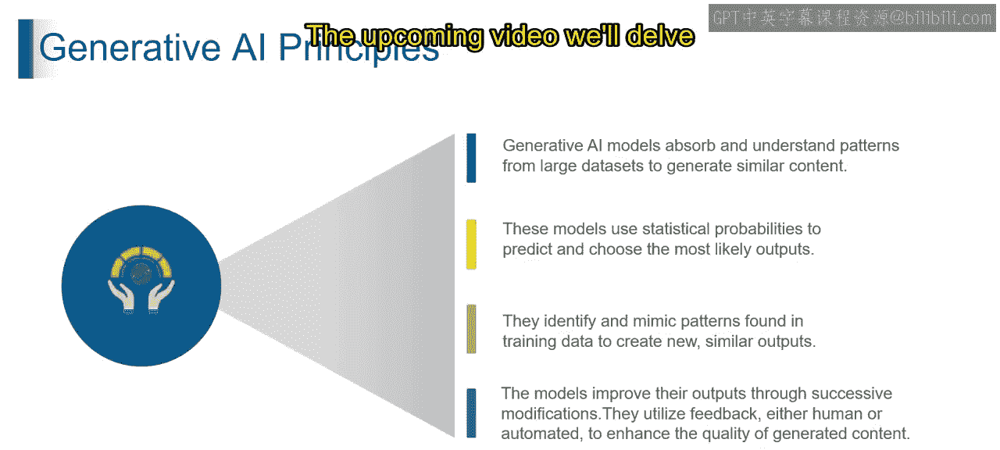

生成式AI入门：第2：生成式AI核心原理

在本节课中，我们将学习生成式人工智能的核心原理。通过本节内容，你将能够理解支配生成式AI运作的基本法则。

生成式AI的原理主要基于四个核心概念。这些概念共同构成了AI从数据中学习并创造新内容的基础。

以下是生成式AI的四大核心原理：

1.  **从海量数据集中吸收模式**
    生成式AI首先从海量数据集中吸收模式，这类似于从一个巨大的示例库中学习。可以将其想象成一个聪明的学生，正在研究一个庞大的书籍收藏。从技术上讲，这一原理涉及在多样化的数据集上训练AI模型。AI会详细学习每一个模式，理解不同元素之间如何相互关联。

2.  **运用统计概率**
    生成式AI运用统计学的“魔法”来预测并选择最可能的输出。这就像根据一个句子中已经出现的单词来预测下一个单词。这一原理涉及使用概率分布。AI会计算各种结果的可能性，并预测出最符合这些统计预测的那个结果。其核心公式可简化为：`P(输出 | 输入)`，即在给定输入条件下，各种输出的概率。

3.  **识别并模仿模式**
    AI识别并模仿在其训练数据中找到的模式，以创造出新颖且相似的内容。这就像一位艺术家学习不同风格以创作自己的杰作。这一过程涉及AI识别在训练期间所见数据中的模式和结构。通过模仿这些模式，它生成的内容能够反映训练数据的特征。

4.  **通过迭代修改进行改进**
    AI根据反馈（无论是来自人类还是自动化系统）来优化其模型。这种持续的改进会随着时间的推移，提升生成内容的质量。这个过程通常通过优化算法实现，例如梯度下降，其核心思想是：`新模型 = 旧模型 - 学习率 * 梯度`，通过不断调整参数来减少误差。

上一节我们概述了生成式AI的四大支柱。理解这些原理是掌握后续更具体技术和应用的关键。

本节课中，我们一起学习了生成式AI的四个核心原理：从数据中吸收模式、利用统计概率进行预测、识别并模仿模式以生成新内容，以及通过持续反馈进行迭代优化。这些原理共同构成了生成式AI能够学习和创造的基础。在接下来的课程中，我们将深入探讨这些原理的具体应用。