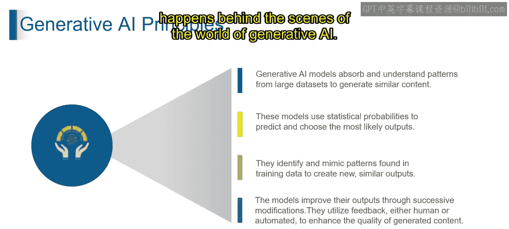
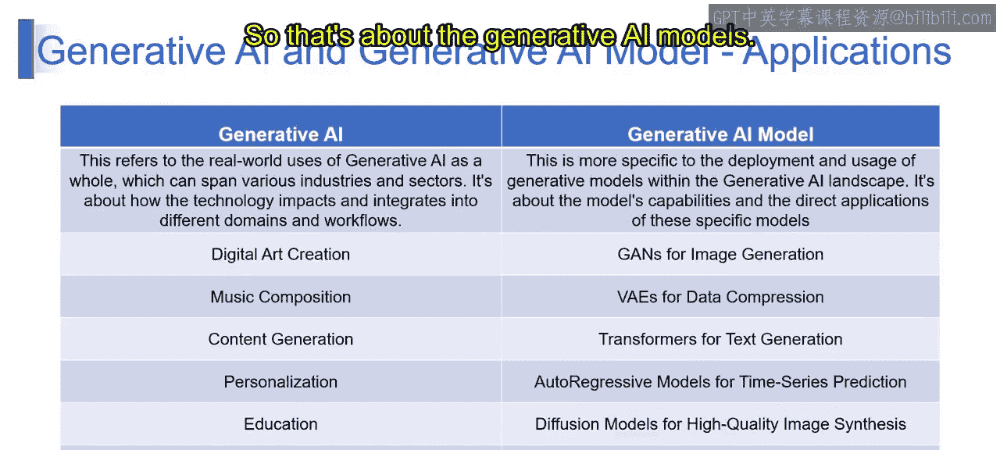
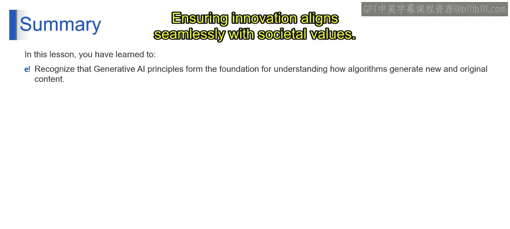

# 第二三四部分 4：生成式AI vs 生成式AI模型 🧠

在本节课中，我们将探讨生成式人工智能及其模型与应用。我们将从上一节讨论的核心原则出发，理解生成式AI如何预测、模仿与改进，并具体了解其在不同领域中的实际应用以及核心的生成式AI模型。

---

上一节我们介绍了生成式AI的核心原则。现在，我们来看看这些原则如何具体体现，并理解生成式AI及其模型。

生成式AI的广泛影响力反映了其在影响和增强各行业方面的多功能性。这项技术通过利用其生成与人类创作难以区分的内容的能力，成为塑造和优化工作流程的强大力量，使其成为技术领域的一股变革性力量。

---

### 生成式AI的应用

以下是生成式AI在几个关键领域的具体应用：

*   **数字艺术创作**：生成式AI展示了其创作原创且视觉吸引力强的内容的能力，通过从海量数据中学习模式来增强艺术创作过程。
*   **音乐作曲**：生成式AI在音乐作曲中的应用突显了其生成创新内容、模仿训练过程中学习到的音乐风格的能力。
*   **内容生成**：生成式AI在内容生成中展示了其作用，能够创建有意义且符合语境的内容，这依赖于其理解和复制模式的能力。
*   **个性化推荐**：生成式AI对个性化的影响展示了其根据个人偏好定制内容的适应性，从而创造独特的用户体验。
*   **教育**：在教育领域，生成式AI成为创建定制教育内容和支持个性化自适应学习体验的宝贵工具，扮演着智能导师的角色。
*   **产品设计**：生成式AI在产品设计中的作用强调了其通过从海量数据集中学习，生成设计选项以贡献于创意过程的能力。

---

### 生成式AI模型

理解了应用之后，本节我们来看看支撑这些应用的生成式AI模型。这些模型特指生成式AI领域中，用于部署和使用的具体生成模型。

以下是几种核心生成式AI模型及其能力：

*   **生成对抗网络**：用于图像生成。GANs复制并创建逼真的图像，如同一位AI艺术家在精炼视觉效果。GAN由**生成器**（创建合成数据）和**判别器**（区分真实图像与生成数据）组成。
    *   `GAN = Generator + Discriminator`
*   **变分自编码器**：用于数据压缩。VAEs高效地压缩数据，如同数据存储的魔术师。VAE使用**编码器-解码器架构**学习以压缩格式表示复杂数据。
    *   `VAE = Encoder + Decoder (for compressed representation)`
*   **Transformer模型**：用于文本生成。Transformer或基于注意力的模型，利用**自注意力机制**，是文本生成的理想选择。
*   **自回归模型**：用于时间序列预测。自回归模型能准确预测未来数据点，如同时间旅行预报员。例如**ARIMA模型**，它基于过去的观测值并考虑数据点之间的依赖性来预测时间序列。
    *   `ARIMA = Autoregressive Integrated Moving Average`
*   **扩散模型**：用于高质量图像合成。扩散模型能创建具有惊人细节的图像，在合成过程中逐步揭示细节。这些模型专注于高质量图像合成，通过迭代减少噪声以获得逼真输出。
*   **条件生成模型**：用于可控生成。条件模型能生成具有特定特征或在预定义条件下的内容，为生成过程提供控制力。

---

在本节课中，我们一起学习了生成式AI的基本概念及其原则。这些原则是理解算法如何产生新颖原创内容的基石。它们也作为指导力量，塑造着生成式AI合乎道德与负责任的应用，确保创新与社会价值无缝结合。