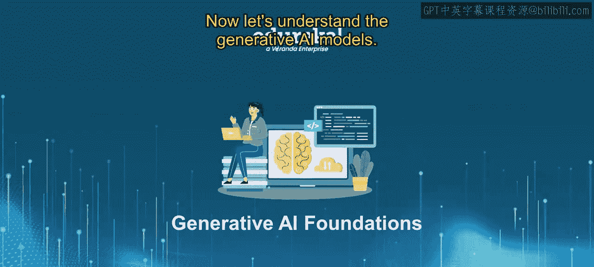
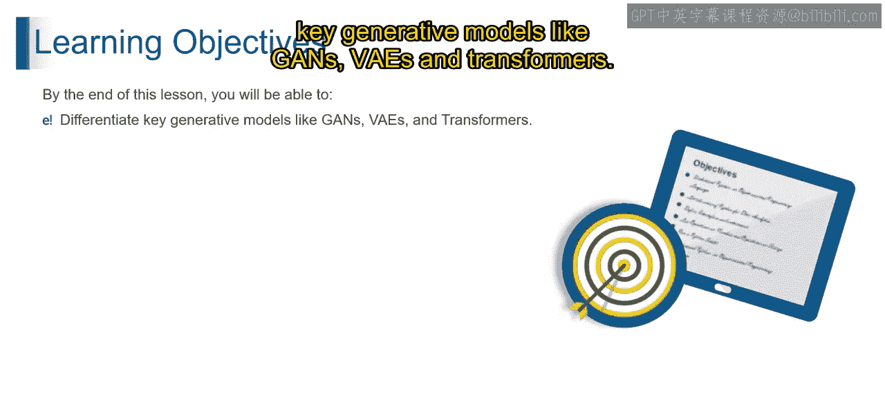
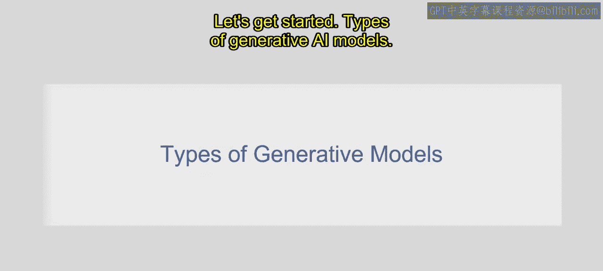
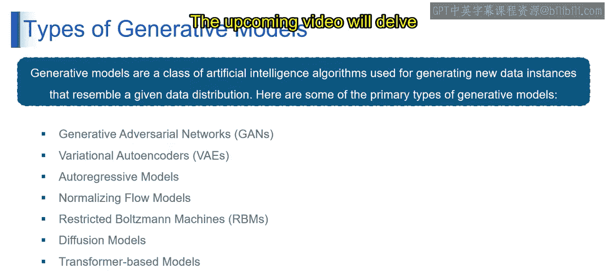

# 第二三四部分 5：理解生成式AI模型

在本节课中，我们将学习生成式AI模型的核心概念与主要类型。课程结束时，你将能够理解并区分诸如GANs、VAEs和Transformer等关键生成模型。

## 概述

生成式AI模型是一类人工智能算法，其设计目标是生成与给定数据分布高度相似的新数据实例。简而言之，它们能创造出模仿其训练数据模式的新颖且逼真的数据。

上一节我们介绍了生成式AI的基本概念，本节中我们将深入探讨其具体模型类型。

以下是不同类型的生成模型：

*   **生成对抗网络**
*   **变分自编码器**
*   **自回归模型**
*   **标准化流模型**
*   **受限玻尔兹曼机**
*   **扩散模型**
*   **基于Transformer的模型**
*   **基于能量的模型**
*   **条件生成模型**

接下来，我们将通过易于理解的例子来逐一解析这些模型。

## 生成对抗网络

想象艺术界的一场猫鼠游戏：一位伪造者创作精美的画作，而一位侦探的任务是辨别哪些是真迹，哪些是赝品。这场持续的较量体现了GANs的精髓。伪造者是**生成器**，负责创造数据；侦探是**判别器**，试图区分真实数据与生成数据。它们相互竞争，最终导致极其逼真的数据被创造出来。

从技术角度看，**生成对抗网络**是一种生成模型，其中两个神经网络——生成器与判别器——在持续的对抗中相互竞争。生成器创造数据，判别器评估其真实性。通过这个过程，GANs能生成与原始数据分布高度相似的数据。

## 变分自编码器

想象一个学生为了高效学习而总结笔记。现在，我们加入一点创意：这个学生每次重新整理笔记时，都会有意引入一点随机性。这种随机性元素正是**变分自编码器**的核心。

VAEs通过在生成过程中引入随机变化，为生成的数据增添了多样性和独特性。技术上讲，**变分自编码器**是一种生成模型，它在传统的自编码器架构中引入了概率元素。它们通过在编码和解码过程中融入随机性，来生成多样且新颖的数据实例。

## 自回归模型

设想写一个故事，其中每个单词都依赖于它前面的单词。自回归模型的工作方式与此类似。想象一下，基于句子中已有的单词来预测下一个单词。这些模型按顺序生成数据，其中每个元素都依赖于之前的元素，就像逐字构建一个故事。

从技术角度理解，**自回归模型**是一种以顺序方式一次生成一个数据元素的生成模型。每个元素都以之前的元素为条件，从而捕捉数据分布内的依赖关系。

## 标准化流模型

想象一条河流流经一片土地，通过多种路径到达目的地。标准化流模型以类似方式运作，通过一系列变换，将简单的初始数据分布转化为更复杂的分布。这就像塑造数据景观以匹配期望的输出。

技术上讲，**标准化流模型**是一种生成模型，它使用一系列可逆变换将简单分布映射到更复杂的分布。这使得它们能够生成具有复杂模式和结构的数据。

## 受限玻尔兹曼机

想象一个房间里有许多音乐家在演奏各种乐器。每位音乐家代表一个特征，他们的协作产生了美妙的音乐，这象征着**受限玻尔兹曼机**生成的数据。

RBM模型能捕捉特征之间的复杂关系，捕获数据内部的依赖关系。技术上讲，**受限玻尔兹曼机**是一种生成模型，它学习其输入数据集合上的概率分布，捕捉输入特征之间的依赖关系，使其能有效生成具有复杂关系的数据。

## 扩散模型

想象在房间里喷洒香水。最初，香气集中在一个区域，但随着时间的推移，它会扩散到房间的每个角落。扩散模型以完全相同的方式运作，从简单且集中的数据开始，逐步将复杂性扩散到整个数据集。

技术上讲，**扩散模型**是一种生成模型，它通过模拟从简单到复杂的逐步扩散过程来生成数据。

## 总结

本节课中，我们一起学习了生成式AI模型的多种类型及其核心工作原理。我们了解了生成对抗网络中生成器与判别器的对抗博弈，变分自编码器引入的随机性与多样性，自回归模型的顺序生成逻辑，标准化流模型的可逆变换，受限玻尔兹曼机对特征关系的捕捉，以及扩散模型从简单到复杂的渐进过程。理解这些基础模型是掌握更高级生成式AI应用的关键。