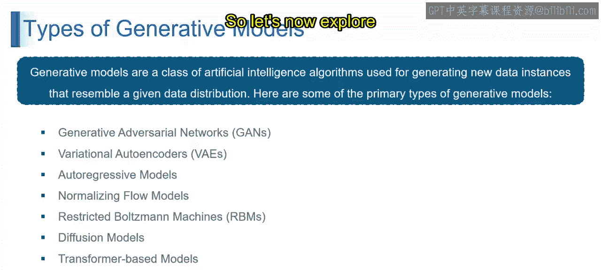
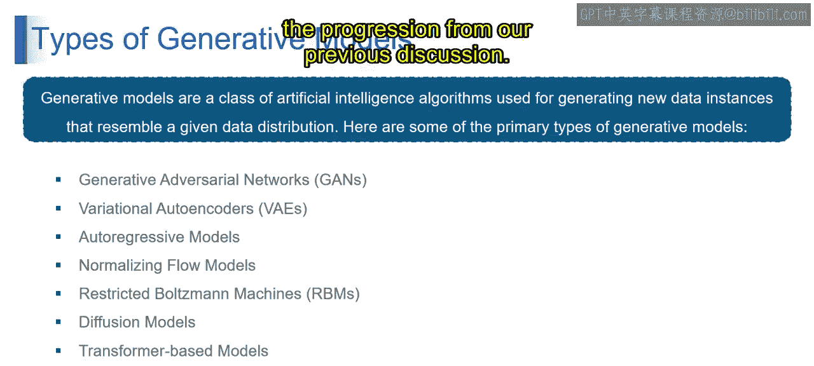
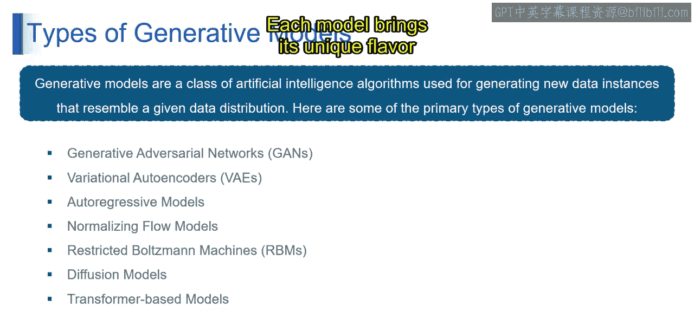
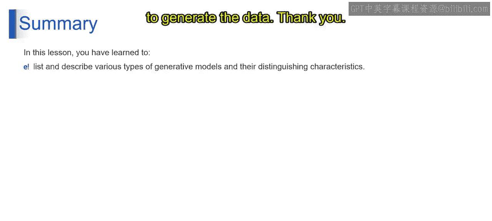

# 第二三四部分 6：基于Transformer的能量条件生成模型

在本节课中，我们将学习生成式AI中几种核心模型的原理与特点。我们将从扩散模型开始，逐步探讨基于Transformer的模型、能量模型以及条件生成模型，了解它们如何以不同的方式创造数据。

上一节我们介绍了扩散模型的基本思想，本节中我们来看看其他几种重要的生成式模型。

## 基于Transformer的模型

想象一个多语言翻译器，可以轻松地在不同语言间切换。基于Transformer的模型，例如著名的GPT-3，其工作原理与此类似。它们处理数据，并通过关注输入的不同部分来生成数据，从而捕捉复杂的关系并产生上下文丰富的输出。

从技术上讲，基于Transformer的模型是一种利用注意力机制来处理和生成数据的生成模型。其核心在于通过关注不同位置的不同元素，来捕捉数据内部的依赖关系，这使得它们功能强大且用途广泛。

**核心机制**：注意力机制。模型在处理序列时，会为序列中的每个元素计算一个“注意力分数”，以决定在生成当前输出时应该“关注”输入序列的哪些部分。这可以用一个简化的公式表示：

`Attention(Q, K, V) = softmax(QK^T / sqrt(d_k)) V`

其中，`Q`（查询）、`K`（键）、`V`（值）是输入序列的线性变换。

## 能量模型

能量模型，也称为EBM。想象一个地形景观，物体自然地沉降到较低或最低点，就像一个球滚入山谷。EBM的运作方式与此类似，它为更可能的数据点分配更低的能量值。模型的目标是找到最低的能量状态，这代表了最可能的数据分布。

从技术术语上讲，EBM是一种为数据的每种可能配置分配一个能量值的生成模型。能量越低，该配置的可能性就越高，从而引导模型生成符合期望分布的数据。

**核心概念**：能量函数 `E(x)`。模型学习一个函数，为数据样本 `x` 分配一个标量能量值。生成数据的目标是找到使能量 `E(x)` 最小化的 `x`。概率可以通过能量函数定义：`P(x) = exp(-E(x)) / Z`，其中 `Z` 是归一化常数。

## 条件生成模型

考虑一位厨师，他可以根据顾客的具体偏好制作各种菜肴。条件生成模型的工作方式与此类似，它基于给定的条件生成具有特定特征或属性的数据。这就像厨师根据顾客的独特要求定制一道菜。

从技术上讲，条件生成模型是一种在数据生成过程中考虑额外信息（称为条件）的生成模型。这些条件引导模型产生具有特定属性或特征的数据。

**核心思想**：在标准生成模型 `P(x)` 的基础上，引入条件变量 `c`，建模条件分布 `P(x|c)`。这意味着数据的生成过程受到条件 `c`（如文本描述、类别标签等）的引导。

## 总结

本节课中我们一起学习了生成式AI中几种关键的模型范式。

从生成对抗网络到条件生成模型，每种模型都具有其独特的特点。无论是通过对抗性博弈、控制随机性、处理序列依赖还是进行复杂变换，这些模型都为生成数据提供了多样且富有创造力的方法。每一种模型都为生成式AI的世界带来了独特的视角和能力。