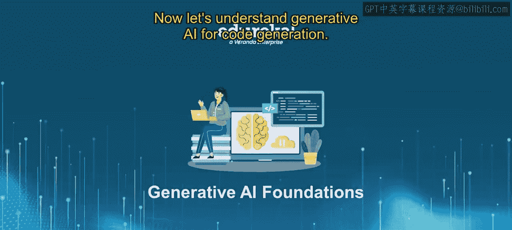
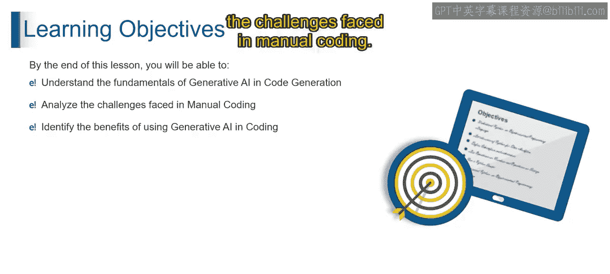
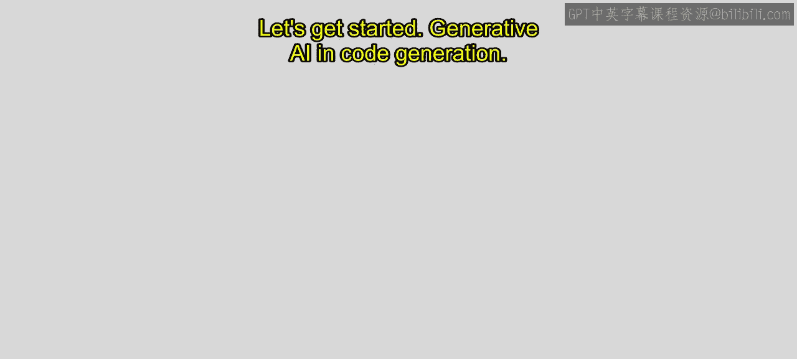
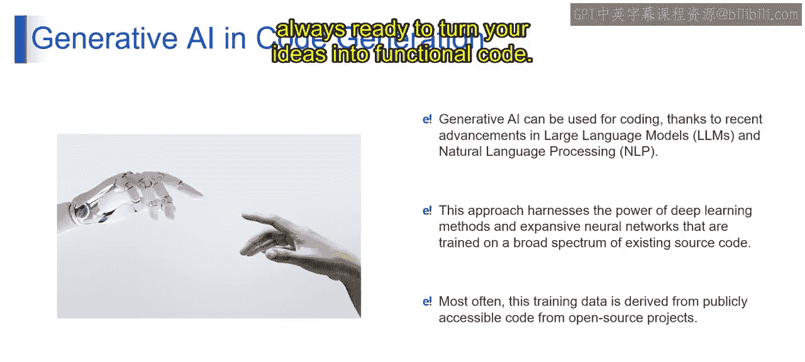
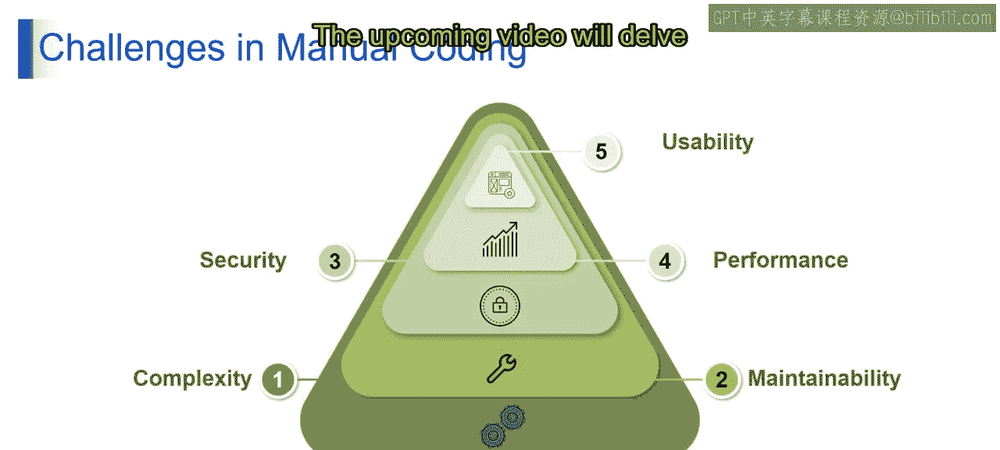

# 第二三四部分 7：用于代码生成的生成式AI 🧑‍💻

在本节课中，我们将要学习生成式AI在代码生成领域的应用。我们将探讨传统手动编码面临的挑战，以及使用生成式AI进行代码生成所带来的诸多好处。

---

想象一个计算机不仅能理解我们的语言，还能为我们编写代码的世界。这种“魔法”是由**大语言模型**和**自然语言处理**领域的最新进展实现的。让我们深入探索这个迷人的领域，看看AI如何成为我们的编程伙伴。

## 从深度学习魔法中汲取力量

你是否曾希望身边有一位编码伙伴？得益于生成式AI，这个梦想正在变为现实。这种前沿方法利用了深度学习和海量神经网络的强大能力。

这些数字天才在大量现有源代码的宝库上进行训练，使它们成为代码编写大师。可以将神经网络视为编码世界的超级英雄。这些网络不仅庞大，而且是巨型的。通过在真实世界源代码的广阔谱系上进行训练，它们已成为计算机语言专家。最棒的是，它们已准备好协助你的编码冒险。

那么，这些神奇的训练数据从何而来？它就像一个从开源项目的宝库中收集的秘密配方。想象一下，从全球无数开发者的集体智慧中学习编码艺术。生成式AI汲取这些知识，成为你个人的编码导师。

想象一下：你用简单的英语表达你的编码想法，而你的AI伙伴将其转化为一行行代码。这就像用你能理解的语言与计算机对话，让编码变得轻而易举，即使对于大型项目也是如此。因此，生成式AI成为你的编码助手，随时准备将你的想法转化为功能性代码。

## 理解手动编码的挑战

在领略了生成式AI的潜力之后，让我们先来看看它旨在解决的传统手动编码中存在哪些问题。

以下是手动编码面临的主要挑战：

*   **复杂性**：想象一下用无数复杂的细节建造一座宏伟的摩天大楼。同样地，随着项目增长，手动编码会变得复杂，涉及大量代码行和复杂的结构。这种复杂性不仅使开发耗时，还增加了引入错误或漏洞的可能性。
*   **可维护性**：想象一个需要持续照料才能蓬勃发展的茂盛花园。在手动编码中，随着项目的演进和扩展，维护代码库变得至关重要。代码需要更新、修复和优化，以保持其健康状态，这通常是一项艰巨且耗时的任务。

---

本节课中，我们一起学习了生成式AI如何作为强大的工具应用于代码生成。我们了解了其背后的核心技术——大语言模型和深度学习，并探讨了传统手动编码在复杂性和可维护性方面面临的挑战。在接下来的课程中，我们将继续深入讨论生成式AI在代码生成中的具体益处。