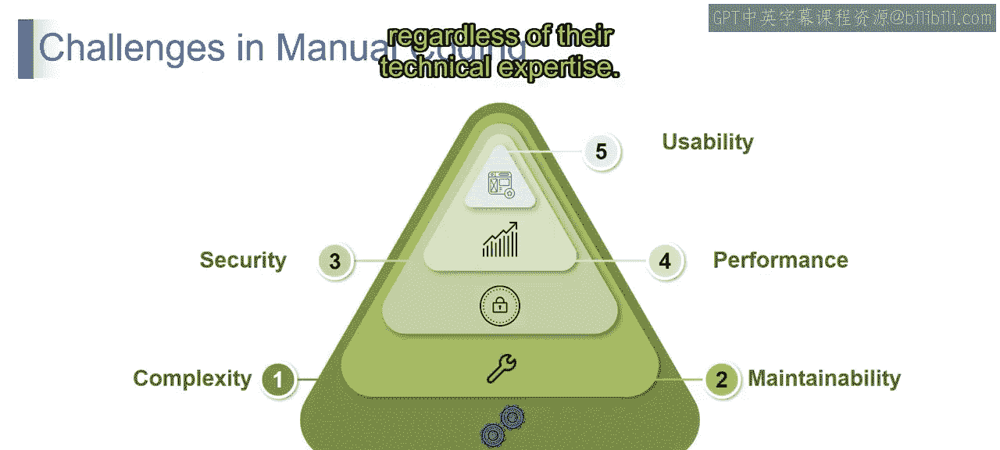
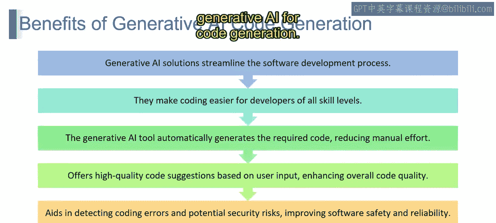
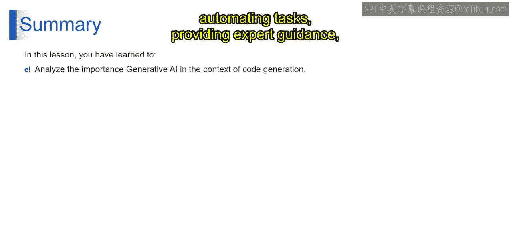

第2：生成式AI代码生成的优势

在本节课中，我们将探讨生成式AI在代码生成领域的优势。我们将从回顾传统手动编码面临的挑战开始，进而了解生成式AI如何应对这些挑战，并最终提升软件开发的效率、质量和安全性。

上一节我们讨论了手动编码在可维护性、安全性、性能和可用性等方面存在的固有挑战。本节中，我们来看看生成式AI如何为代码生成带来变革性的优势。

以下是生成式AI在代码生成中的主要优势：

**1. 简化开发流程**
生成式AI解决方案如同编码世界的数字助手，能够优化工作流程，使从概念到代码的旅程更加高效和顺畅。

**2. 提升开发可及性**
生成式AI为所有技能水平的开发者打开了大门。它就像一个能适应你学习节奏的导师，通过直观的代码生成，即使是初学者也能自信地进入编码领域，从而赋能更广泛的开发者社区。

**3. 实现自动化代码生成**
生成式AI能够自动生成所需代码，处理编码中的重复性工作，让开发者专注于创造性部分。这种自动化不仅减少了人工工作量，还加速了开发进程。

**4. 提供高质量代码建议**
生成式AI能根据用户输入提供高质量的代码建议，如同一位编码导师，提供见解和改进方案，从而提升代码的整体质量并推广软件开发的最佳实践。

**5. 增强软件安全性与可靠性**
生成式AI有助于检测编码错误和安全风险，就像一个警惕的助手，扫描你的工作以发现潜在缺陷，确保代码不仅功能正常，而且健壮安全。

本节课中，我们一起学习了生成式AI在代码生成中的关键作用。通过分析其重要性，我们揭示了生成式AI如何改变编码格局：它简化流程、增强可及性、自动化任务、提供专家指导等。这些优势共同推动软件开发向着更高效、更包容和更可靠的方向发展。

