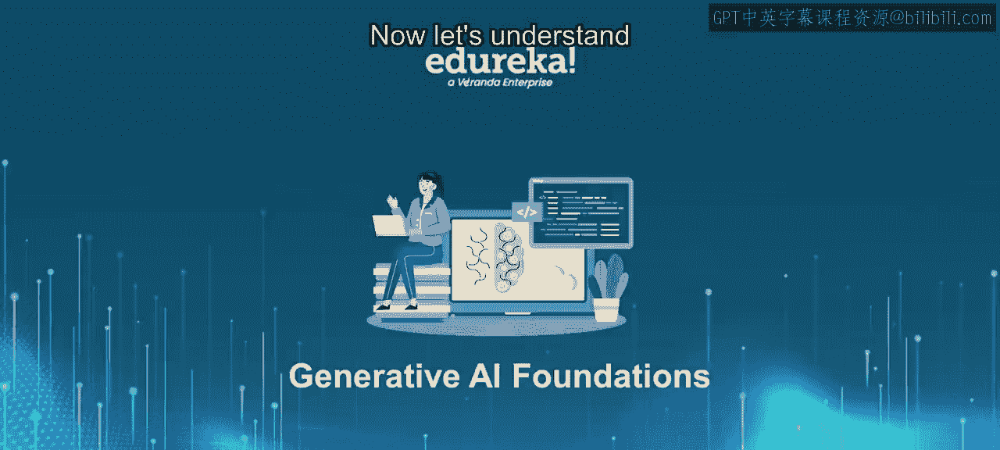
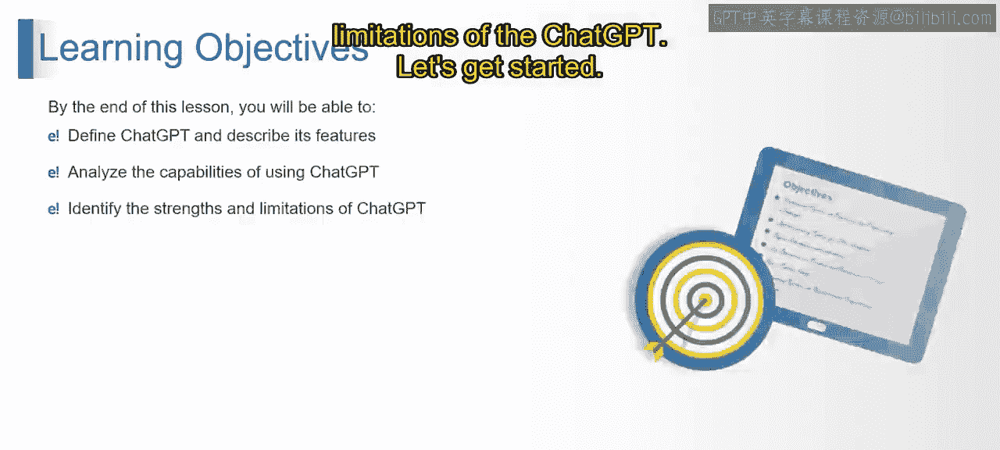
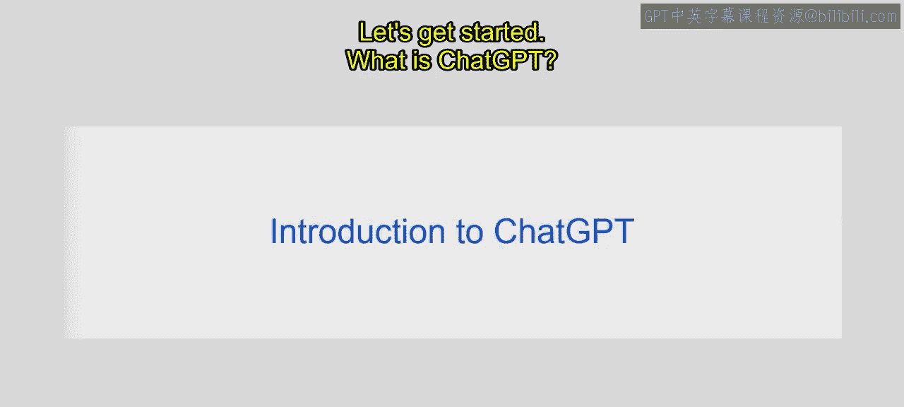
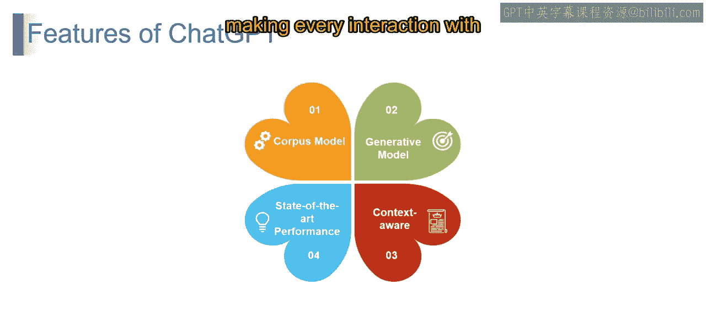
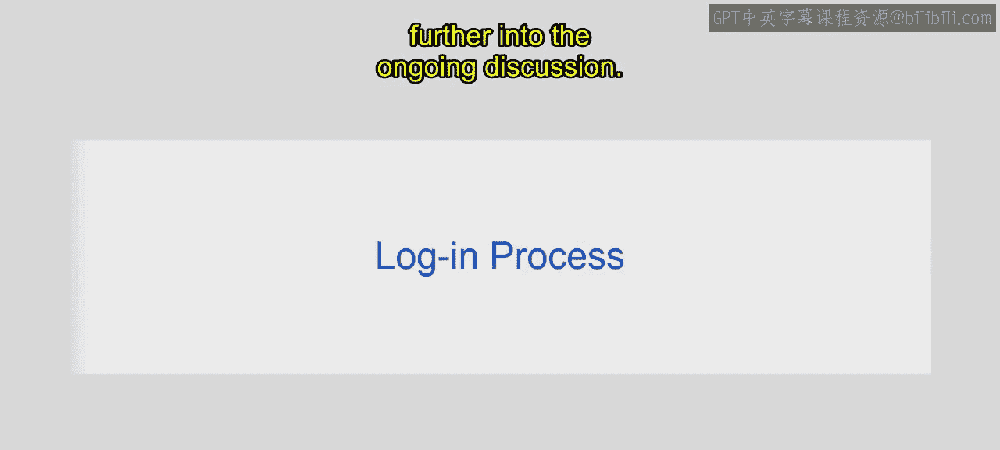

# 第二三四部分 9：ChatGPT入门指南

在本节课中，我们将学习ChatGPT的基本概念、功能特性、登录流程以及其优势与局限性。我们将一起探索这个由OpenAI开发的强大对话式AI模型。

## 什么是ChatGPT？🤖

ChatGPT是您的数字对话伙伴，由OpenAI开发。它就像一个由深度学习驱动的智能伙伴，通过在海量互联网文本数据上进行训练，ChatGPT能够生成类似人类的文本回复，应对您提出的各种问题。准备好进入一个流畅且引人入胜的对话世界，在这里，每次互动都感觉像是在与一位聪明的朋友交谈。

## ChatGPT的核心特性 ✨

上一节我们介绍了ChatGPT是什么，本节中我们来看看它的核心功能特性。这些特性使其在对话式AI领域脱颖而出。

以下是ChatGPT的四个关键特性：

1.  **知识渊博的模型**：ChatGPT的“知识渊博”特性指的是它能够利用多样化的文本数据，从而用丰富的语言知识来增强其对话能力。
2.  **生成式模型**：作为一个生成式模型，ChatGPT超越了简单的记忆。它利用训练数据生成新颖的回复，确保对话的动态性和互动性。其核心可以理解为基于概率生成序列：`P(回复 | 输入, 上下文)`。
3.  **上下文感知**：具备上下文感知能力意味着ChatGPT能够关注对话的上下文，从而智能地回应，确保互动有意义且与语境相关。
4.  **顶尖性能表现**：凭借顶尖的性能，ChatGPT站在了语言模型的前沿，在理解和生成文本方面提供了卓越的能力，这使其在对话式AI领域独树一帜。

正是这些特性——汲取广泛的知识库、生成创造性的回复、保持上下文感知以及提供顶尖的性能——使得ChatGPT不仅仅是一个聊天机器人。它是您的智能对话伙伴，让每一次与ChatGPT的互动都成为一次引人入胜且愉快的体验。

## 如何登录ChatGPT 🔑

了解了ChatGPT的强大功能后，您可能想亲自尝试。本节将介绍如何开始使用它。

登录过程始于访问ChatGPT的官方网站。

1.  打开您的浏览器（例如Google Chrome）。
2.  在地址栏输入 `https://chat.openai.com` 或通过搜索引擎访问OpenAI官网。
3.  接下来的视频将更深入地探讨登录和使用的具体步骤。

## 总结 📝

本节课中我们一起学习了ChatGPT的基础知识。我们定义了ChatGPT——一个由OpenAI开发的、基于深度学习的智能对话模型。我们分析了它的核心能力：作为一个知识渊博且能生成新颖内容的模型，它能够理解上下文并提供卓越的交互体验。同时，我们也了解到开始使用它需要访问OpenAI的官方网站。在后续课程中，我们将进一步探讨其具体的应用、优势以及需要注意的局限性。