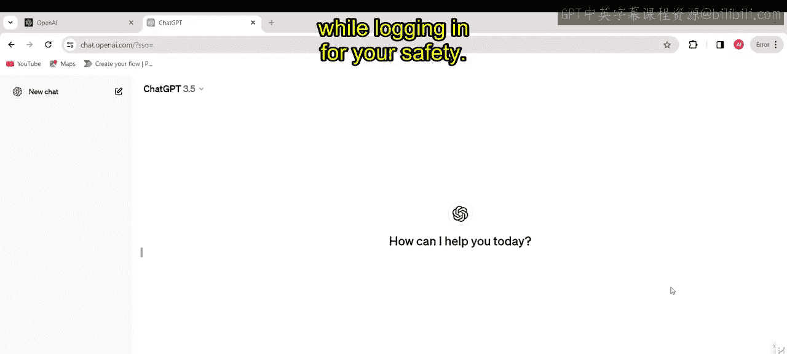
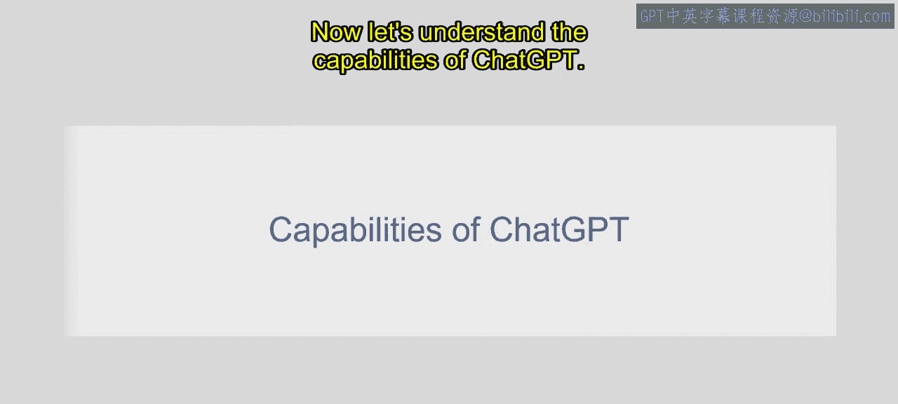
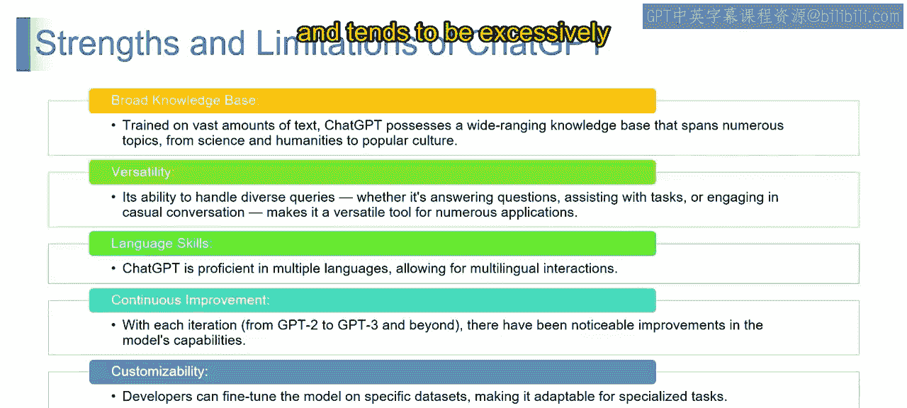
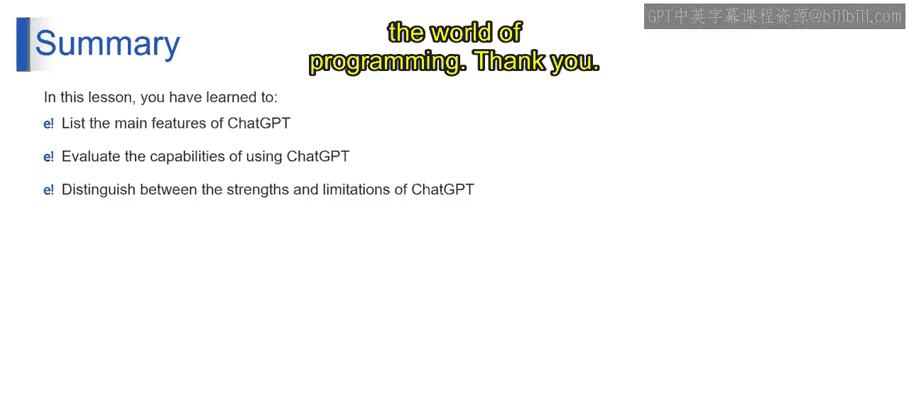

# 第二三四部分 10：登录流程与ChatGPT核心能力

在本节课中，我们将学习如何登录ChatGPT平台，并深入了解其核心能力、优势与局限性。我们将从登录步骤开始，逐步探索这个强大工具的功能。

## 登录流程

上一节我们介绍了生成式AI的基本概念，本节中我们来看看如何实际访问并使用ChatGPT。首先，你需要找到并点击网站上的登录按钮。

登录按钮通常位于网站的右上角或中央位置。

以下是登录步骤：

1.  点击登录按钮后，你将看到登录选项。这些选项可能包括使用谷歌账户、电子邮箱或其他方法登录。
2.  选择最适合你的登录方式。例如，点击“使用谷歌账户登录”。
3.  如果你已有账户，可以提供电子邮箱并点击继续，然后输入密码即可进入网站。
4.  如果你是首次使用，需要点击“注册”。注册过程可能包含多个步骤，例如输入邮箱地址以及进行验证。
5.  验证步骤可能涉及将验证码发送到你的邮箱或手机，你需要输入该验证码以确认身份。

这就是注册流程。如果你已有谷歌账户，可以直接点击“使用谷歌账户继续”。点击后，系统将引导你进入 `platform.openai.com` 或相关应用页面。

进入后，你将能看到两个主要部分：ChatGPT聊天界面和API。

至此，登录完成。你可以开始探索平台功能，发起对话，并了解ChatGPT能做什么。这个过程非常简单。

现在，让我们点击ChatGPT并开始使用它。

你将看到ChatGPT的聊天窗口。请务必确保在登录时使用安全可信的网络连接以保障安全。以上就是登录过程的全部内容。

## 理解ChatGPT的核心能力

现在，让我们来理解ChatGPT的各项核心能力。

以下是ChatGPT的五大核心能力：

*   **广泛的知识库**：你可以将ChatGPT视为一个装载了跨领域信息的虚拟百科全书，涵盖科学、人文和流行文化。它就像一个拥有海量知识库的对话型天才，触手可及。
*   **多功能性**：ChatGPT是数字领域的瑞士军刀。它能轻松处理多种任务，无论是回答问题、协助解决各种疑问，还是进行友好聊天。它的多功能性使其成为广泛应用的常用工具。
*   **语言技能**：ChatGPT拥有多语言魔力。它不受单一语言限制，是一个能使用不同语言进行对话的多语言者，让语言障碍成为过去。
*   **持续改进**：ChatGPT是一种随时间演进的技术。从GPT-2到GPT-3、GPT-3.5，再到现在的GPT-4及未来版本，每次升级都带来了显著的改进。这就像目睹一个数字凤凰不断崛起，持续增强其能力以提供更好的用户体验。
*   **可定制性**：你可以根据需求定制ChatGPT。开发者可以通过特定数据集对模型进行微调，将其转变为执行独特任务的专用工具。这就像拥有一个能适应你项目特定需求的个性化助手。

## 优势与局限性

了解核心能力后，我们来看看ChatGPT的优势与局限性。

ChatGPT的优势在于其**广泛的知识库**、**多功能性**以及**处理多样化查询的能力**。它**精通多种语言**，能够通过迭代**持续改进**，并且开发者可以利用其**可定制性**来完成专门任务。

然而，与任何工具一样，ChatGPT也有其局限性。它有时可能会提供**不准确或无意义的信息**，在应对**模糊查询**时会遇到困难，并且对**输入措辞的细微变化**可能比较敏感。此外，它有时会产生**冗长或过于详细的输出**，并且在某些情况下会表现得**过于谨慎**。

## 在编程领域的类比

最后，我们通过一个类比来总结ChatGPT在编码领域的角色。

在编码领域，手动编码就像**投入时间和精度精心制作一件杰作**，而ChatGPT则像一个**能根据请求快速生成代码的编码精灵**。在手工匠艺与AI效率之间的选择，定义了编程世界的不同叙事，两者各有其独特的魅力。

本节课中我们一起学习了ChatGPT的登录流程，详细探讨了其广泛知识库、多功能性、语言技能、持续改进和可定制性这五大核心能力，并分析了其优势与局限性。最后，我们通过编程领域的类比，理解了AI辅助工具与传统手工编码的不同价值。