# 第二三四部分 11：使用ChatGPT生成代码

在本节课中，我们将学习手动编码与使用ChatGPT进行AI辅助编码的核心区别。我们将通过具体示例，直观地比较两种方式在时间、效率和过程上的差异。

## 概述：手动编码与AI辅助编码

在编程世界中，选择手动编码还是AI辅助编码，就像选择亲手制作一件杰作还是拥有一位得力的AI助手。手动编写程序需要时间、精确性和缜密的思考。而ChatGPT则像一个编码精灵，通过简单的指令就能在几秒钟内生成代码。

上一节我们介绍了生成式AI的基本概念，本节中我们来看看如何利用ChatGPT这一工具来生成代码。

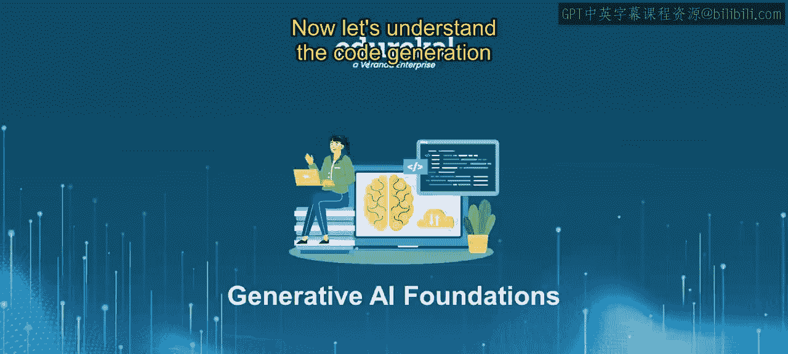

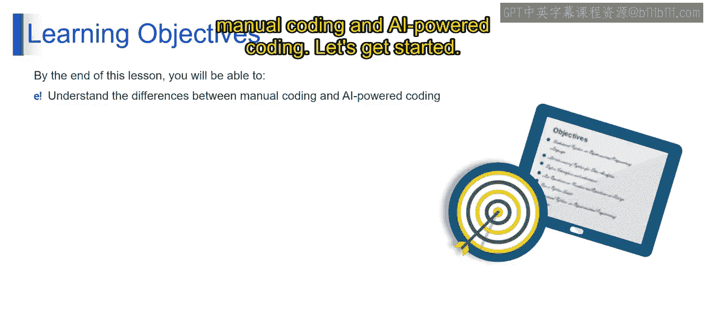

## 示例一：编写计算平方的Python函数

首先，我们通过一个简单的例子来感受两者的区别：创建一个计算数字平方的Python函数。

### 手动编码过程

在手动编码时，我们需要逐步构思并编写代码。以下是手动完成此任务的步骤：

1.  打开代码编辑器（例如Google Colab）。
2.  定义一个名为 `calculate_square` 的函数。
3.  该函数接收一个参数 `number`。
4.  在函数体内，计算 `number` 的平方并返回结果。
5.  调用函数进行测试。

以下是手动编写的代码示例：
```python
def calculate_square(number):
    return number ** 2

# 第二三四部分 测试函数
result = calculate_square(2)
print(result)  # 输出：4
```
完成这个简单的任务大约需要1到2分钟。

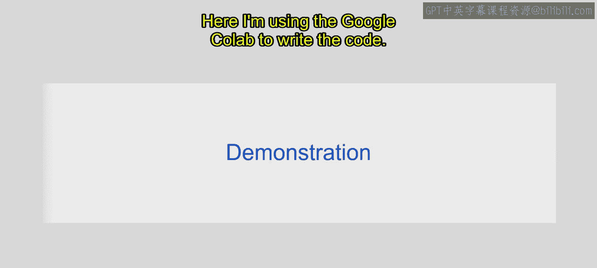

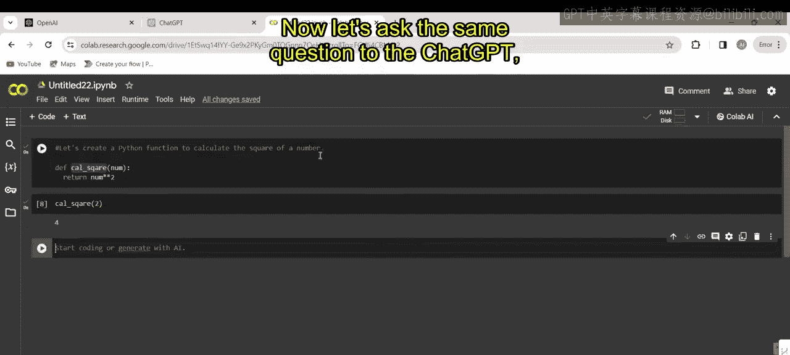

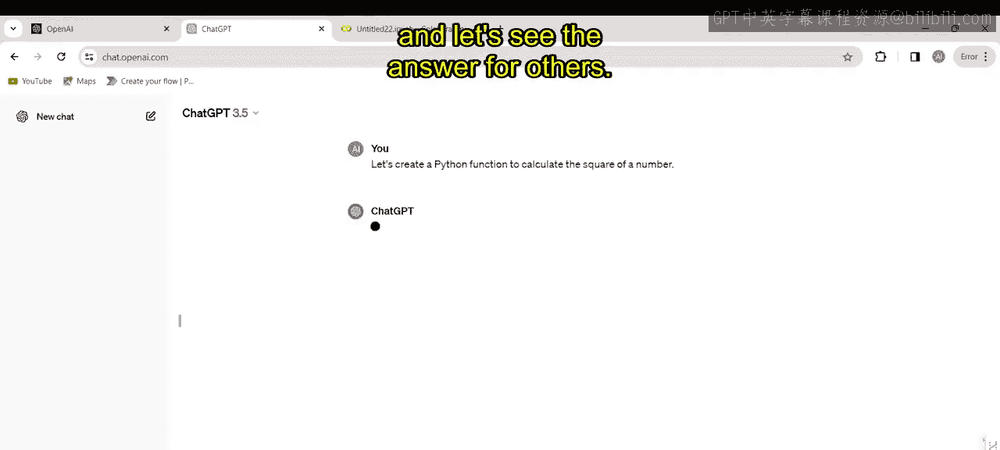

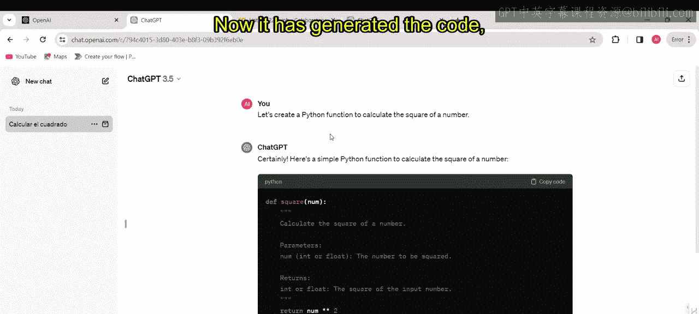

### 使用ChatGPT生成代码

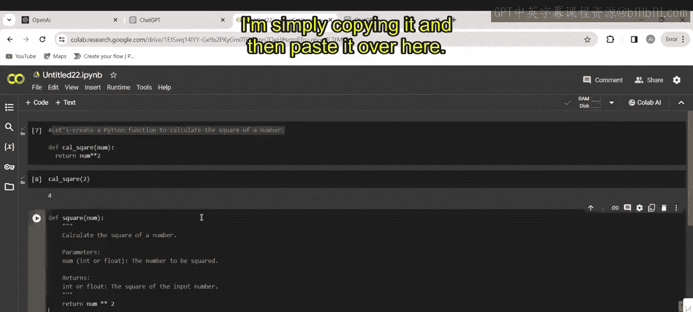

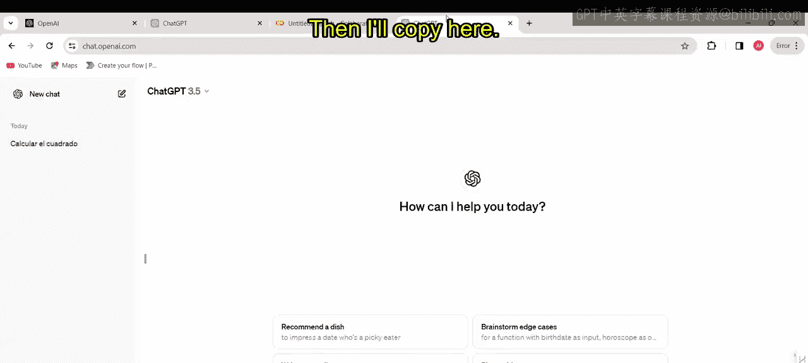

现在，我们将相同的任务指令提供给ChatGPT：“创建一个Python函数来计算数字的平方”。

ChatGPT几乎在瞬间就生成了以下代码：
```python
def calculate_square(number):
    """
    计算给定数字的平方。

    参数:
    number (int 或 float): 需要计算平方的数字。

    返回:
    int 或 float: 输入数字的平方。
    """
    return number * number

# 第二三四部分 示例用法
print(calculate_square(5))  # 输出：25
```
使用ChatGPT完成此任务仅需几秒钟。它不仅提供了功能代码，还包含了清晰的文档注释。

通过这个简单示例，我们可以看到AI辅助编码在速度上的显著优势。接下来，我们探索一个更复杂的任务。

## 示例二：编写计算学生平均成绩的程序

现在，让我们尝试一个更复杂的任务：创建一个计算学生平均成绩的Python程序。

### 手动编码的挑战

手动完成此任务涉及多个步骤，耗时更长：

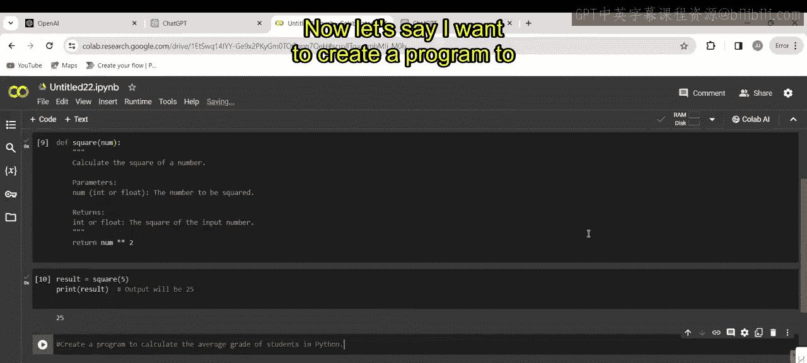

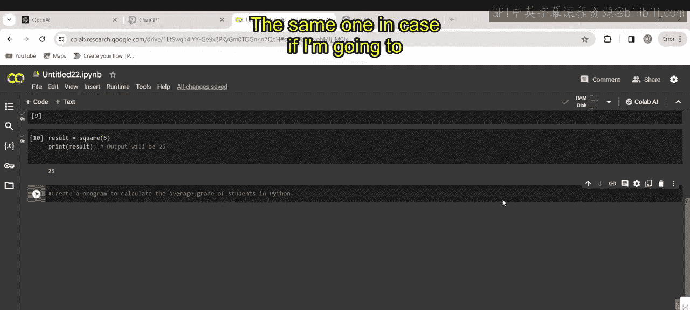

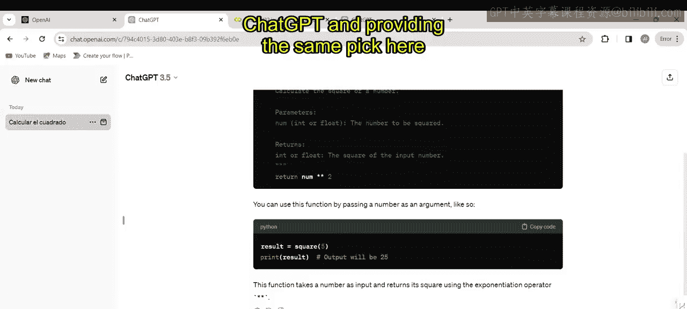

1.  **构思逻辑**：设计程序结构，如何获取输入、计算平均值并输出结果。
2.  **逐步编码**：编写代码实现每一步逻辑。
3.  **调试与优化**：运行并测试代码，修复可能出现的错误。

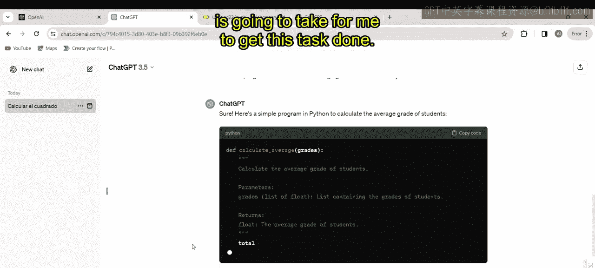

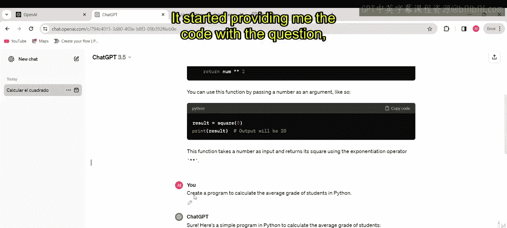

整个过程可能需要30分钟到1小时。

### 使用ChatGPT生成代码

我们将指令“创建一个用Python计算学生平均成绩的程序”发送给ChatGPT。

ChatGPT迅速生成了一个完整的、可运行的程序：
```python
def calculate_average_grade():
    """
    计算学生平均成绩的程序。
    """
    try:
        # 获取学生数量
        num_students = int(input("请输入学生人数: "))

        # 初始化总成绩
        total_grades = 0

        # 循环获取每个学生的成绩
        for i in range(1, num_students + 1):
            grade = float(input(f"请输入学生 {i} 的成绩: "))
            total_grades += grade

        # 计算平均成绩
        average_grade = total_grades / num_students

        # 输出结果
        print(f"\n学生的平均成绩是: {average_grade:.2f}")

    except ValueError:
        print("输入错误！请确保输入的是有效数字。")

# 第二三四部分 运行程序
if __name__ == "__main__":
    calculate_average_grade()
```
我们只需复制生成的代码，粘贴到编辑器中运行即可。例如，输入3名学生，成绩分别为85、95、90，程序会正确输出平均成绩90.0。

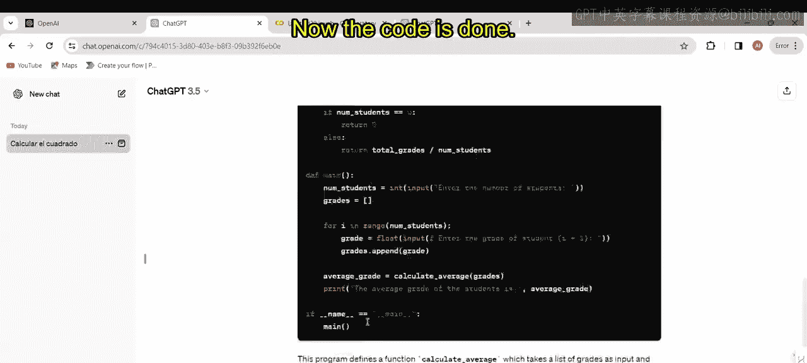

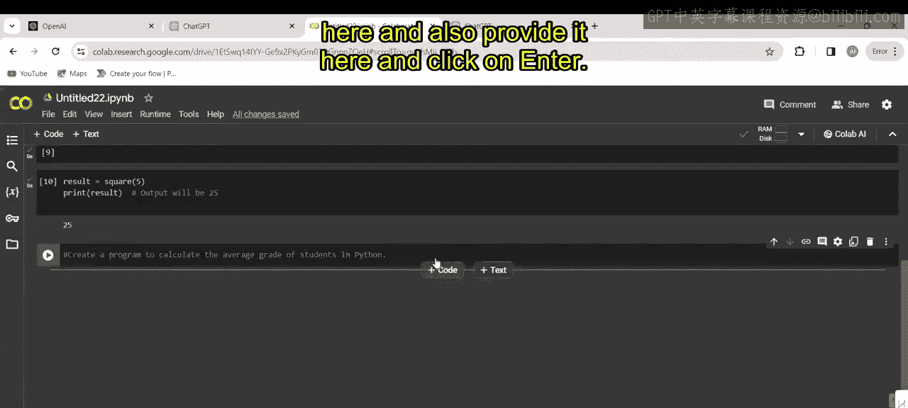

使用ChatGPT，从发出指令到获得可用的代码，整个过程不超过5分钟。如果需要调整，还可以通过进一步的提示词对代码进行微调。

## 核心对比与总结

通过以上两个示例，我们可以清晰地比较两种编码方式：

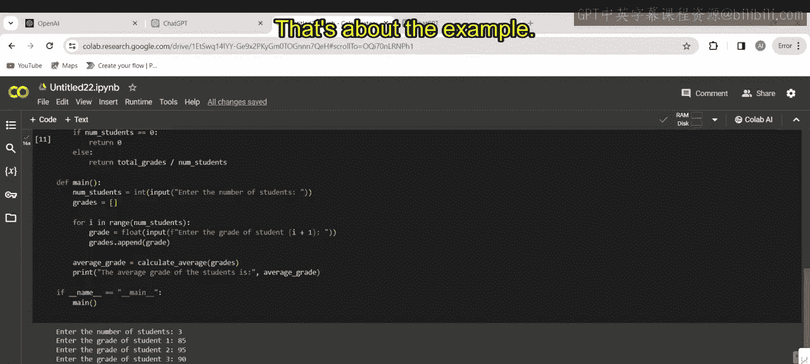

*   **手动编码**：如同精心搭建沙堡，需要逐行构建，注重细节和逻辑。这是一个需要时间和专业技能的过程。
*   **AI辅助编码（ChatGPT）**：如同一位理解你需求的编码向导，能够快速生成代码草稿，极大提升效率。

选择手动编码还是AI辅助编码，关键在于在编程的“工艺性”与“效率”之间找到适合当前任务的平衡点。

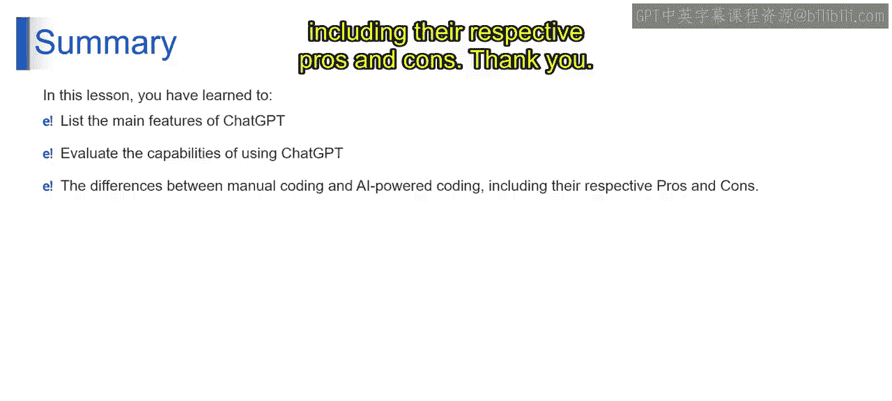

本节课中，我们一起学习了手动编码与使用ChatGPT进行AI辅助编码的区别。我们通过具体实例，看到了AI工具如何在短时间内生成功能性代码，从而节省时间并提高效率。理解这两种方式的优缺点，将帮助你在未来的编程工作中做出更合适的选择。