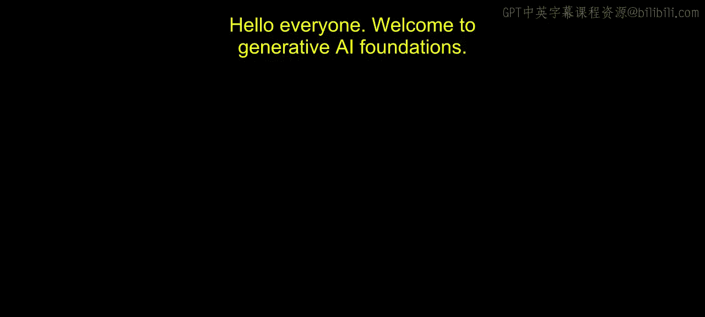
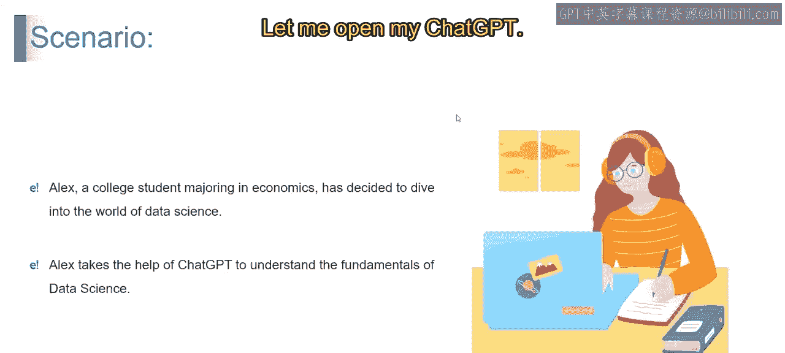
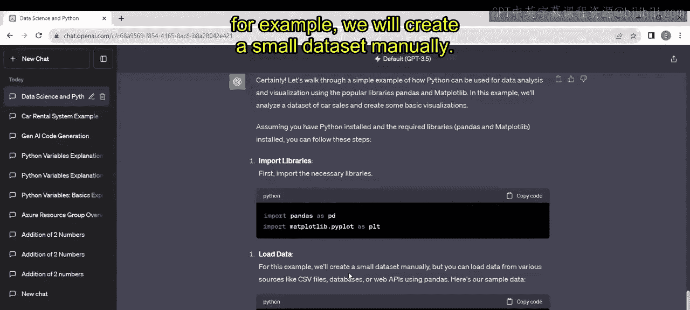
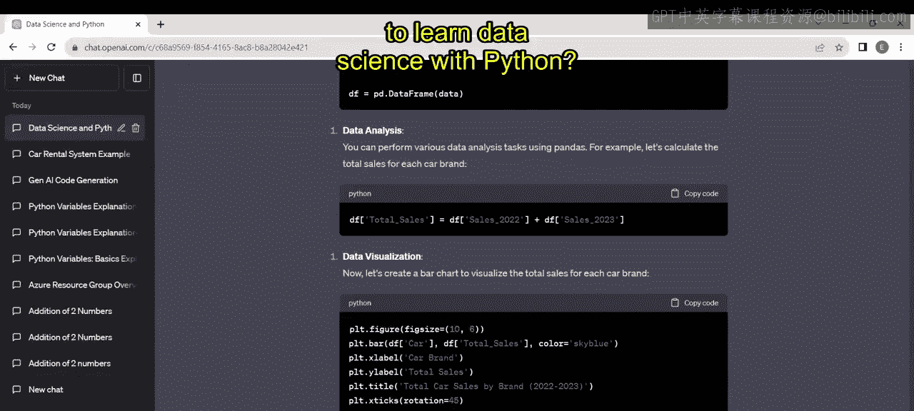
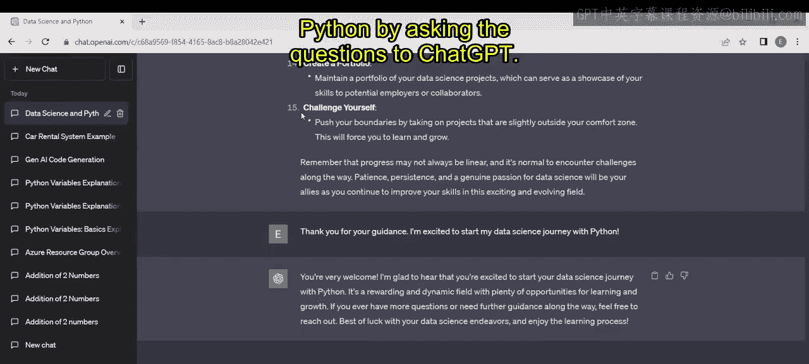
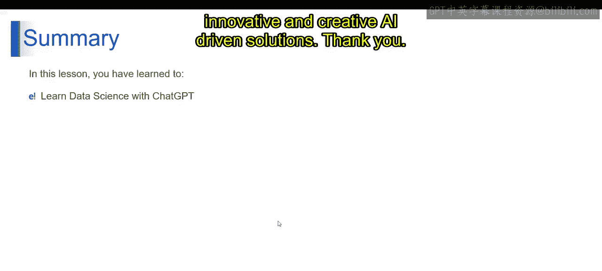

# 第二三四部分 12：利用ChatGPT学习Python数据科学

大家好，欢迎来到生成式AI基础课程。

在本节课中，我们将学习如何利用ChatGPT来学习Python数据科学。课程结束时，你将能够运用提示工程来提升大型语言模型在特定任务上的表现。让我们开始吧。

## 场景介绍

设想一个场景：Alex是一名主修经济学的大学生，决定进入数据科学的世界。Alex借助ChatGPT来理解数据科学的基础知识。让我们看看如何做到这一点。

现在，让我打开ChatGPT。我们来看看如何利用ChatGPT帮助Alex学习Python数据科学的基础知识。

## 第一步：获取数据科学概述

在ChatGPT中，我们以Alex的身份提问：“我是数据科学和Python的新手，你能概述一下什么是数据科学吗？以及它与Python的关系，因为我对此完全陌生。”

你可以看到ChatGPT开始提供答案。

当然，数据科学是一个多学科领域，涉及使用各种技术、算法、过程和系统从数据中提取有价值的见解和知识。它结合了统计学、计算机科学、领域专业知识和数据可视化的元素，以分析和解释数据，从而做出明智的决策和预测。

以下是它提供的关于数据科学关键方面的简要信息：

以下是数据科学的关键方面：
*   **数据收集**：从各种来源获取数据。
*   **数据清洗与预处理**：准备数据以供分析。
*   **探索性数据分析**：理解数据的模式和关系。
*   **机器学习**：构建预测或分类模型。
*   **统计分析**：应用统计方法进行推断。
*   **数据可视化**：以图形方式呈现数据。
*   **大数据与分布式计算**：处理海量数据集。
*   **领域专业知识**：理解特定行业的背景。

## 第二步：设置开发环境

现在我想问：“如何在我的电脑上设置Python和数据科学环境？因为我想学习这个，但我对此一无所知。”让我们向ChatGPT提出这个问题。

现在你可以看到，在你的计算机上设置基于Python的数据科学环境涉及几个基本步骤。它甚至提供了分步指南：

以下是设置环境的步骤：
1.  **安装Python**：从官方网站（如 python.org）下载并安装。
2.  **选择代码编辑器或IDE**：例如 PyCharm、VS Code 或 Jupyter Notebook。
3.  **创建虚拟环境**：使用 `venv` 或 `conda` 隔离项目依赖。
4.  **安装核心库**：通过包管理器（如 pip）安装 `numpy`、`pandas`、`matplotlib`、`scikit-learn` 等。

你可以按照这些步骤的详细过程，开始使用Python进行数据科学工作。这是在本地计算机上设置环境的方法。

## 第三步：理解核心基础知识

现在，我想问：“在数据科学中，我需要理解哪些关键基础知识？”

你可以看到，它告诉我们，我们需要理解以下内容：

以下是数据科学的核心基础知识：
*   **统计学与数学**：概率、线性代数等。
*   **编程技能**：主要是Python。
*   **数据操作与分析**：使用 `pandas` 等库。
*   **机器学习**：算法原理与应用。
*   **特征工程**：从原始数据构建有效特征。
*   **数据预处理**：处理缺失值、异常值等。
*   **模型选择与评估**：选择合适模型并评估其性能。
*   **大数据与分布式计算**：处理大规模数据的技术。
*   **自然语言处理与计算机视觉**：特定领域的AI应用。
*   **领域知识**：理解业务背景。
*   **伦理与隐私**：负责任地使用数据。
*   **沟通能力**：清晰传达分析结果。
*   **持续学习与问题解决**：跟上领域发展并解决新问题。

这些都是为了理解数据科学所需要掌握的基础知识。

## 第四步：查看实践示例

现在让我们再问一个问题。“我对数据科学或Python编程语言一无所知。我只是想看看一些例子。”因此，我这样问：“你能展示一个Python如何用于数据分析和可视化的例子吗？”然后点击回车。

你可以看到它开始提供解决方案。假设你已经安装了Python和所需的库。

以下是使用Python进行数据分析和可视化的基本步骤：
1.  **导入所需库**：`import pandas as pd`， `import matplotlib.pyplot as plt`
2.  **加载数据**：可以从CSV文件、数据库或API加载，或手动创建示例数据。
3.  **执行数据分析**：使用 `pandas` 进行数据探索、统计摘要等。
4.  **进行数据可视化**：使用 `matplotlib` 或 `seaborn` 创建图表。

在这里你甚至可以看到描述。例如，如果你想加载数据，我们可以手动创建一个小型数据集，但你也可以从各种来源加载数据，如CSV文件、数据库或网络。每段代码的定义都已在此给出。

## 第五步：寻找学习资源

现在我想再问一个问题。现在我清楚了，如果我想要更好地理解它，我需要掌握所有这些最基本的知识。我想提一个问题：“我在哪里可以找到更多资源来学习使用Python的数据科学？”它将开始为你生成解决方案或答案。

以下是主要的学习资源：
*   **在线课程平台**：Coursera， edX， Udemy。
*   **YouTube教程**：免费的视频学习资源。
*   **书籍**：《利用Python进行数据分析》等经典教材。
*   **MOOC平台**：提供系统化课程。
*   **博客与网站**：如Towards Data Science， KDnuggets。
*   **论坛与社区**：如Stack Overflow， Reddit的r/datascience。
*   **官方文档**：Python及各个库（如pandas， scikit-learn）的官方文档。

你可以看到这些是你可以用来学习Python数据科学的资源来源。

## 第六步：持续提升技能

现在我明白了可以从哪里获取知识。我还有一个问题：“提升数据科学技能的最佳方式是什么？”

让我向ChatGPT提出这个问题。

它告诉我们，提升数据科学技能是一个持续的过程，需要 dedication 和实践。

以下是持续提升技能的方法：
*   **持续学习**：跟进最新研究和工具。
*   **实践项目**：动手完成实际项目。
*   **开源贡献**：参与开源项目。
*   **在线编码挑战**：在Kaggle等平台竞赛。
*   **在线课程与认证**：系统化学习新技能。
*   **阅读数据科学书籍**：深化理论知识。
*   **寻求指导与建立人脉**：向他人学习。
*   **教学与讲解**：通过教授他人来巩固知识。
*   **专业化**：深入某个特定领域。
*   **编码练习**：保持编码熟练度。
*   **批判性分析工作**：回顾和改进自己的项目。
*   **培养软技能**：如沟通和团队合作。
*   **保持好奇心**：探索新领域。
*   **创建作品集**：展示你的项目。
*   **接受挑战**：尝试解决困难问题。

这些方法可以帮助你持续提升数据科学技能。听到这些很棒。我对ChatGPT提供的所有输入感到非常满意。

## 场景总结

现在我只是说：“谢谢你的指导，我很兴奋能开始我的Python数据科学之旅。”你可以看到，即使对于这句话，它也提供了回应。“不客气。”

在这个场景中，Alex使用ChatGPT获取关于数据科学基础、Python和实践示例的指导。这种循序渐进的方法确保了结构化的学习体验，Alex可以通过向ChatGPT提问，逐步建立使用Python进行数据科学的专业知识。

## 课程总结

本节课中，我们一起学习了如何将ChatGPT用作学习数据科学的宝贵资源，帮助你理解关键概念、工具和实践示例，从而开启你的数据科学世界之旅，这对你来说可能是一个全新的领域。

在下一课中，我们将解锁生成式AI在令人惊叹的可视化方面的力量，通过创新和创造性的AI驱动解决方案，将你的数据、艺术和设计提升到新的水平。

谢谢。