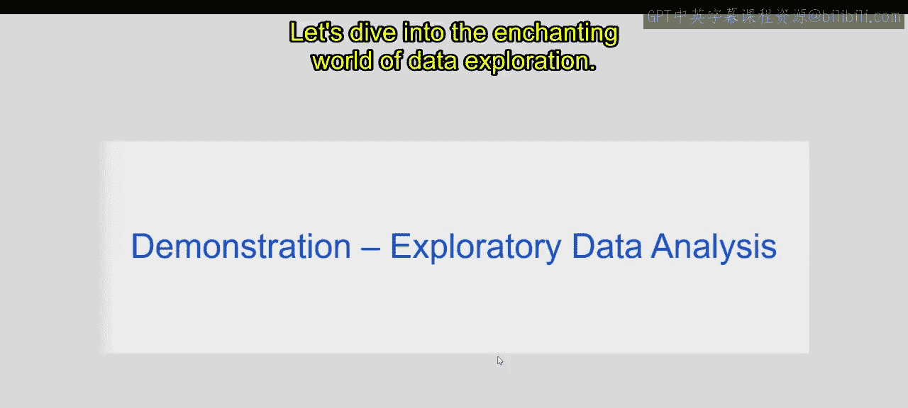
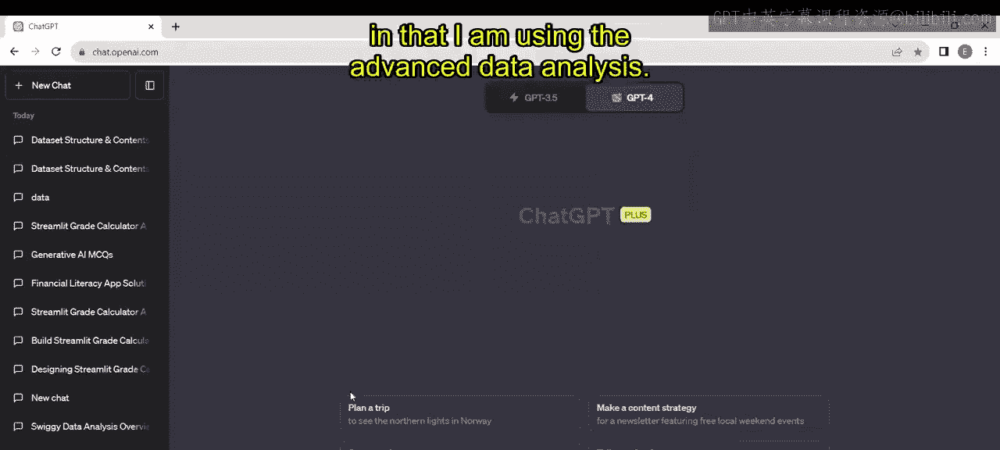
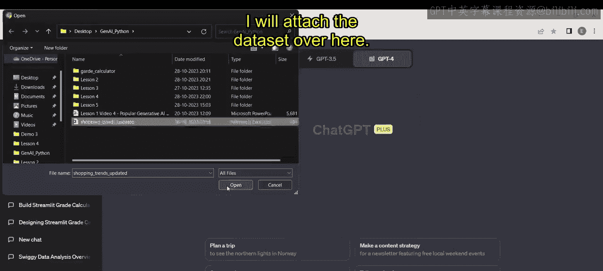
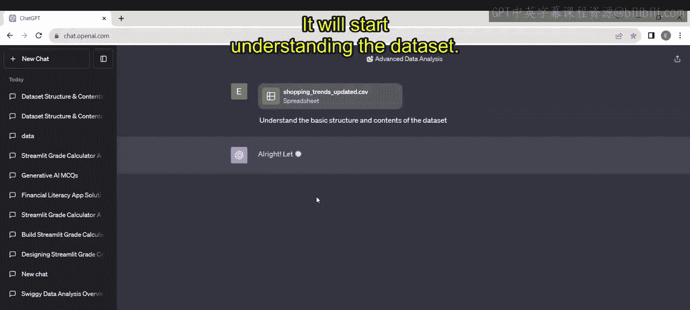
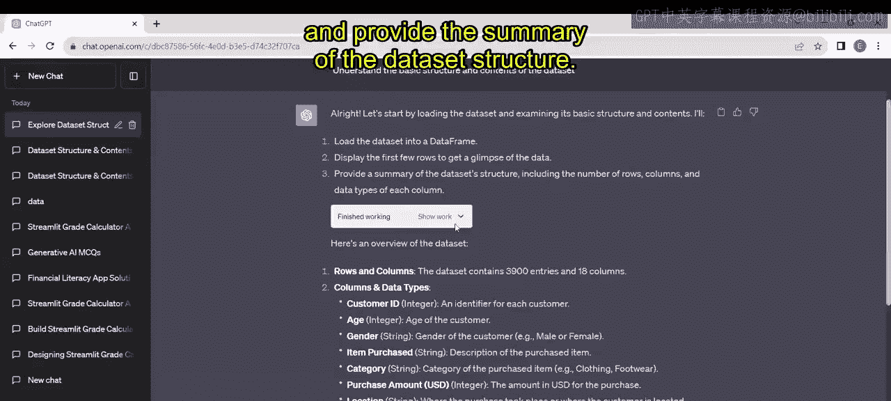
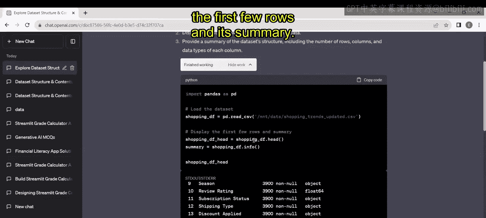
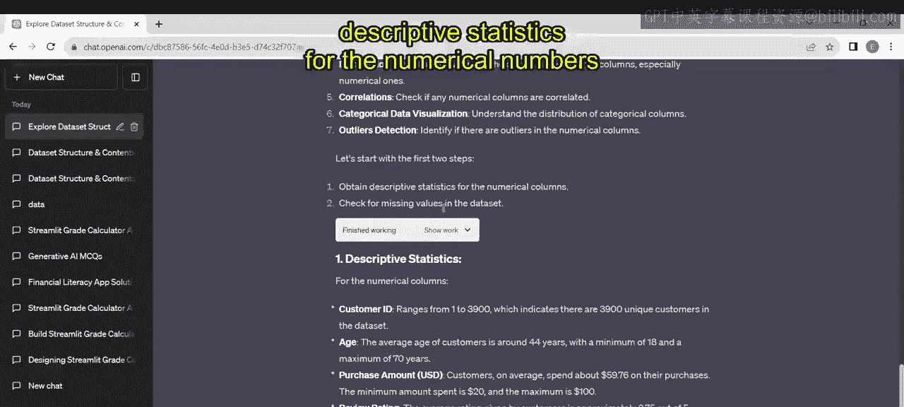
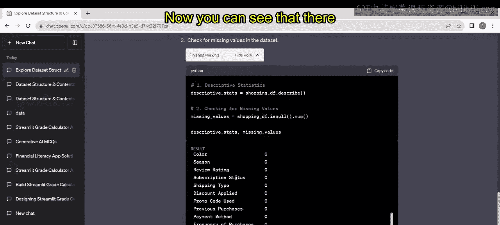
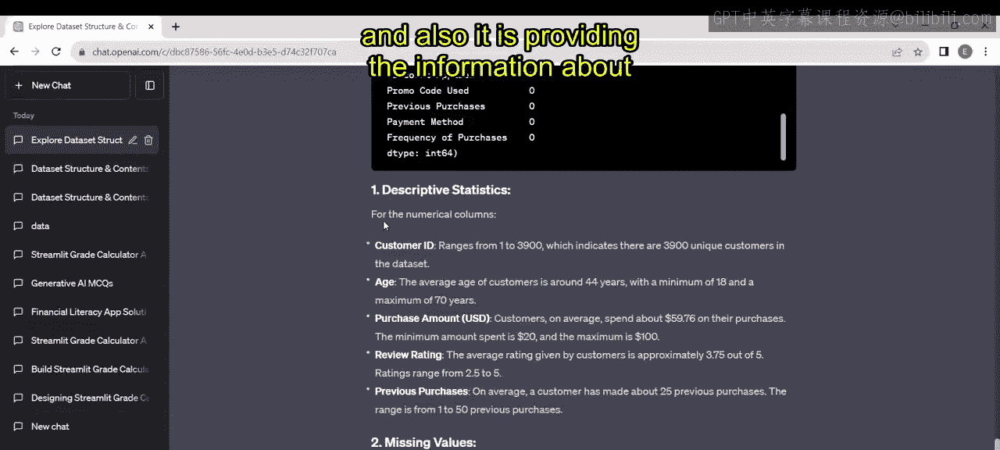
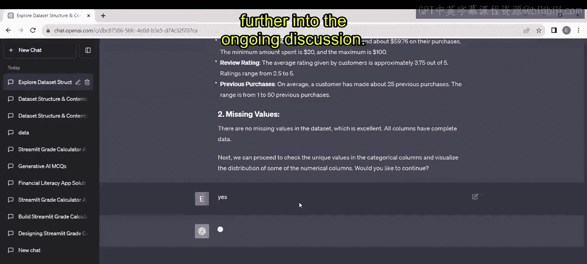

# 第二三四部分 14：探索性数据分析 📊

## 概述
在本节课中，我们将学习探索性数据分析（EDA）的基本概念，了解它如何帮助我们从数据中发现隐藏的模式和洞察，并利用ChatGPT（GPT-4）的“高级数据分析”功能，对一个真实的购物趋势数据集进行完整的EDA流程演示。

---

## 什么是探索性数据分析？ 🤔

首先，让我们开启一段数据探索的奇妙旅程，在这里，平凡的数据将变得非凡。想象你是一家书店的店主，多年来收集了大量的销售数据。现在，你想了解哪些书是你店里的“隐藏宝藏”。EDA就像一张寻宝图，指引你发现这些隐藏的宝藏。通过分析客户偏好、发现趋势，你可以做出数据驱动的决策来促进业务增长。这一切都得益于EDA。

让我们再举一个例子。想想那些预测天气的应用程序。这些每日天气预报背后是庞大的数据集。EDA允许气象学家揭示天气数据中的趋势、模式和异常值。借助EDA，他们可以做出更准确的预测，帮助你判断外面是冷是热，或者是否会下雨。

因此，无论你是书店老板、天气爱好者，还是仅仅对周围世界感到好奇的人，EDA都有能力解锁隐藏在数据中的故事，让你的生活更美好。

现在，让我们探索EDA如何将数字转化为有价值的见解，从而影响决策并塑造我们的世界。让我们一起潜入数据探索的迷人世界。

---

## 利用ChatGPT进行EDA 🛠️

上一节我们介绍了EDA的概念，本节中我们来看看如何利用ChatGPT来实际进行探索性数据分析。

现在，我将使用GPT-4版本，并启用其中的“高级数据分析”功能。在这里，你可以看到加号符号，通过它可以上传文件。我打算对一个“购物趋势”数据集进行EDA，因此我将在这里上传该数据集。

现在，我向ChatGPT提问：“理解数据的基本结构和内容”，然后点击回车。它将开始理解这个数据集。

它仍在生成答案。现在你可以看到，它已经为我的查询生成了答案。首先，它告诉我将数据集加载到数据框中，显示前几行，并提供数据集结构的摘要。让我们展开看看。

现在你可以看到它提供了Python代码。它首先导入所需的库，然后加载数据集并显示前几行及其摘要。开始了。现在它解释了数据包含的行数和列数：数据集总共有3900个条目和18列。在这里，你可以看到全部18列的描述。让我们看看这是否正确。

我将打开我当前的数据集并展示给你看。好了，现在你可以看到原始数据，它包含客户ID、性别、购买物品、类别、购买金额、位置、尺寸等信息。你甚至可以在ChatGPT的回复中交叉检查它提供的内容是否相同。现在你可以看到所有的列名都在这里。

现在我有了数据大小、特征以及列名。接下来，我询问我的ChatGPT：“我想进行探索性数据分析。你能在这方面协助我吗？”点击回车，它将直接开始为你生成代码。

现在，你可以看到它已经为我的查询生成了解决方案。它告诉我EDA是理解数据集的关键步骤，并提供了一个处理计划。

以下是它提出的计划步骤：
*   首先，我们需要进行描述性统计、检查缺失值、唯一值等许多额外分析。
*   基于此，它首先执行前两个步骤：获取数值型数据的描述性统计，并检查数据中的缺失值。

让我们展开这部分。在这里，你可以看到用于理解描述性统计和检查缺失值的代码。现在你可以看到数据中没有缺失值。同时，它还提供了各个数值型列的描述性统计信息，这很棒。

现在它询问：“接下来，我们可以继续检查分类列中的唯一值，并可视化一些数值型列的分布。你想继续吗？”我回答“是”并点击回车。

接下来的视频将进一步深入正在进行的讨论。

---

## 总结
本节课中，我们一起学习了探索性数据分析（EDA）的核心价值——将原始数据转化为可操作的洞察。我们了解了EDA在商业和科学等场景中的应用，并初步实践了如何借助ChatGPT的“高级数据分析”功能，快速启动一个EDA项目，包括加载数据、查看结构、进行描述性统计和检查数据质量。这为我们后续深入分析数据分布、关系和模式奠定了坚实的基础。