# 第二三四部分 16：借助ChatGPT进行探索性数据分析

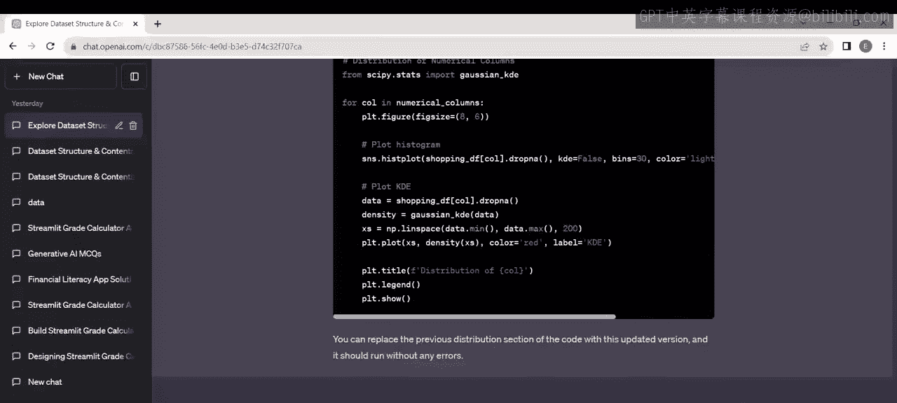

在本节课中，我们将学习如何利用ChatGPT（特别是Plus版本）来自动化执行探索性数据分析（EDA）。我们将看到如何通过自然语言指令，让ChatGPT生成完整的分析代码、解读结果、提供关键洞察，并基于分析结果提出商业建议，整个过程无需手动编写代码。

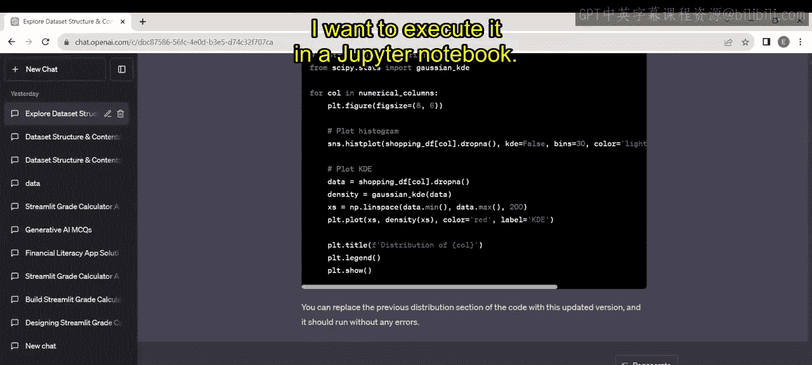

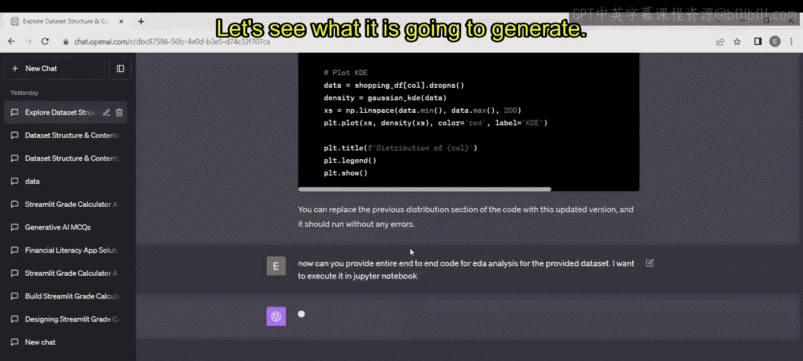

## 概述：自动化EDA工作流

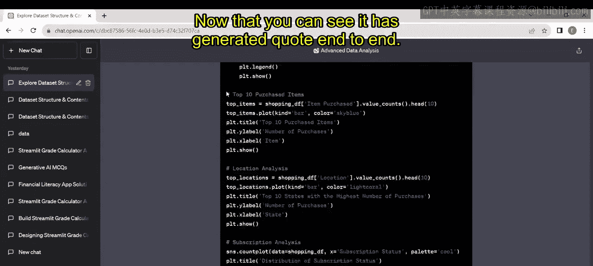

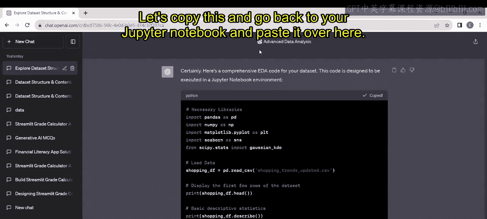

上一节我们介绍了生成式AI的基础概念，本节中我们来看看如何将其应用于实际的数据分析任务。我们将演示一个端到端的流程：从向ChatGPT提出分析请求，到在Jupyter Notebook中执行生成的代码，再到根据分析结果获取商业策略建议。

## 步骤一：请求生成EDA代码

首先，我们向ChatGPT提出明确的请求，要求其为指定数据集生成端到端的EDA代码，并指定在Jupyter Notebook中运行。

**请求示例**：
```
请为提供的数据集生成端到端的探索性数据分析代码。我需要在Jupyter Notebook中执行它。
```

ChatGPT响应并生成了一段完整的Python代码。这段代码通常包含数据加载、缺失值检查、异常值检测、单变量与多变量分析以及可视化。

## 步骤二：在Jupyter Notebook中执行代码

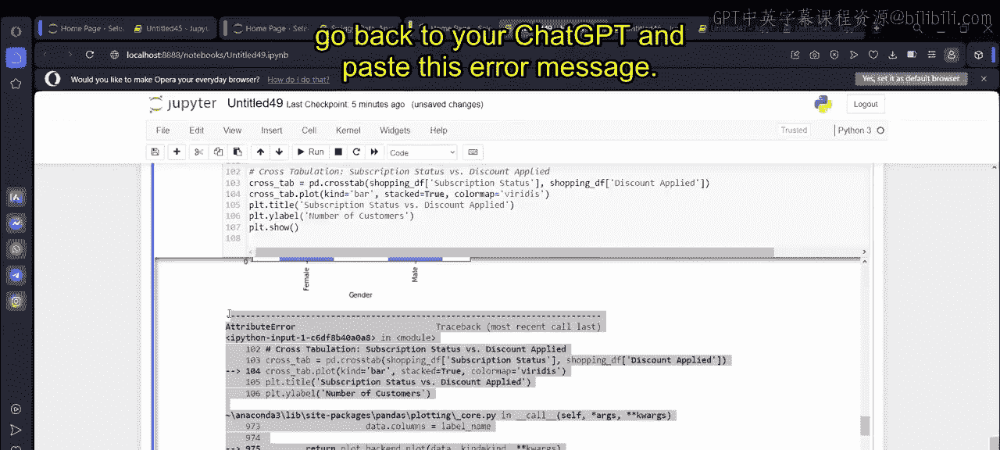

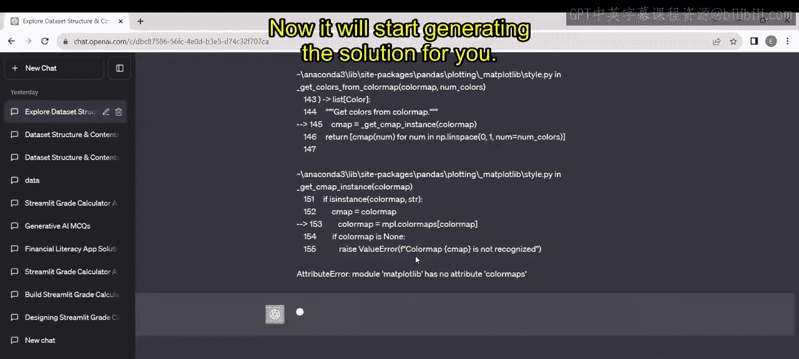

接下来，我们将ChatGPT生成的代码复制到Jupyter Notebook中。

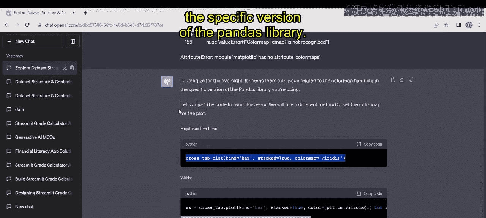

**关键操作**：
1.  复制生成的代码。
2.  在Jupyter Notebook中新建单元格并粘贴代码。
3.  需要根据实际情况修改数据集文件路径。例如：
    ```python
    # 修改文件路径
    df = pd.read_csv(‘/your/actual/path/to/dataset.csv’)
    ```
4.  运行单元格，开始执行分析。

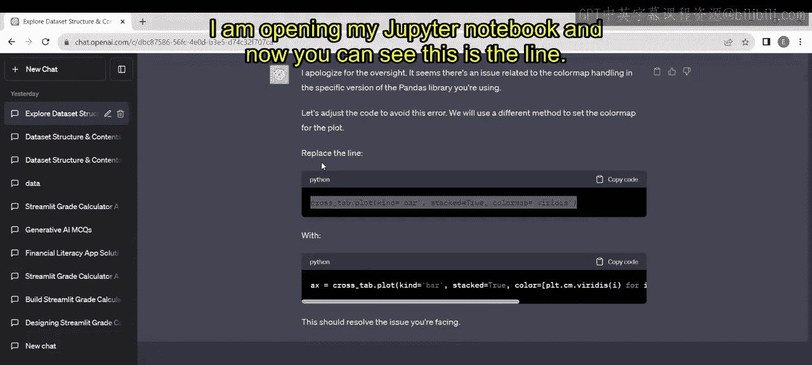

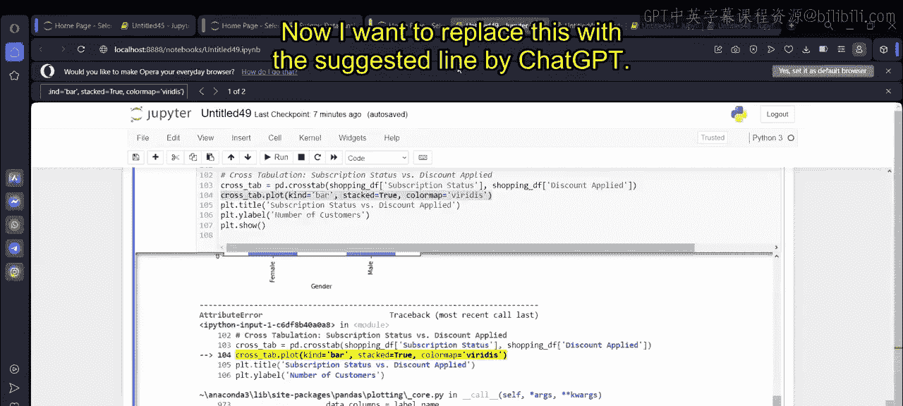

执行过程中，代码会输出一系列分析结果，例如：
*   数据概览与缺失值情况。
*   数值型变量的分布（如`Previous Purchases`）。
*   分类变量的分布（如`Subscription Status`, `Size`）。
*   最畅销的商品（`Top Purchased Items`）。
*   购买力最高的地区（`Top States`）。
*   各类可视化图表。

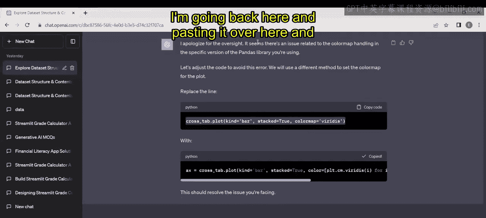

## 步骤三：调试与优化

在执行代码时，可能会遇到错误或警告。例如，我们可能遇到与绘图库色彩映射（colormap）相关的版本兼容性问题。

**解决方法**：
1.  将错误信息复制。
2.  返回ChatGPT，粘贴错误并请求解决方案。
3.  ChatGPT会提供修改建议。例如，它可能建议将某行代码从：
    ```python
    df.hist(bins=30, figsize=(20,15))
    ```
    修改为：
    ```python
    df.hist(bins=30, figsize=(20,15), edgecolor=‘black’)
    ```
4.  按照建议修改Jupyter Notebook中的代码并重新运行，问题通常得以解决。

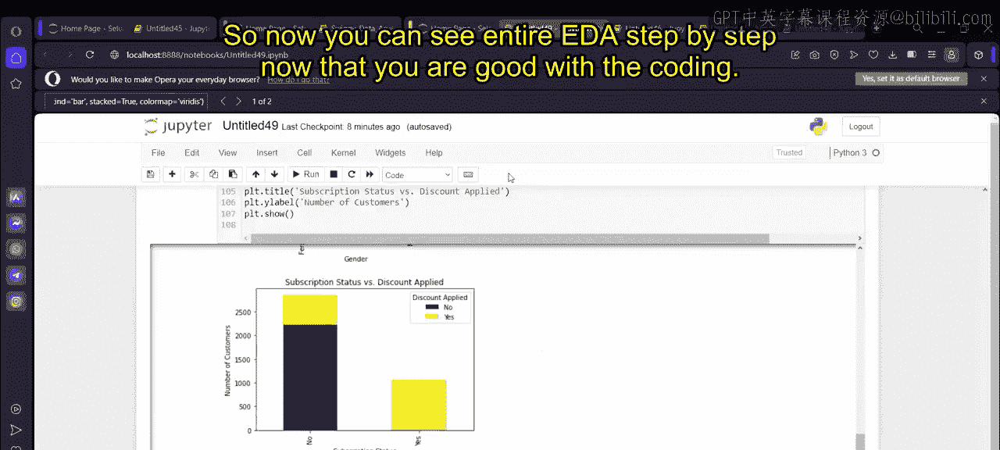

## 步骤四：获取分析洞察与关键结论

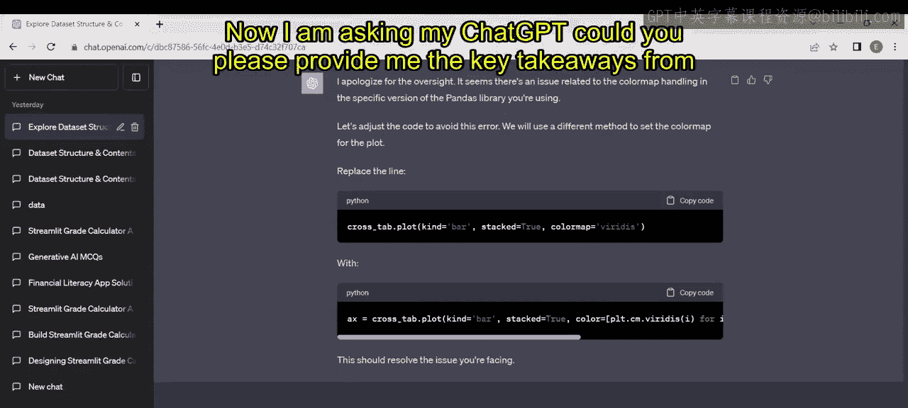

代码成功运行并生成所有图表后，我们可以进一步向ChatGPT提问，以提炼分析的核心发现。

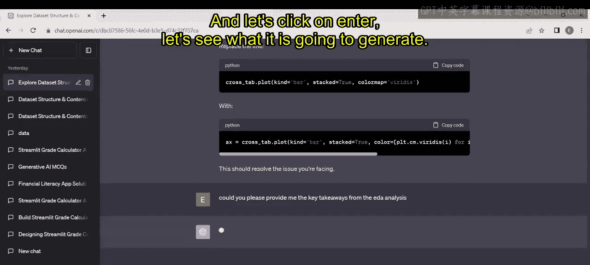

**请求示例**：
```
请根据刚才的EDA分析，提供关键结论。
```

ChatGPT会总结出结构化洞察，以下是它可能提供的要点：

以下是ChatGPT生成的关键结论示例：
*   **数据结构**：数据包含X行Y列，主要涵盖客户 demographics、购买行为与产品偏好。
*   **数据质量**：数据清洁，无明显缺失值或异常值。
*   **数值分布**：`Previous Purchases` 和 `Review Rating` 呈现特定分布形态。
*   **热门商品**：商品A、B、C是销量最高的前几名。
*   **地域分析**：X州、Y州的购买数量领先。
*   **订阅状态**：大部分客户处于“非订阅”状态。
*   **尺寸与颜色偏好**：M号是最受欢迎的尺寸，黑色是最畅销的颜色。
*   **评分分布**：客户评分普遍较高，集中在4-5分。

## 步骤五：基于洞察制定商业策略

基于上述分析结论，我们可以让ChatGPT直接提供数据驱动的商业建议。

**请求示例**：
```
基于我们得到的分析洞察，您推荐哪些市场营销或销售策略？
```

ChatGPT会生成一系列具体的策略建议：

以下是ChatGPT推荐的策略示例：
*   **针对中年客户进行精准营销**：因为数据显示该年龄段购买力最强。
*   **推出忠诚度计划**：聚焦于复购率高的热门商品。
*   **在高销售州进行业务扩张**。
*   **优化库存**：根据尺寸和颜色偏好调整备货。
*   **激活低频买家**：通过个性化促销提升其购买频率。
*   **完善评价系统**：鼓励更多客户留下评分和评论。
*   **实施性别化营销**：针对不同性别推荐平均购买金额较高的商品类别。
*   **设计智能折扣策略**：分析折扣与应用率的关系。

## 步骤六：探索深化分析的方向

最后，我们可以询问ChatGPT，为了更深入理解购物趋势，未来可以进行哪些分析或需要整合哪些数据。

**请求示例**：
```
哪些潜在的未来分析或额外数据集可以增强我们对购物趋势的理解？
```

ChatGPT会给出进一步的分析方向建议：

以下是ChatGPT建议的深化分析方向：
*   **时间序列分析**：分析购买行为随时间（季节、月份）的变化趋势。
*   **客户细分**：利用聚类算法（如K-Means）对客户进行分群。
*   **购物篮分析**：挖掘商品之间的关联规则（例如“买了A的客户也常买B”）。
*   **整合外部数据**：建议引入宏观经济数据、社交媒体情绪或竞争对手价格等数据集。

## 总结

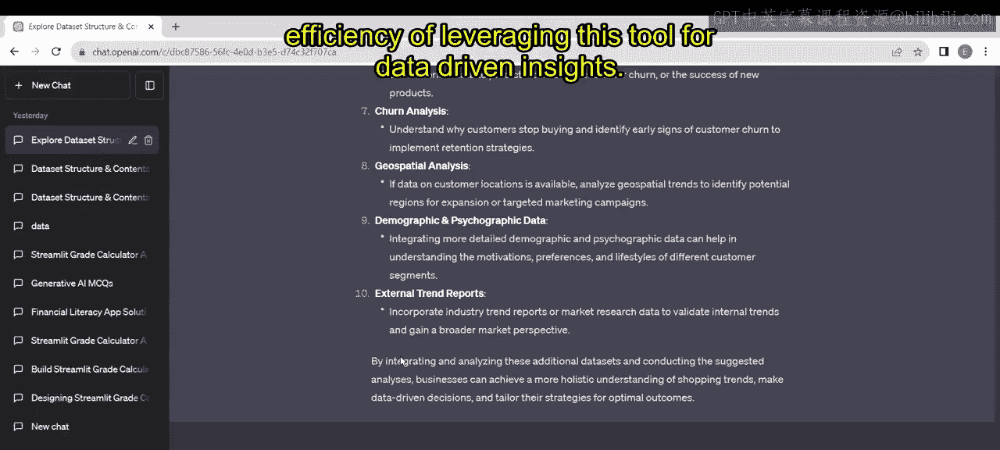

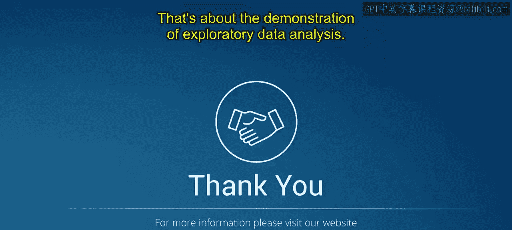

本节课中我们一起学习了如何利用ChatGPT Plus版本高效完成探索性数据分析。我们实践了从生成代码、执行分析、调试错误到提炼商业洞察的全流程。这个过程展示了生成式AI如何将复杂的数据分析任务简化，让分析师能够更专注于问题定义和策略思考，而非繁琐的编码工作。通过自然语言交互，我们能够快速获得可执行的代码、清晰的可视化以及数据驱动的决策建议，极大地提升了数据分析的效率和可及性。