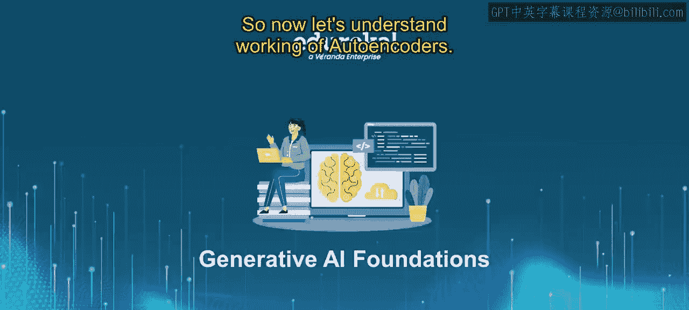
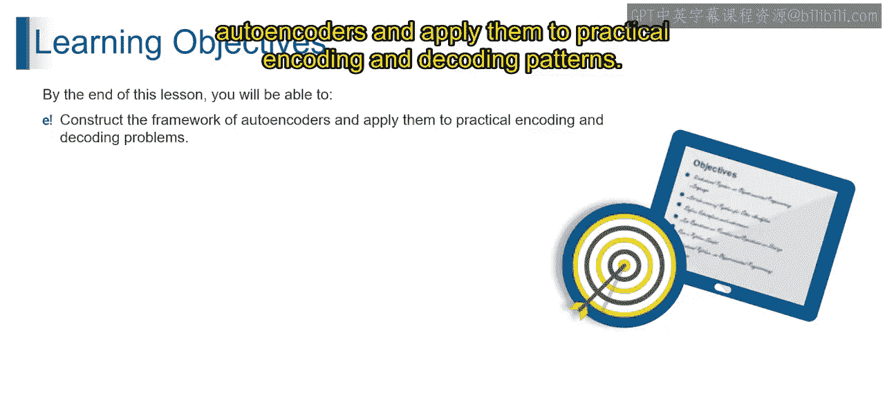
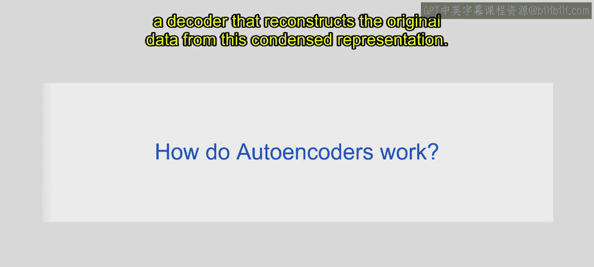
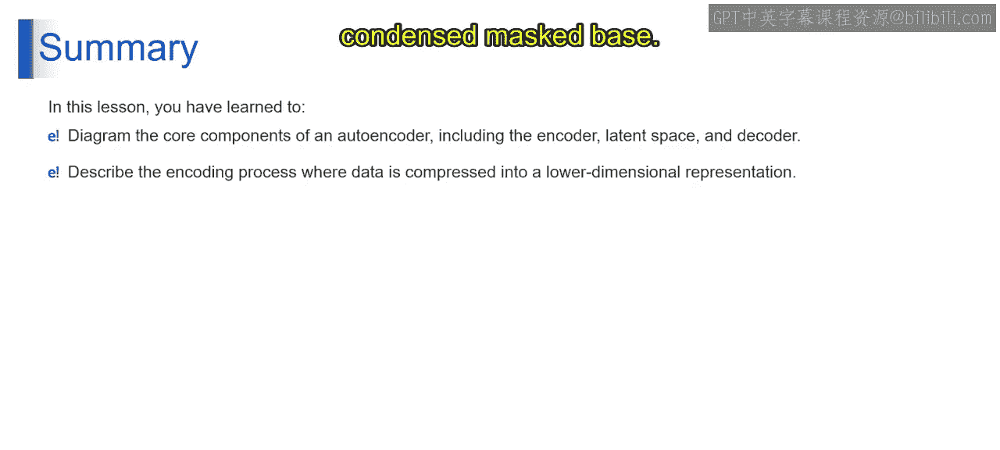

# 第二三四部分 17：自编码器的工作原理 🧠

在本节课中，我们将要学习自编码器的工作原理。我们将了解什么是自编码器，以及它们如何通过压缩和重建数据来工作。课程结束时，你将能够理解自编码器的基本框架，并将其应用于实际的编码和解码模式。

## 什么是自编码器？

想象一下，你是一名学生，需要记住一个冗长而详细的故事。为了简化，你决定写一个摘要，只抓住核心细节。这个摘要就像自编码器中的**编码表示**，它以更紧凑的格式包含了关键信息。





从技术角度理解，自编码器是一种设计用于压缩然后重建输入数据的神经网络，就像学生写摘要一样。


它由一个**编码器**和一个**解码器**组成。编码器将输入压缩成低维度的表示，解码器则从这个压缩的表示中重建原始数据。



## 自编码器如何工作？

上一节我们介绍了自编码器的基本概念，本节中我们来看看它的具体工作流程。自编码器通过学习压缩和重建输入数据来捕获其本质特征。

它包含两个主要组件：编码器和解码器。下图展示了自编码器的工作流程。


以下是自编码器工作的四个核心步骤：

### 1. 输入数据

这是自编码器需要处理的初始数据。例如，如果你在处理图像，输入数据就是一组代表图像信息的像素值。

### 2. 编码器

编码器的作用是将输入数据压缩。可以把它想象成一个神奇的打包助手，把你的物品变成更小、更易管理的形式。

想象你正在为周末旅行打包。你从一个大行李箱（代表详细的原始输入数据）开始。编码器就是你的打包助手，它决定带什么、不带什么。在自编码器中，编码器接收输入数据（你的旅行必需品），并将其映射到**潜在空间**。

编码器由多层神经元（节点）组成，这些层逐步降低输入数据的维度。每一层都从数据中提取越来越抽象和高级的特征，就像决定哪些物品是旅行必需品一样。这个过程可以表示为：

```python
# 第二三四部分 编码过程：将高维输入 x 映射到低维潜在表示 z
z = encoder(x)
```

编码器的角色至关重要，它负责学习数据的高效表示。

### 3. 潜在空间

潜在空间是编码器创建的、输入数据的低维表示。继续用打包的比喻，经过编码器（打包助手）的筛选，你得到了一个紧凑的行李箱，这就是潜在空间。

潜在空间是压缩后的精华版本，捕获了你物品的本质。这个空间中的每个维度都代表了数据的一个学习到的特征或特性，就像你行李箱里分门别类的口袋（衣服、零食等）。通过将数据编码到潜在空间，自编码器可以在减少冗余的同时捕获关键信息。

潜在空间 `z` 的公式可以表示为：
`z = f_encoder(x)`
其中 `f_encoder` 是编码器函数，`x` 是输入数据。

### 4. 解码器

到达旅行目的地后，你需要从紧凑的行李箱中取出物品并重建它们，目标是尽可能接近原始的样子。解码器就扮演了这个“拆包专家”的角色。

解码器从潜在空间中获取信息，并尝试重建原始数据。它努力基于压缩的表示忠实地再现输入。解码器也由多层神经元组成，每一层都逐步重建原始数据，并添加细节。

解码过程可以表示为：
```python
# 第二三四部分 解码过程：从潜在表示 z 重建数据 x_reconstructed
x_reconstructed = decoder(z)
```

解码器的首要目标是生成与原始输入数据 `x` 非常接近的重建数据 `x_reconstructed`。

### 5. 输出

输出是自编码器经过重建过程后生成的最终结果。理想情况下，它应该与输入数据高度相似。重建的误差通常用损失函数来衡量，例如均方误差（MSE）：
`Loss = MSE(x, x_reconstructed)`

## 总结

本节课中，我们一起学习了自编码器的魔法之旅：编码器、潜在空间和解码器。

*   **编码器** 如同打包专家，将你的“物品”（数据）压缩进一个紧凑的“行李箱”（潜在空间）。
*   **潜在空间** 是存放数据精华的紧凑表示。
*   **解码器** 如同拆包专家，努力从压缩的表示中重现原始的“魔法”（数据）。



整个过程就像一次行李箱之旅：打包、压缩、然后拆包以找回你物品的精髓。我们学习了编码和解码的艺术，将详细的数据转化为浓缩的杰作。掌握这个框架是理解更复杂生成式AI模型的重要基础。