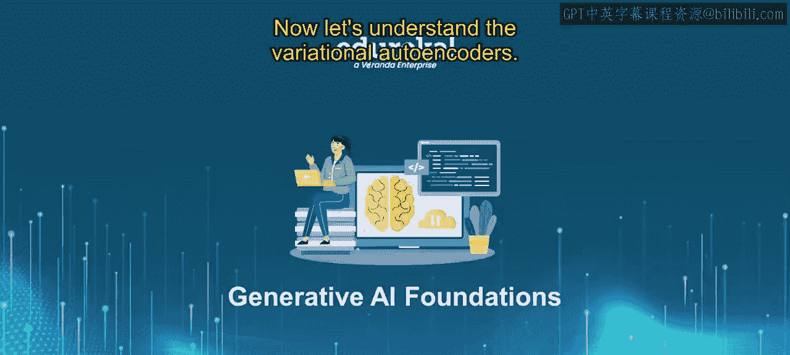
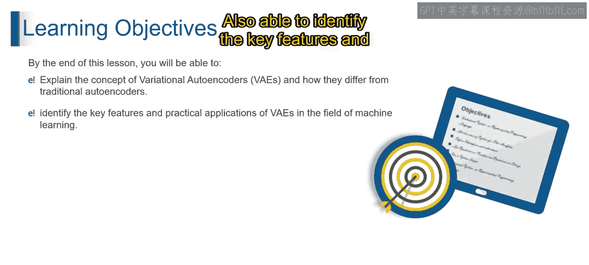
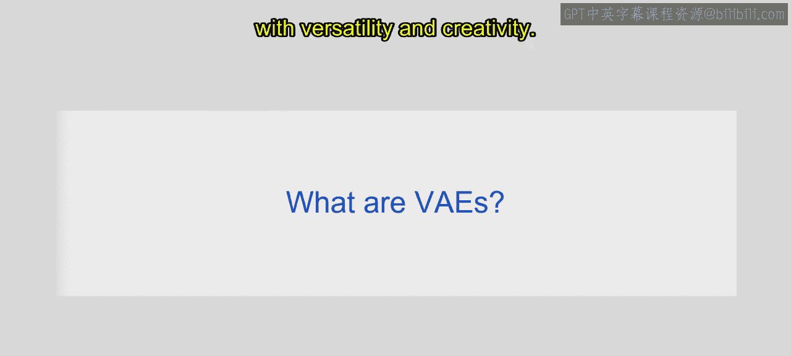
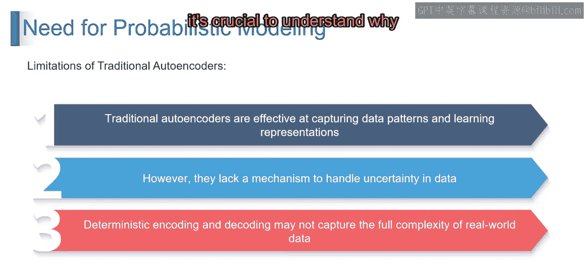
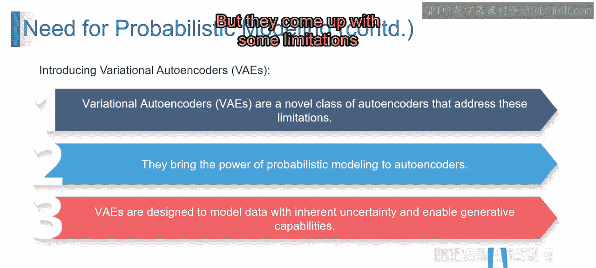
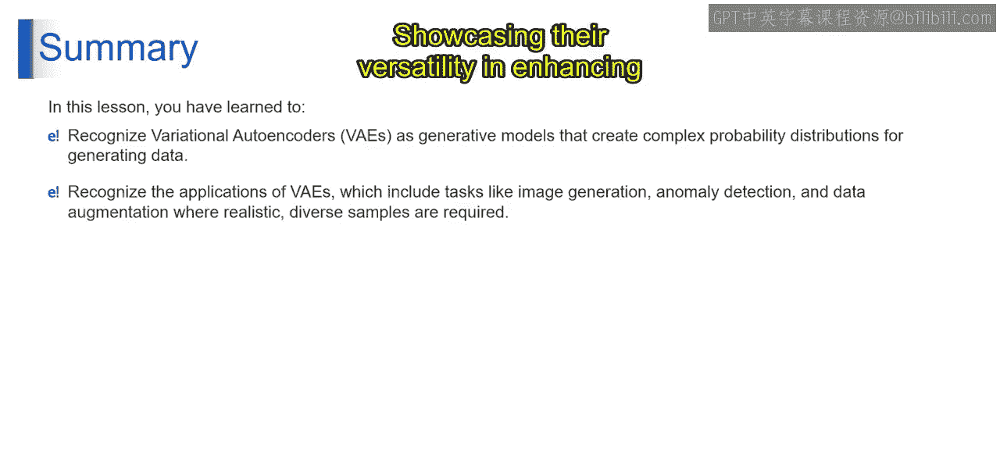

# 第二三四部分 18：变分自编码器 (VAE) 🎨

在本节课中，我们将要学习变分自编码器。这是一种强大的生成式模型，它在传统自编码器的基础上引入了创造性和随机性，能够生成多样化的新数据。

## 什么是变分自编码器？

上一节我们介绍了自编码器的基本概念，本节中我们来看看变分自编码器。变分自编码器，通常简称为VAE，它在标准自编码器的公式上增加了一个独特的“推力”。

变分自编码器的核心在于，它不仅仅是对数据进行压缩和重建。它为数据生成过程注入了创造性和随机性的元素。想象一下，一个学生在创作艺术笔记时，不是坚持一种固定的风格，而是决定加入一些层次感，使得每一次的再创作都略有不同——这就是VAE的精神。它通过引入这种随机性，旨在生成多样化和新颖的数据实例，拥抱数据中的可变性。

## 为何需要概率建模？

随着我们对VAE的深入探讨，理解为何需要采用概率建模至关重要。

传统自编码器有其局限性，而VAE旨在克服这些局限。这就像学习一首曲子时，不仅要掌握主旋律，还要理解音符的各种变化。VAE超越了单纯的重建，它拥有强大的生成能力，能够创造多样且新颖的数据实例，就像一位艺术家不仅复制作品，还能用每一笔触创造出独特的画作。

以下是VAE的几个关键特性：

*   **生成能力**：VAE具备强大的生成新数据的能力。
*   **概率基础**：VAE建立在坚实的概率论基础上，承认并利用数据中的不确定性。
*   **应用广泛**：VAE在从图像合成到异常检测等多个领域都有应用。

## VAE的应用领域

VAE在机器学习的多个领域都有广泛的应用，就像一个艺术家的工具箱，可用于各种数据世界的创造性任务。

以下是VAE的一些主要应用：

*   **图像生成与风格迁移**：VAE擅长生成逼真的图像和转换艺术风格，实现创造性的视觉合成。可以将其想象为一位艺术家，能够无缝融合不同的绘画风格来创作独特的杰作。
*   **数据填补与去噪**：VAE擅长填补缺失的数据和去除噪声，从而提高数据质量和完整性。这就像修复一张老照片，填补缺失的细节并去除不需要的伪影。
*   **医学图像分析**：VAE在分析医学图像方面发挥着至关重要的作用，有助于疾病诊断和治疗规划。可以将其想象为一台强大的显微镜，不仅能放大图像，还能突出关键的医学细节。
*   **自然语言处理**：VAE通过生成连贯且多样的文本来助力NLP任务，改善语言理解。这类似于一位作者创作一个故事的不同版本，每个版本都有其独特的叙事风格。

## 总结

本节课中我们一起学习了变分自编码器。VAE是一种变革性的概率生成模型，它通过在潜在空间中操作，引入了艺术性的可变性，学习数据分布，并展现出强大的生成能力。它们的应用范围广泛，从图像生成到医学图像分析，再到NLP中的文本合成，展示了其在提升数据质量和激发创造力方面的多功能性。