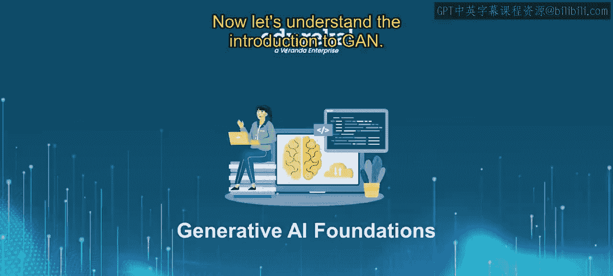
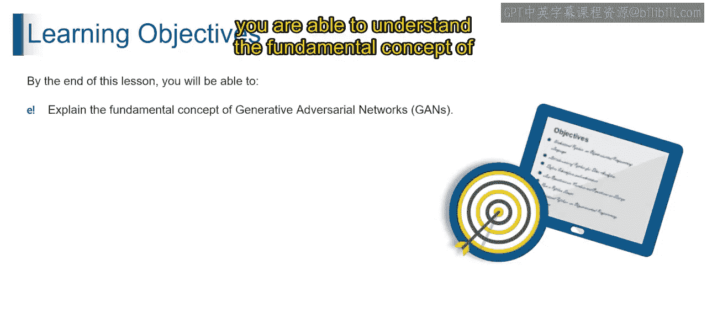
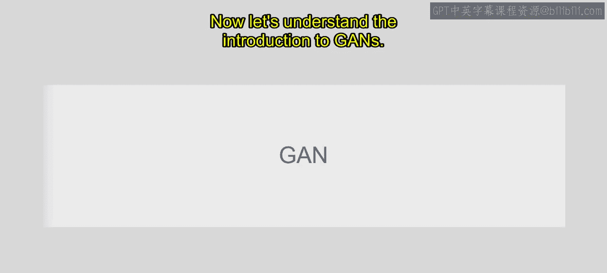
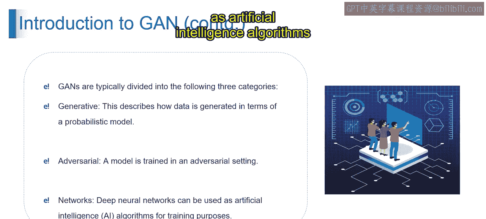
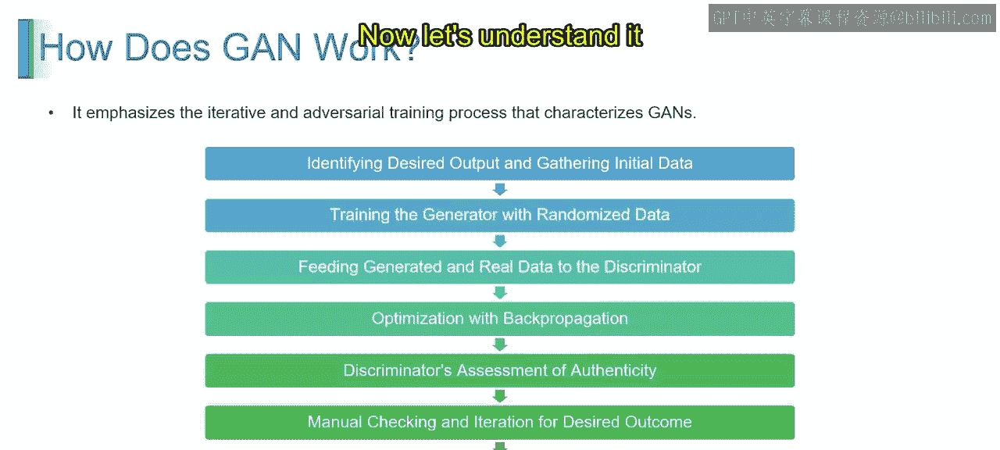
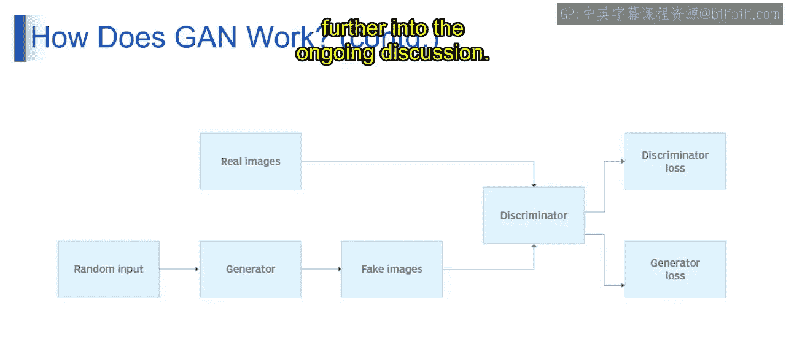

# 第二三四部分 19：GAN介绍

在本节课中，我们将要学习生成对抗网络（GAN）的基本概念。我们将了解什么是GAN，以及它的核心工作原理。通过本节内容，你将能够理解生成对抗网络的基本框架和运作流程。

---

## 什么是GAN？

想象一位技艺高超的伪造者和一位警惕的银行柜员。伪造者的目标是制作出与真钞一模一样的假币，而柜员则不断提升自己识别假币的能力。在数字领域，GAN的运作方式与此非常相似。生成器负责制造类似于真实实例的数据，就像伪造者；而判别器则不断优化其区分真实数据与生成数据的能力，就像银行柜员。

从技术定义上理解，GAN包含一个生成数据的生成器和一个学习区分真实数据与生成数据的判别器。这种动态交互不断优化生成逼真数字内容的能力。生成器产生的数据会越来越接近真实实例，而判别器也在不断进化，以更好地区分真实与生成的数据。这个迭代过程使得两个组件的能力都得到持续提升。

---

## GAN的构成

现在我们来理解GAN的构成。GAN就像一个学习创造新事物的创意艺术家。可以将其想象成一个游戏，其中两位玩家——生成器（艺术家）和判别器（评论家）——相互竞争以提升各自的技能。GAN由Ian Goodfellow及其团队于2014年提出，为机器学习带来了革命性的变化。

GAN通常可以分为三个部分来理解：
*   **生成式**：这描述了数据是如何通过概率模型生成的。
*   **对抗式**：这指的是模型在一个对抗性的环境中进行训练。
*   **网络**：这指的是使用深度神经网络作为训练人工智能算法的工具。

---

## GAN如何工作？

以下是GAN工作的基本步骤：

首先，确定期望的输出并收集初始数据。你需要先确定想要生成的数据类型，并收集初始样本来指导学习过程。

接着，用随机数据训练生成器。生成器开始学习，通过创建随机数据来尝试模仿之前收集的样本。

然后，将生成的数据和真实数据输入判别器。判别器会评估这两类数据，以分辨哪些是真实的，哪些是生成的。

下一步是利用反向传播进行优化。系统利用反馈来调整生成器创建数据的方式，使其更擅长“欺骗”判别器。

随后，判别器评估真实性。判别器会提升其区分真实数据与生成数据的能力。

之后，进行人工检查和迭代以达到期望结果。用户监控进展，手动调整生成器的训练，以获得期望的数据输出。

最后，是双反馈循环。这个迭代过程包含一个持续的循环，生成器和判别器相互提供反馈，从而不断精炼各自的技能。

在GAN中，生成器创建数据，判别器评估其真实性，形成一个对抗循环。这个迭代过程涉及反向传播和人工调整，不断优化两个网络的能力，从而随着时间的推移改善数据生成的质量。双反馈循环确保了GAN性能的持续学习和提升。

---

## GAN的图示解析

现在让我们通过图示来理解这个过程。

首先，是随机输入。这个模块代表了生成器的起点，通常包含随机噪声或一个潜在向量。其具体的格式和大小取决于特定的GAN架构以及它设计用来生成的数据类型，例如图像、文本等。

接着，是生成器。这个模块代表了负责生成新数据实例的神经网络。它以随机输入作为起点。

在接下来的视频中，我们将对此进行更深入的探讨。

---

## 总结

本节课中，我们一起学习了生成对抗网络（GAN）的基础知识。我们了解了GAN的核心思想——一个由生成器和判别器组成的对抗系统，并通过类比和步骤分解理解了其工作流程。生成器致力于生成逼真的数据，而判别器则努力将其与真实数据区分开来，两者在对抗中共同进步，最终使生成器能够产出高质量的数据。