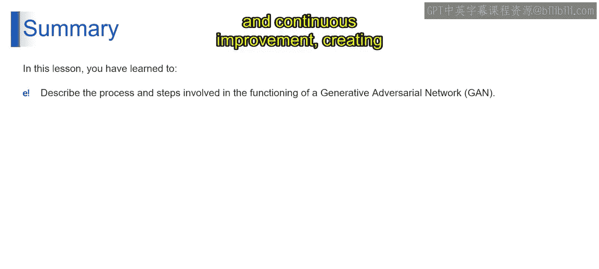

# 第二三四部分 20：GAN的工作原理 🎨

在本节课中，我们将深入探讨生成对抗网络的工作原理。我们将了解其内部结构、各组件如何协作，以及它们如何通过对抗过程共同进步，最终生成逼真的数据。

---

上一节我们介绍了生成对抗网络的基本概念。本节中，我们来看看GAN内部各层和连接的具体工作流程。

以下是GAN工作流程的核心步骤：

1.  **生成器生成图像**
    生成器接收一个随机噪声向量 `z` 作为输入，并通过其神经网络层将其转换为一幅输出图像。理想情况下，生成器生成的图像应难以与训练数据中的真实图像区分开来。

2.  **判别器接收图像**
    接下来，生成的假图像和来自数据集的真实图像被一同送入判别器。假图像是上一步由生成器产生的输出，而真实图像则是生成器试图学习的实际训练数据集中的样本。

3.  **判别器进行分类**
    判别器是一个负责将数据分类为“真实”或“虚假”的神经网络。它接收来自上一步的真实与假图像，并尝试区分它们。

4.  **输出概率分数**
    对于输入的每一幅图像，判别器输出一个介于0和1之间的概率分数。分数为0表示“肯定是假图像”，即该图像极不可能来自真实数据。分数为1表示“肯定是真实图像”，即该图像与真实数据集中的图像有高度相似性。

5.  **计算损失**
    判别器损失和生成器损失是用于更新两个网络、提升其性能的反馈信号。它们通过衡量网络输出与期望结果之间差异的损失函数来计算。
    *   **判别器损失**：衡量判别器在准确分类真实和假图像方面的表现。
    *   **生成器损失**：衡量生成器的输出在多大程度上“欺骗”了判别器。它反映了生成图像被判别器分类为“真实”的接近程度。

6.  **更新网络参数**
    利用这些损失值，两个网络通过反向传播和优化算法更新其内部参数。目标是逐步最小化判别器损失，同时最大化生成器损失，从而持续提升两个网络的能力。

---

在每一轮迭代中，生成图像、真实图像、判别器的分类结果以及计算出的损失，都被用来更新两个网络。随着训练的进行，生成器有望生成越来越逼真的数据，而判别器则变得更擅长区分真实与虚假数据。这种持续的改进最终使得生成器能够产生高度逼真、与其训练数据极为相似的输出。

---

本节课中，我们一起学习了生成对抗网络的工作原理。我们理解了生成器和判别器如何通过一个反馈循环迭代地精进各自的技能。这个过程包括训练生成器、评估数据真实性以及持续改进，从而创造出一个动态的相互作用，以实现更优的数据生成。