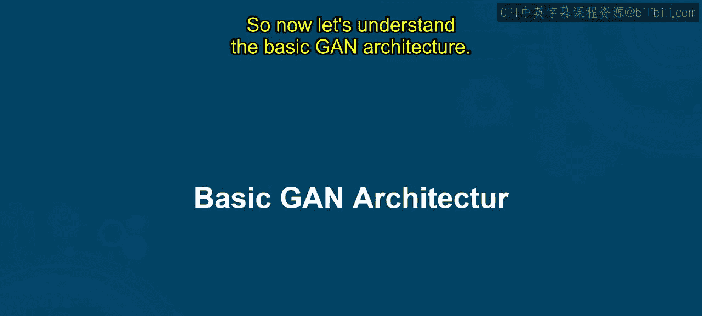
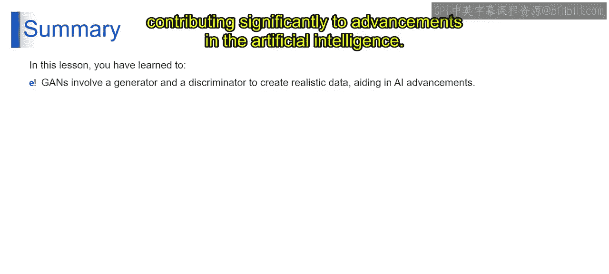

# 第二三四部分 21：基本GAN架构

在本节课中，我们将要学习生成对抗网络的基本架构。我们将了解GAN的核心组件及其结构，帮助你理解这个强大模型是如何工作的。

---

### 概述

生成对抗网络拥有一个简洁而强大的架构，主要由两个核心组件构成：**生成器**和**判别器**。它们通过对抗性训练共同进步。

---

### 核心组件：生成器与判别器

以下是GAN架构中的两个主要组成部分：

1.  **生成器**
    生成器是GAN中的“艺术家”。它的核心功能是接收随机噪声（通常来自**潜在空间**），并通过学习将其转化为逼真的数据（如图像）。它使用如转置卷积等技术来构建其“作品”。生成器的最终目标是创造出与真实数据难以区分的样本。

2.  **判别器**
    判别器扮演着“侦探”的角色。它是一个二元分类器，其任务是区分输入样本是来自真实数据集还是来自生成器的“赝品”。通过训练，判别器不断提升其鉴别真伪的能力，目标是精确地区分真实与生成的图像。

---

### 工作流程与对抗过程

上一节我们介绍了两个核心组件，本节中我们来看看它们是如何协同工作的。GAN的训练是一个动态的对抗过程：

1.  **输入**：过程始于**真实样本**（训练数据）和来自**潜在空间**的**随机噪声**。
2.  **生成**：**生成器**接收噪声，尝试生成看起来像真实数据的**虚假样本**。
3.  **判别**：**判别器**同时接收真实样本和生成器产生的虚假样本，并判断每个样本是“真”还是“假”。
4.  **反馈与迭代**：判别器的判断结果作为反馈回传给生成器。生成器的目标是“骗过”判别器，而判别器的目标是更准确地区分。这个迭代过程持续进行，双方在对抗中不断改进：生成器生成的数据越来越逼真，判别器的鉴别能力也越来越强。

这个过程就像一个艺术家（生成器）与一位眼光犀利的评论家（判别器）之间的创造性竞赛，最终共同推动数据生成质量的提升。

---

### 总结

本节课中我们一起学习了生成对抗网络的基本架构。我们了解到，GAN通过**生成器**和**判别器**这两个组件的对抗性协作，能够生成高度逼真的数据。生成器负责从随机噪声中创造数据，而判别器负责评估数据的真伪。这种独特的对抗机制是GAN在人工智能领域取得重大进展的关键。