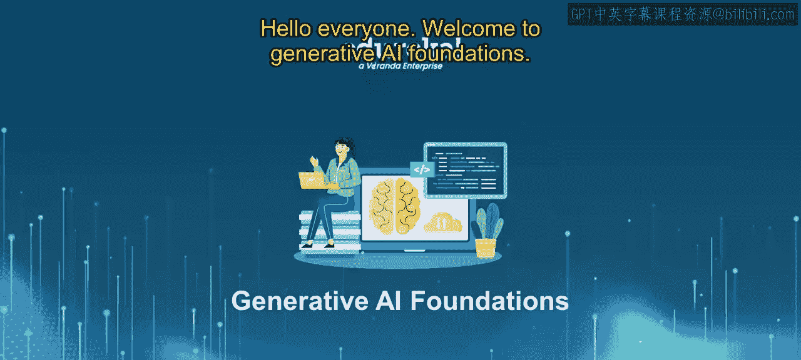
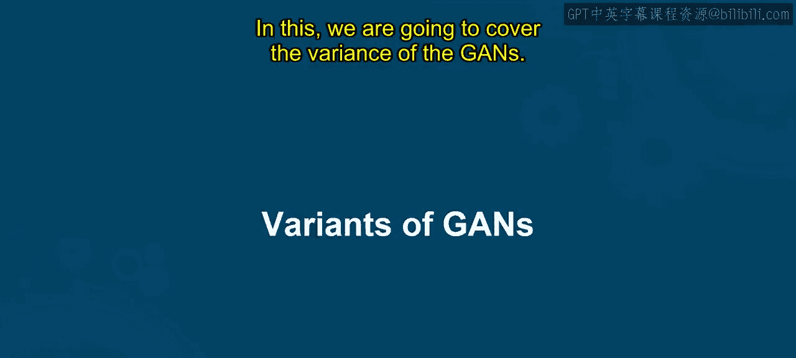
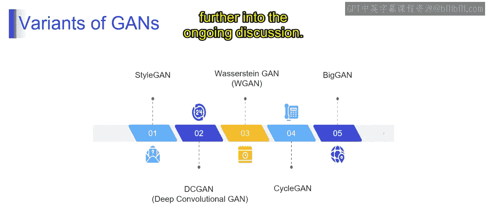

# 第二三四部分 22：GAN的变体

在本节课中，我们将学习生成对抗网络的不同变体。通过学习，你将能够识别GAN家族中存在的多种不同变体，并了解它们各自的特点和应用场景。

## 概述

生成对抗网络是一个多样化的家族，每种变体都像拥有独特风格的艺术家。这些变体共享相同的核心思想，但采用了不同的方法来实现特定目标或应对特定挑战。接下来，我们将逐一探讨这些重要的GAN变体。

## StyleGAN：风格化生成对抗网络

上一节我们介绍了GAN的基本概念，本节中我们来看看第一种变体——StyleGAN。想象一位多才多艺的艺术家，他不仅能绘制逼真的肖像，还能调整自己的风格以适应不同的对象。StyleGAN就是GAN家族中的这样一位艺术家，它擅长创造多样化和个性化的作品。

StyleGAN引入了**风格混合**的概念，允许在输出中生成多样化且可定制的视觉风格。其核心在于**自适应细节**，能够生成具有不同复杂程度的高质量逼真图像。此外，StyleGAN擅长捕捉独特的特征，使其适用于具有特定视觉要求的广泛应用。

以下是StyleGAN的主要应用领域：
*   艺术图像合成
*   视觉时尚设计
*   深度伪造生成
*   人脸老化与年轻化
*   图像到图像的转换

## DCGAN：深度卷积生成对抗网络

了解了擅长风格变换的StyleGAN后，我们再来看看专注于细节的DCGAN。想象一位GAN艺术家，他配备了一套功能强大的画笔，专门用于捕捉图像中错综复杂的细节和纹理。

DCGAN在GAN家族中就是这样一位艺术家，它利用深度卷积层来创建视觉丰富且细节精细的图像。它通过**深度卷积层**增强了网络捕捉生成数据中复杂特征和模式的能力。DCGAN利用卷积网络作为其视觉调色板，能够生成具有逼真纹理和细节的高质量图像。它专注于通过利用深度卷积架构来提高生成图像的真实感，因此非常适合需要详细和真实数据的应用。

以下是DCGAN的主要应用领域：
*   图像生成
*   超分辨率成像
*   风格迁移
*   异常检测
*   领域到领域转换
*   语义分割
*   数据增强

## WGAN：Wasserstein生成对抗网络

前面我们介绍了专注于图像质量和风格的变体，现在我们来关注训练过程本身。WGAN是一种不仅关心创造美丽画作，还致力于确保稳定、平滑创作过程的GAN架构。

WGAN是GAN家族中专注于维持平衡可靠训练动态的建筑师。它采用**Wasserstein距离**来实现更稳定的训练过程，解决了模式崩溃、不收敛等问题，这些问题可能会破坏GAN训练的顺畅流程。WGAN引入了一个更平衡的训练环境，缓解了传统GAN面临的挑战，并为生成器和判别器的对抗训练提供了稳定的基础。通过其距离度量，WGAN优先考虑生成数据分布的连续性，有助于实现更可靠、更一致的GAN训练过程。

以下是WGAN的主要应用领域：
*   图像合成
*   提升训练稳定性
*   数据增强
*   医学图像合成
*   风格迁移

## CycleGAN：循环生成对抗网络

最后，我们来看一种具有独特转换能力的变体——CycleGAN。想象一种GAN，它不仅能够生成令人印象深刻的画作，还拥有在不同风格之间无缝转换艺术作品的独特能力。

CycleGAN是GAN家族中的变革型艺术家，专精于风格转换，并确保艺术演化的平滑循环。CycleGAN擅长**风格转换**，允许将图像从一种风格转换为另一种风格，同时保持内容不变，从而实现无缝的艺术过渡。在CycleGAN中，图像的内容在风格转换过程中得以保留，确保转换后的输出中基本元素和结构得以维持。此外，它支持**双向转换**，CycleGAN可以双向操作，实现从风格A到B再回到A的转换循环，同时保持视觉连贯性。

## 总结

本节课中，我们一起学习了生成对抗网络的四种重要变体。我们了解了**StyleGAN**在生成多样化和可定制风格图像方面的能力，**DCGAN**在利用深度卷积网络捕捉精细细节方面的优势，**WGAN**在通过Wasserstein距离实现稳定训练方面的改进，以及**CycleGAN**在无需成对数据下进行双向风格转换的独特机制。每种变体都是针对GAN在特定挑战下的优化与发展，共同推动了生成式AI在图像合成等领域的进步。