生成式对抗网络：第2：BigGAN与GAN变体总结

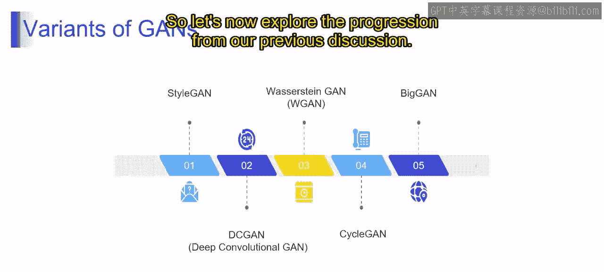

在本节课中，我们将要学习生成式对抗网络家族中一个重要的成员——BigGAN，并总结几种关键的GAN变体。我们将了解BigGAN的设计目标、核心特点及其应用领域，并回顾其他GAN变体的独特之处。

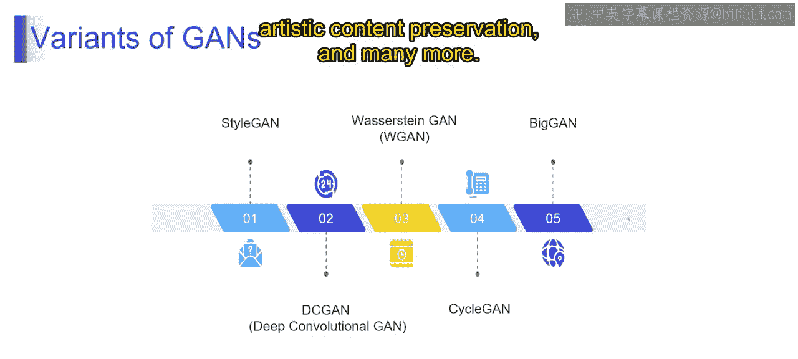

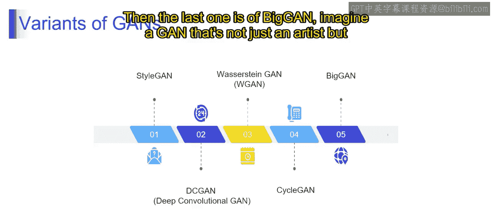

上一节我们介绍了CycleGAN等模型的图像转换能力，本节中我们来看看一个专注于生成高分辨率、高细节度图像的强大模型：BigGAN。

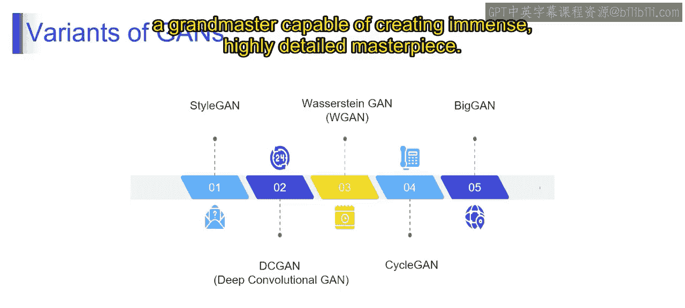

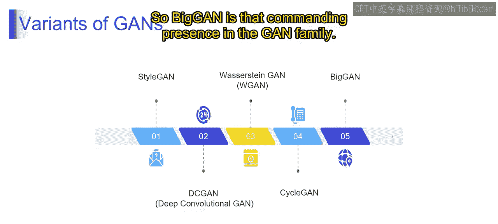

BigGAN是GAN家族中一个具有统治地位的存在，它被设计用于生成大规模、高分辨率且细节极其丰富的图像。它就像一个艺术大师，能够创作出细节无与伦比的巨幅杰作。

BigGAN的核心设计目标是生成**高分辨率**和**高度细节化**的图像。其庞大的网络架构使其能够捕捉并生成图像中精细的特征和模式，将图像生成的复杂度和质量推向了前所未有的水平。

以下是BigGAN的一些关键特点：
*   **大规模图像生成**：专为生成大型、高分辨率图像而设计。
*   **前所未有的细节**：能够创作出具有无与伦比细节的巨幅艺术作品。
*   **复杂架构**：凭借其广泛的网络结构，擅长处理图像中的复杂细节和模式。

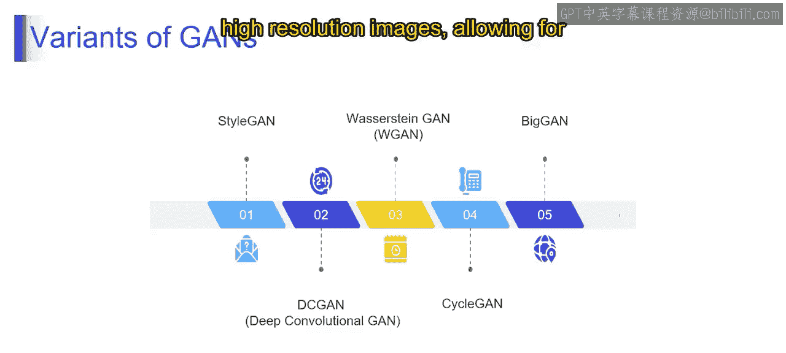

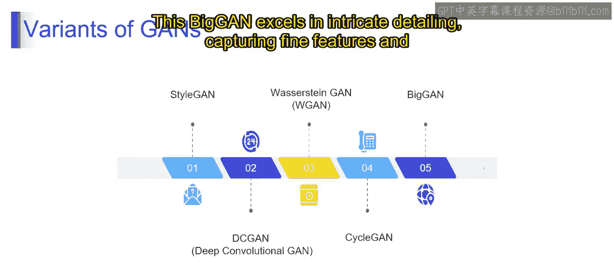

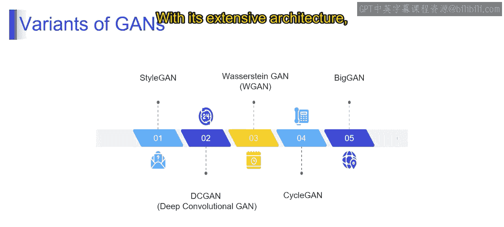

BigGAN在多个领域都有重要应用。以下是其主要应用场景：
*   **高分辨率图像合成**
*   **精细化图像控制**
*   **条件图像生成**
*   **分类任务的数据增强**
*   **艺术内容创作**
*   **语义图像编辑**

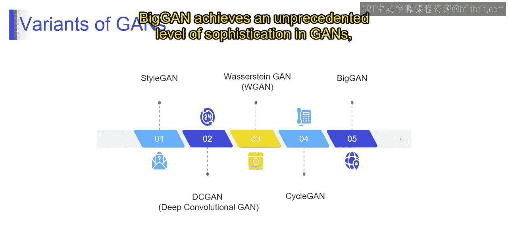

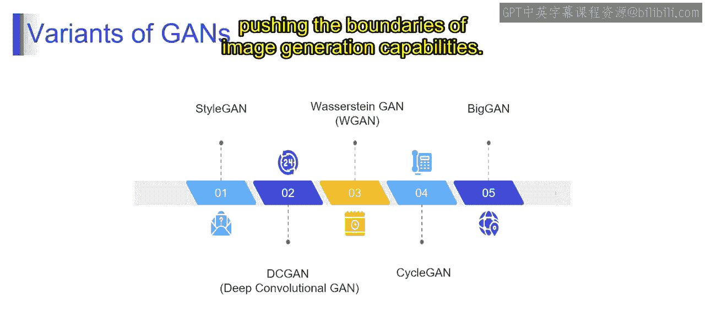

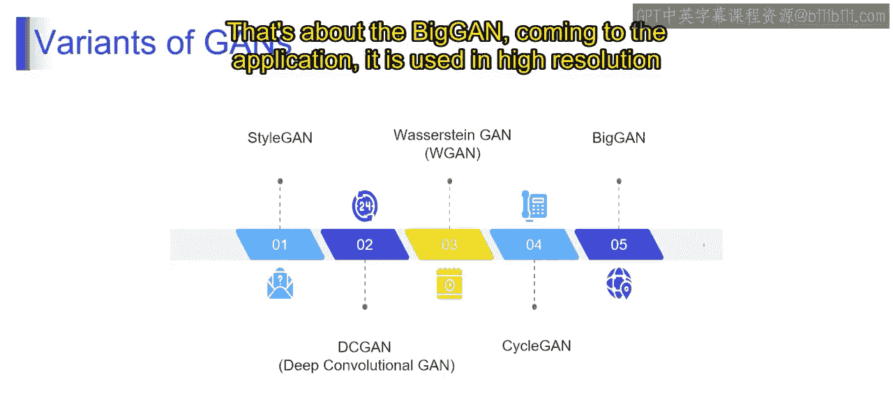

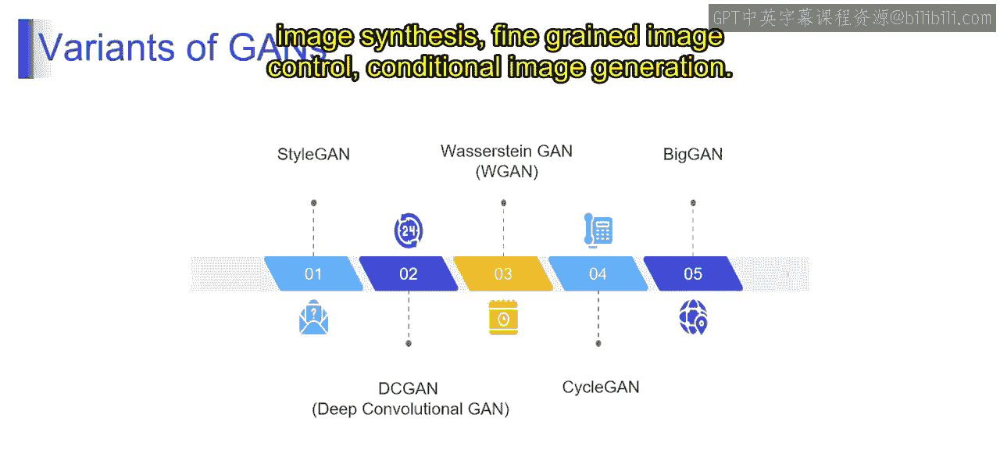

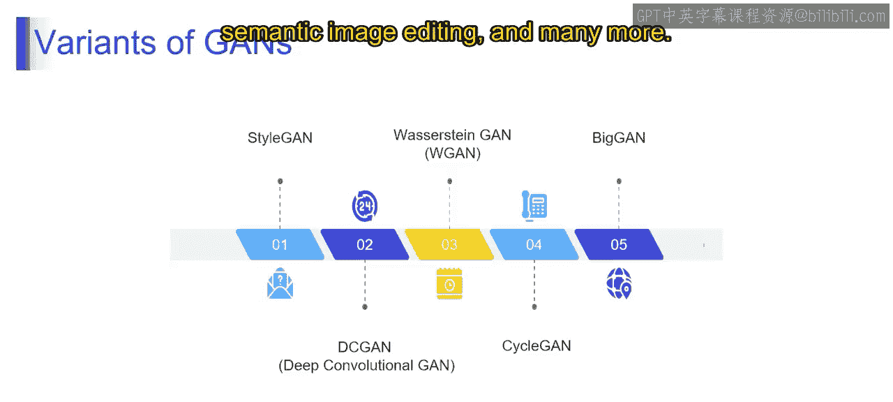

回顾整个课程，我们深入了解了多种不同类型的GAN变体，每种变体都有其独特的改进和侧重点。

从StyleGAN对艺术风格的适应性，到WGAN对训练稳定性的关注，再到CycleGAN强大的图像转换能力，以及BigGAN在生成大规模图像上的卓越表现，我们探索了GAN变体的多样化图景。

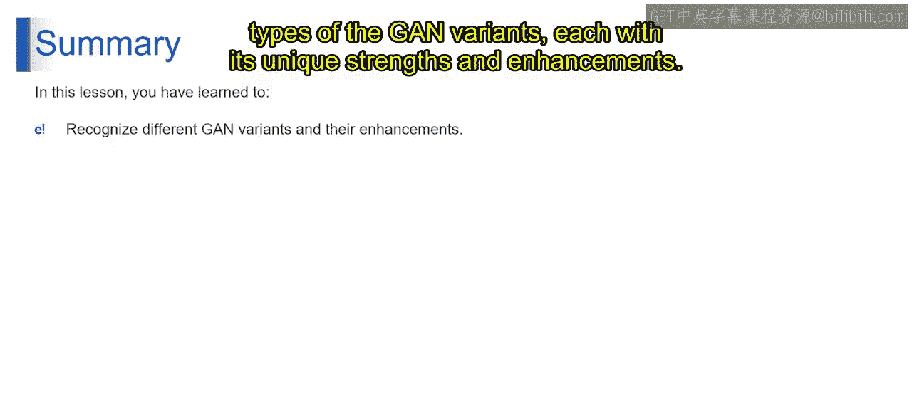

认识这些模型的增强特性，能让你对生成式对抗网络这一迷人领域的技术与艺术内涵有更深刻的理解。

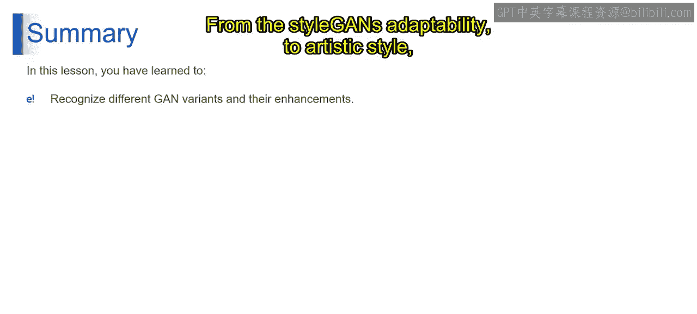

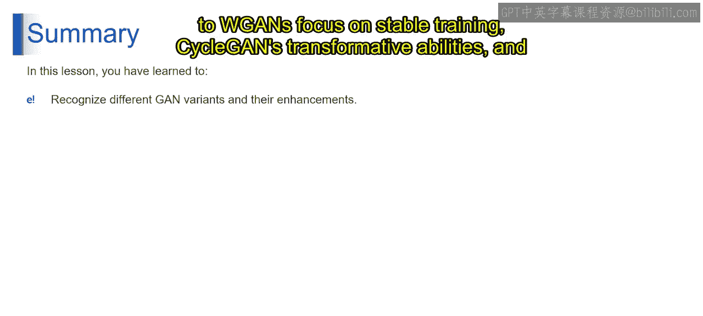

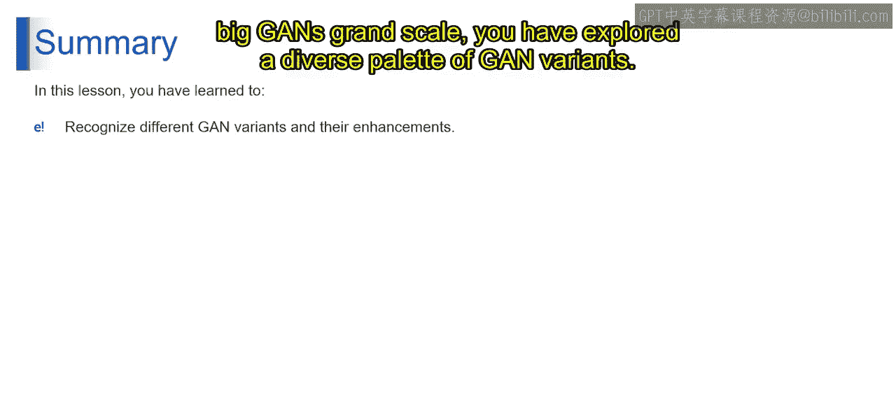

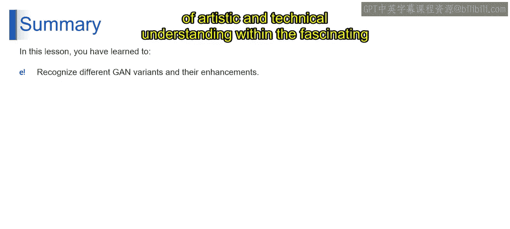

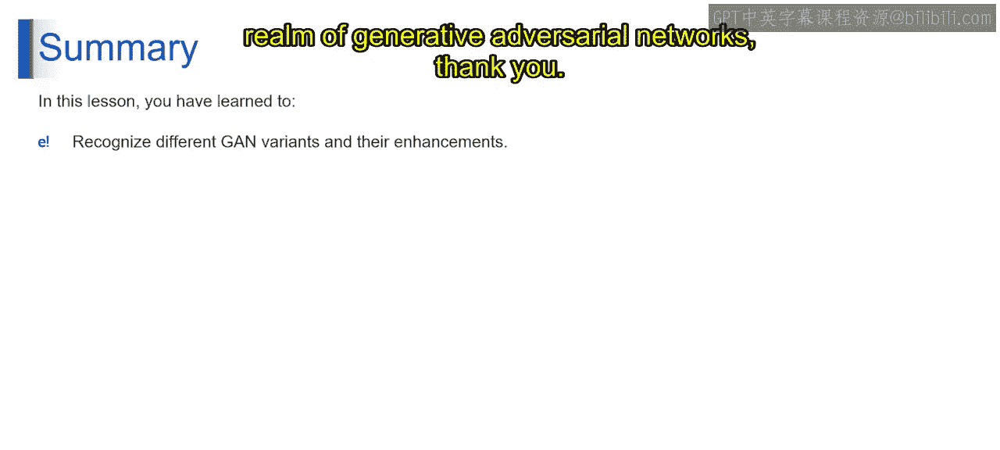

本节课中我们一起学习了BigGAN的核心概念与应用，并总结了包括StyleGAN、WGAN、CycleGAN在内的多种重要GAN变体的特点。这些知识为我们进一步探索生成式AI的应用开发奠定了坚实的基础。