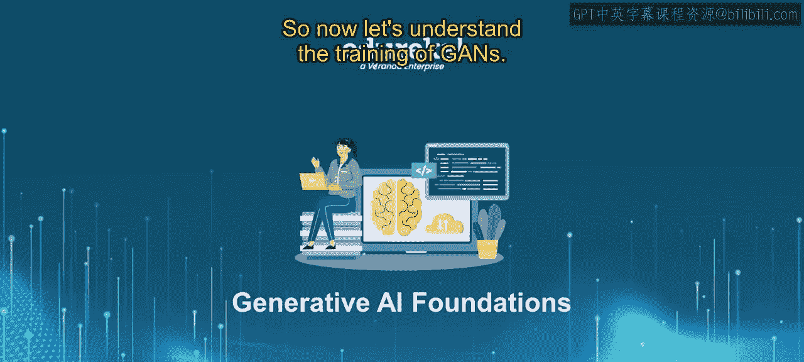
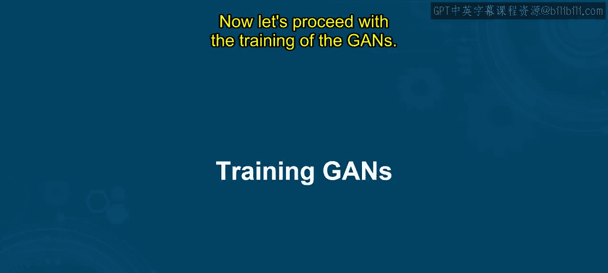
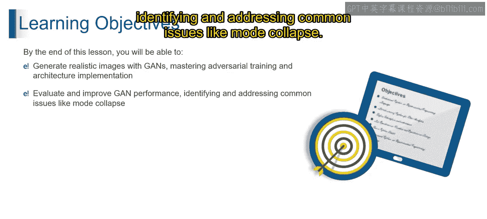
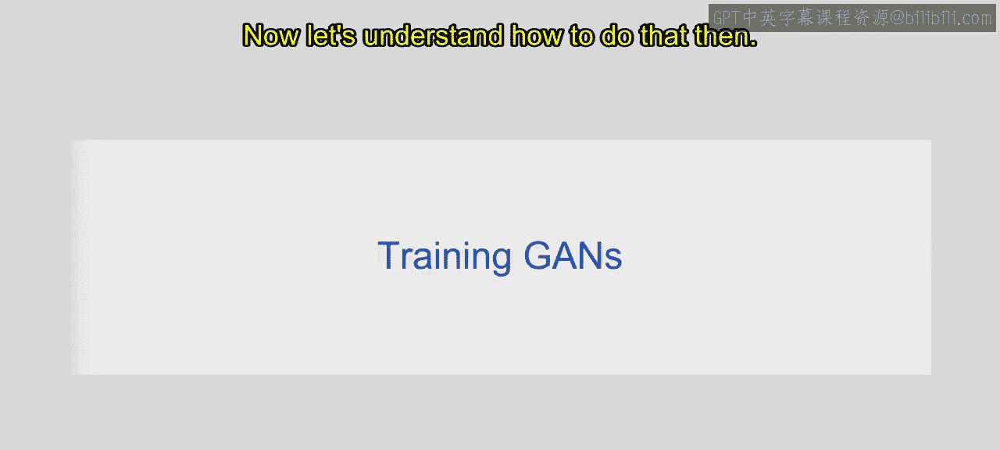
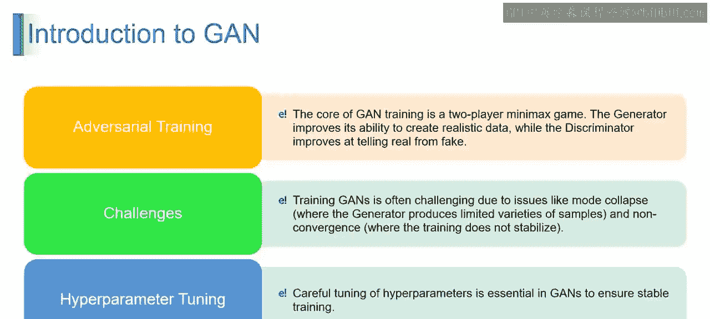

# 第二三四部分 24：训练生成对抗网络

## 概述
在本节课中，我们将要学习生成对抗网络（GAN）的训练过程。我们将理解为何训练至关重要，并掌握其核心的对抗训练机制、面临的挑战以及关键的超参数设置。通过本节学习，你将能够训练GAN来生成逼真的图像，并学会评估和改进其性能。

---

## 为何需要训练GAN？
训练生成对抗网络对于使生成器和判别器学习并改进各自的任务至关重要。其主要目标包括：数据生成、判别能力提升以及实现真实性。

以下是训练GAN的几个核心原因：







1.  **数据生成**：GAN旨在生成与给定数据分布相似的新数据实例。训练生成器使其能够从真实数据中学习模式和结构，从而创建出与原始数据集特征高度相似的合成数据。这就像教导一位艺术家学习特定绘画风格，通过向他们展示各种艺术作品，并引导他们创作出具有相似特征的新作品。

2.  **判别能力**：判别器的训练对于其擅长区分真实数据和生成数据至关重要。随着生成器变得更好，判别器也需要改进其数据鉴别能力，以持续“识破”生成器。这就像训练一位侦探识别赝品画作。他们对真实艺术了解得越多，就越擅长识别伪造品，从而促使伪造者（即生成器）提升其技能。

3.  **实现真实性**：GAN训练的最终目标是使生成的数据与真实数据无法区分。通过对抗训练过程，生成器和判别器迭代地完善各自的能力，直至达到生成数据非常逼真的状态。这就像精炼艺术技能，直到他们的创作变得栩栩如生，即使是专家评论家（即这里的判别器）也难以分辨差异。

因此，训练GAN非常重要。它关乎教导生成器创建真实的数据，以及教导判别器准确区分真实数据和生成数据，从而形成一种动态的相互作用，最终生成高质量的合成数据。

---

## 如果不训练GAN会怎样？
如果不训练生成对抗网络，它本质上将处于未学习状态。其生成器和判别器组件无法获得进行有意义的数据生成所需的技能。

不训练GAN会带来以下影响：

1.  **无法生成数据**：GAN的主要目的是生成与给定分布相似的新数据。未经训练，生成器无法从真实数据中学习，因此无法创建有意义的合成数据实例。这就像让一位从未见过任何画作的艺术家去创作杰作。没有真实样本的接触，生成器就缺乏生成真实数据的基础。

2.  **判别能力有限**：判别器未经训练，无法有效区分真实数据和生成数据。没有从对抗过程中学习，它无法向生成器提供有意义的反馈。想象一位从未研究过艺术的侦探被要求识别赝品。缺乏训练使得判别器不可能甄别真实与伪造数据。

3.  **无法向真实性改进**：推动GAN创建真实数据的对抗性相互作用在未经训练时不会发生。生成器不会精炼其技能，判别器也无法发展出检测真实数据与生成数据之间细微差异的能力。简单来说，期望艺术家不练习就能进步，或评论家不学习就能评判，其创作将停滞不前，缺乏所需的真实感。

---

## 如何训练GAN？
想象一场技艺高超的画家（在我们的案例中即生成器）与敏锐的艺术评论家（在我们的案例中即判别器）之间的游戏。生成对抗网络将数据创造变成了一场激动人心的竞赛：画家努力创作逼真的艺术，而评论家则磨炼其辨别真伪的能力。

训练过程主要涉及三个关键方面：生成器与判别器的交互、对抗训练中的挑战以及超参数调优之旅。

上一节我们介绍了训练GAN的必要性，本节中我们来看看其核心的训练机制与组成部分。

### 生成器与判别器的交互
GAN的训练是一个动态的对抗过程。生成器（G）试图生成足以“欺骗”判别器（D）的数据，而判别器则试图正确区分真实数据和生成数据。这个过程通过一个极小极大博弈（Minimax Game）来形式化。

以下是描述该目标的公式：

**目标函数（价值函数）**：
`min_G max_D V(D, G) = E_{x~p_data(x)}[log D(x)] + E_{z~p_z(z)}[log(1 - D(G(z)))]`

其中：
*   `E` 表示期望值。
*   `x ~ p_data(x)` 表示来自真实数据分布的样本。
*   `z ~ p_z(z)` 表示来自噪声分布（如高斯分布）的随机噪声向量。
*   `D(x)` 是判别器认为样本 `x` 来自真实数据的概率。
*   `G(z)` 是生成器根据噪声 `z` 生成的样本。
*   `D(G(z))` 是判别器认为生成样本 `G(z)` 来自真实数据的概率。

**训练步骤**：
1.  **固定生成器，训练判别器（最大化）**：判别器的目标是最大化上述价值函数中与 `D` 相关的部分。它试图将 `D(x)`（对真实数据）推向1，将 `D(G(z))`（对生成数据）推向0。
    ```python
    # 伪代码示意
    real_output = discriminator(real_images)
    fake_output = discriminator(generator(noise))
    d_loss = - (log(real_output) + log(1 - fake_output)).mean() # 实际中常使用交叉熵损失
    ```
2.  **固定判别器，训练生成器（最小化）**：生成器的目标是最小化价值函数，但更常见的是通过最大化 `D(G(z))` 来“欺骗”判别器。即，生成器希望判别器将其生成的样本误判为真实数据。
    ```python
    # 伪代码示意
    fake_output = discriminator(generator(noise))
    g_loss = - log(fake_output).mean() # 或使用 log(1 - fake_output) 的变体
    ```
这两个步骤交替进行，推动双方不断进化。

### 对抗训练挑战
在训练过程中，GAN会面临一些特有的挑战。

以下是几个常见的挑战：

1.  **模式崩溃**：生成器只学习生成数据集中有限的几种样本模式，而忽略了其他多样性。例如，在生成人脸时，可能只生成同一张脸的不同角度，而无法生成不同人的脸。
2.  **训练不稳定**：生成器和判别器的损失可能剧烈振荡，难以收敛。一方可能过早地压倒另一方（例如，判别器变得太强，导致生成器梯度消失）。
3.  **评估困难**：缺乏一个简单、客观的指标来衡量生成样本的质量和多样性。常需要人工评估或使用如FID、IS等复杂指标。

### 超参数调优之旅
成功训练GAN需要仔细调整一系列超参数。

以下是一些关键的超参数：



1.  **学习率**：控制模型权重更新的步长。过大会导致不稳定，过小会导致收敛缓慢。生成器和判别器有时需要不同的学习率。
2.  **优化器**：常用的有Adam、RMSprop。Adam通常是不错的选择，但其动量参数（beta1）可能需要调低（如0.5）以帮助稳定训练。
3.  **批量大小**：每批用于更新模型的数据量。较大的批量大小通常能提供更稳定的梯度估计，但受限于内存。
4.  **噪声维度**：输入生成器的随机噪声向量 `z` 的长度。更高的维度可能提供更多的表达能力和多样性。
5.  **网络架构**：生成器和判别器的深度、宽度、是否使用批量归一化、使用何种激活函数等，都对训练成功至关重要。

---



## 总结
本节课中我们一起学习了生成对抗网络（GAN）的训练。我们首先理解了训练GAN对于实现数据生成、提升判别能力和达到真实性的必要性，并探讨了不训练的后果。接着，我们深入剖析了GAN训练的核心机制——生成器与判别器在极小极大博弈框架下的动态对抗。最后，我们认识了训练过程中常见的挑战（如模式崩溃）以及成功训练所依赖的关键超参数。掌握这些知识是使用GAN生成高质量、逼真数据的基础。