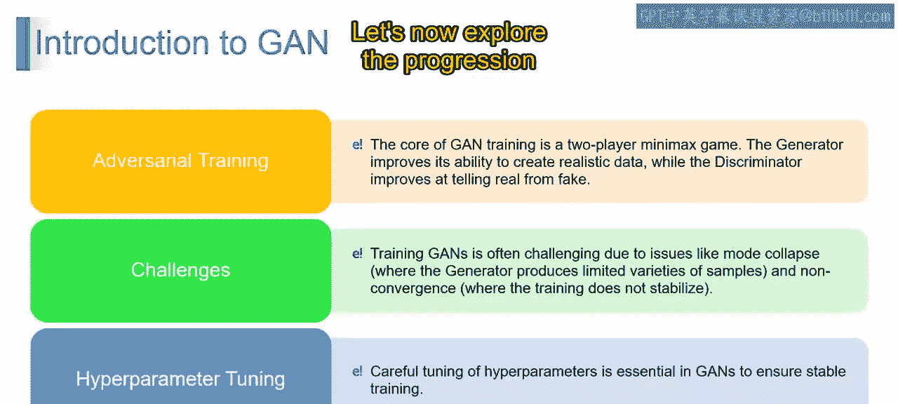
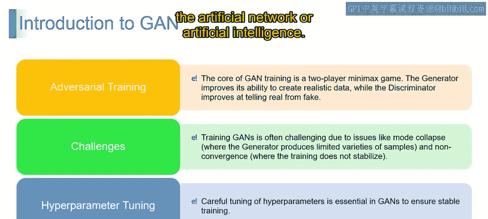
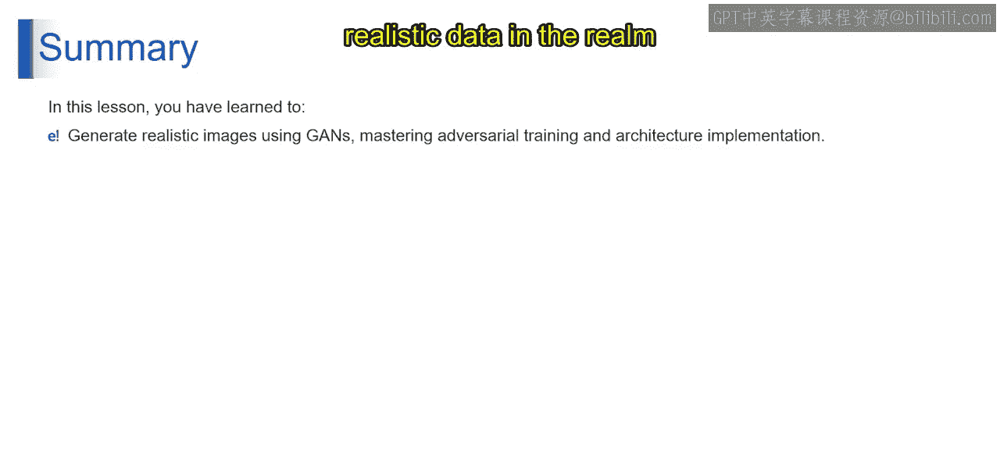

第2：关于生成对抗网络

在本节课中，我们将要学习生成对抗网络的核心概念、其独特的对抗训练过程、面临的挑战以及确保训练成功的关键因素。

---

上一节我们介绍了生成对抗网络的基本框架。本节中，我们来看看其核心的训练过程——对抗训练。

在对抗训练过程中，发生的是一个持续的博弈。在我们的“艺术游戏”比喻中，画家（即生成器）与评论家（即判别器）不断交锋。生成器学习创造更逼真的“艺术品”，而判别器则提升其辨别真伪的能力。这就像一场不断进化的舞蹈，双方都在提升自己的技艺。

---

理解了对抗训练的动态后，我们来看看这个过程并非一帆风顺，它面临着一些挑战。

以下是训练GAN时常见的两个主要挑战：

*   **模式崩溃**：生成器可能反复生成相似或有限的样本，缺乏多样性。
*   **不收敛**：训练过程可能无法达到一个稳定的平衡点。

这些挑战使得GAN的训练变得棘手，就像在我们的艺术对话中难以找到完美的节奏。

---

面对这些挑战，我们需要一些技巧来确保训练顺利进行。接下来，我们将探讨一个至关重要的步骤：超参数调优。

为了确保这场“艺术对决”平稳推进，对参数进行细致的调优至关重要。这类似于调整画笔的大小和画布的纹理。精心的超参数调优能保持训练稳定，防止我们的“艺术游戏”偏离正轨。

以下是GAN训练的三个关键方面总结：

1.  **对抗训练**：GAN训练是一个**minimax博弈**，其目标函数可表示为 **min_G max_D V(D, G)**，其中生成器（G）致力于提升生成数据的能力，而判别器（D）则致力于提升区分真实与生成数据的能力。
2.  **挑战**：模式崩溃和不收敛是GAN训练中的主要挑战，前者导致生成样本多样性不足，后者使训练过程难以稳定。
3.  **超参数调优**：细致的超参数调优能确保GAN训练稳定，防止出现问题，并维持对抗博弈的良性进行。

在生成对抗网络的迷人领域中，训练包含一场持续的、艺术般的对决。生成器与判别器相互竞争、共同进化，克服挑战，而精确的超参数调优则确保这场“游戏”平稳推进，不断拓展人工智能的疆界。

---

本节课中，我们一起学习了通过生成对抗网络生成逼真图像的专业知识。我们掌握了对抗训练的艺术，理解了生成器如何精进其技能，判别器如何提升其辨别能力。此外，我们还深入探讨了GAN架构的实现，解锁了在人工智能领域创造逼真数据的潜力。