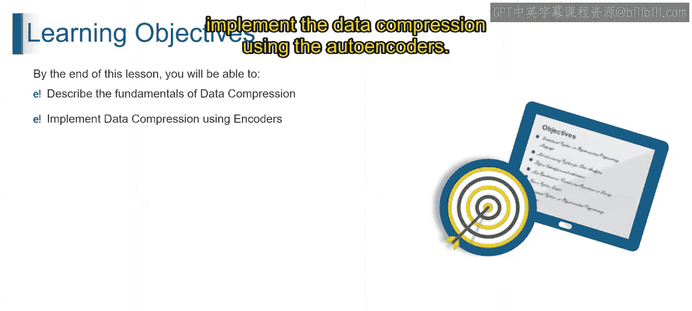
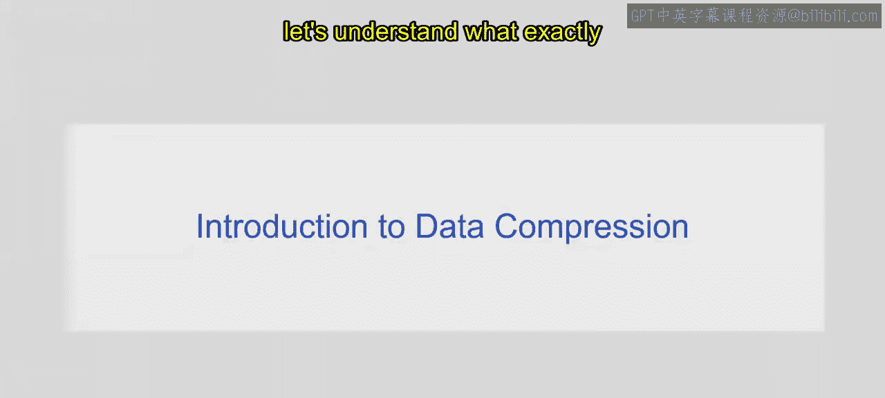
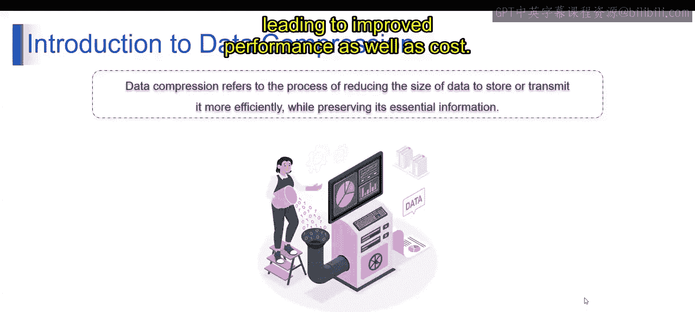
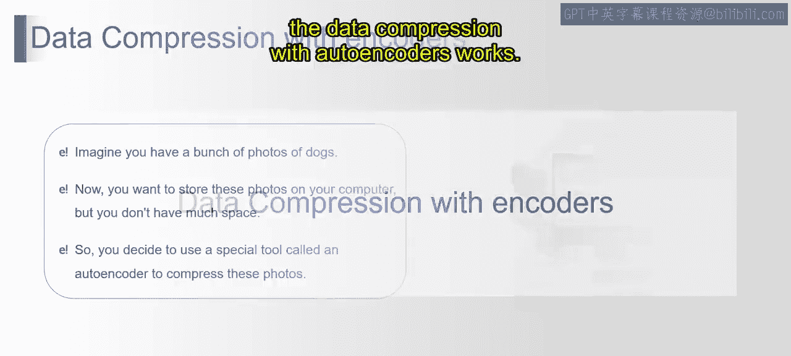
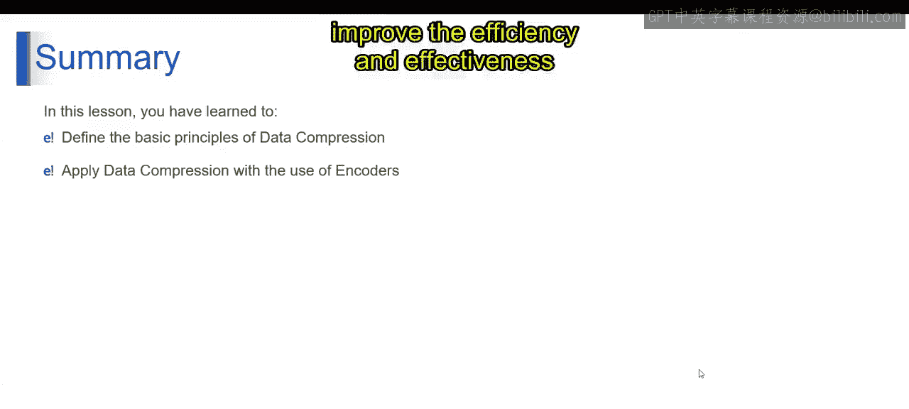

2：使用自编码器进行数据压缩

在本节课中，我们将学习数据压缩的基本概念，并重点了解如何使用自编码器来实现数据压缩。我们将探讨数据压缩的原理、自编码器的工作机制，以及生成式AI中其他相关的数据压缩技术。

首先，我们来理解什么是数据压缩。数据压缩是指减少数据大小的过程，以便更高效地存储或传输，同时保留其关键信息。这意味着使用更少的比特或字节来表示原始数据，从而降低存储需求并加快传输速度。

这种压缩技术旨在尽可能保持数据保真度的前提下，消除数据中的冗余或无关信息。数据大小的减少在各种存储空间或带宽有限的应用中尤其有价值，例如数字媒体、通信系统和数据存储设备。高效的数据压缩使得在可用资源下能够存储或传输更多数据，从而提升性能并降低成本。

上一节我们介绍了数据压缩的基本概念，本节中我们来看看自编码器是如何实现数据压缩的。让我们考虑一个例子：假设你有一堆狗狗的照片，每张照片都非常详细，包含大量像素，因此文件体积很大。现在你想把这些照片存储在电脑上，但空间有限。于是你决定使用一个名为“自编码器”的特殊工具来压缩这些照片。

以下是自编码器工作的步骤：
1.  **编码照片**：自编码器首先查看每张照片，并尝试找出每只狗最重要的特征，如大小、颜色和形状。然后，它用一种更简单的方式表示这些特征，类似于为每只狗画一幅素描，而不是保留完整的细节照片。
2.  **压缩**：在识别出重要特征后，编码器会丢弃不太重要的细节。这使得每幅“素描”的尺寸比原始照片小得多。因此，你只需要保存这些紧凑的“素描”，而不是原来庞大的照片。
3.  **解码**：之后，当你想再次查看照片时，自编码器可以获取这些紧凑的“素描”，并用它们来重建原始照片。它通过根据之前创建的简化“素描”来填补缺失的细节，从而实现重建。

从技术上讲，使用自编码器进行数据压缩涉及使用一种称为自编码器的神经网络来学习输入数据的压缩表示。自编码器由两部分组成：**编码器网络**，它将输入数据压缩成低维表示；以及**解码器网络**，它从这个压缩表示中重建原始数据。

在训练过程中，自编码器最小化重建误差，确保压缩表示保留了原始数据的基本信息。这种压缩表示允许在减小数据大小的同时，对其进行高效的存储、传输或进一步分析。

我们已经了解了自编码器的工作原理，接下来简要看看生成式AI中其他几种重要的数据压缩技术。

以下是几种主要的技术：
1.  **变分自编码器**：VAE是一种生成模型，它学习数据的概率分布，并从这个分布中生成新样本。它包含一个将输入数据压缩到低维潜在空间的编码器网络，以及一个从该潜在表示重建原始数据的解码器网络。VAE以其生成多样且逼真样本的能力而闻名，同时支持潜在空间插值和操作。
2.  **生成对抗网络**：GAN是生成建模的另一种流行方法，其中两个神经网络（生成器和判别器）以竞争方式同时训练。生成器学习生成逼真的数据样本，而判别器学习区分真实样本和生成样本。通过这种对抗性训练过程，GAN可以在文本、图像和音频等多个领域生成高质量、逼真的数据样本。
3.  **Transformer模型**：这是一类在自然语言处理任务中广受欢迎的深度学习模型。它们利用自注意力机制来捕捉输入数据中的长程依赖关系，从而实现有效的数据压缩和生成。像GPT和BERT这样的模型在文本生成、翻译和摘要等任务中展现了卓越的性能。
4.  **自编码变分贝叶斯**：也称为AEVB，它是一个概率模型框架，结合了VAE和贝叶斯推断的元素。它利用VAE的编码器-解码器架构来学习数据的潜在空间表示，同时结合变分技术进行不确定性估计和鲁棒性提升。

本节课中我们一起学习了数据压缩的基础知识，重点探讨了自编码器如何通过编码和解码过程实现高效压缩。我们还简要介绍了生成式AI领域中其他几种关键的数据压缩技术，如变分自编码器、生成对抗网络、Transformer模型和自编码变分贝叶斯。每种技术都有其独特的优势，适用于不同类型的数据和应用场景。研究人员仍在不断探索和开发新方法，以提高生成建模中数据压缩的效率和效果。