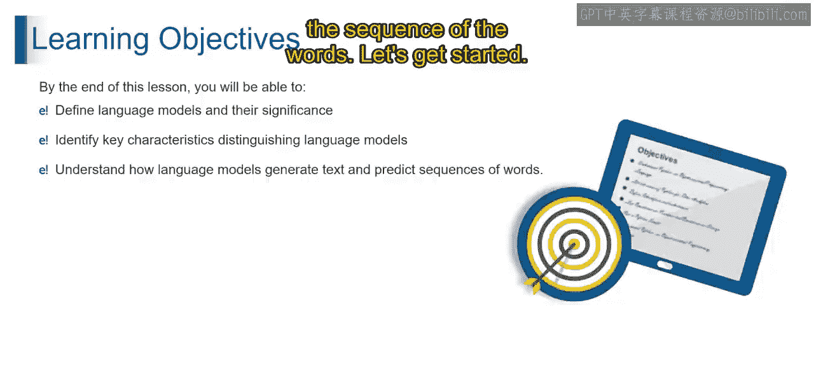
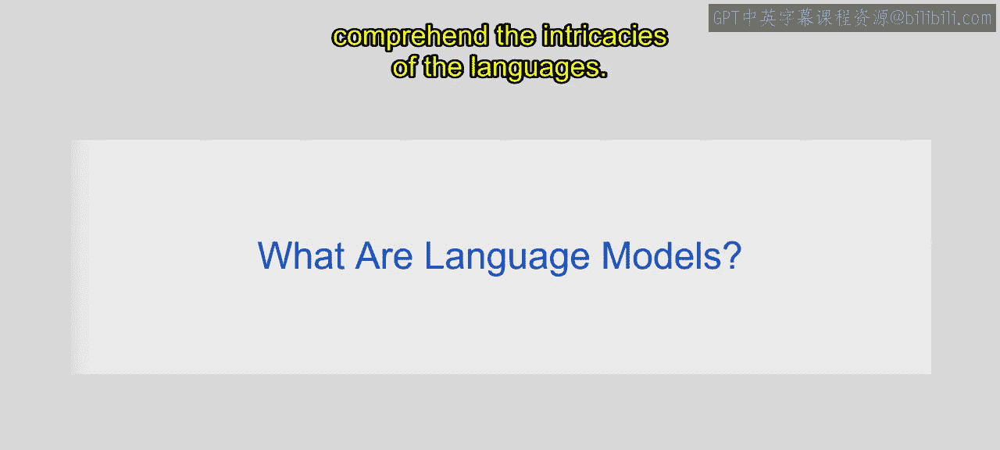
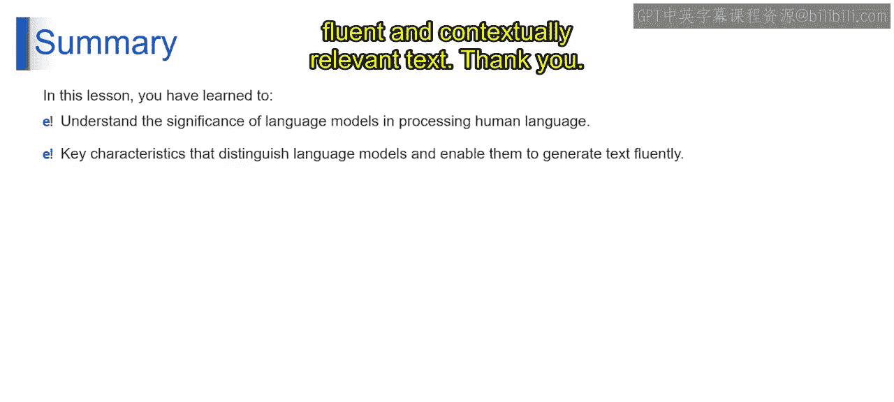

# 第二三四部分 27：探索语言模型

在本节课中，我们将学习语言模型的核心概念。我们将了解什么是语言模型，并探讨它们的关键特性。课程结束时，你将能够理解并定义语言模型及其重要性，识别区分语言模型的关键特征，并理解语言模型如何生成文本和预测单词序列。

---

### 什么是语言模型？🤔

首先，语言模型是旨在理解、生成和预测人类语言的计算模型。这些模型利用海量文本数据中的统计模式和结构来理解语言的复杂性。

语言模型是人工智能领域的基石，专门用于理解和生成人类语言。

**理解与生成**：想象一个模型深入研究庞大的文本库以掌握语言的精妙之处。这意味着语言模型能够恰当地理解和生成文本，利用从广泛训练数据中获得的洞察力。

**广泛训练**：设想模型沉浸于文字的海洋中，通过大量接触来掌握细微差别。这意味着在庞大数据集上进行训练，能提升语言模型理解复杂语言模式的能力。

**上下文连贯的文本**：想象模型能够创作出无缝融入特定对话、保持流畅的文本。这意味着语言模型擅长生成连贯且与上下文相关的文本，确保高效沟通。

**在NLP中的关键作用**：考虑由语言模型驱动的聊天机器人、语言翻译工具或内容摘要系统。语言模型在推动自然语言处理进步、改变各种应用方面发挥着重要作用。

本质上，语言模型是驾驭人类语言复杂性的人工智能引擎，使其能够理解、生成并为自然语言处理领域内的广泛应用做出贡献。

---

### 语言模型的关键特性 🔑

上一节我们介绍了语言模型的基本定义和作用，本节中我们来看看构成语言模型核心能力的关键特性。

以下是语言模型的关键特性：

1.  **NLP应用**
    *   **聊天机器人与虚拟助手**：语言模型为对话代理提供动力，促进自然且与上下文相关的互动。其影响是增强用户参与度，并在基于聊天的应用中实现无缝沟通。
    *   **语言翻译**：语言模型有助于构建准确且考虑上下文语境的语言翻译系统。其影响是提高翻译质量，并在多语言应用中实现更广泛的语言覆盖。
    *   **内容摘要**：语言模型协助将冗长文本压缩为简洁摘要，同时保留关键信息。其影响是高效提取核心内容，辅助信息检索。
    *   **情感分析**：语言模型分析文本以确定情感倾向。其影响是为企业决策提供有价值的洞察。

2.  **文本生成**
    语言模型能够基于给定上下文或提示生成连贯且与上下文相关的文本。其影响是允许进行创意内容生成、故事叙述和多样化的语言应用。

3.  **序列依赖性**
    序列依赖性指的是序列中元素之间存在的关系和模式，其中元素的顺序至关重要。其意义在于，理解序列依赖性对于涉及时间序列数据、语言处理以及任何元素排列传达有意义信息的领域都至关重要。

4.  **预训练模型**
    预训练模型是在大型数据集上针对特定任务进行训练，然后在较小的任务特定数据集上进行微调的神经网络模型。其影响是利用从海量数据中学到的知识，加速训练过程并提升下游任务的性能。例如：BERT、GPT等模型。

---

### 总结 📝

本节课中，我们一起学习了语言模型的精髓。你认识了语言模型在理解和生成人类语言方面的关键作用，并探索了赋予语言模型生成流畅且与上下文相关文本能力的关键特性。