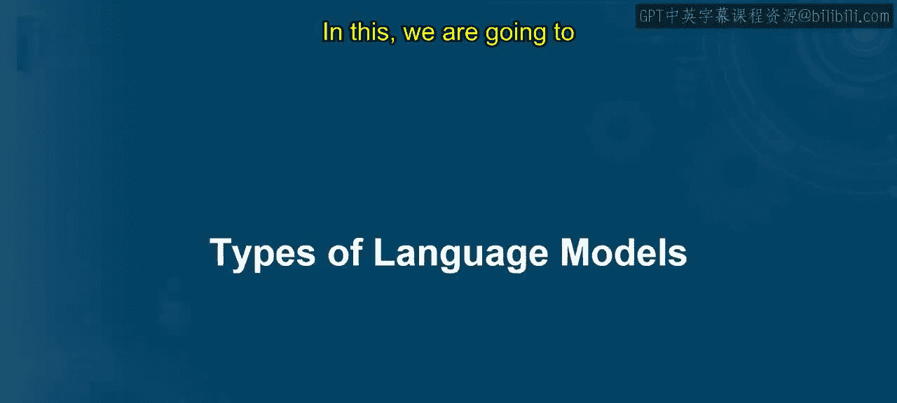
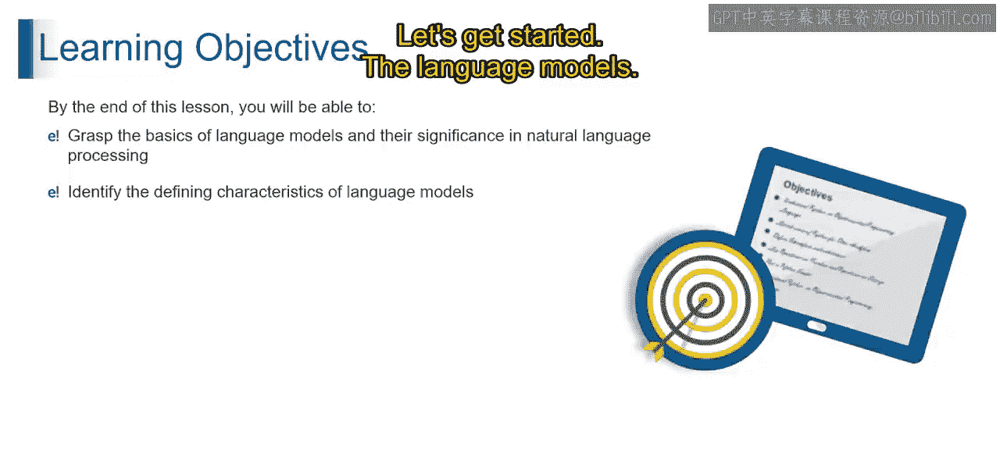
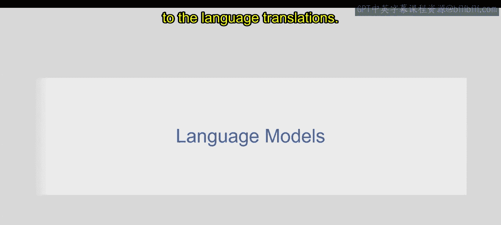
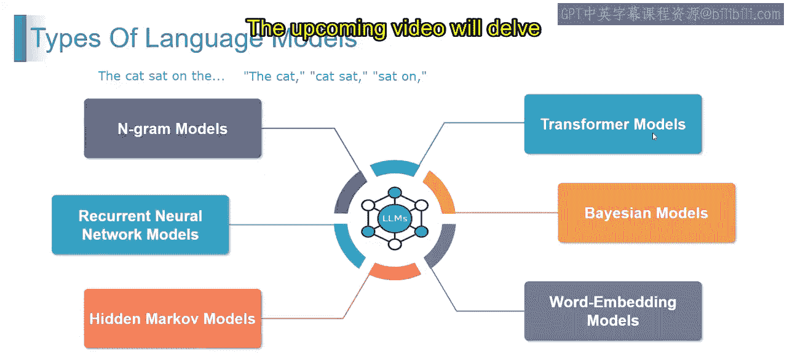

# 第二三四部分 28：语言模型的类型

在本节课中，我们将学习不同类型的语言模型。通过本课，你将能够理解语言模型的基础知识及其在自然语言处理中的重要性，并能够识别各类语言模型的关键特征。

语言模型是旨在理解、生成和预测人类语言的计算模型。它们在从聊天机器人到语言翻译的各种应用中扮演着核心角色。

现在，让我们来了解其不同类型。

## N-gram模型

上一节我们介绍了语言模型的基本概念，本节中我们首先来看看N-gram模型。N-gram模型是自然语言处理中的一个基础概念，它提供了一种结构化的方式来理解和生成文本。

想象你正在读一个句子：“the cat sat on the”。在N-gram模型中，你可以选择n等于任意数字，例如1、2、3或更多。在我们的例子中，假设n=2（即二元语法，也称为bigram），模型将专注于连续的词对。对于这个句子，它会考虑“the cat”、“cat sat”、“sat on”和“on the”等组合。

N-gram模型分析给定文本中n个词（或项目）的序列，基于前n-1个项目来预测下一个项目的可能性。上述二元语法的例子说明了其本质是捕捉相邻词之间的依赖关系。

以下是N-gram模型的一些应用：

*   **语言建模**：预测序列中的下一个词。
*   **语音识别**：将语音信号转换为文本。
*   **拼写检查**：识别和纠正拼写错误。

然而，N-gram模型也存在一些局限性：

*   **有限的上下文**：N-gram模型具有有限的上下文窗口，难以处理语言中的长期依赖关系。
*   **稀疏数据问题**：随着n增大，特定n-gram的出现频率会降低，导致数据稀疏问题。
*   **缺乏语义理解**：这些模型可能无法捕捉词之间更深层的语义关系。

总之，N-gram模型为语言分析提供了一个简单而强大的框架。

## 循环神经网络模型

了解了基于统计的N-gram模型后，我们来看看基于神经网络的模型。循环神经网络模型是处理涉及序列依赖任务（如语言理解、翻译和语音识别）的强大工具。其架构使RNN能够捕捉并利用整个输入序列的信息，使其擅长处理序列数据。

以下是RNN的一些应用：

*   **自然语言理解**：理解文本的含义。
*   **语言翻译**：将一种语言翻译成另一种语言。
*   **语音识别**：将语音转换为文本。

但RNN也存在一些局限性：

*   **短期记忆问题**：RNN在保留长序列信息方面面临挑战，对于具有长期依赖关系的任务存在限制。
*   **梯度消失与爆炸**：训练RNN时可能遇到梯度消失或爆炸的问题，阻碍有效学习。
*   **难以捕捉长期依赖**：尽管有内部记忆机制，RNN可能仍难以有效捕捉被长序列分隔的元素之间的关系。

## 隐马尔可夫模型

接下来，我们了解另一种经典的序列模型——隐马尔可夫模型。它是一个用于理解和建模序列数据的强大框架。

HMM是概率模型，旨在表示随时间演变的系统，其中观测数据是底层隐藏状态的结果。可以将HMM视为序列模式的“故事讲述者”，其中每个状态生成可观测的结果，状态之间的转换决定了叙事的流程。

例如，在天气预测中，每天的天气（在我们的例子中是隐藏状态）会影响可观测事件（如下雨或晴天）。类似地，在HMM中，隐藏状态影响可观测结果，状态之间的转换模拟了过程的动态性质。

HMM在理解可观测数据背后的隐藏结构至关重要的场景中表现出色，例如语音识别、生物信息学和自然语言处理。HMM的优雅之处在于其能够基于底层隐藏状态对序列进行建模和预测。

以下是HMM的一些应用：

*   **语音识别**：将语音信号转换为文本。
*   **生物信息学**：例如DNA序列分析，HMM对影响可观测序列的隐藏生物状态进行建模。
*   **自然语言处理**：如词性标注。

然而，HMM也存在一些局限性：

*   **平稳性假设**：HMM假设底层过程是平稳的，这可能限制其在动态环境中的有效性。
*   **难以捕捉长期依赖**：与其他序列模型类似，HMM在捕捉长序列上的依赖关系时可能面临挑战。
*   **对初始化敏感**：HMM的性能可能对初始参数敏感，需要仔细调整。

## 总结

本节课中，我们一起学习了四种主要的语言模型：**N-gram模型**、**循环神经网络模型**、**隐马尔可夫模型**，并预告了下一节将深入探讨的**Transformer模型**。我们了解了每种模型的基本原理、典型应用及其固有的局限性。理解这些模型的差异和适用场景，是深入学习现代自然语言处理和生成式AI的重要基础。