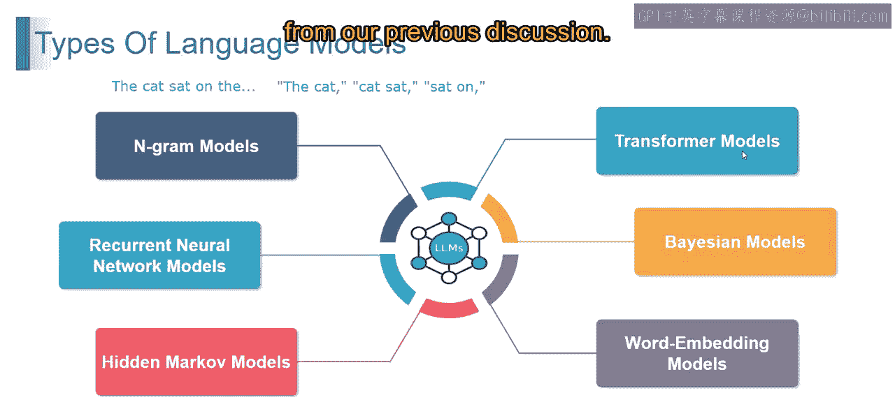
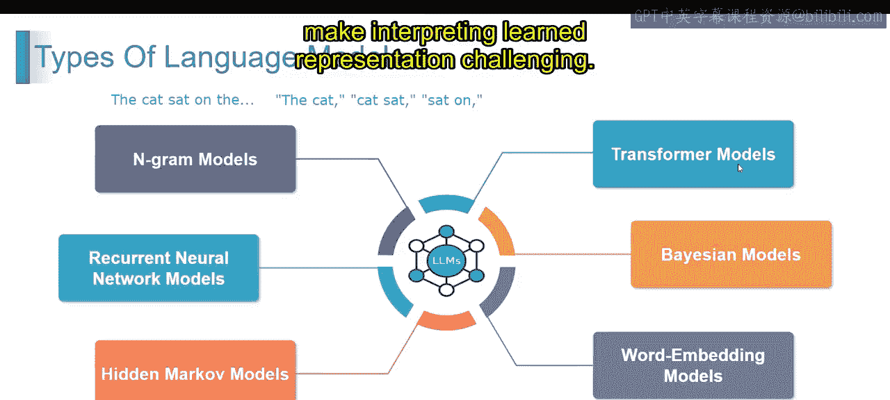
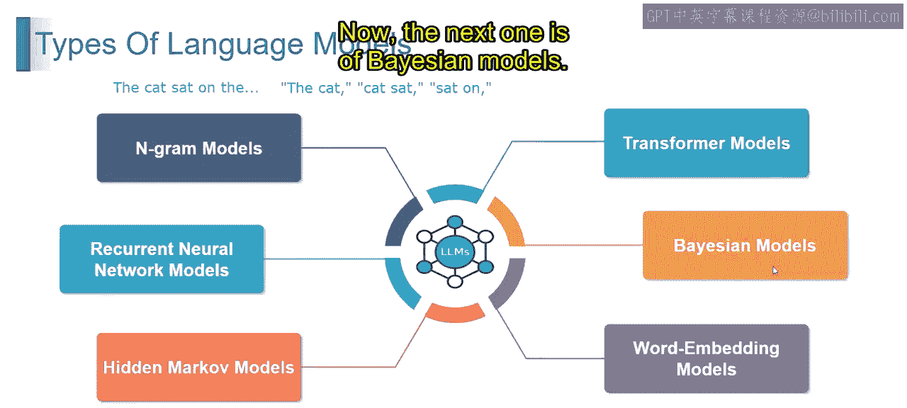
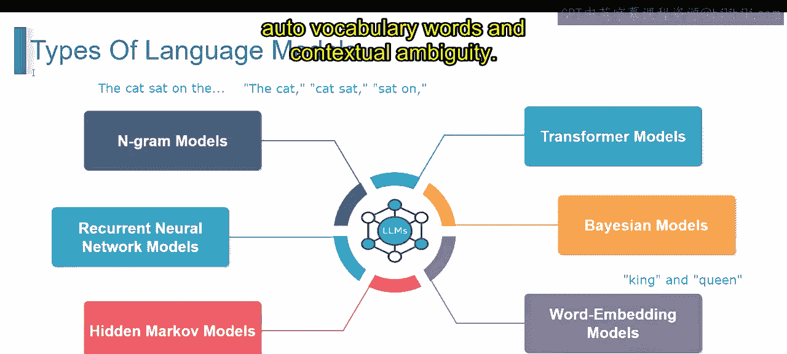
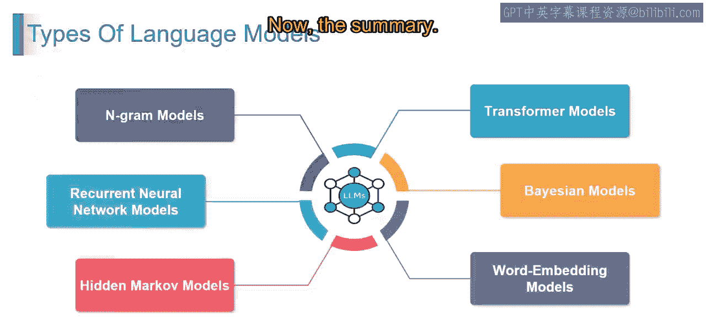
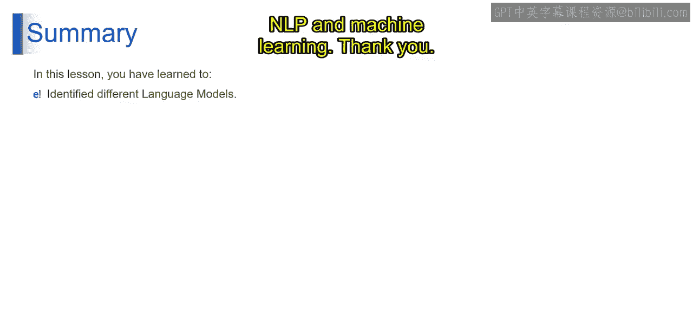

2：迁移模型

在本节课中，我们将要学习几种关键的迁移模型，包括Transformer模型、贝叶斯模型和词嵌入模型。这些模型为理解和生成人类语言提供了不同的视角和强大的工具。

---

上一节我们介绍了语言模型的基础，本节中我们来看看几种重要的迁移模型架构。

首先探讨Transformer模型。Transformer模型是一种为处理序列数据而设计的新型神经网络架构。它依赖**自注意力机制**来捕捉上下文关系。与传统序列模型不同，Transformer利用并行化和注意力机制来实现高效学习。

想象一个教室，每个学生根据相关性关注其他同学。Transformer的运作方式类似，序列中的每个元素根据重要性关注其他元素。自注意力机制使Transformer能有效理解上下文依赖。

Transformer通过捕捉长距离依赖和上下文细微差别，重塑了自然语言翻译和各种序列应用任务。其独特的注意力机制使其在理解整个序列关系至关重要的场景中表现出色。

以下是Transformer模型的一些应用领域：
*   自然语言处理
*   图像处理
*   语音识别

使用Transformer模型具有以下优势：
*   **并行化**：相比顺序模型，加速了训练过程。
*   **长距离依赖捕捉**：能够捕捉长范围的依赖关系。
*   **多功能性**：在自然语言处理之外的多种领域也表现出色。

然而，Transformer模型也存在一些局限性：
*   **计算复杂度**：对于大型模型和数据集，计算可能非常密集。
*   **可解释性**：自注意力机制的复杂性使得解释学习到的表征具有挑战性。

---

了解了基于注意力的Transformer后，我们接下来看看基于概率推断的贝叶斯模型。

贝叶斯模型是一类结合了贝叶斯推断的统计模型，允许将不确定性量化为概率分布。与确定性模型不同，贝叶斯模型提供了一个基于新证据更新信念的框架，使其具有适应性和鲁棒性。

贝叶斯模型在不确定性起关键作用的场景中表现出色，例如医疗诊断、风险评估和决策制定。贝叶斯推断的优雅交互使这些模型能够在新信息出现时更新预测。

以下是贝叶斯模型的一些应用：
*   医疗诊断
*   风险评估
*   决策制定

使用贝叶斯模型具有以下优势：
*   **不确定性量化**
*   **对新证据的适应性**
*   **在小数据集下的鲁棒性**

贝叶斯模型也面临一些挑战：
*   **计算复杂度**
*   **先验选择的主观性**

---

最后，我们来看一种将词语映射到数值空间的技术：词嵌入模型。

词嵌入模型是自然语言处理中的一种技术，它将词语映射到多维向量中，使含义相似的词在向量空间中位置更接近。想象词语是高维空间中的点，距离近则表示语义相似。

在词嵌入中，语义相近的词语就像地图上相邻的城市。例如，在嵌入空间中，“king”和“queen”这两个词由于语义关系会在空间上彼此靠近。

词嵌入通过捕捉语义细微差别，彻底改变了语言处理，使模型能够理解词语之间的关系和上下文。与这些词关联的向量编码了语义信息，为情感分析、语言翻译等任务提供了强大的基础。

以下是词嵌入的一些应用：
*   情感分析
*   语言翻译
*   信息检索

词嵌入模型具有以下优势：
*   **语义丰富性**：捕捉语义关系，使模型能理解上下文和含义。
*   **降维**
*   **迁移学习**

词嵌入模型也存在挑战：
*   **未登录词问题**
*   **上下文歧义**

---

本节课中我们一起学习了一系列语言模型，每种模型都为浏览和生成人类语言提供了独特的视角。从RNN的序列掌控力，到Transformer的变革性能力，再到词嵌入，我们深入了解了这些模型为自然语言处理和机器学习提供的多功能工具包。

这些模型共同构成了现代AI处理和理解语言的核心基础。