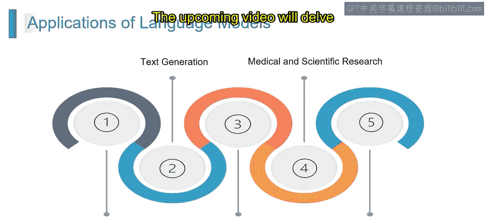

# 第二三四部分 30：语言模型的应用

在本节课中，我们将学习语言模型在各个领域中的实际应用。通过了解这些应用，你将能够认识到语言模型如何改变行业、提升用户体验，并推动人工智能的持续发展。

语言模型正在革新行业，提升用户体验，并为人工智能不断演进的格局做出贡献。

以下是语言模型的主要应用领域。

## 对话式AI与聊天机器人

上一节我们介绍了语言模型的广泛应用，本节中我们来看看第一个具体应用：对话式AI与聊天机器人。

对话式AI是人工智能的一个子集，专注于使计算机能够以自然且符合上下文的方式理解、解释和回应人类语言。聊天机器人是对话式AI的应用，旨在模拟与用户的对话，通过文本或语音交互提供信息、协助或执行任务。

想象一下，你发短信给一个虚拟助手安排会议。这个由对话式AI驱动的助手理解你的请求并作出回应，发起动态对话以敲定细节。这意味着对话式AI利用自然语言处理（NLP）和机器学习（ML）来理解用户输入，使聊天机器人能够进行有意义且与上下文相关的对话。

以下是对话式AI与聊天机器人的主要应用场景：
*   **客户服务**：自动回答常见问题。
*   **虚拟助手**：如Siri、Alexa，协助处理日常任务。
*   **电子商务助手**：提供购物建议和订单支持。
*   **信息检索**：快速查找和提供特定信息。

其优势包括：
*   **24/7可用性**：全天候提供服务。
*   **可扩展性**：能同时处理大量用户请求。
*   **用户参与度**：提供即时互动，提升体验。

然而，它也面临一些挑战：
*   **上下文理解**：确保聊天机器人在整个对话中理解并保持上下文连贯性是一个挑战。
*   **自然语言变异性**：应对人类语言表达和变化的多样性，对对话式AI构成了持续性的挑战。

## 文本生成

了解了对话式AI后，我们接下来探讨语言模型的另一个核心应用：文本生成。

文本生成是自然语言处理的一个分支，涉及使用机器学习算法（包括神经网络）根据给定的提示或上下文生成类人文本。

想象一下，要求一个AI系统生成一个关于魔法之旅的短篇故事。利用文本生成的AI会创作出包含角色、事件和描述性细节的叙事，模仿人类讲故事的方式。这意味着文本生成算法分析现有文本数据中的模式，并学习生成与训练数据的风格、语气和上下文相一致的新内容。

以下是文本生成的主要应用：
*   **内容创作**：自动撰写文章、报告或营销文案。
*   **聊天机器人回复**：生成更自然、多样的对话回应。
*   **语言翻译**：作为翻译流程的一部分。
*   **创意写作辅助**：为作者提供灵感或续写建议。

其优势包括：
*   **效率与速度**：快速生成大量文本。
*   **一致性**：保持统一的风格和语气。
*   **创意激发**：帮助产生新的想法和内容角度。

但它也存在挑战：
*   **上下文理解**：确保AI模型理解并生成具有特定上下文相关性的文本仍然是一个难题。
*   **伦理考量**：解决潜在的伦理问题，例如可能被滥用于传播虚假信息或生成带有偏见的内容，需要谨慎关注。

## 语言翻译

文本生成关注于创造新内容，而语言翻译则专注于跨越语言障碍传递准确信息。现在，我们来了解语言模型在语言翻译中的应用。

语言翻译涉及使用人工智能和机器学习将文本或语音从一种语言转换为另一种语言，同时保留原始内容的意义、上下文和细微差别。

想象一下，你用英语输入一条消息，并立即收到西班牙语的翻译版本。语言翻译AI使这种实时对话成为可能，轻松打破语言障碍。这意味着语言翻译算法利用神经网络和统计模型来理解并准确再现不同语言中文本或语音的语义。

以下是语言翻译的主要应用：
*   **多语言沟通**：促进国际交流。
*   **旅行协助**：实时翻译标识、菜单和对话。
*   **全球内容可访问性**：使网站、文档和媒体能被更广泛的受众理解。
*   **语言学习支持**：作为辅助工具帮助学习者。

其优势包括：
*   **文化交流**：促进不同文化间的理解。
*   **业务拓展**：帮助企业进入国际市场。
*   **全球协作**：使跨国团队合作更加顺畅。

然而，语言翻译也面临挑战：
*   **上下文细微差别**：捕捉并准确再现上下文中的细微差别、习语和文化表达，对语言翻译模型来说仍然是一个挑战。
*   **稀有语言处理**：某些语言可能训练数据有限，这会影响对较少使用语言的翻译准确性。

## 医学与科学研究

最后，我们来看看语言模型在要求极高的医学与科学研究领域的应用。

医学与科学研究中的AI涉及将人工智能整合到医疗保健和科学实践中，以增强诊断、药物发现、个性化医疗、数据分析及其他关键方面。AI驱动的技术有助于提高医学和科学领域的效率、精确度并带来突破。

以下是其在医学研究中的应用：
*   **疾病诊断**：分析医学影像和病历，辅助诊断。
*   **药物发现**：加速新药化合物的筛选和设计。
*   **个性化医疗**：根据患者基因和病史定制治疗方案。
*   **患者护理优化**：预测病情发展并提供护理建议。
*   **数据分析与解读**：处理庞大的临床和基因组数据。

以下是其在科学研究中的应用：
*   **数据分析与解读**：处理实验数据，识别模式。
*   **假设生成**：从文献和数据中提出新的研究假设。
*   **气候建模**：分析和预测复杂的气候变化模式。
*   **自动化实验室流程**：控制实验设备，记录和分析结果。

其优势包括：
*   **效率与速度**：快速处理和分析海量数据。
*   **精确度与准确性**：减少人为错误，提高分析一致性。
*   **数据整合**：能够融合来自不同来源的多模态数据。

面临的挑战主要有：
*   **可解释性AI**：在关键的医疗和研究环境中，确保AI模型的透明度和可解释性仍然具有挑战性。
*   **伦理考量**：涉及患者隐私、数据安全、算法公平性等伦理问题需要持续关注和讨论。

本节课中，我们一起学习了语言模型的四大核心应用领域：**对话式AI与聊天机器人**、**文本生成**、**语言翻译**以及**医学与科学研究**。我们探讨了每个应用的基本概念、具体用途、优势以及当前面临的挑战。理解这些应用有助于我们全面认识语言模型如何驱动技术创新并解决现实世界中的复杂问题。