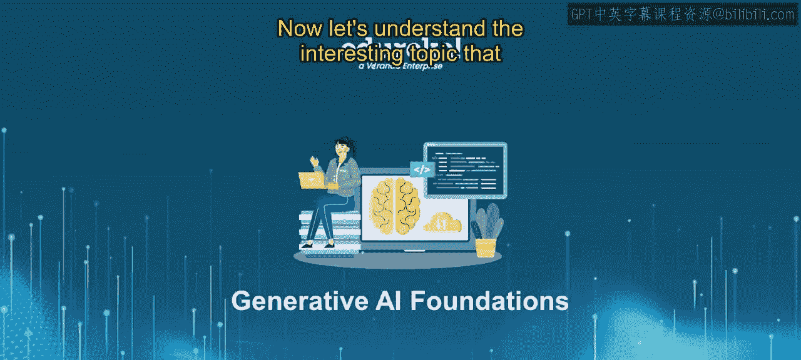
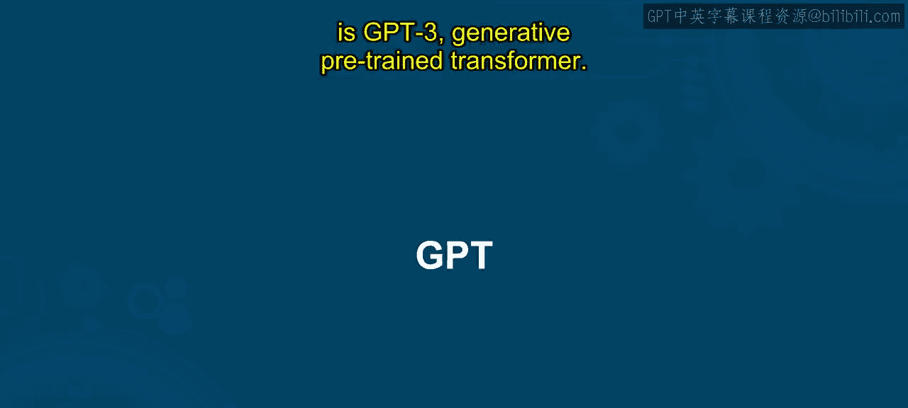
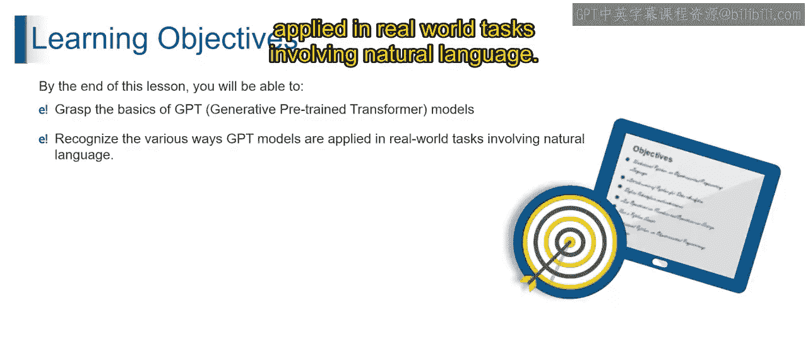
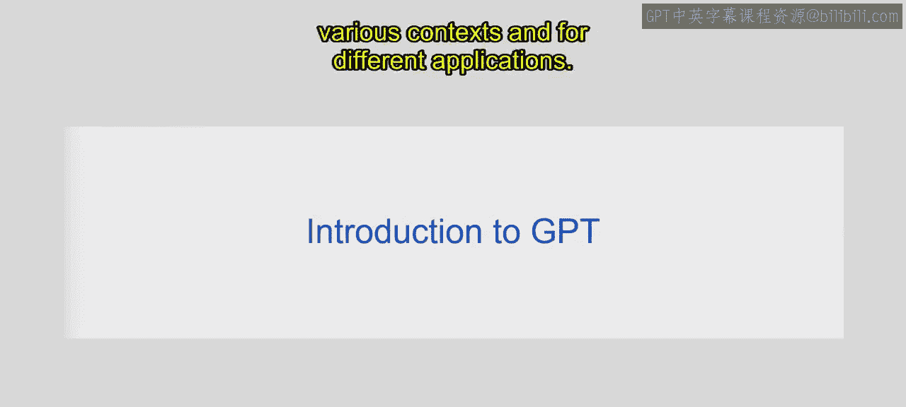
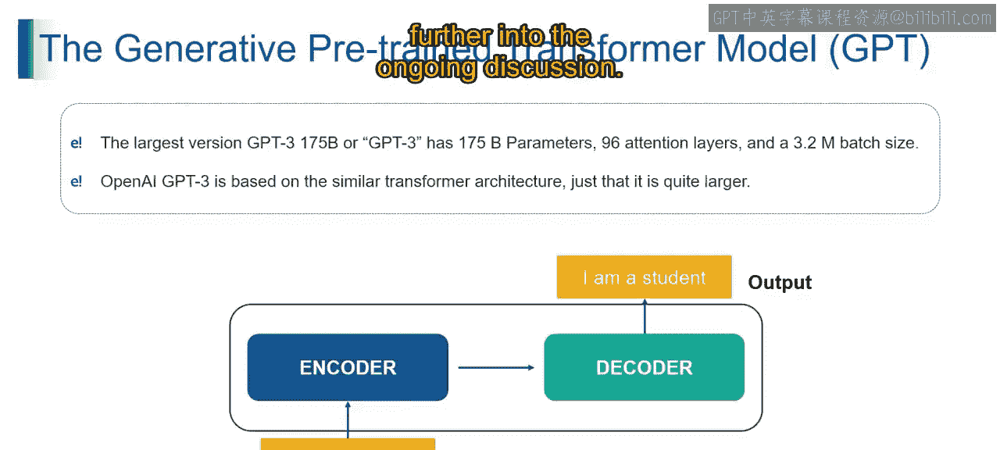

# 第二三四部分 32：GPT介绍 🧠

在本节课中，我们将学习生成式预训练变换器（GPT）的基本概念。我们将了解GPT是什么，它是如何构建的，以及它在现实世界中有哪些应用。课程结束时，你将能够掌握GPT模型的基础知识，并识别其在自然语言处理任务中的各种应用方式。

---

## GPT简介

生成式预训练变换器（GPT）标志着人工智能在语言理解、生成和领悟方面达到了新的高度。GPT是一种先进的语言模型，它利用变换器架构，并在海量数据集上进行预训练，从而能够理解、生成和处理类人文本。想象一下，与一个不仅能理解你的语言，还能用上下文相关且连贯的句子进行回应的人工智能进行对话，这模仿了人类的交流方式。GPT通过对多样化数据集的预训练实现了语言掌握，使其能够在各种情境下生成类人文本，并拥有不同的应用。

上一节我们介绍了GPT的基本概念，本节中我们来看看GPT模型是如何构建的。

## GPT的构建原理

GPT是一个由深度神经网络和尖端变换器架构驱动的“语言奇才”。简单来说，GPT通过理解大量文本数据来学习语言的奥秘，而无需任何直接监督。

以下是GPT的核心概念：

*   **变换器架构**：变换器架构就像一个脑细胞，帮助GPT处理和掌握我们说话与写作的复杂性。其核心是**自注意力机制**，公式可简化为 `Attention(Q, K, V) = softmax(QK^T / √d_k)V`，它允许模型在处理一个词时，权衡句子中所有其他词的重要性。
*   **无监督学习**：GPT通过研究海量文本成为语言专家，它学习规则，而无需被告知什么是对或错。这通常通过**语言建模**任务实现，即预测给定上下文中的下一个词。
*   **模型家族**：GPT不只是一个单一的模型，而是一个拥有众多成员的完整家族。每个成员都具有独特的能力组合，主要体现在它们学习的参数数量上。

OpenAI的GPT系列不仅仅是一个花哨的名字，它是一个“语言超级英雄”家族。每个成员都具备理解和生成类人语言的能力，就像拥有一支随时准备应对任何语言挑战的冠军联盟。

以下表格提供了各GPT模型架构和参数数量的详细信息：

| 模型 | 发布时间 | 参数量 | 关键特点 |
| :--- | :--- | :--- | :--- |
| **GPT-1** | 2018年 | 1.17亿 | 开创性工作，证明了变换器架构在生成任务上的潜力。 |
| **GPT-2** | 2019年 | 15亿 | 参数量大幅增加，展示了更强的文本生成和零样本学习能力。 |
| **GPT-3** | 2020年 | 1750亿 | 参数量达到空前规模，在多种任务上表现出接近人类的语言能力。 |

## GPT-3的详细信息

GPT-3是语言模型领域的一个庞然大物，拥有无与伦比的特征。

*   **庞大的规模**：最大的GPT-3版本拥有惊人的**1750亿**个参数。
*   **深层架构**：GPT-3拥有**96层**注意力层，每一层都像一个超级观察员，捕捉语言的细微差别。
*   **巨大的批次大小**：其训练批次大小达到**320万**个令牌，这好比一位厨师同时处理大量食材，确立了GPT-3作为真正语言巨人的地位。

GPT-3的巨大规模建立在变换器架构的基础之上。接下来的视频将进一步深入探讨相关话题。

---

本节课中我们一起学习了生成式预训练变换器（GPT）的基础知识。我们了解了GPT的定义、其基于变换器架构和无监督学习的构建原理，以及从GPT-1到GPT-3的模型演进。GPT作为一个强大的语言模型家族，正在深刻改变我们与机器交互的方式，并推动人工智能语言处理的未来发展。