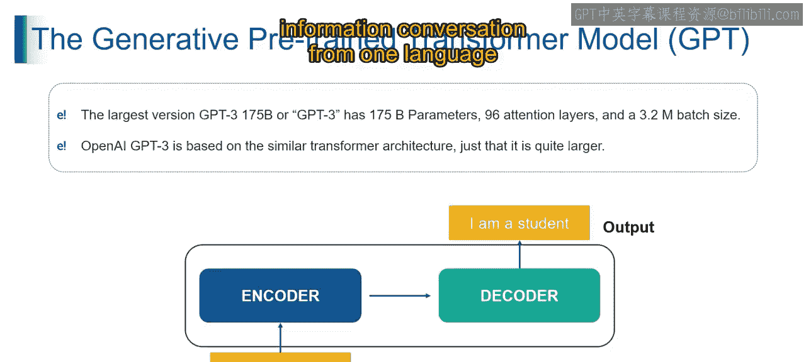
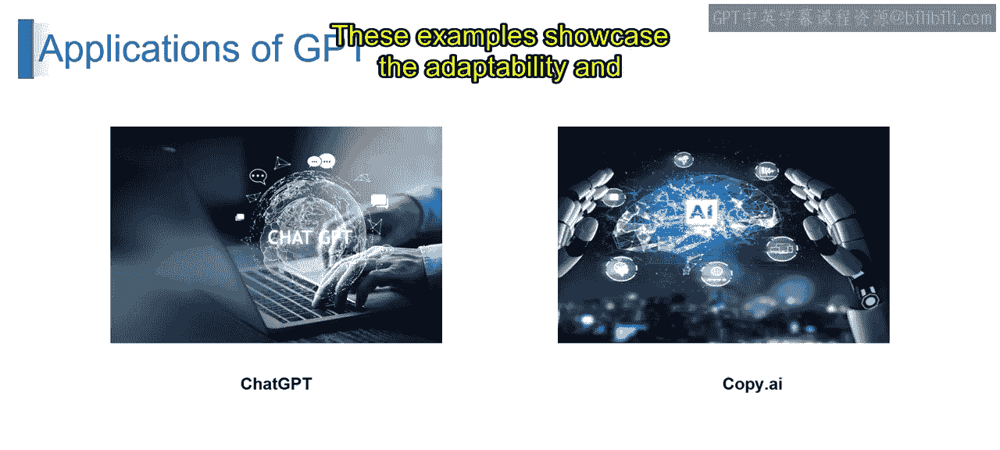
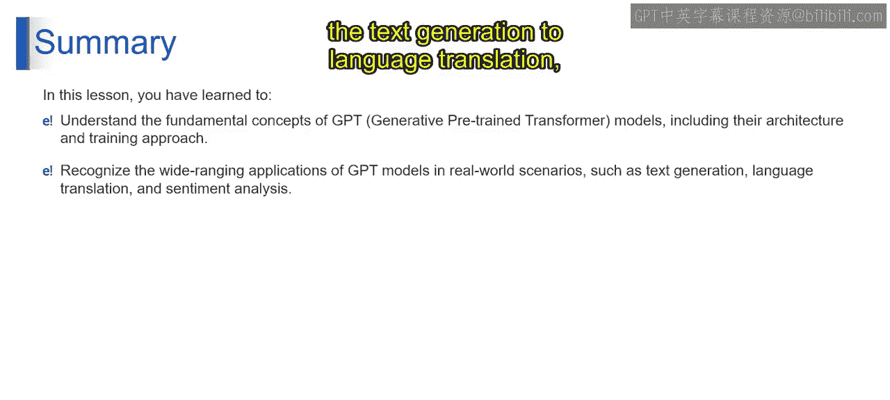
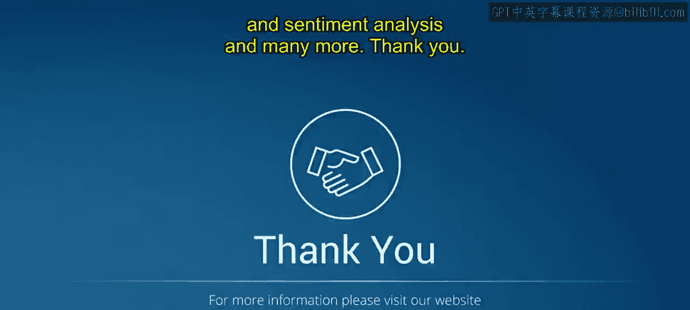

# 第二三四部分 33：理解GPT模型 🧠

在本节课中，我们将深入探讨GPT模型的核心概念，包括其架构、工作原理以及实际应用。我们将从GPT模型的演进开始，逐步解析其背后的Transformer架构，并了解它在现实世界中的强大应用。

---

## GPT模型的演进 🏗️

上一节我们介绍了生成式AI的基础，本节中我们来看看GPT模型的发展。与它的前身GPT-2相比，GPT-3是一个语言领域的“摩天大楼”。其参数数量、注意力层和批处理大小的增加，共同促成了GPT-3理解和生成复杂、精细语言的能力。

这个庞大的模型并非徒有其表。它的巨大规模旨在实现对上下文、细微差别和各种语言复杂性的更深层次理解。GPT-3拥有**1750亿**个参数，这不仅是一个语言模型，更是一个重新定义AI语言处理边界的模型。它强调在语言领域，规模确实至关重要。

---

## Transformer架构：语言翻译的动力之源 ⚙️

现在，让我们来理解Transformer架构。它是语言翻译背后的强大引擎，能够将一种语言的单词无缝转换为另一种语言。我们通过快速了解编码器和解码器来理解其工作原理。

以下是其工作流程：

1.  **编码器**：想象编码器是一位双语向导。它接收一个句子（例如西班牙语），将其分解为关键元素，并对信息进行编码。这就像为翻译员记下必要的笔记。然后，这些信息被发送给解码器。

2.  **解码器**：将解码器想象成一位技艺高超的翻译员，他手持编码器提供的笔记。他解读这些信息，并将对应的句子转换成目标语言（例如英语）。解码器确保翻译不仅准确，还能捕捉原始语言的精髓，并输出所需的句子。

编码器和解码器协同工作，来回传递信息。这就像一场精心编排的舞蹈，编码器提供原材料，解码器将其转化为新的杰作。

**Transformer架构的核心优势在于并行处理**。与传统翻译方法不同，Transformer架构允许并行处理，可以同时翻译句子的多个部分，从而加速翻译过程。

Transformer之所以卓越，在于其理解句子中单词之间关系的能力。它不仅仅是逐词翻译，更能捕捉上下文和细微差别，从而提供更自然、更流畅的翻译。

在语言翻译领域，Transformer架构及其编码器-解码器组合，就像一位语言指挥家，精心编排着信息从一种语言到另一种语言的无缝转换舞蹈。

---

## GPT的实际应用 💡

了解了GPT的原理后，我们来看看它的实际应用。GPT的应用广泛，以下是两个主要例子：

*   **ChatGPT**：这是你的虚拟对话伙伴，随时准备聊天。无论是寻求建议、信息，还是只想友好地聊聊天，ChatGPT都能进行有意义且贴合上下文的对话。它革新了在线互动方式，展示了语言模型在提供个性化、动态对话体验方面的多功能性。

*   **Copy.ai**：这是你的创意写作助手，帮助你生成引人注目且有说服力的内容。从构思吸引人的标题到起草营销文案，Copy.ai就像一个理解你写作风格的文字大师搭档。它改变了内容创作的方式，展示了GPT作为生成多样化、高质量书面内容工具的宝贵价值。

GPT的应用超越了传统用途，为创新提供动力，例如用于交互式对话的ChatGPT和用于创意内容生成的Copy.ai。这些例子展示了GPT在不同领域的适应性和有效性。

---

## 总结 📝

本节课中，我们一起探索了GPT模型的核心概念，深入研究了其架构和训练方法。我们还识别了GPT在现实世界中的多样化应用，从文本生成、语言翻译到情感分析等等。GPT模型凭借其强大的能力和灵活性，正在不断推动人工智能语言处理领域的边界。