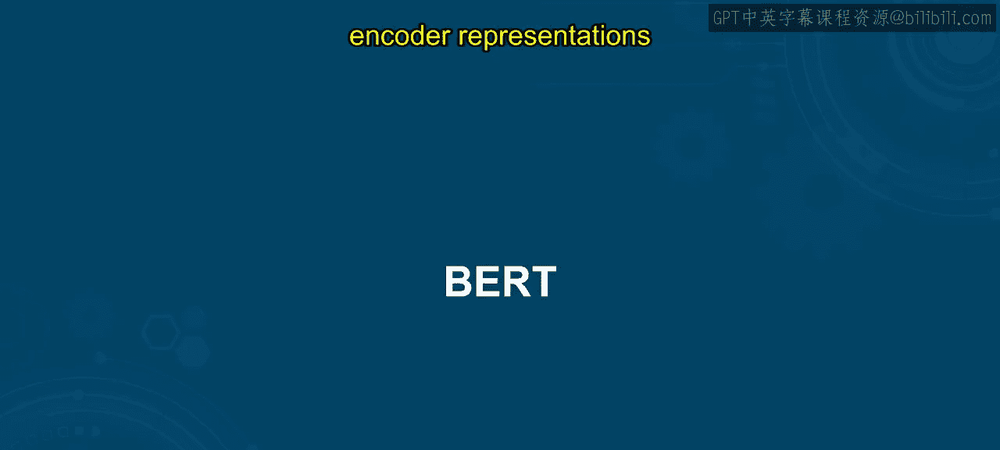
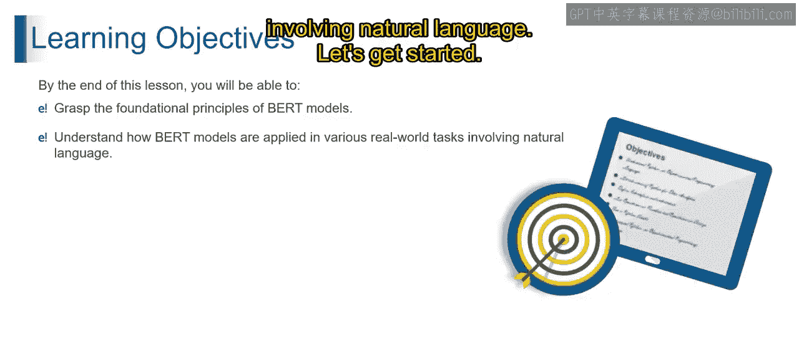
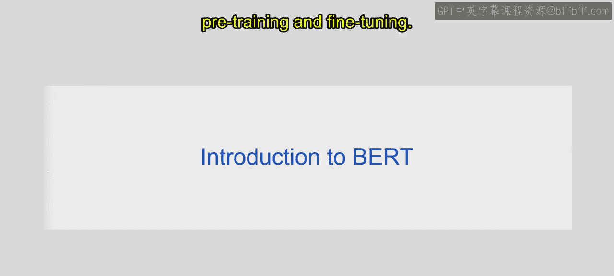
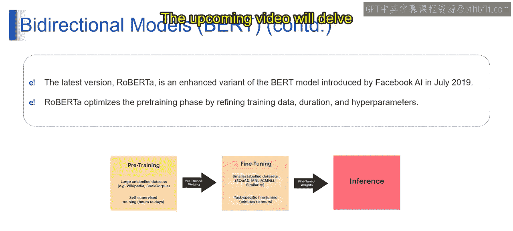

# 第二三四部分 34：BERT模型详解

在本节课中，我们将要学习一个重要的自然语言处理模型——BERT。我们将了解BERT的基本原理、其独特的学习过程，以及它在现实世界中的应用。通过本节内容，你将能够理解BERT模型的核心思想及其重要性。

---

### **BERT简介**

BERT是“来自Transformer的双向编码器表示”的缩写，它是深度学习领域一个强大的模型，专为自然语言理解而设计。BERT的有效性在于其能够处理文本中的复杂上下文关系，这通过一个精心设计的两步过程实现：预训练和微调。

上一节我们介绍了BERT的基本概念，本节中我们来看看它的核心特点。

BERT之所以突出，是因为它专注于双向上下文建模。与仅从左到右或从右到左分析文本的传统模型不同，BERT同时考虑一个词**之前**和**之后**的所有词语来理解其含义。这种双向方法使BERT能够把握语言的细微差别，从而增强其上下文理解能力。

---

### **BERT的学习过程：预训练与微调**

BERT的学习之旅包含两个关键阶段：预训练和微调。这个过程赋予了BERT对语言的通用理解能力，使其成为自然语言处理应用的首选模型。

以下是BERT学习过程的具体步骤：

1.  **预训练**
    这是BERT学习的初始阶段。模型在大量无标签文本数据（如维基百科和书籍语料库）上进行训练。在此过程中，BERT通过预测句子中被掩盖的词语来学习语言的基本模式，这是一种无监督学习，旨在掌握词语间的上下文关系。预训练阶段获得的权重为BERT的语言理解能力奠定了基础。

2.  **微调**
    在预训练的基础上，BERT进入微调阶段。此时，模型会接触到带有特定任务标签的数据集（例如问答数据集SQuAD，或自然语言推理数据集MNLI）。通过在这些数据集上进行训练，BERT将其通用的语言知识调整并优化，以胜任特定的下游任务（如文本分类、问答）。微调过程可能持续数分钟到数小时，最终得到的权重包含了BERT为特定任务定制的专业知识。

---

### **RoBERTa：BERT的演进**

RoBERTa是BERT模型的一个增强版本，由Facebook AI于2019年7月提出。它建立在BERT的基础之上，通过优化预训练过程，实现了更强大的语言理解能力。

具体来说，RoBERTa对BERT的预训练阶段进行了细致改进，包括：
*   使用更大量、更多样化的训练数据。
*   延长训练时间。
*   调整关键的超参数（如批次大小）。

这些优化使RoBERTa能够更精确、更高效地捕捉语言的复杂性。与BERT一样，RoBERTa也遵循预训练和微调的两步流程，但其在预训练阶段的优化为后续的微调卓越表现奠定了基础。

---

### **总结**

本节课中我们一起学习了BERT模型。BERT通过其**双向上下文建模**和**预训练-微调**的两步学习过程，革新了模型理解和解释文本中上下文关系的方式，是自然语言处理领域的一项重大进步。而它的演进版本**RoBERTa**，则通过优化预训练的数据、时长和超参数，进一步推动了自然语言理解能力的边界。