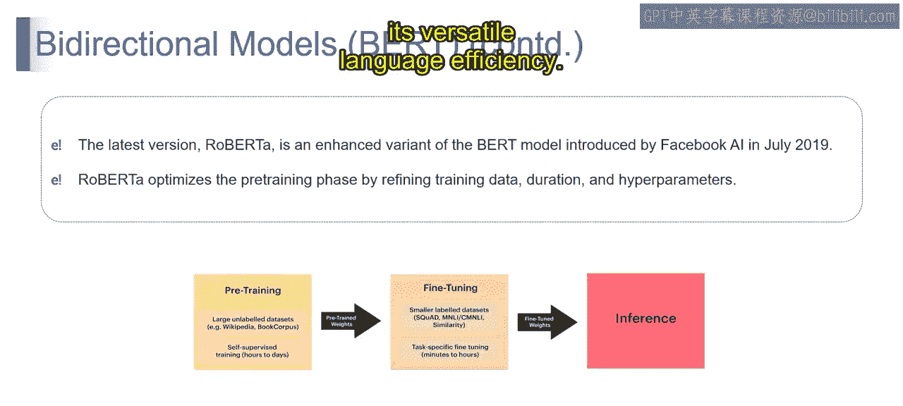
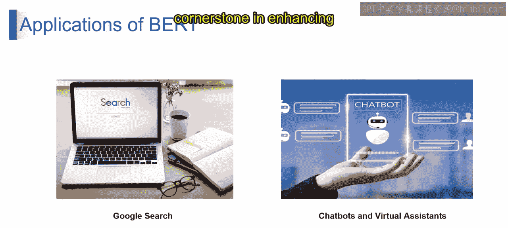
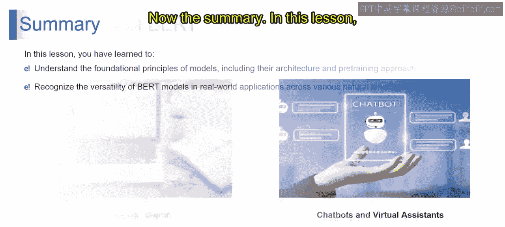
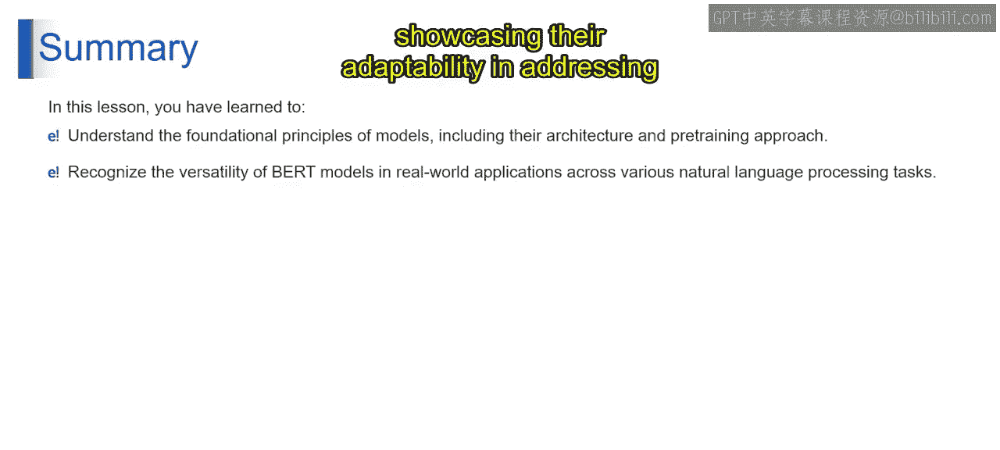

# 第二三四部分 35：BERT中的推理 🧠

在本节课中，我们将学习BERT模型在完成预训练和微调后，如何进入推理阶段，并将其学到的知识应用于解决实际问题。我们将重点探讨推理阶段的工作原理以及BERT在谷歌搜索和聊天机器人等场景中的具体应用。

---

上一节我们介绍了BERT的预训练与微调过程。本节中，我们来看看BERT模型如何利用这些训练成果进行推理。

推理阶段是模型将其学到的理解应用于新的、未见过的数据的过程。无论是回答问题、识别序列相似性，还是执行各种自然语言处理任务，BERT的推理阶段都展示了其习得知识的实际应用能力。预训练后未经微调的权重在推理过程中协同工作，使BERT能够出色应对各种语言相关的挑战。BERT从在大规模数据集上的无监督预训练，到针对特定任务的精细化微调，再到最终的推理应用，代表了一个全面的学习过程。这一过程揭示了其动态的自然语言理解方法，每个阶段都为其语言处理效率做出了贡献。

---

现在，让我们了解一下BERT的众多应用。以下是BERT的一些主要应用领域：

*   **问答系统**
*   **文本分类**
*   **相似性任务**
*   **特定任务微调**
*   **命名实体识别**
*   **情感分析**
*   **文本相似性计算**
*   **实时推理**

接下来，我们将聚焦于谷歌搜索和聊天机器人/虚拟助手这两个具体应用。

---

首先，我们来看谷歌搜索。BERT通过更准确地理解搜索查询的上下文，来增强搜索的相关性。这带来了更相关、更具上下文感知的搜索结果，从而提升了整体用户体验。BERT擅长理解更细致、更口语化的搜索查询。这种能力确保用户获得的搜索结果能精确匹配其查询背后的真实意图。此外，BERT的贡献还体现在改进的多语言搜索理解上，使谷歌搜索能够理解并用多种语言提供相关的查询结果。

---

然后，我们探讨聊天机器人和虚拟助手。BERT的双向上下文建模使其成为聊天机器人和虚拟助手的强大工具，能够以更对话化、更自然的方式理解用户查询。通过利用BERT的微调能力，聊天机器人可以生成更准确、与上下文更相关的回复。这对于维持引人入胜且有效的对话至关重要。BERT的多样性在处理广泛的查询和用户输入时大放异彩。这种适应性确保了聊天机器人和虚拟助手能够有效地处理多样化的对话。BERT对上下文关系的理解在多轮对话管理中起着关键作用。配备BERT的聊天机器人能够在多轮对话中保持上下文，从而提供更连贯、更有力的互动。BERT理解用户意图的能力有助于提供个性化协助，使聊天机器人和虚拟助手能够根据用户的独特需求和偏好来定制回复。

在谷歌搜索以及聊天机器人/虚拟助手的交互领域，BERT在提升结果和回复质量方面扮演着核心角色。其上下文理解能力和适应性，使其成为增强这些应用用户体验的基石。

---

本节课中，我们一起探索了BERT模型的核心原理，深入了解了其架构和预训练方法。此外，我们也认识了BERT模型的多样化应用，展示了其在解决各种自然语言处理任务方面的强大适应能力。