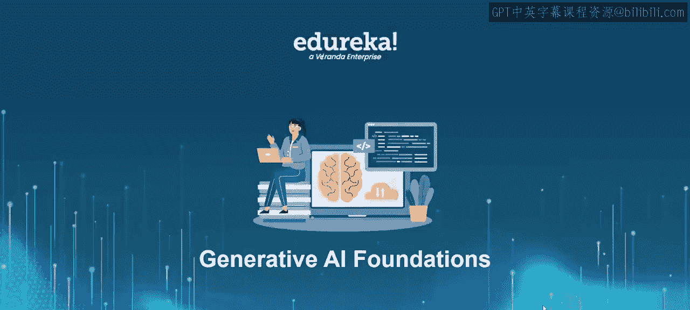
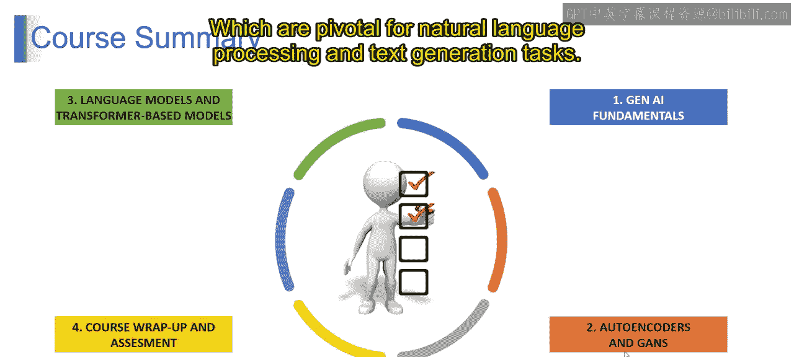
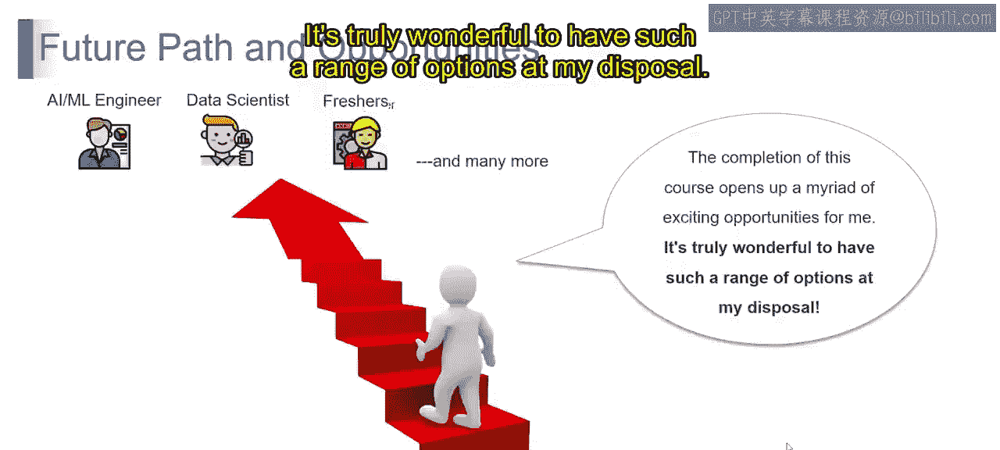
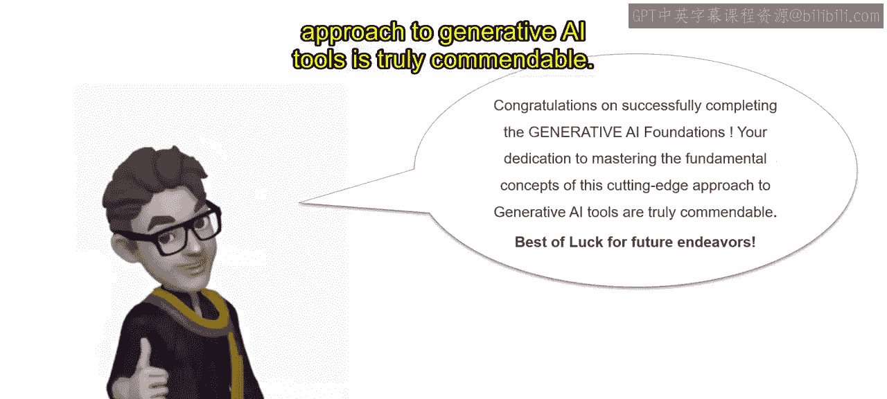

P36：课程总结

在本节课中，我们将对《生成式AI基础》课程的核心内容进行回顾与总结，并展望未来的学习与发展路径。

在之前的模块中，我们探讨了生成式AI的基本概念。我们学习了**生成式AI基础**，这为理解AI如何创造新数据奠定了基础。随后，我们深入研究了**自编码器**和**生成对抗网络**，这些是用于生成和操作数据的关键技术。我们还探讨了**语言模型**和**基于Transformer的模型**，它们是自然语言处理和文本生成任务的核心。

以下是本课程涵盖的核心技术概览：
*   **自编码器**：一种用于学习数据高效表示的神经网络，其目标是最小化输入与重构输出之间的差异，公式可表示为：`L = ||x - decoder(encoder(x))||^2`。
*   **生成对抗网络**：包含生成器`G`和判别器`D`的框架，两者通过对抗训练共同进化，目标函数为：`min_G max_D V(D, G) = E[log D(x)] + E[log(1 - D(G(z)))]`。
*   **Transformer模型**：一种基于自注意力机制的架构，彻底改变了序列建模，其核心是**多头注意力**机制，允许模型同时关注输入序列的不同部分。

完成本课程后，将为未来的发展道路开启丰富的可能性。对于AI/ML工程师、数据科学家、初学者等众多人士而言，前方多样化的机遇非常令人期待，提供了在生成式AI领域内探索和成长的众多路径。

能够掌握如此多的选择确实非常有益。最后，祝贺您完成《生成式AI基础》课程。您致力于掌握这一前沿生成式AI工具的基本概念，这非常值得赞赏。祝您在未来的努力中一切顺利。

本节课中，我们一起回顾了生成式AI的核心基础，包括自编码器、GANs和Transformer模型，并展望了在该领域的广阔发展前景。希望这些知识能成为您进一步探索生成式AI世界的坚实起点。