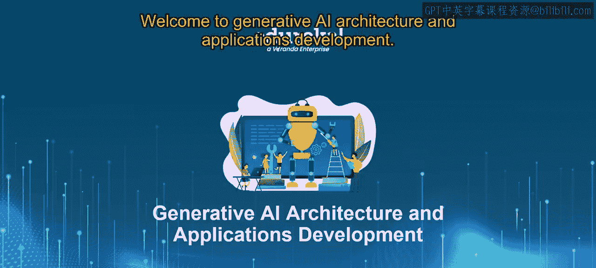
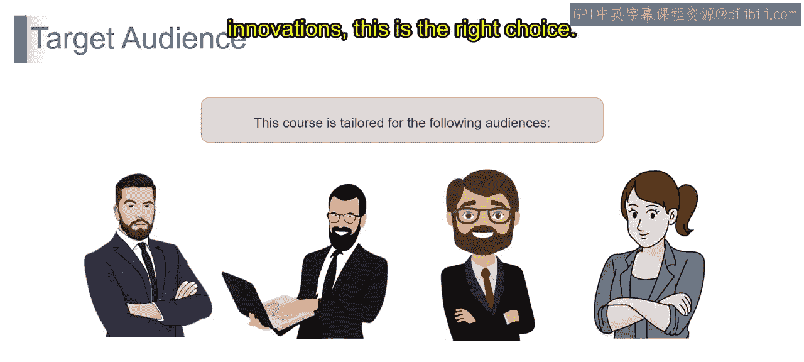
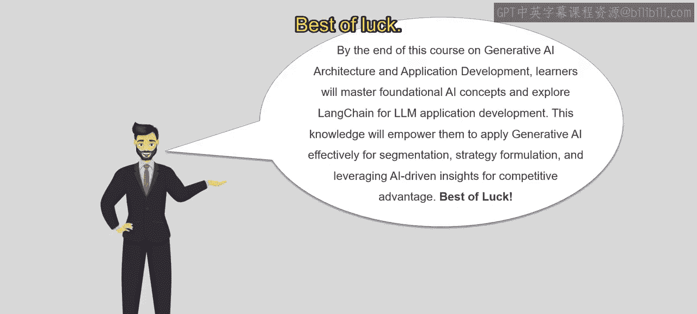

# 第二三四部分 37：课程介绍 🎯

在本节课中，我们将介绍《生成式AI架构与应用开发》课程的整体框架、学习目标以及适合的学习人群。通过概述，您将了解本课程的核心内容与学习路径。

## 课程概述

本课程将引导您进入生成式AI与大型语言模型的领域。我们将从基础概念出发，逐步深入到实际应用开发与评估。

以下是本课程将涵盖的核心模块：

1.  **生成式AI与LLMs基础**：我们将深入探讨生成式AI的基本原理，重点介绍大型语言模型在文本生成中的核心作用。
2.  **用于搜索、预测与生成的LLMs**：本节将探索语言模型如何应用于多种任务，包括搜索、预测和文本生成，展示其在自然语言处理中的多功能性。
3.  **LangChain应用开发**：我们将了解LangChain是什么，它是一个用于开发基于语言模型应用的强大平台。我们将学习如何利用其功能进行无缝的应用开发和部署。
4.  **使用LangChain与RAG集成数据**：本节将研究使用LangChain以及检索增强生成模型进行数据集成的高级技术。我们将理解数据处理与利用策略。
5.  **评估语言模型性能**：我们将学习评估语言模型性能的各种方法。我们将探索不同的评估指标，例如困惑度、BLEU分数和人工评估，以确保建立稳健的评估实践。
6.  **生成式AI的数据隐私与保护**：我们将探讨生成式AI应用中数据隐私与保护的关键方面。我们将讨论在语言模型使用背景下保护敏感数据的策略与技术。
7.  **课程总结与评估**：我们将总结每个模块的关键知识点，并通过评估来检验您对生成式AI概念与语言模型应用的综合理解与熟练程度。

通过本课程的学习，您将全面理解生成式AI的基础，并掌握在各种实际场景中高效利用语言模型的实践技能。

## 目标受众

本课程适合以下人群：

*   **机器学习工程师**：希望深化对生成式AI基础的理解，并扩展在各类应用中利用语言模型的专业知识。
*   **初学者**：如果您是入门级专业人士、学生，或正转型进入数据科学或生成式AI领域，渴望探索这一激动人心的领域并获得关于语言模型的基础知识以开启职业生涯，本课程适合您。
*   **数据科学家**：如果您是已经熟悉机器学习概念的专业人士，希望专攻生成式AI，特别是在数据分析和生成任务中利用语言模型，本课程适合您。
*   **研究人员**：如果您是学者或研究人员，有兴趣深入研究生成式AI的高级主题，例如大型语言模型，并进行研究以推动该领域的进步与创新，本课程是您的正确选择。

## 总结

本节课中，我们一起学习了《生成式AI架构与应用开发》课程的整体介绍。您了解了课程的核心模块、学习目标以及本课程适合的学习人群。通过本课程，您将掌握生成式AI的基础概念，并深入LangChain以开发基于大型语言模型的出色应用。想象一下，解锁创建AI驱动策略、利用数据进行细分以及通过富有洞察力的AI预测获得竞争优势的能力。请准备好踏上通往AI未来的精彩旅程。祝您好运！