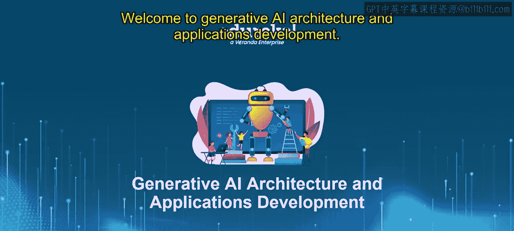
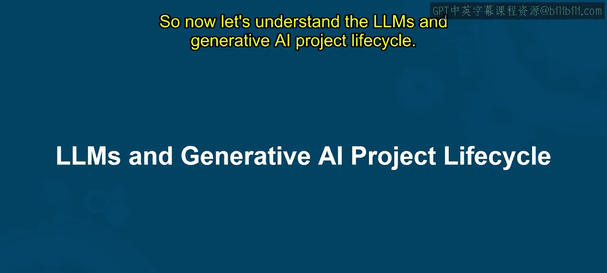
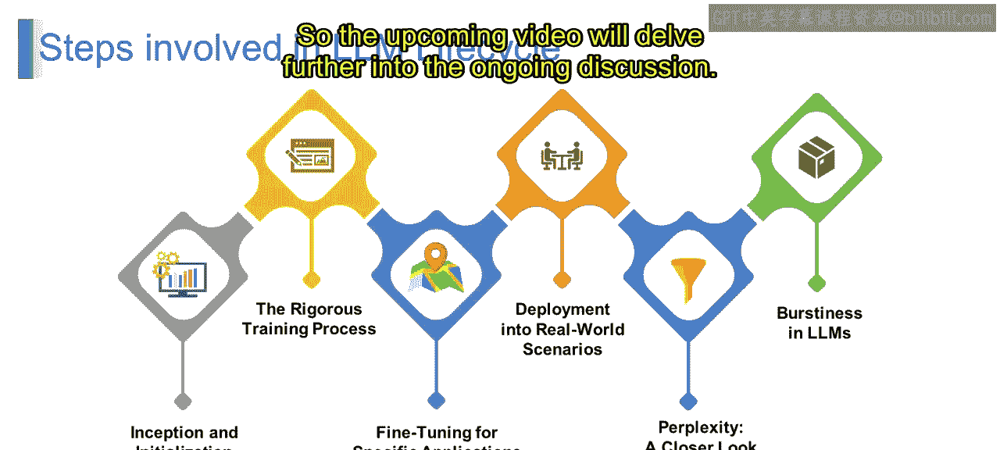

# 第二三四部分 38：1_LLM和生成式AI项目生命周期

在本节课中，我们将学习什么是大语言模型以及生成式AI项目的生命周期。通过本课，你将能够理解生成式AI项目生命周期的各个阶段和关键组成部分。

## 🤖 什么是大语言模型？

想象你有一个超级机器人伙伴，我们称它为“机器人伙伴”。这个机器人伙伴并非普通的金属搭档，它拥有令人难以置信的能力，可以阅读、理解甚至创作文本，就像你最喜欢的讲故事的人一样。无论是阅读睡前故事还是起草一封引人注目的电子邮件，机器人伙伴都能胜任。

在技术领域，工程师们创造了类似的东西，称为**大语言模型**。这些数字奇迹就像是机器人伙伴，但能力被极大地增强了。LLMs是经过精心调校的人工智能系统，旨在理解、创作甚至预测任何给定文本片段的下文。它们是数字语言领域的超级英雄。

大语言模型就像是人工智能领域聪明的巫师。它们擅长处理海量的书面信息，理解其含义，然后利用这种理解来完成各种酷炫的任务。可以将它们视为数字世界的语法专家，确保网上的一切文字都合乎逻辑。

LLMs最酷的特点之一是它们处理和解释人类语言的卓越能力。这就像它们掌握了破译我们语言奥秘的艺术。这意味着它们可以毫不费力地理解上下文、情感甚至我们说话方式的细微差别。

LLMs不仅以其语言专长给我们留下深刻印象，它们还在无数数字应用中扮演着非常重要的角色，从能像人类一样聊天的聊天机器人，到能够撰写文章的内容创作工具。

## 🔄 LLM项目生命周期

现在，让我们来理解LLM生命周期所涉及的步骤。

### 1. 构思与初始化

第一步就像一个新生的婴儿。一切都始于构思和初始化，即创建一个虚拟大脑，就像一个准备好学习和成长的婴儿大脑。这就像将一个全新的数字生命带到世界上。

从技术术语上讲，这个阶段涉及设置LLM的初始结构和参数。这就像为我们的AI理解语言打下基础，有点像教新生儿基础知识。

### 2. 严格的训练过程

想象一下，你的AI正在“健身房”里锻炼，举起语言的“重量”以变得更强壮。在这个阶段，我们的LLM会接触大量的文本，学习语言的模式、语法和细微差别。

在技术术语中，这是进行繁重工作的地方。模型在庞大的数据集上进行训练，通过无数次迭代成为语言专家。这就像把我们语言上的新手变成经验丰富的专业人士。

### 3. 为特定应用进行微调

想象我们的LLM为各种任务戴上不同的“帽子”，比如成为厨房里的厨师或解决谜案的侦探。在这个阶段，我们为特定目的定制我们的AI。

从技术上讲，我们调整模型以在某些特定领域表现出色。无论我们希望它写诗、回答特定问题还是进行总结，这种微调就像是赋予它专门的技能，将我们的语言专家转变为多才多艺的表演者。

### 4. 部署到现实世界场景中

我们经过充分训练和微调的LLM现在已准备好部署到现实世界场景中。想象一下，就像把你的超级英雄释放到数字世界中，在那里它可以协助用户、创作内容并与用户互动。

这意味着我们将LLM集成到应用程序中，使其成为我们日常数字体验的一部分。这就像让我们的语言超级英雄自由地在互联网上施展魔法。

### 5. 困惑度：深入观察

但困惑度到底是什么？想象一下，我们的LLM遇到了一个令人困惑的句子。它挠着数字脑袋，试图理解它。困惑度就像是我们的模型在预测给定句子中下一个词时所经历的“困惑程度”。

从技术上讲，困惑度是衡量我们的LLM理解和预测语言能力的一个指标。困惑度越低，我们的AI就越自信、越不困惑，使其成为真正的语言大师。

### 6. LLM中的突发性

想象一下，我们的LLM像一个随机充气和放气的气球，里面装着单词。突发性指的是序列中单词不可预测的出现情况，有时频繁出现，有时则休息一下。

这意味着突发性突显了语言中单词的不规则分布。这就像承认语言有其古怪的时刻，而我们的LLM在其数字游乐场中拥抱了单词不可预测的特性。

## 📝 总结

在本节课中，我们一起学习了**大语言模型**的基本概念，它就像一个强大的数字语言专家。我们详细探讨了LLM项目的完整生命周期，包括**构思与初始化**、**严格的训练**、**为特定任务微调**、**部署到现实世界**，以及两个重要的评估概念：**困惑度**和**突发性**。理解这个生命周期是成功开发和运用生成式AI应用的基础。