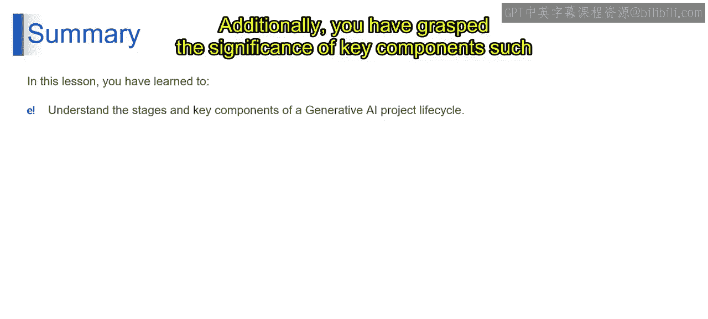
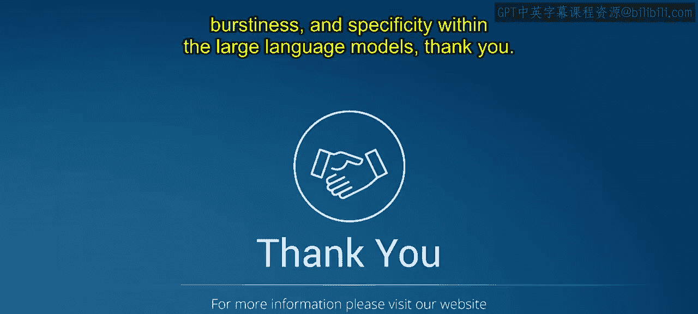

# 第二三四部分 39：LLM生命周期（续）🚀

在本节课中，我们将继续探索大型语言模型生命周期的后续阶段。我们将深入了解如何提升LLM在特定性、上下文理解、内容吸引力以及对话风格等方面的能力，并学习如何运用类比和隐喻使复杂概念更易于理解。

---

上一节我们介绍了LLM生命周期的初始阶段，本节中我们来看看如何让LLM变得更精确、更具吸引力。

### 提升特定性与上下文理解 🔍

想象一下，我们的LLM变成了一名侦探，正拿着放大镜仔细观察，以理解所提供句子的具体细节和上下文。这关乎精确性。从技术上讲，**特定性和上下文**指的是我们的LLM能够多好地把握语言中的细节和细微差别。这就像训练我们的AI成为句子界的夏洛克·福尔摩斯，时刻留意那些微妙的线索。

### 创作吸引读者的详细段落 📖

将我们的LLM想象成一位技艺高超的故事讲述者，编织着吸引读者的叙事。这一步的目标是创造不仅信息丰富，而且读起来令人愉悦的内容。这涉及优化LLM，使其生成详细且引人入胜的段落。就像教导我们的数字文字匠人，如何创作出让读者一句接一句沉浸其中的内容。

### 理解LLM内容中的对话风格 💬

想象我们的LLM坐下来进行一场友好的聊天，而不仅仅是倾泻信息，而是参与到对话中。这一步为我们的数字互动增添了人情味。从技术上讲，我们通过微调LLM来生成感觉像自然对话的文本。这就像让我们的AI不仅成为一个知识宝库，同时也成为数字领域中一个令人愉快的伙伴。

现在，让我们从理论层面来理解这些概念。我们不是在这里向你灌输信息，而是进行一场对话。就像坐下来喝杯咖啡，就这些想法进行一次友好的交谈。这为我们的数字互动增添了人情味。从技术角度看，我们微调了LLM，使其功能超越一个单纯的知识库。我们赋予了它生成感觉像自然对话的文本的能力。这就像教导我们的AI不仅仅是一个聪明的百科全书，它变成了一个数字伙伴，让理论问题的探索不仅富有信息量，而且充满乐趣。这是关于创造一种对话体验，感觉就像你在数字领域与一位知识渊博的朋友交谈。

### 运用类比和隐喻，使内容易于理解 💡

将我们的LLM想象成一座理解的灯塔，用贴切的比较来阐明复杂的概念。这一步的目标是使内容易于理解和产生共鸣。从技术上讲，**类比和隐喻**涉及训练LLM在不同想法之间建立联系。这就像赋予我们的AI简化复杂概念的能力，使其对用户来说更易于理解和产生共鸣。

以上就是关于LLM生命周期的完整旅程，从成为数字领域的语言超级英雄的基础开始。这些步骤展示了我们AI伙伴的惊人能力。

---

### 总结 📝

本节课中，我们一起学习了生成式AI项目生命周期所涉及的各个阶段，从开始到实际部署。此外，你们还掌握了大型语言模型中关键组成部分的重要性，例如训练过程、微调，以及像**困惑度**、**突发性**和**特定性**这样的细微方面。