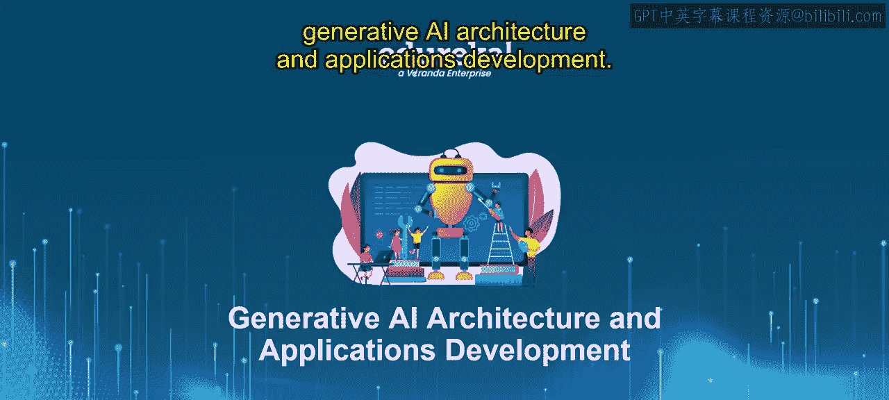
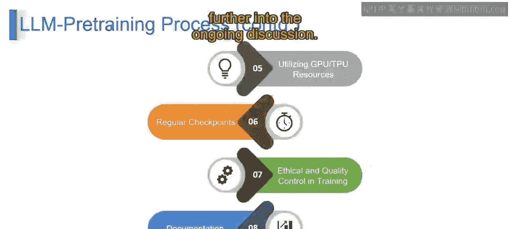

# 第二三四部分 40：LLM预训练与扩展

在本节课中，我们将要学习大型语言模型预训练与扩展的核心概念和步骤。我们将了解如何从数据准备开始，一步步构建和训练一个强大的语言模型。

---

## 数据收集与预处理 🛒

想象一下烘焙一个完美的蛋糕。在开始混合原料之前，你需要收集最好的材料：面粉、鸡蛋和糖。在LLM预训练中，我们做同样的事情，但收集的是海量的文本数据——我们数字杰作的原始原料。然后，就像筛面粉去除结块一样，我们清洗和组织数据，确保我们的模型能从中学到最好的东西。

从技术上讲，数据收集与预处理涉及收集大量文本数据，并为其做好AI学习的准备。这就像选择最优质的原料，并确保它们以最佳形式呈现，以便我们的数字创作能高效学习。

---

## 模型架构与搭建 🏗️

上一节我们介绍了数据的准备，本节中我们来看看如何为模型搭建“骨架”。设想建造一艘宇宙飞船，你需要一个坚实的设计，对吧？大型语言模型也是如此，它们需要一个经过深思熟虑的架构。

就像为我们的AI旅程打造完美的飞船一样，我们搭建模型的结构，决定模型将如何理解和生成语言——这是我们数字太空奥德赛的精髓。从技术上讲，模型架构搭建是关于设计我们AI的蓝图。它涉及创建定义模型如何处理和生成语言的结构，确保它为其语言冒险做好充分准备。

---

## 训练脚本开发 📜

有了架构，下一步就是教模型如何学习。想象一下教机器人它的动作，我们开发一个训练脚本。这就像为我们数字学生制定的课程计划。这个脚本引导AI完成学习过程，从基本的语法规则到创作引人入胜的句子。

从技术上讲，训练脚本开发是为我们的AI创建课程。它是一个详细的计划，指导模型完成学习过程，教会它语言的细微差别和复杂性。

---

## 监控与日志记录 📊

在训练过程中，我们需要密切关注进展。就像船长检查船只的仪表一样，我们密切关注AI的学习旅程，记录每一步。这就像在漏水变成洪水之前修复一个小漏洞，确保训练过程顺利进行。

监控与日志记录涉及在训练过程中跟踪AI的进展。这确保了能及早发现任何问题，使训练过程更高效、更有效。

---

## 利用GPU或TPU资源 ⚡

为了加速学习，我们需要强大的计算支持。把我们的AI想象成一个正在训练中的超级英雄。为了加速它的学习，我们给它一个强大的伙伴——GPU或TPU（图形处理单元或张量处理单元）。这就像升级我们英雄的装备，以更快地征服挑战，成为语言超级英雄。

从技术上讲，利用GPU或TPU资源涉及在训练过程中为我们的AI提供额外的计算能力。这类似于给我们的数字超级英雄先进的设备，以提升其学习速度和效率。

---

## 定期保存检查点 💾

在漫长的训练中，保存进度至关重要。在我们的AI冒险中，检查点就像保存游戏进度。这些检查点保护了AI的学习成果，允许我们从上次中断的地方继续。这就像在我们的AI故事书中放了一个神奇的书签。

从技术上讲，定期保存检查点涉及在训练过程中按间隔保存AI的进度。这确保了如果发生任何中断，我们可以从特定点恢复训练，就像从上次停下的地方继续读故事一样。

---

## 训练中的伦理与质量控制 ⚖️

一个强大的模型也必须是一个负责任的模型。就像超级英雄有道德准则一样，我们的AI遵循伦理准则。我们实施质量控制措施，以确保我们的数字创作行为负责，对世界产生积极影响。

训练中的伦理与质量控制涉及设定指导方针和措施，以确保AI的行为符合道德标准。这是关于创造一个负责任且积极的数字实体。

---

## 文档记录 📖

最后但同样重要的是，我们记录AI的旅程：它的起源故事、它的能力以及它学到的经验教训。这就像创建一本超级英雄手册，确保其他人能够理解并基于我们所做的出色工作进行构建。

文档记录涉及记录和详述AI训练过程的每个方面。这就像创建一本全面的手册，为未来的参考提供关于AI发展、能力和伦理考量的见解。

---

## 总结

本节课中，我们一起学习了大型语言模型的预训练与扩展。我们理解了收集、组织数据并教导我们的数字伙伴语言的过程。通过稳健的架构、持续的监控和伦理准则，我们赋能AI，使其成为语言领域的超级英雄。下一节视频，我们将进一步深入探讨LLM的扩展。