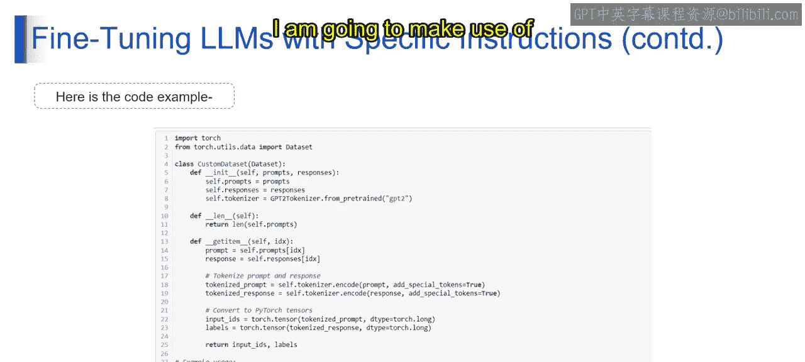

# 第二三四部分 43：使用特定指令微调LLM 🎯


在本节课中，我们将学习如何使用特定指令来微调大型语言模型。我们将理解这种微调方式的重要性、核心参数、具体过程以及相关应用与挑战。

---

在上一节关于参数微调的课程中，我们主要关注优化预训练模型的参数以提升其整体性能，并未指定任何具体的任务指令。然而，在使用特定指令微调LLMs时，我们会根据明确的指令或指导方针，调整微调过程，以赋予模型特定的能力或行为。

例如，在参数微调中，我们可能调整学习率或正则化技术来提升模型的通用性能。相比之下，使用特定指令微调LLMs则涉及向模型提供有针对性的指导或额外的训练数据，旨在实现特定的语言生成任务，例如生成具有特定主题、情感或风格的文本。

本质上，参数微调旨在提升模型的整体性能，而使用特定指令微调LLMs则是通过向模型提供明确的指令，将微调过程导向实现特定任务的目标。

---

以下是微调语言模型时常用的一些参数：

*   **学习率**：决定训练期间模型参数更新的步长。它影响训练的速度和稳定性。较高的学习率可能导致更快的收敛，但也可能引发不稳定；较低的学习率可能导致收敛较慢，但训练更稳定。
*   **批次大小**：指每次训练迭代中一起处理的训练样本数量。它影响训练速度和内存需求。较大的批次大小通常意味着更快的训练，但需要更多内存；较小的批次大小则能提供更好的稳定性，并可能带来更好的泛化能力。
*   **训练步数或轮数**：指定在整个训练过程中，全部训练数据通过模型的次数。它影响模型的收敛和泛化。更多的训练步数可能带来更好的性能，但如果控制不当，也会增加过拟合的风险。
*   **丢弃率**：一种正则化技术，在训练期间随机丢弃一部分神经元或连接以防止过拟合。丢弃率决定了被丢弃的神经元或连接的比例。较高的丢弃率提供更强的正则化，但可能减慢训练速度并需要更长的训练时间。
*   **权重衰减**：也称为L2正则化，它惩罚模型中的大权重以防止过拟合。它在损失函数中添加一个正则化项，惩罚大的权重值，鼓励模型学习更简单、更通用的模式。
*   **预热步数**：在训练初期使用较低学习率的步骤，以稳定训练过程并防止发散。
*   **梯度累积步数**：在更新模型参数之前，累积多个批次的梯度。这对于使用大批次进行训练时很有用。
*   **Adam优化器参数**：特定于Adam优化器的参数，例如控制动量和参数更新规模的beta系数或epsilon值。
*   **学习率调度器**：根据预定义的计划（如指数衰减或线性预热）在训练期间调整学习率。
*   **任务特定参数**：微调任务特有的额外参数，例如针对微调过程特定目标定制的文本生成提示词或分类标签。

---

上一节我们介绍了微调的通用参数，本节中我们来看看使用特定指令进行微调的核心概念。

*   **特定指令在微调中的重要性**：特定指令指导微调过程，确保LLM被定制以执行特定任务目标，例如生成具有特定主题或风格的文本。这些指令提供了清晰度和方向，增强了微调过程的有效性。
*   **使用特定指令的微调过程**：该过程涉及向LLM提供任务特定的指令或指导方针，这可能包括额外的训练数据、提示词或约束条件。然后模型使用这些指令进行微调，以相应地调整其语言生成能力。
*   **在微调中实现特定指令**：可以通过在微调过程中加入任务特定的提示词或约束条件来实现特定指令。例如，对于情感分析任务，可以使用带有情感标签的数据对LLM进行微调，指导其生成具有所需情感倾向的文本。
*   **使用特定指令的微调目标**：其目标是使模型适应执行特定的语言生成任务，如文本摘要、翻译或情感分析。通过提供明确的指令，模型可以学会生成符合期望标准的文本。
*   **微调后LLMs的应用与挑战**：微调后的LLMs在内容生成、对话代理和文本分类等多个领域都有应用。然而，挑战可能在于如何有效定义和传达特定指令，以及确保模型性能与期望目标保持一致。
*   **微调LLMs的高级步骤**：高级步骤可能包括尝试不同的微调策略，如多任务学习、迁移学习或架构修改。此外，超参数调优和正则化方法等技术可以进一步优化微调过程，以提升性能。

---

以下是一个使用特定指令进行微调的代码示例框架：

```python
# 第二三四部分 示例：使用任务特定提示词进行微调
# 第二三四部分 假设我们使用一个预训练的文本生成模型
from transformers import AutoModelForCausalLM, AutoTokenizer, TrainingArguments, Trainer

# 第二三四部分 1. 加载预训练模型和分词器
model_name = "gpt2"
model = AutoModelForCausalLM.from_pretrained(model_name)
tokenizer = AutoTokenizer.from_pretrained(model_name)

# 第二三四部分 2. 准备带有特定指令的训练数据
# 第二三四部分 例如，每条数据都包含一个引导模型生成特定风格文本的提示词
train_data = [
    {"prompt": "以正式商务风格写一封邮件：", "completion": "尊敬的[收件人姓名]..."},
    {"prompt": "用轻松幽默的语气描述夏天：", "completion": "夏天就像个热情似火的朋友..."},
    # ... 更多示例
]

# 第二三四部分 3. 对数据进行分词处理
def tokenize_function(examples):
    # 将提示词和补全文本拼接后进行分词
    texts = [p + c for p, c in zip(examples["prompt"], examples["completion"])]
    return tokenizer(texts, truncation=True, padding="max_length", max_length=128)

tokenized_datasets = tokenize_function(train_data)

# 第二三四部分 4. 定义训练参数，包含特定微调目标相关的设置
training_args = TrainingArguments(
    output_dir="./results",
    learning_rate=5e-5,
    per_device_train_batch_size=4,
    num_train_epochs=3,
    # 可以在此处设置与任务相关的特定参数，如权重衰减、预热步数等
)

# 第二三四部分 5. 创建Trainer并开始微调
trainer = Trainer(
    model=model,
    args=training_args,
    train_dataset=tokenized_datasets,
    # 可以在此处添加数据整理器或回调函数以处理特定指令逻辑
)

trainer.train()
```

在下一个视频中，我将详细解释使用特定指令微调LLM的编码部分，并会利用OpenAI API来完成这项具体任务。

---




本节课中我们一起学习了使用特定指令微调LLM的方法。我们了解了其与通用参数微调的区别，认识了关键的微调参数，探讨了特定指令的指导作用、实现过程和目标，并概述了其应用与高级优化步骤。通过结合明确的指令，我们可以更有针对性地塑造LLM的能力，使其更好地服务于特定任务。