# 第二三四部分 44：微调演示 🎬

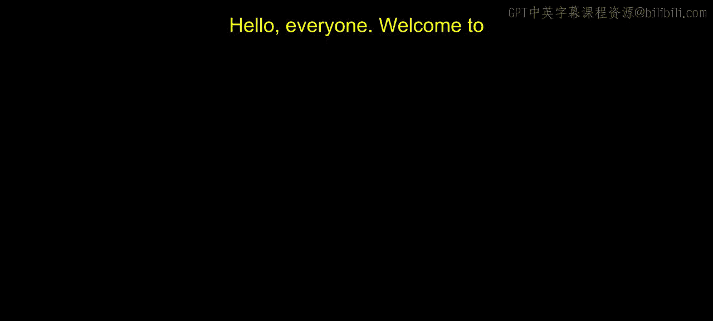

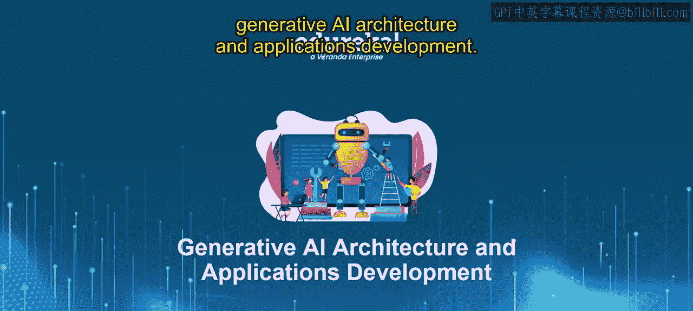

在本节课中，我们将通过实际操作演示，学习如何对大型语言模型进行微调。我们将探索三种不同的方法：基础文本生成、基于参数的微调以及基于指令的微调。

---

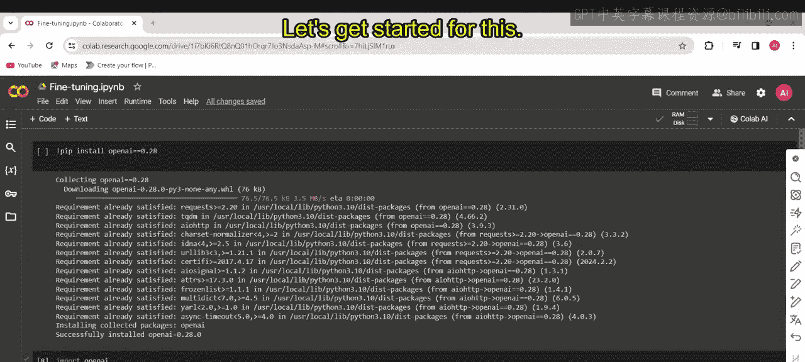

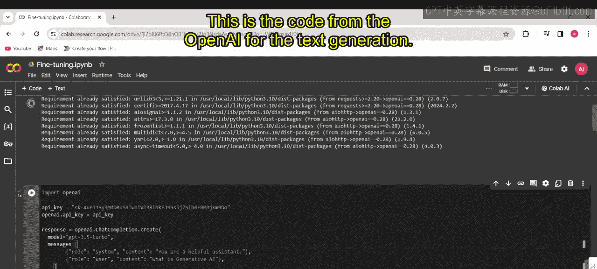

在上一节的理论介绍中，我们了解了微调的基本概念。本节我们将通过OpenAI API进行实际演示，展示如何调整模型参数和指令，以定制模型的行为。

## 基础文本生成

首先，我们来看如何使用OpenAI API进行基础的文本生成。以下是核心代码示例：

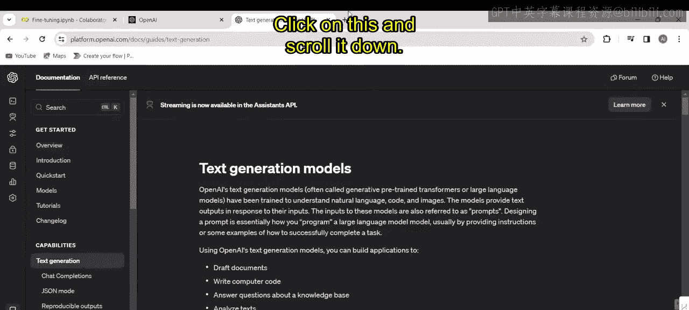

```python
import openai

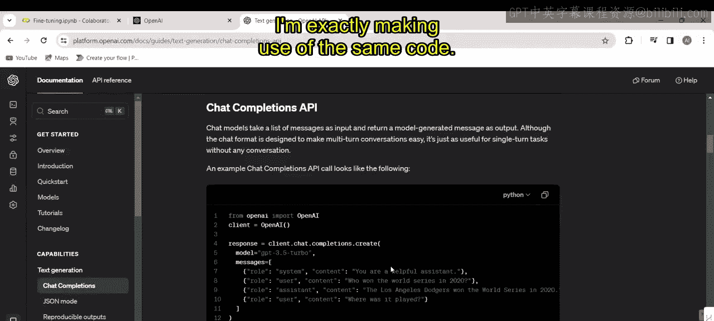

openai.api_key = '你的API密钥'

response = openai.ChatCompletion.create(
    model="gpt-3.5-turbo",
    messages=[
        {"role": "system", "content": "你是一个有帮助的助手。"},
        {"role": "user", "content": "什么是生成式AI？"}
    ]
)

print(response.choices[0].message.content)
```

这段代码通过API调用GPT-3.5模型，并获取对“什么是生成式AI？”这个问题的回答。系统角色定义了助手的基本行为。

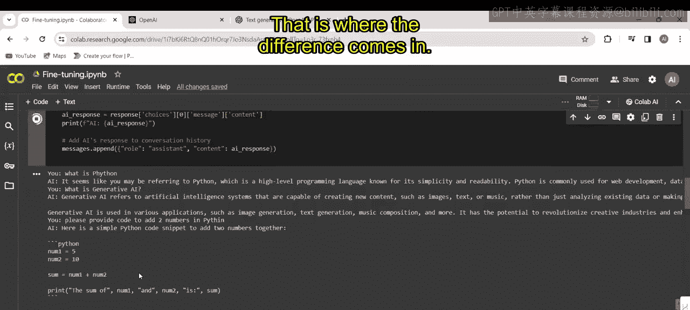

为了使代码更具交互性，我们可以将其修改为接受用户输入：

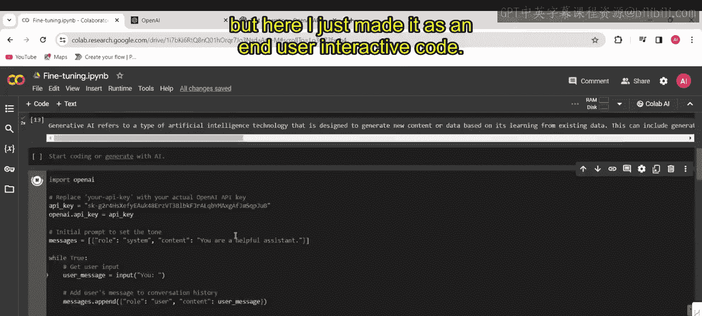

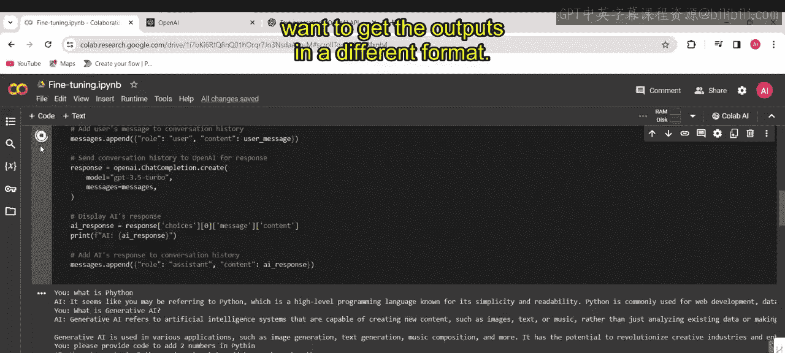

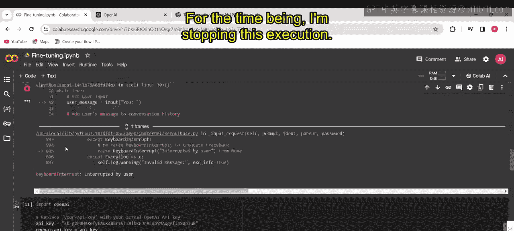

```python
user_message = input("请输入您的问题：")
# 第二三四部分 ... 其余代码使用 user_message 作为用户输入
```

这样，模型就能动态响应用户提出的各种问题。

## 基于参数的微调

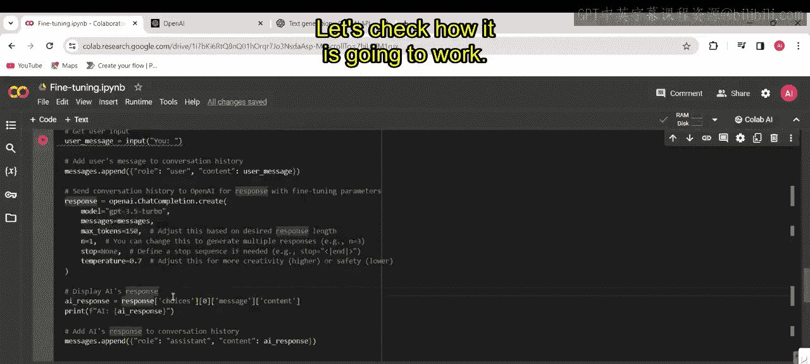

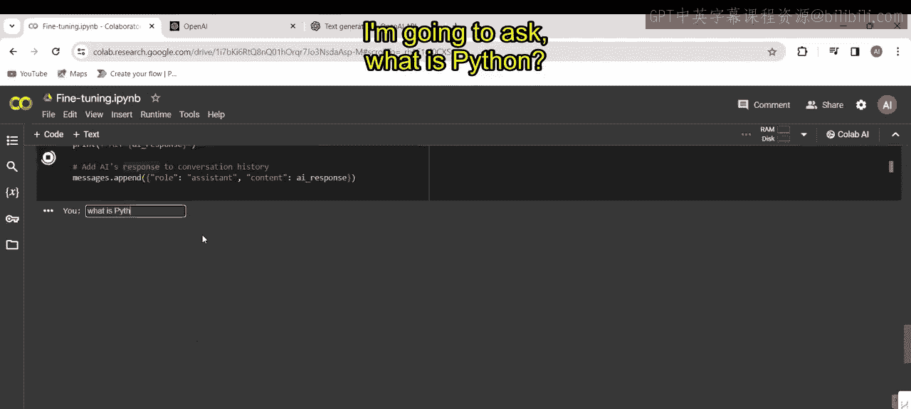

上一节我们介绍了基础调用，本节中我们来看看如何通过调整模型参数来微调其输出。这些参数控制着模型生成文本的“风格”。

以下是调整了关键参数的代码示例：

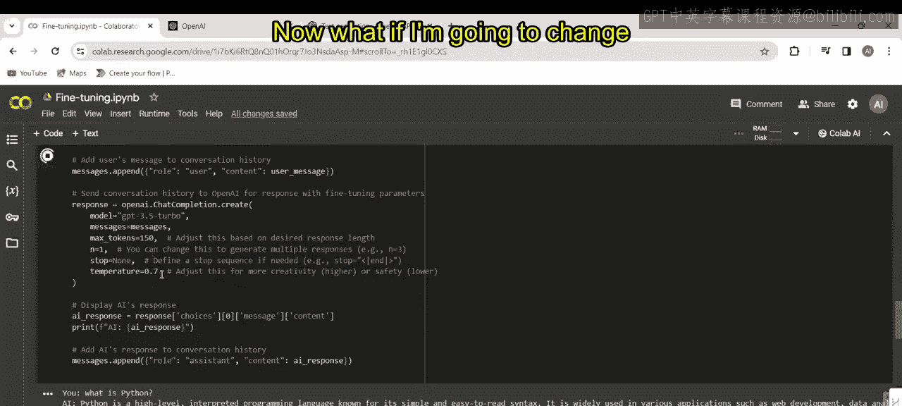

```python
response = openai.ChatCompletion.create(
    model="gpt-3.5-turbo",
    messages=[...], # 消息列表
    max_tokens=150,      # 控制生成文本的最大长度
    temperature=0.7,     # 控制输出的随机性（创造性）
    stop=None           # 定义停止序列
)
```

以下是这些核心参数的作用：
*   **`max_tokens`**：限制模型响应可以生成的最大令牌（单词/字符片段）数。值越大，回答可能越详细；值越小，回答越简洁。
*   **`temperature`**：控制输出的随机性。其值域通常为 **0.0 到 2.0**。**较低的值（如0.2）** 会使输出更确定、更安全；**较高的值（如1.0或更高）** 会使输出更具创造性、更多样化。

通过调整`temperature`参数，我们可以观察到模型对同一问题“什么是Python？”的不同回答风格，从而理解参数如何影响输出。

## 基于指令的微调

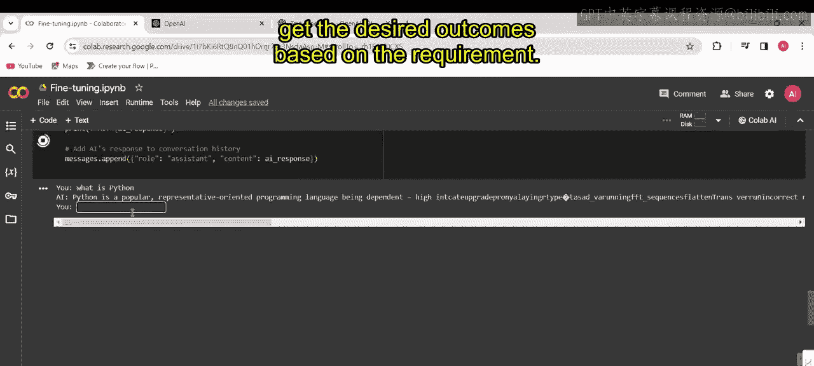

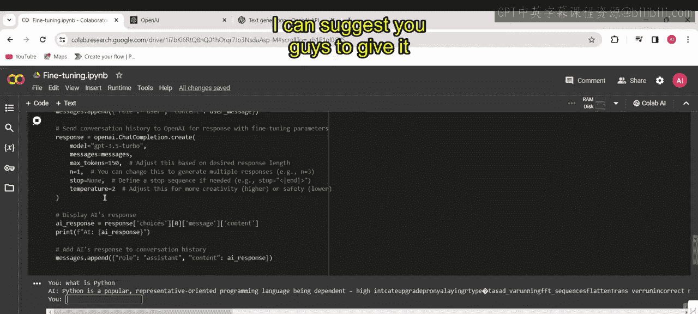

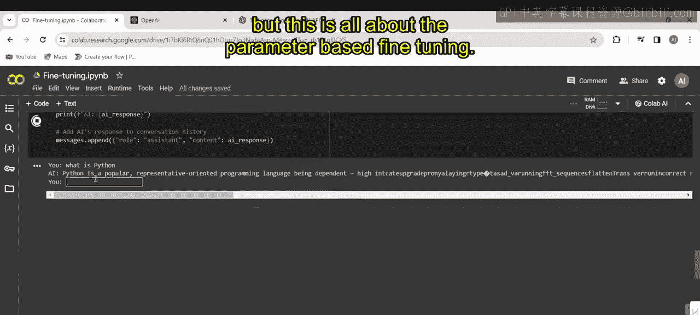

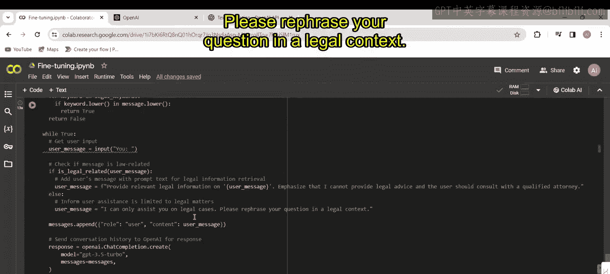

除了调整参数，我们还可以通过修改系统指令来更根本地改变模型的行为和领域。这种方法称为基于指令的微调。

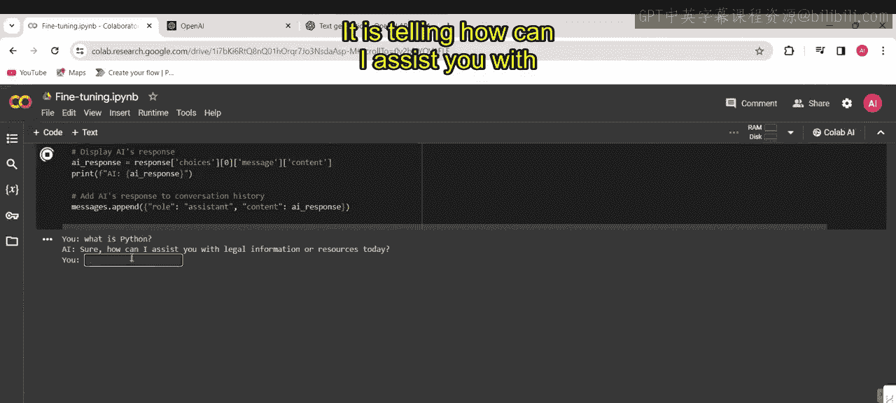

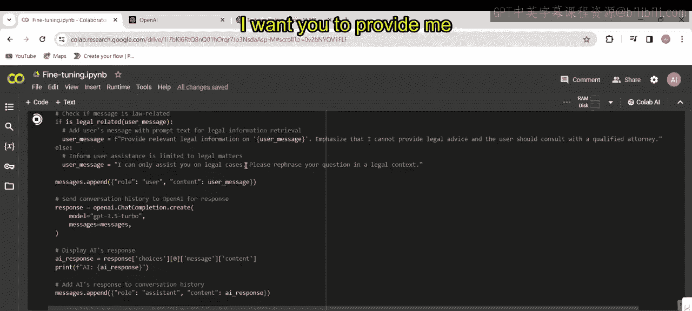

以下是一个将模型角色限定为法律信息助理的示例：

```python
response = openai.ChatCompletion.create(
    model="gpt-3.5-turbo",
    messages=[
        {
            "role": "system",
            "content": "你是一个法律信息助理。你不能提供法律建议，但可以帮助查找法律事务相关的信息和回答。如果你的问题不涉及法律内容，请回复：‘我只能协助处理法律案件相关的问题，请重新组织你的问题，使其具有法律背景。’"
        },
        {"role": "user", "content": "什么是Python？"}
    ]
)
```

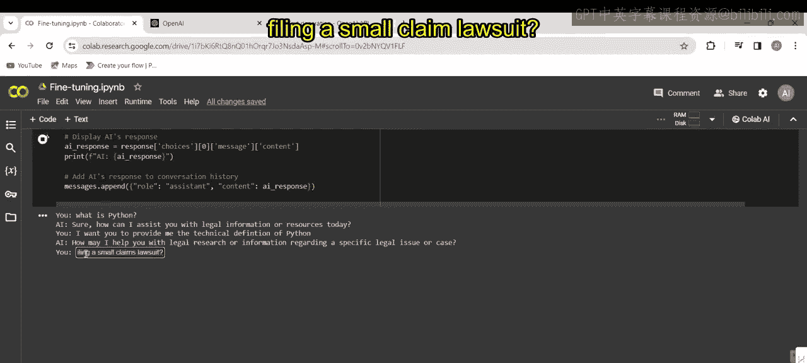

当用户询问“什么是Python？”这类非法律问题时，模型会依据指令拒绝回答，并引导用户提出法律相关的问题。而当用户询问“提起小额索赔诉讼的法律流程是什么？”时，模型则会提供相关的法律信息。

这种方法通过明确的系统指令，将模型的能力约束在特定领域内。

---

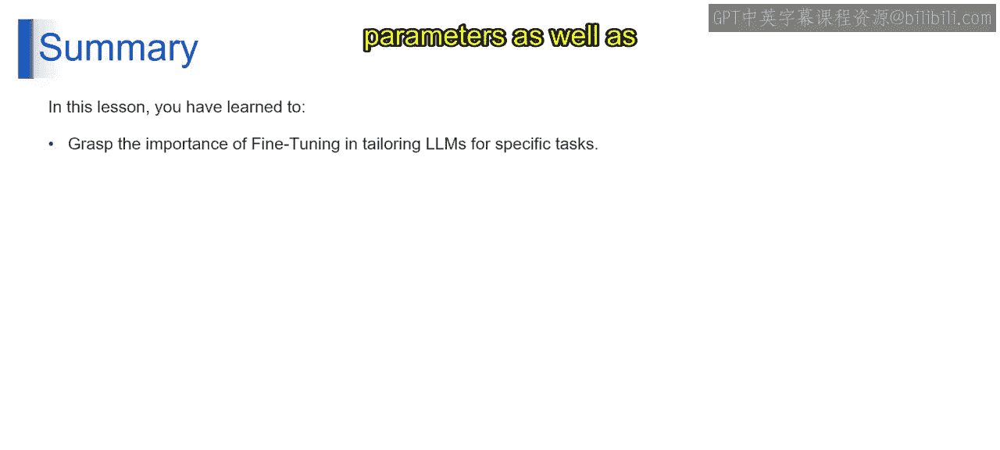

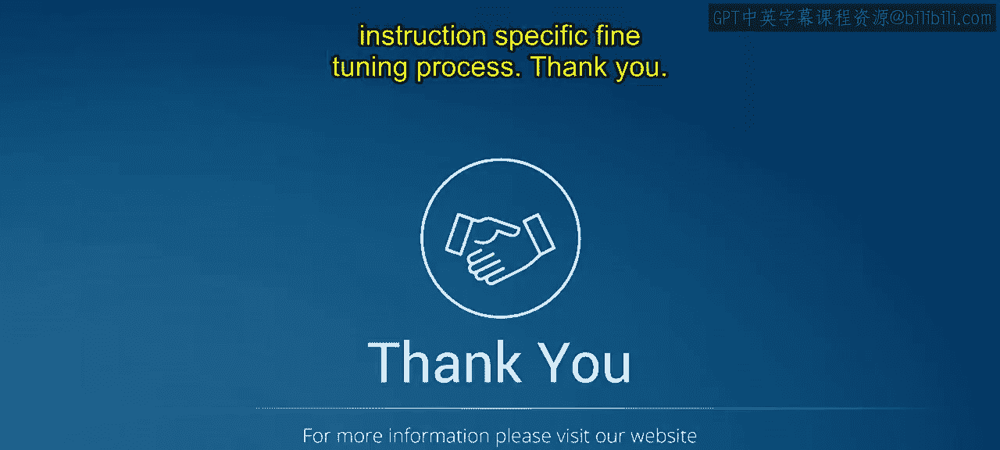

本节课中我们一起学习了大型语言模型微调的三种实践方法。我们首先演示了基础的文本生成，然后通过调整`max_tokens`和`temperature`等参数来微调模型的输出风格，最后通过修改系统指令来实现基于领域的模型行为定制。通过这些技术，我们可以优化LLMs，使其更好地适应多样化的实际任务需求。