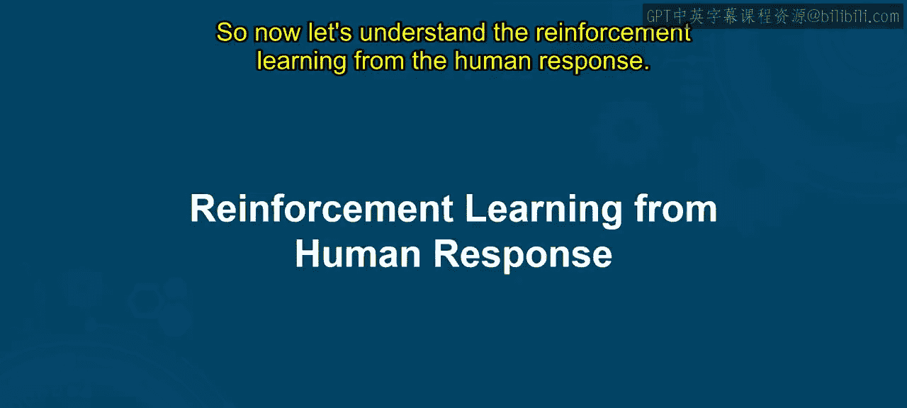
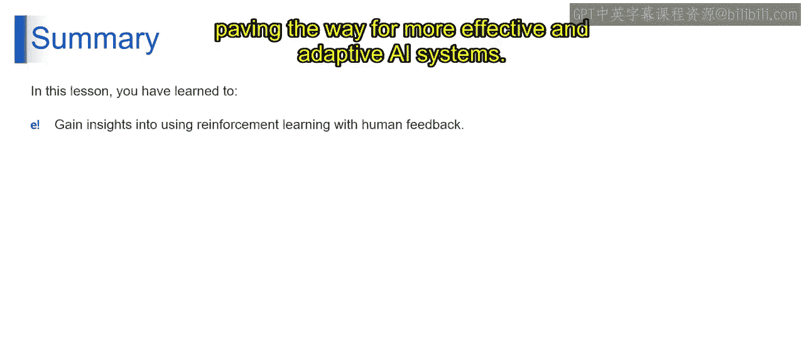

# 第二三四部分 45：人类反馈强化学习 (RLHF) 🧠

在本节课中，我们将要学习**人类反馈强化学习**。这是一种让AI模型通过与人类互动来学习并改进其行为的方法。我们将了解其核心概念、工作原理、面临的挑战以及前沿研究方向。

---

## 什么是强化学习？

想象一下，你正在训练一只狗完成特定指令。当狗成功执行指令时，你奖励它零食；如果它没有执行，则不给奖励。随着时间的推移，狗学会了哪些行为会带来奖励，并据此调整自己的行为。

**强化学习**是一种机器学习类型，其中**智能体**通过与**环境**交互来学习决策。智能体根据当前状态采取**行动**，并因此获得**奖励**或**惩罚**。其目标是学习一系列能随时间最大化总奖励的最佳行动。

在我们的例子中：
*   **智能体**：狗。
*   **行动**：狗表演的把戏。
*   **奖励**：零食。
*   **环境**：训练过程。

智能体学习哪些行动能带来积极奖励，哪些不能。

---

## 什么是人类反馈强化学习 (RLHF)？

现在，假设你在玩一个视频游戏，控制角色在迷宫中穿行。当你移动角色时，游戏会根据你的行动提供反馈：成功到达终点获得积分，撞到障碍物则扣分。

**人类反馈强化学习**是强化学习的一种，其中智能体不再仅仅依赖环境预设的奖励，而是直接接收来自**人类**的反馈。人类对智能体的行动给出评价，指明其好坏。智能体根据这些反馈调整策略，以提升整体表现。

在游戏例子中：
*   **智能体**：玩家控制的角色。
*   **环境**：迷宫和障碍物。
*   **人类反馈**：玩家（人类）提供的指导或评价。

智能体从这种反馈中学习，以改进其决策过程。

---

## RL 与 RLHF 的主要区别

上一节我们介绍了强化学习的基本概念，本节中我们来看看它与RLHF的核心区别。

两者的主要区别在于**反馈的来源**：
*   **传统强化学习**：智能体从环境预设的奖励或惩罚中学习。
*   **人类反馈强化学习**：智能体直接从人类那里获得反馈，这使得学习过程能获得更细致、更有针对性的指导。

---

## RLHF 的核心组成部分

为了深入理解RLHF如何工作，我们需要剖析其核心组成部分。以下是构成RLHF系统的关键要素：

### 1. 智能体：驱动力

智能体是执行学习任务的主体。在一个使用RLHF训练语言模型驱动的虚拟助手的例子中：
*   **智能体**：语言模型本身。
*   **输入**：用户的查询。
*   **输出**：生成的回复。

在RLHF中，智能体（语言模型）会收到人类对其生成回复的反馈。通过分析这些反馈，智能体调整其**策略**（即决策方式），以便在未来生成更好的回复。

### 2. 环境：人类作为催化剂

环境是智能体与之交互的外部世界。在RLHF中，环境主要由**人类用户**与智能体（虚拟助手）的互动构成。
人类通过他们对助手生成内容的反应来提供反馈，这些反应充当了奖励或惩罚。这种以人为中心的环境塑造了智能体的学习过程。

### 3. 行动空间：可能性集合

行动空间指的是智能体在给定状态下可以采取的所有可能行动的集合。对于我们的语言模型助手来说：
*   **行动空间**：指语言模型可以针对用户查询生成的所有可能的回复选项。

探索行动空间涉及分析语言模型对于一个给定提示可以产生的各种回复。理解和扩展行动空间能增强模型的适应性和多样性。

### 4. 状态空间：信息枢纽

状态空间包含了智能体做决策时所需的所有信息。对于语言模型助手：
*   **状态空间**：包括用户当前的提示、之前的对话历史记录以及语言模型自身的内部状态。

理解状态空间对于提炼模型的上下文理解能力至关重要，使其能生成更准确、更符合语境的回复。

### 5. 奖励函数：成功的映射

奖励函数在RLHF中扮演着核心角色，它将智能体的行动映射到基于人类反馈的奖励或惩罚上。
*   **作用**：通过强化理想行为、抑制不良行为来指导学习过程。

具体来说，奖励函数负责根据人类反馈，对语言模型采取的行动（生成的回复）进行评分。这个函数为模型提供了关于其表现的反馈，帮助它随时间学习和改进。

---

## RLHF 面临的挑战

尽管RLHF潜力巨大，但在实际应用中仍面临诸多挑战：

*   **人类反馈数据有限**：获取高质量、大规模的人类反馈成本高昂。
*   **设计有效的奖励函数**：手动设计能准确反映复杂人类价值观的奖励函数非常困难。
*   **确保公平性与减轻偏见**：人类反馈可能包含无意识的偏见，导致模型学习并放大这些偏见。
*   **维护用户隐私与安全**：处理人类反馈数据时需保护用户隐私。
*   **系统的可扩展性**：如何将RLHF系统扩展到处理海量数据和多样化的反馈来源。
*   **优化人机交互**：设计高效、自然的反馈收集机制。
*   **模型的可解释性**：理解模型为何根据特定反馈做出调整。

---

## 如何应对挑战？

针对上述挑战，研究者们提出了多种应对策略：

*   **最大化利用有限反馈**：采用主动学习等技术，智能地选择最需要反馈的数据点。
*   **自动学习奖励函数**：开发技术从有限的反馈数据中自动学习有效的奖励函数。
*   **改进人机交互**：设计更直观、低成本的反馈界面。
*   **减轻偏见**：在数据收集和模型训练中引入去偏见技术。
*   **确保隐私与可扩展性**：使用联邦学习等分布式计算框架，在保护数据隐私的同时利用多方数据。
*   **提升模型可解释性**：开发工具来分析和解释模型的决策过程。

---

## 前沿研究方向

最后，我们来看看RLHF领域一些激动人心的前沿研究方向：

*   **自动学习奖励函数**：减少对手动设计奖励函数的依赖，使系统更自适应。
*   **多智能体强化学习**：将RLHF扩展到多个智能体相互协作或竞争的场景，以解决更复杂的任务。
*   **分布式人类反馈强化学习**：在多个设备或用户间实施分布式RLHF，在保护隐私和安全的同时，利用更广泛的反馈数据进行学习。

---

## 总结

本节课中，我们一起深入探讨了**人类反馈强化学习**的领域。我们学习了其基本概念、核心组成部分（智能体、环境、行动空间、状态空间、奖励函数），分析了它面临的主要挑战以及相应的解决策略，并展望了该领域的未来研究方向。通过融入人类互动，强化学习能够发展出更有效、更适应性的AI系统。