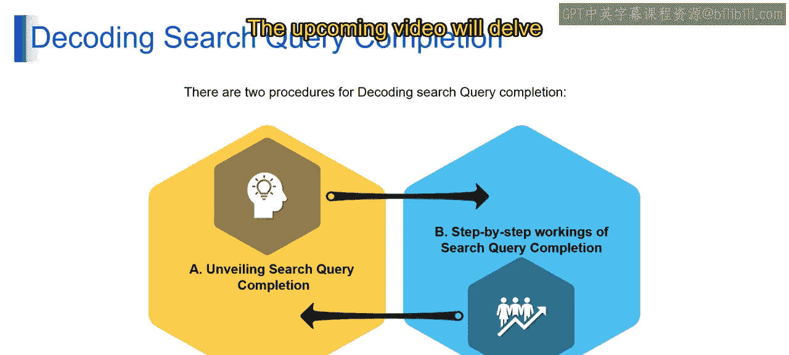

# 第二三四部分 生成式AI架构与应用开发：P46：搜索查询补全

## 概述

在本节课中，我们将要学习**搜索查询补全**的工作原理。我们将了解人工智能，特别是大型语言模型，如何预测并理解用户的搜索意图，从而在用户输入时实时提供建议。通过本课，你将掌握搜索查询补全背后的核心概念及其在信息检索系统中的作用。

---

## 揭秘搜索查询补全的魔法 ✨

想象一下，你正在输入一个搜索查询。例如，你开始输入“how to make”。在你甚至还没打完字之前，搜索引擎就已经神奇地给出了建议，比如“how to make a website”、“how to make Google form”等。这种体验背后的魔法，就是由AI驱动的**搜索查询补全**。

那么，搜索引擎是如何知道你可能要搜索这些内容的呢？这就要归功于一种被称为**语言模型**的技术。

---

## 语言模型：智能预测的核心 🧠

语言模型，通常缩写为**LLMs**，是一种能够理解和处理人类语言的超级智能算法。它们是提升我们与技术交互体验的秘密武器。

在搜索查询补全中，LLMs扮演着至关重要的角色。它就像一个私人助手，能够预测你接下来要问什么，让你的搜索更快、更高效。

其工作原理可以概括为：当你输入时，LLM会根据它对语言模式的理解，开始预测下一个单词。这就像有一个非常了解你的朋友，能够帮你把话说完。

真正的魔力在于LLM**预测**和**理解**人类语言的能力。预测是猜测接下来会发生什么，而理解则是真正把握你提问的上下文。这种预测与理解的协同作用，让你与技术的交互感觉几乎是心灵相通的。

例如，当你输入“how to make”时，LLM不仅预测你可能在寻找一个食谱，还能理解你可能在寻找“如何制作网站”或“如何制作PPT”等常见选项。这就像一个善解人意的AI读心术。

---

## 解码搜索查询补全：两大过程

搜索查询补全的过程可以分解为两个主要部分：**揭秘过程**和**逐步工作机制**。让我们来逐一理解。

### 揭秘搜索查询补全

你是否曾好奇搜索引擎为何能如此准确地读懂你的心思？这就是搜索查询补全的魔力。让我们来揭开它背后的过程。

第一步是**理解你的输入**。系统会仔细分析你已经输入的单词，试图预测你可能在寻找什么。这就像与一个非常专注的倾听者对话，他能帮你把话说完，因为他懂你。

魔力在于**智能预测**。系统使用复杂的算法和语言模型，基于从海量数据中学到的知识，来预测你搜索中最可能出现的下一个单词。这不仅仅是完成你的句子，更是读懂你的想法。

### 搜索查询补全的逐步工作机制

现在，让我们一步步拆解搜索查询补全背后的机制。这里涉及到真正的技术细节。

1.  **实时分析**：当你输入时，系统会实时分析每一个单词。这就像一个侦探在检查线索，以弄清楚你在搜索什么。
2.  **语言模型介入**：接下来，我们可靠的**语言模型**开始工作。它们是操作的大脑，基于从大量先前数据中学到的模式，预测哪些单词很可能紧随其后。这就像拥有一个训练有素、精通语言的助手。
3.  **排序与展示**：一旦做出预测，系统会根据相关性对它们进行排序，并显示最可能的选项。这就像你的私人助理为你呈现下一步行动的最佳建议。
4.  **实时适应**：最酷的部分是，这一切都是**实时发生**的。系统会随着你的输入而调整，用每一次击键来优化其预测。这就像一个始终在学习和进化的搜索引擎。

---

## 总结

本节课中，我们一起学习了**搜索查询补全**的工作原理。我们了解到，其核心在于**语言模型**对用户输入的理解和预测能力。整个过程从实时分析用户输入开始，经由语言模型预测后续内容，最后对预测结果进行排序并实时展示给用户。这不仅仅是简单的单词补全，而是一个理解用户意图、让技术交互变得无比流畅的智能过程。