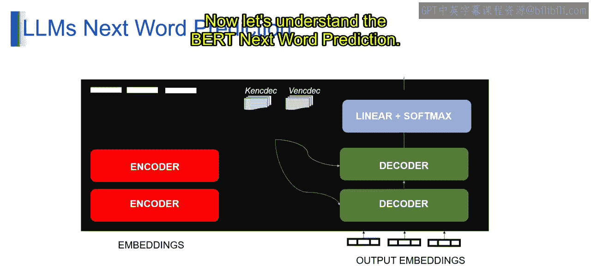
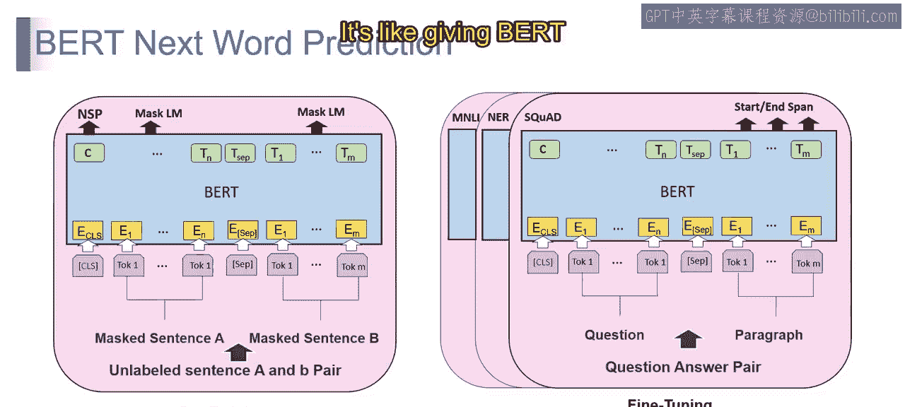
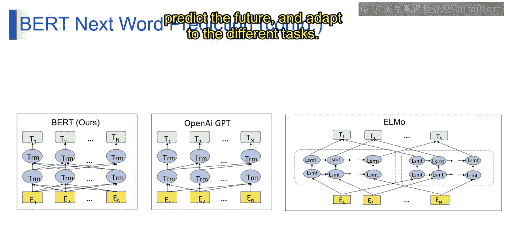
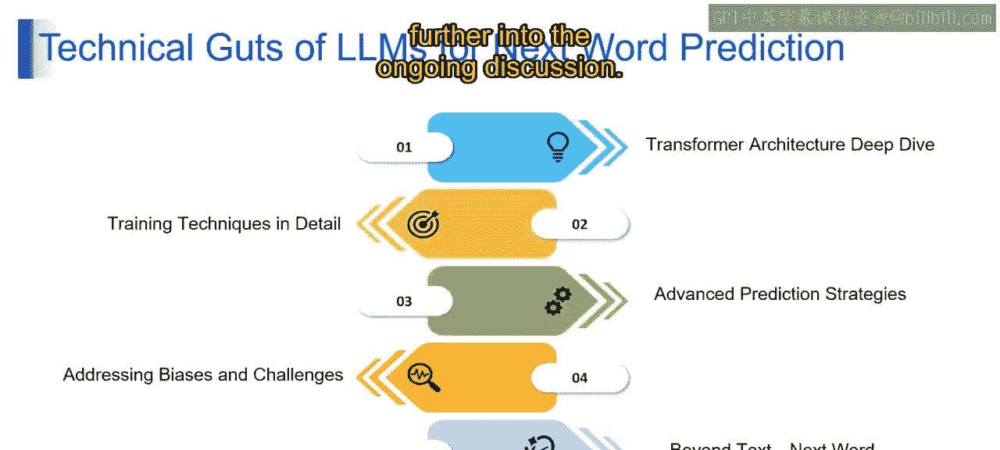

# 第二三四部分 49：线性变换与Softmax函数

在本节课中，我们将学习Transformer解码器中的两个核心组件：线性变换与Softmax函数。我们将了解它们如何协同工作，将编码后的信息转化为下一个单词的预测概率。

上一节我们介绍了Transformer的整体架构，本节中我们来看看解码器内部是如何做出具体预测的。

## 线性变换与Softmax：单词预测的“魔法团队”

线性变换和Softmax函数在解码器部分协同工作，就像一个“单词巫师”，负责预测序列中的下一个单词。

### 线性变换的作用

想象一下，编码器产生的、像密码一样的编码单词被送入解码器。线性变换就像一个“拉伸和压缩机器”。它接收所有数字序列，并根据学习到的模式拉伸或压缩每个值。这个过程不创造新信息，但会调整每个编码单词对于预测下一个单词的重要性。

**公式表示**：`y = Wx + b`
其中，`x`是输入向量，`W`是权重矩阵，`b`是偏置向量，`y`是变换后的输出。

### Softmax函数的作用

线性变换后，你得到了一行调整过的数字，但它们并不直接告诉你每个单词成为下一个单词的概率。Softmax函数接收这些调整后的值，并将它们转换为概率。

想象把它放入一个魔法机器，将所有值转化为百分比，总和为100%。概率最高的单词就成为预测的下一个单词。

**公式表示**：`softmax(z_i) = exp(z_i) / Σ_j exp(z_j)`
其中，`z_i`是第i个输入值，分母是所有输入值的指数和。

### 两者的协同工作



当我们将两者结合时，线性变换帮助解码器专注于来自前文的最相关信息。Softmax函数则将这些信息转化为清晰的概率，使解码器能够像单词巫师一样选择最可能的下一个单词。

简单来说：
*   线性变换为预测调整单词的重要性。
*   Softmax函数将这些调整转化为百分比，就像为下一个单词设计的投票系统。

它们像一个团队，共同使单词巫师能够准确预测下一个词。

---

## BERT的下一词预测



现在让我们理解BERT模型如何进行下一词预测。它主要包含两个部分：预训练和微调。

以下是BERT训练的两个主要阶段：

1.  **预训练**
    BERT通过预测句子中的单词开始学习，但这里有一个转折：一些单词被`[MASK]`标记遮盖了。这就像在和单词玩捉迷藏。BERT必须根据周围的单词来推断被隐藏的是什么。这帮助模型学习单词在不同情境下如何相互关联。

2.  **微调**
    BERT的目标不仅是成为一个巫师，还要成为一个特定任务的专家。它通过不同的任务进行练习，比如回答问题或识别精确的单词位置。这就像给BERT一份工作，并为其量身定制技能以适应这份工作。

---

## 不同模型的预训练架构

现在让我们了解不同模型在预训练时采用的不同架构。可以将这些视为我们语言巫师的不同学习风格。

以下是几种经典的模型架构：

*   **BERT**
    这是原始的BERT，就像我们故事中智慧的老巫师。它一次查看整个句子，并使用堆叠的编码器来理解单词及其关系。

*   **OpenAI GPT**
    想象一个从左到右阅读的巫师，这就是GPT。它使用单个解码器块来预测下一个单词，一次处理一步。

*   **ELMo**
    ELMo代表“来自语言模型的嵌入”。它是一种在NLP中使用的技术，通过考虑上下文来表征单词。在我们的比喻中，ELMo是一个风格独特的巫师。它使用双向LSTM来理解单词，以不同的方式捕捉上下文。

**核心概念**：在预训练中，模型通过与单词“捉迷藏”来理解上下文；在微调中，模型针对特定任务（如预测下一个词）调整技能。不同的架构为我们的语言巫师提供了多种学习方式，每种都有其优缺点。



这就是BERT进行下一词预测背后的“魔法”。就像训练一个语言巫师去理解单词、预测未来并适应不同的任务。

---

## 下一词预测的技术细节

现在，让我们深入理解LLMs进行下一词预测的技术核心。

### 1. Transformer架构深度解析

将Transformer架构视为我们语言模型的“智慧蓝图”。它不是逐个处理单词，而是像一个超级智能的多任务大脑，一次查看整个句子。它使用堆叠的编码器来理解单词和关系。这不仅仅是从左到右阅读，更像是拥有句子的全景视图，一次性捕捉所有细节。

### 2. 训练技术详解

现在，让我们揭开训练魔法的帷幕。它涉及一种称为**掩码语言模型**的技术。想象玩一个单词游戏，句子中的一些单词被隐藏（掩码）。模型试图根据上下文猜测这些隐藏的单词。这就像一个单词侦探游戏，帮助我们的语言模型学习单词在不同情境下如何组合。这项技术为理解语言和上下文奠定了坚实的基础。

### 3. 高级预测策略

我们的语言模型不仅仅是猜测单词，它还要有风格地进行预测。它使用如**束搜索**这样的技术，一次探索多个单词选项，并根据各种标准选择最佳选项。这就像拥有一个单词探索者，不满足于第一个猜测，而是仔细选择最有希望的预测，使你的下一词预测更准确、更有风格。

**代码示例（束搜索简化逻辑）**：
```python
# 第二三四部分 伪代码示例
def beam_search(model, input_sequence, beam_width=5):
    candidates = [(input_sequence, 0)] # (序列， 总对数概率)
    for step in range(max_length):
        all_candidates = []
        for seq, score in candidates:
            # 获取下一个词的概率分布
            next_word_probs = model.predict(seq)
            # 选择 top-k 个候选词
            top_k_words = get_top_k(next_word_probs, beam_width)
            for word, prob in top_k_words:
                new_seq = seq + [word]
                new_score = score + log(prob)
                all_candidates.append((new_seq, new_score))
        # 从所有候选中选择总体得分最高的 beam_width 个
        candidates = select_top_k(all_candidates, beam_width)
    return candidates[0][0] # 返回最佳序列
```

### 4. 处理偏见与挑战

我们的语言模型希望保持公平和无偏见，就像一个负责任的巫师。模型经过特殊训练，以识别并最小化偏见，确保预测是公正和周全的。这就像教导我们的巫师在语言王国中保持公平，平等对待每个人。

### 5. 超越文本：其他领域的下一词预测

最后，我们的语言巫师不仅能预测句子中的单词，还可以涉足其他领域。这就像我们的巫师为各种任务戴上不同的帽子。无论是预测下一个音符还是下一个棋步，我们的语言模型都能适应并在不同领域进行预测，展示了其超越文本的多样性。

---



本节课中我们一起学习了Transformer解码器中线性变换与Softmax函数的核心作用，了解了BERT等模型的预训练与微调过程，并深入探讨了实现下一词预测背后的多种技术细节与策略。这些组件和技术共同构成了现代大语言模型理解和生成语言的基础。