# 第二三四部分 50：其他领域的下一个词预测

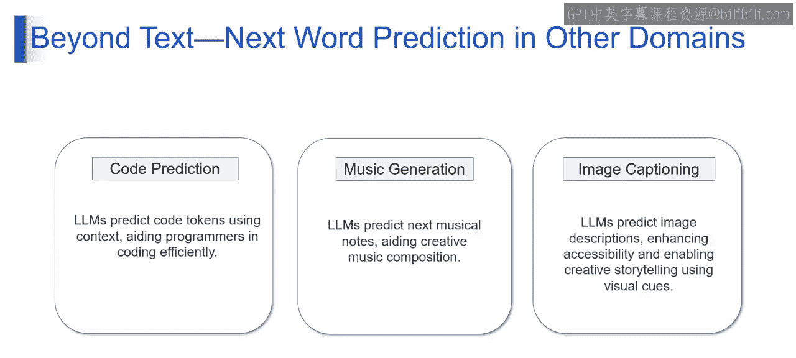

## 概述

在本节课中，我们将要学习大型语言模型（LLMs）如何将其核心能力——“下一个词预测”——从文本领域扩展到其他创造性领域。我们将探讨其在代码预测、音乐生成和图像描述三个具体场景中的应用。

---

上一节我们介绍了语言模型在文本序列中预测下一个词的基本原理。本节中我们来看看，这种预测能力如何被应用于更广泛的领域。

### 代码预测 💻

想象一下，语言模型踏入编程领域。它能够根据上下文预测下一个代码标记（token），这为程序员编写高效且无错误的代码提供了便利。

这就像拥有一个编码助手，它能预判下一行代码或下一个函数。以下是其核心过程的简化表示：

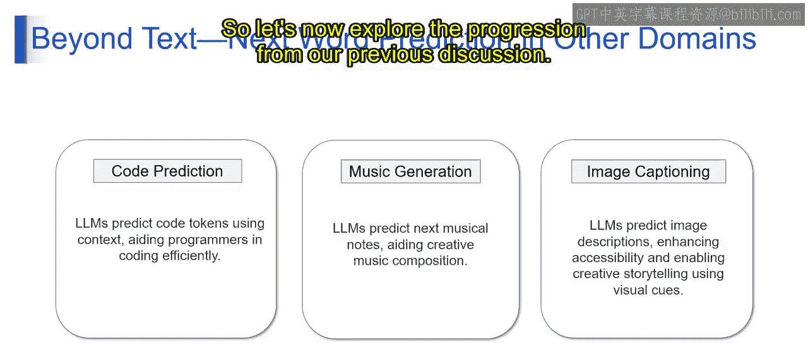

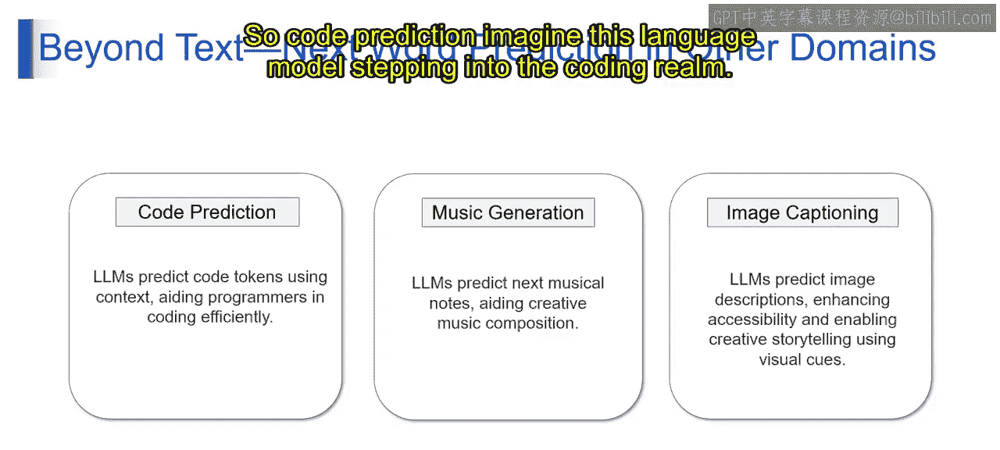

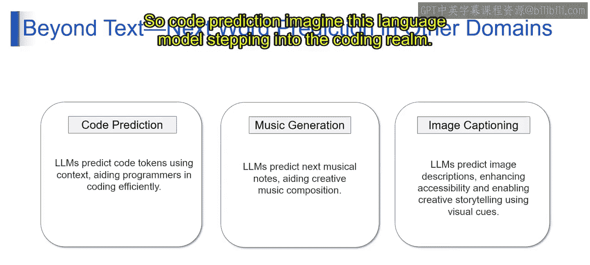

```python
# 第二三四部分 模型根据已有代码上下文预测下一个token
context = "def calculate_sum(a, b):"
predicted_token = model.predict_next_token(context)
# 第二三四部分 可能的预测输出: "return"
```

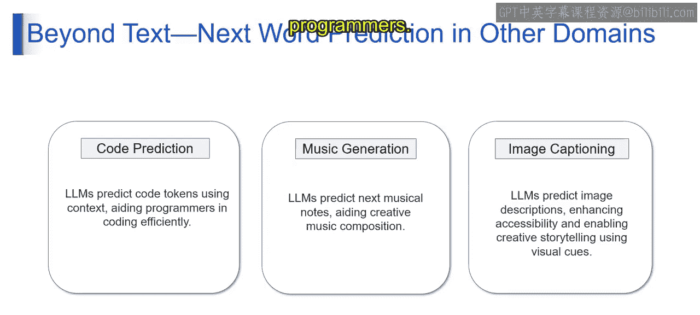


这种能力使编程变得更加轻松。

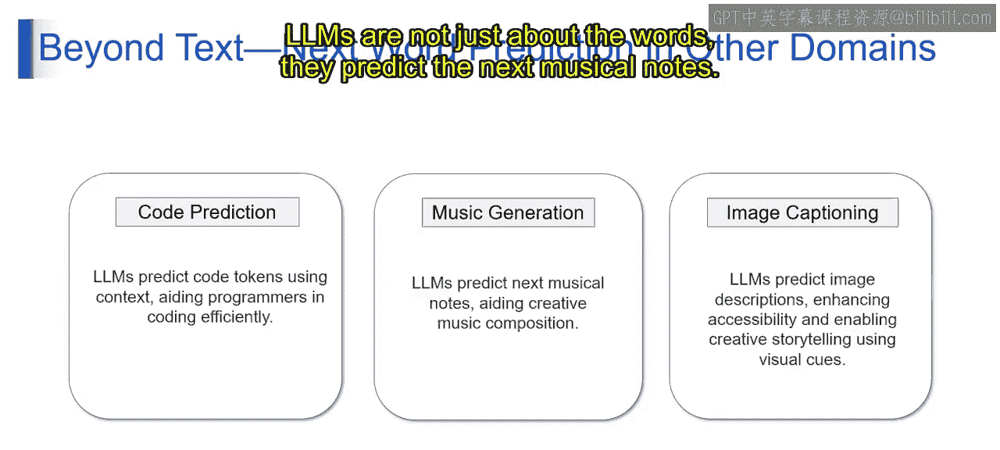

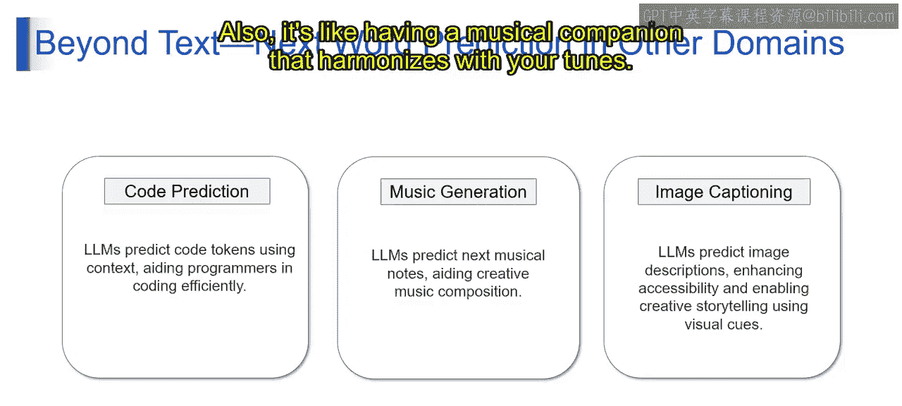

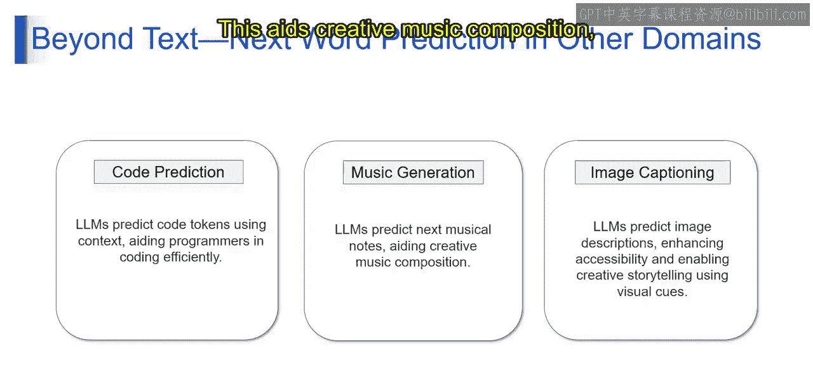

### 音乐生成 🎵


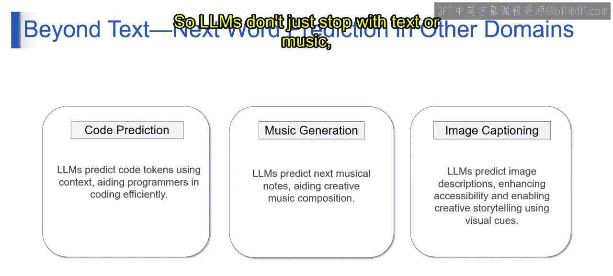

大型语言模型的能力不仅限于词语，它们也能预测下一个音符。

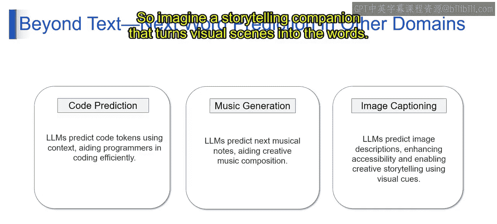

这就像拥有一个音乐伙伴，能与创作者的曲调和谐共鸣。它通过提供一系列可能的旋律走向，来辅助创造性的音乐作曲，为音乐家探索和创作开辟新路径。

其预测逻辑可以类比为：
**P(下一个音符 | 已生成的音符序列)**

### 图像描述 🖼️

大型语言模型的应用也不止于文本和音乐，它们还能预测对图像的描述。

想象一个能将视觉场景转化为文字的伙伴。这通过为图像添加描述性标题，不仅增强了视障人士的无障碍访问体验，也激发了创造性的故事讲述。

这个过程通常结合了视觉编码器和语言模型：
**图像特征 → LLM → 描述文本**

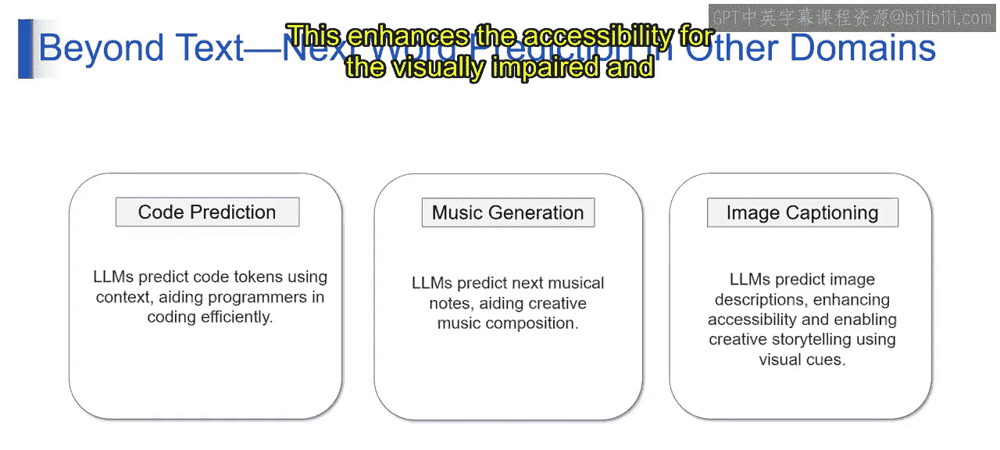

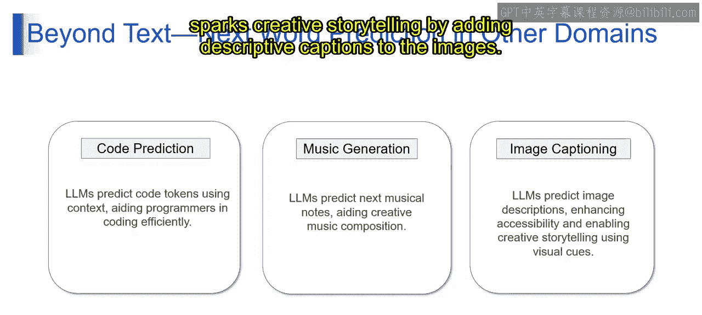

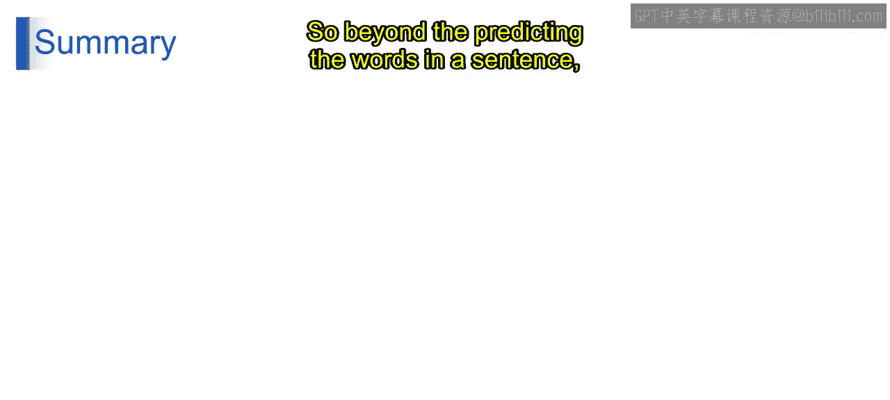

---

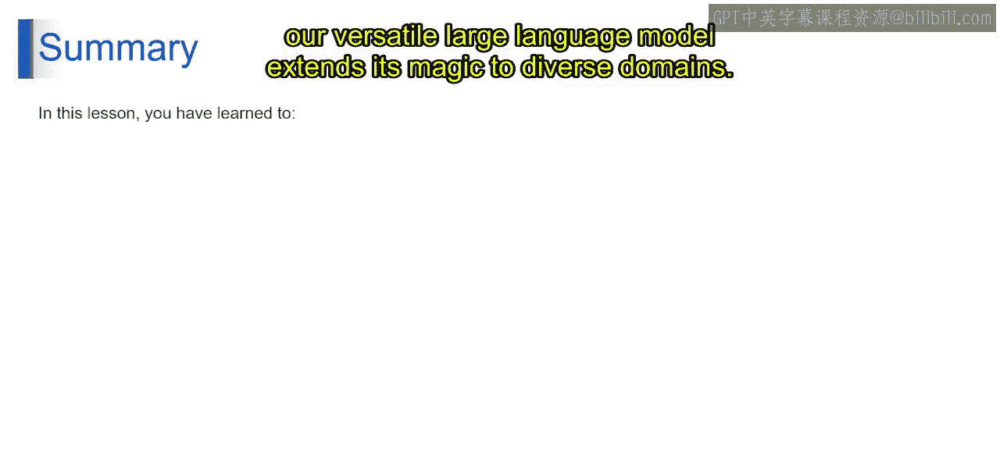

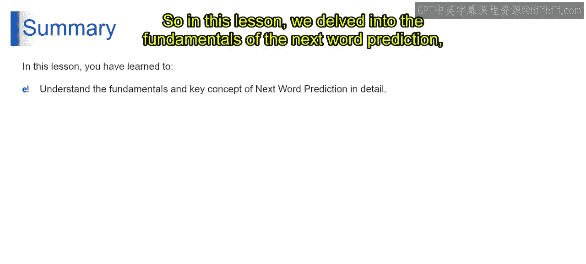

## 总结

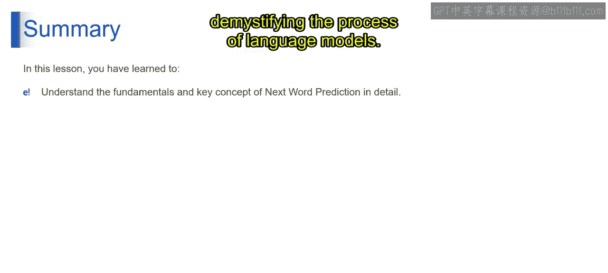

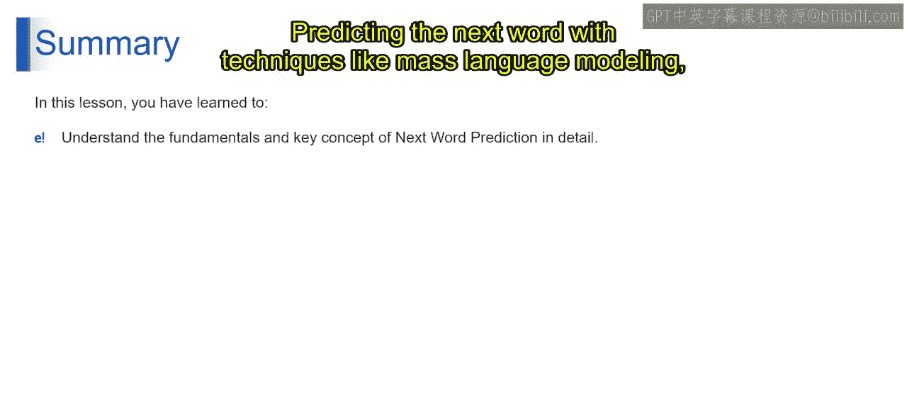

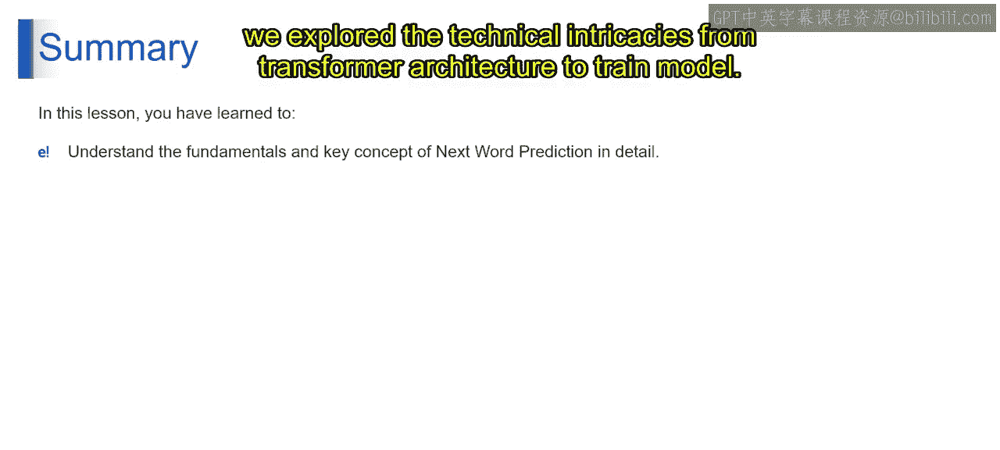

本节课中我们一起学习了，强大的大型语言模型如何超越句子中的词语预测，将其能力扩展到多样化的领域。

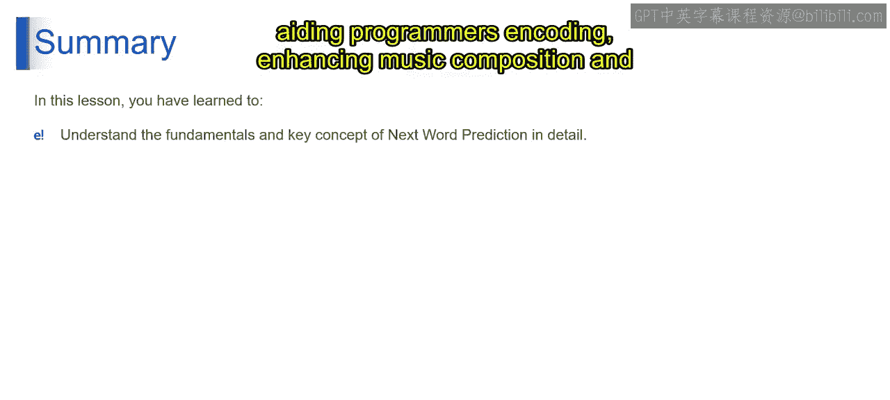

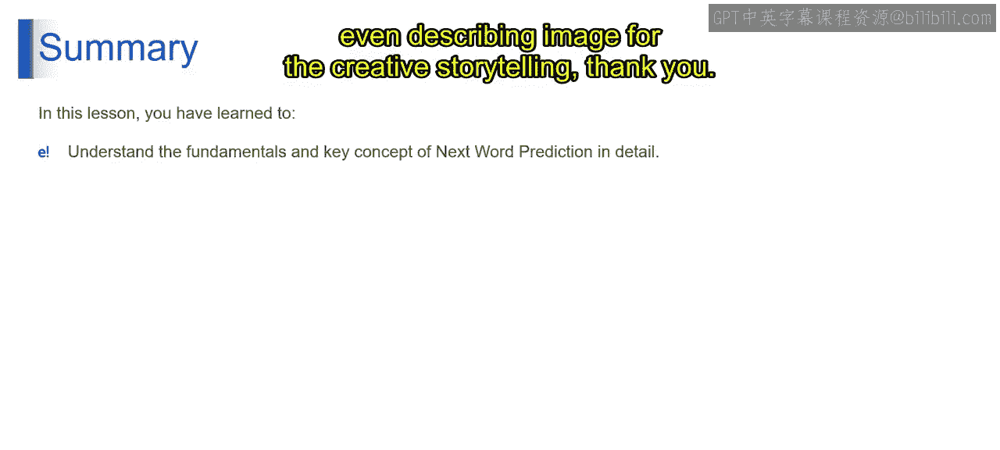

我们深入探讨了“下一个词预测”的基础，揭示了语言模型使用如**掩码语言建模（Masked Language Modeling）** 等技术进行预测的过程。我们从Transformer架构探索到模型训练的技术细节，并揭示了这些模型如何超越文本，在辅助程序员编码、增强音乐创作乃至为图像添加描述以促进创造性叙事等方面发挥作用。