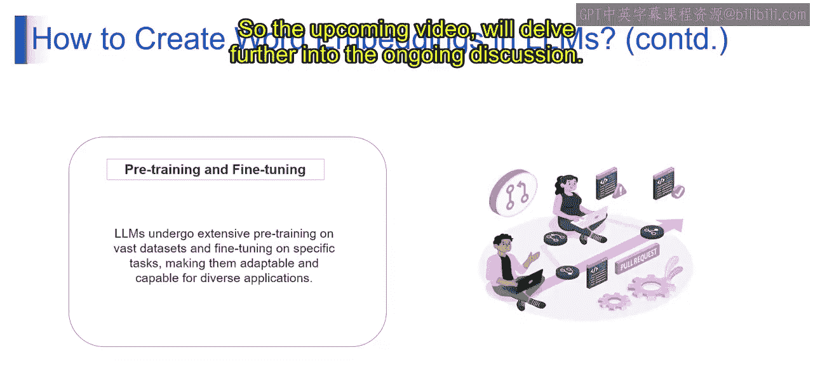

# 第二三四部分 51：词嵌入

在本节课中，我们将要学习词嵌入的概念。我们将了解词嵌入是什么、如何创建它们，以及其背后的基本原理。课程结束时，你将能够阐述词嵌入是如何捕捉词语的语义和句法关系的。

---

### 概述

词嵌入是词语在高维空间中的数值表示。每个词被转换成一个向量，向量的每个维度代表该词的一个不同特征。

上一节我们介绍了语言模型的基础，本节中我们来看看如何具体为词语创建这种数值表示。

---

### 如何在大语言模型中创建词嵌入

以下是创建词嵌入所需遵循的关键步骤。

#### 1. 在海量文本上训练

想象大语言模型像一个语言爱好者，正在探索巨大的图书馆。它通过阅读海量文本来学习语言，理解词语是如何被使用和连接的。这就像通过沉浸在无数故事中来学习语言的韵律。

*   **核心概念**：模型从多样化的数据源中吸收语言模式。这种广泛的接触帮助它掌握词语使用的细微差别和词语间的关系，为构建有意义的词嵌入奠定基础。

#### 2. 模型架构

将模型架构视为我们语言模型的蓝图。大语言模型使用配备自注意力机制的Transformer架构。这就像拥有一个超级放大镜，能够捕捉句子中词语之间的相互关系，确保获得丰富的理解。

*   **核心概念**：大语言模型的架构，以其Transformer结构和自注意力机制为特点，能够高效捕捉词语间的关系和依赖。它是赋能模型理解语言复杂性的支柱。

#### 3. 分词

将语言分解成易于处理的小块。分词就像将一个句子拆分成单词或子词。这类似于将拼图分解成可管理的碎片，让我们的语言专家更容易理解和处理。

*   **核心概念**：大语言模型中的分词涉及将输入文本划分为更小的单元，例如单词或子词。通过将文本分解为更易消化的组成部分，这一步促进了语言的理解和处理。

#### 4. 在训练中学习嵌入

当我们的语言爱好者阅读时，它会识别独特的词语并赋予每个词特殊的意义。类似地，在训练过程中，大语言模型为每个分词单元开发独特的嵌入向量。这就像给每个词一个独特的身份，让我们的语言模型每遇到一个句子都变得更聪明。

*   **核心概念**：在训练期间，大语言模型通过反向传播同时为每个分词单元开发独特的嵌入向量。随着模型优化其对语言的理解，这个过程会持续改进模型的性能。

#### 5. 上下文化

上下文化是指大语言模型根据周围词语的上下文来更新分词单元的嵌入向量。这个动态过程增强了词语在特定上下文中的表示意义，使模型能够结合词语的周围环境来理解它。

#### 6. 嵌入向量的提取

大语言模型提供了从不同网络层提取嵌入向量的灵活性。每一层捕捉不同层次的抽象和上下文信息，允许用户根据特定应用需求选择合适深度的语言理解。

#### 7. 预训练与微调

大语言模型首先在庞大的数据集上进行广泛的预训练，以掌握通用的语言模式。随后，微调过程允许针对特定任务对模型进行定制。这个双重过程使得大语言模型能够适应多样化的应用场景。

以上就是在大型语言模型中创建词嵌入可以遵循的所有步骤。

---

### 总结

本节课中我们一起学习了词嵌入。我们了解到词嵌入是词语的数值化表示，它们在高维空间中捕捉词语的含义和关系。我们逐步探讨了在大语言模型中创建词嵌入的过程：从海量文本训练、利用Transformer架构、进行分词，到在训练中动态学习并上下文化嵌入向量，最后通过预训练和微调使模型适应各种任务。理解这些步骤是掌握现代自然语言处理模型如何“理解”语言的关键基础。

接下来的视频将继续深入探讨相关话题。