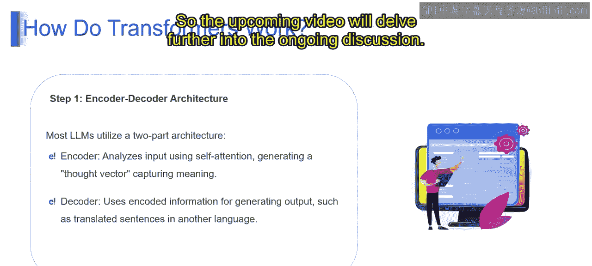

# 第二三四部分 53：Transformer架构详解 🧠

在本节课中，我们将要学习Transformer架构。我们将了解Transformer是什么，它在大型语言模型中的作用，其核心工作原理，以及它在各种自然语言处理任务中的应用。

---

## 什么是Transformer？

想象你正在读一个故事，你有一位朋友特别擅长关注故事的不同部分。当故事中出现一个重要角色时，你的朋友会聚焦于此；当情节发生转折时，他们会迅速调整注意力。这位朋友能帮助你更好地理解故事，因为他们关注的是最相关的细节。

从技术上讲，LLM中的Transformer就像你那位专注的朋友，但存在于数字世界中。这种神经网络架构使用**自注意力机制**，使其能够对句子中的不同部分给予不同程度的关注。模型可以动态决定哪些词对于理解上下文至关重要，这使得它在自然语言理解和处理方面非常高效。

就像你专注的朋友会根据故事内容或上下文调整注意力一样，LLM中的Transformer使用自注意力机制在语言处理过程中动态调整焦点。这种适应性使Transformer能够捕捉词语之间复杂的关系，使其成为理解和生成类人文本的强大工具，广泛应用于各种场景。

---

## Transformer的应用

以下是Transformer在几个关键自然语言处理任务中的应用：

**机器翻译**
在翻译任务中，Transformer利用其自注意力机制来理解不同语言中词语之间的关系，捕捉细微差别，从而实现准确、连贯的翻译。

**文本摘要**
在摘要任务中，Transformer使用其自注意力机制聚焦于关键细节，确保生成的摘要能准确代表原文的核心内容。

**问答系统**
在问答任务中，Transformer利用其自注意力机制来理解问题的含义，检索相关信息，并生成连贯的答案。

**文本生成**
在文本生成任务中，Transformer使用其自注意力机制来理解和捕捉词语之间的依赖关系，使其能够创造出多样且富有意义的文本输出。

---

## Transformer的用途

上一节我们介绍了Transformer的应用，本节中我们来看看它带来的实际价值。

**革新沟通**
想象一下与说不同语言的人聊天，Transformer可以帮助实时翻译对话。这就像打破了语言障碍，促进了全球交流。Transformer通过实现无缝的语言翻译革新了沟通方式，使人们能够跨越语言依赖性和差异进行理解和互动。

**提升生产力**
想象一个智能助手为你总结冗长的报告，节省你的时间。Transformer可以自动化文档摘要、数据提取等任务，使信息更易获取，并节省宝贵的资源。Transformer通过自动化文本相关任务、简化信息处理流程并提供快速高效的解决方案来提升生产力。

**增强创造力**
设想一个能生成独特诗歌或创新代码行的AI。Transformer支持创意写作和代码生成，充当各种艺术和技术项目的创意协作者。Transformer通过提供生成多样化、富有想象力的内容的工具来增强创造力，为艺术事业做出贡献并促进创新。

**推动研究**
想象一位研究人员使用Transformer分析海量的科学文献，加速模式的发现。Transformer通过处理和理解复杂信息，协助科学研究和各技术领域的创新。Transformer在推动研究方面发挥着关键作用，为分析、总结和从各领域的大型数据集中提取洞察提供了强大的工具。

---

## 为何需要Transformer？

了解了Transformer的用途后，我们来看看它相较于其他模型的核心优势。

**卓越的上下文理解能力**
卓越的上下文理解能力使Transformer在需要把握词语与上下文之间复杂关系的任务中表现出色，使其在自然语言处理中极具价值。

**并行处理能力**
并行处理显著提升了模型从数据中学习和做出预测的能力，与RNN等顺序处理模型相比，在训练和推理效率上更高。

**强大的可扩展性**
可扩展性使Transformer能够处理海量信息，使其适合训练大型语言模型，这些模型擅长捕捉其中的复杂关系和细微差别。

**广泛的应用性**
广泛的应用性使其在各种任务中都极具价值，能够应用于不同领域，解决传统语言处理之外的广泛挑战。

---

## 总结

本节课中我们一起学习了Transformer架构。我们了解到，Transformer是一种利用**自注意力机制**的神经网络，能够动态关注输入文本的不同部分，从而卓越地理解上下文和词语关系。它在翻译、摘要、问答和文本生成等任务中发挥着核心作用，并通过革新沟通、提升生产力、增强创造力和推动研究等方式产生巨大价值。其并行处理、可扩展性和广泛适用性等优势，使其成为现代大型语言模型的基石。