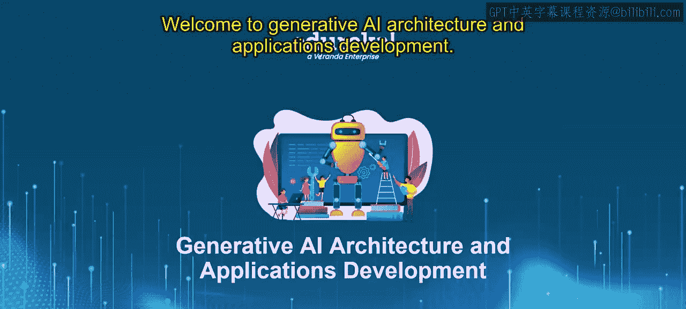
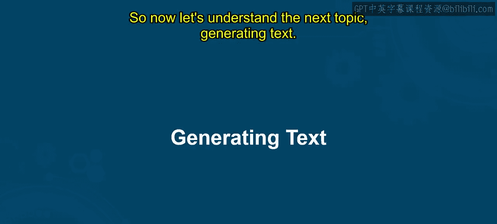
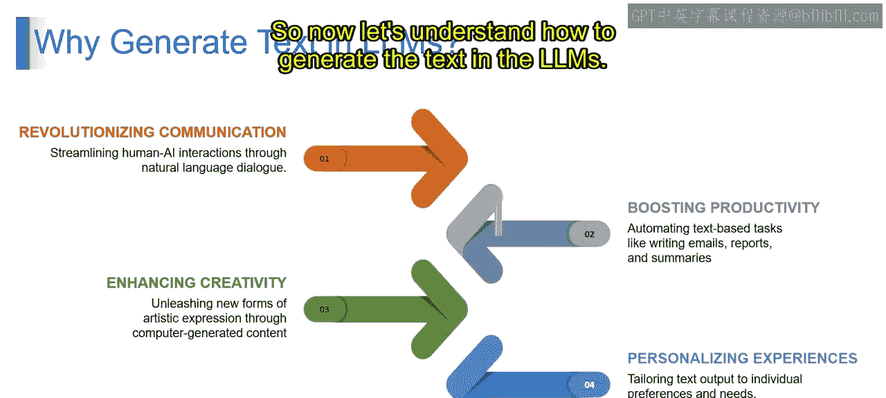
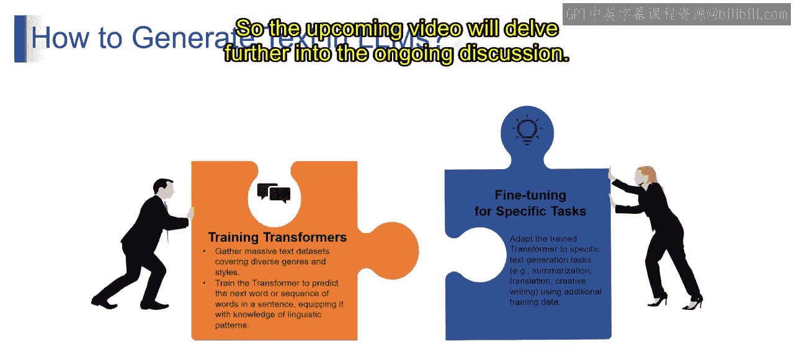

# 第二三四部分 55：生成文本

大家好，欢迎来到生成式AI架构与应用开发课程。

在本节课中，我们将要学习生成文本这一主题。我们将涵盖如何使用大型语言模型生成文本。通过本节的学习，你将能够理解生成文本的概念及其工作原理。让我们开始吧。

## 什么是文本生成？

想象一个智能机器人，它可以写故事、编写代码，甚至进行对话。这就像是教计算机自主创建文本。文本生成涉及使机器能够根据上下文产生各种类型的文本内容，从句子到完整的叙述，这就是文本生成的确切含义。

## 为什么Transformer模型至关重要？

上一节我们介绍了文本生成的基本概念，本节中我们来看看其背后的核心技术。

可以将Transformer模型视为操作背后的“大脑”。它们是强大的神经网络，如同语言理解领域的超级英雄。正如我们在之前的模块中所了解的，Transformer模型尤其擅长把握语言的细微差别和重要性，这使得它们能够生成听起来非常像人类的文本。

那么，这些Transformer模型在后台是如何工作的呢？可以将Transformer视为语言专家。它们从海量示例中学习，理解单词和短语如何组合在一起。这种知识，结合它们关注句子不同部分的能力，使Transformer能够生成不仅有意义，而且能模仿人类表达细微差别的文本。简而言之，文本生成就像训练机器成为有创造力的作家，而Transformer就是赋予它们理解并生成类人文本能力的超级英雄。

## 为什么要在LLMs中生成文本？

理解了Transformer的核心作用后，我们来看看文本生成在大型语言模型中的具体应用价值。以下是其主要目的：

**革新沟通方式**
想象一下与一个虚拟助手聊天，它不仅能理解你的问题，还能像一位乐于助人的朋友一样回应。这就像在与你的计算机对话。LLM中的文本生成通过赋能自然语言对话，使机器能够以语言上的精细度理解和回应人类查询，从而革新了沟通方式。

**提升生产力**
设想一个智能写作助手，它可以帮助你起草电子邮件、报告甚至摘要。这就像拥有一个能加速你的工作并确保其精心制作的写作伙伴。LLM通过文本生成自动化基于文本的任务，利用其对语言的理解来辅助内容创作，从而提升生产力。

**增强创造力**
想象一位AI艺术家创作独特的诗歌、故事甚至代码片段。这就像与一个能引入新鲜和创新想法的创意伙伴合作。LLM中的文本生成通过计算机生成的内容产生新形式的艺术表达，利用模型产生多样化和富有想象力的文本的能力，从而增强创造力。

**个性化体验**
想象一个专为你量身定制的新闻源，以符合你偏好的方式呈现信息。这就像拥有一份能理解你兴趣所在的个性化报纸。LLM通过根据个人偏好和需求定制文本输出，利用其对上下文和用户交互的理解来提供定制化内容，从而实现个性化体验。

综上所述，在LLM中生成文本服务于多种目的，从改善沟通、提升生产力到培养创造力和个性化体验。这些应用利用了模型的技术能力，展示了它们在自然语言理解和生成方面的强大力量。

## 如何在LLMs中生成文本？

了解了文本生成的价值后，接下来我们探讨其实现过程。以下是生成文本的两个关键步骤：

**第一步：训练Transformer模型**
我们如何训练Transformer呢？首先，需要收集海量的文本数据集，这些数据应涵盖来自不同背景的多样化信息和风格。训练Transformer的目标是预测句子中的下一个单词或单词序列，使其掌握语言模式的知识。因为它是在来自不同信息背景的海量数据上进行训练的，所以它有能力生成相关的答案。这就是Transformer模型的训练过程。

**第二步：针对特定任务进行微调**
接下来，我们利用这个预训练的Transformer模型来理解特定任务，例如摘要、翻译或创意写作。这需要使用额外的训练数据进行微调。这意味着我们利用已经预训练好的模型，并根据我们的需求对它们进行微调，以改进或专精于任何特定任务。这就是我们如何在LLMs中生成文本的方法。

## 总结

本节课中我们一起学习了文本生成。我们首先定义了文本生成，即让机器自主创建上下文相关的文本内容。接着，我们探讨了Transformer模型作为其核心“大脑”的重要性，它能够理解语言细微差别并生成类人文本。然后，我们分析了在大型语言模型中应用文本生成的四大价值：革新沟通、提升生产力、增强创造力和个性化体验。最后，我们拆解了实现文本生成的两个关键步骤：首先在海量多样化数据上训练Transformer模型以掌握语言模式，然后针对特定任务（如摘要、翻译）使用额外数据进行微调。接下来的视频将进一步深入探讨相关内容。