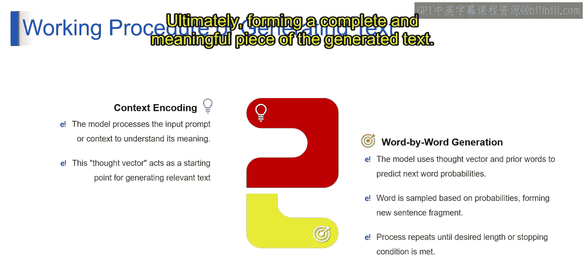
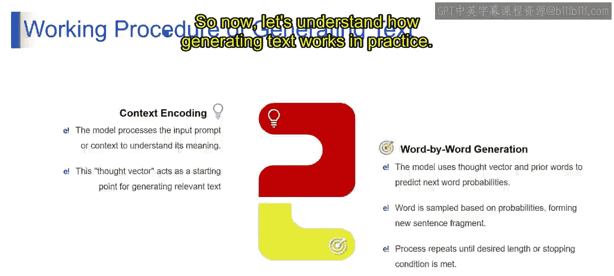
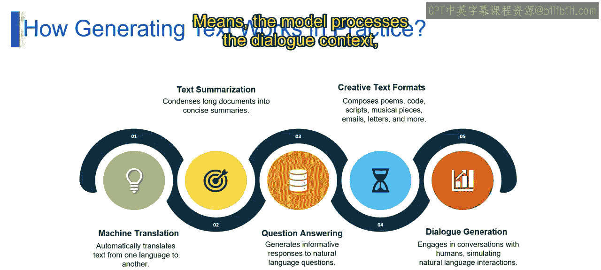
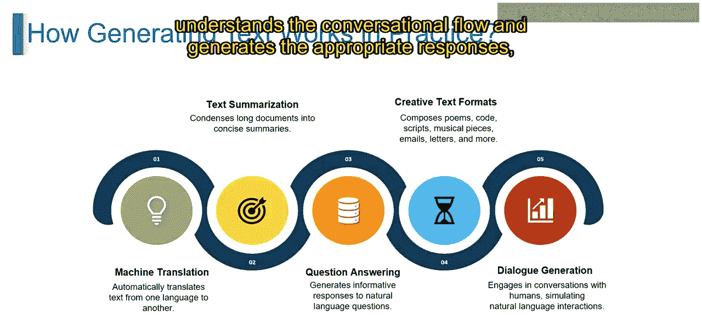
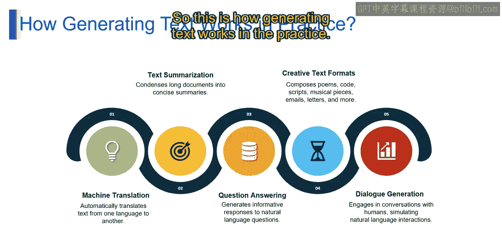
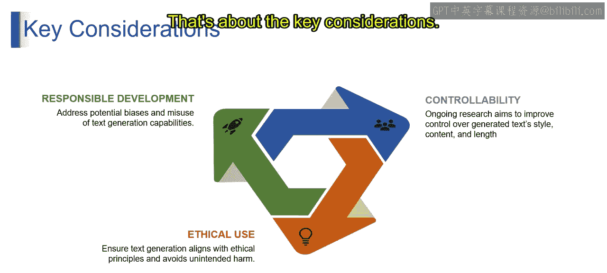
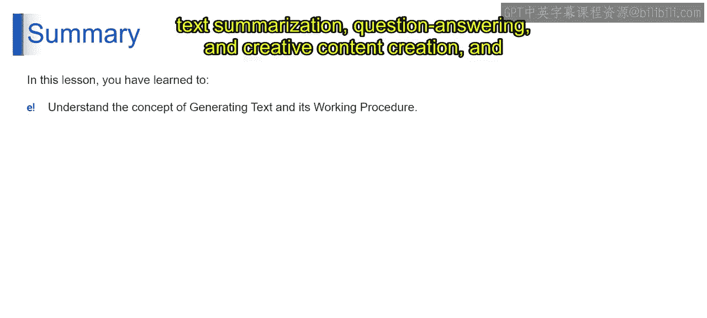

# 第二三四部分 56：生成文本的工作原理

在本节课中，我们将要学习大型语言模型生成文本的核心工作原理。我们将从模型如何理解上下文开始，逐步深入到它如何逐字生成连贯的文本，并探讨这一过程在机器翻译、文本摘要等实际场景中的应用。

## 上下文理解

上一节我们介绍了语言模型的基础，本节中我们来看看生成文本的第一步：上下文理解。

想象模型是一个正在阅读故事提示的学生。它仔细阅读并理解提示的内容，通过创建一个**思想向量**来把握输入的含义。这个思想向量就像一份心理笔记，为模型在给定上下文中生成有意义的文本做好准备。

用技术术语描述，这个过程是模型对输入上下文进行编码，创建其理解的表示。

## 逐字生成

理解了上下文之后，模型便准备好开始“写作”了。以下是逐字生成的过程：

模型利用思想向量，并考虑之前已生成的词语，来预测序列中下一个词出现的概率。接着，模型基于这些概率**采样**出一个词，并将其添加到句子中。这个过程不断重复，每个新生成的词都会影响下一个词的选择，从而形成一个连贯的句子片段。模型会持续生成词语，直到达到所需长度或满足停止条件，最终生成一段完整且与上下文相关的文本。

用公式化的语言总结：`生成的文本 = 模型(思想向量， 已生成的历史词语)`。

## 实践中的应用

了解了基本原理后，我们来看看生成文本在实践中的具体应用。以下是几个常见的例子：

*   **机器翻译**：想象你在输入一个英文句子，语言模型能轻松地将其翻译成法语。这就像口袋里有一个即时语言翻译器。模型将你的英文句子编码，然后利用其对语言模式和上下文的理解，生成法语的翻译版本。
*   **文本摘要**：设想将一篇长文章浓缩成几个抓住要点的关键句子。这就像有一个助手阅读长文档并为你提供快速摘要。模型处理输入文本，提取关键信息，并生成简洁的摘要，展示了其高效提炼内容的能力。
*   **问答系统**：向虚拟助手提问并获得详细、信息丰富的回答。这就像拥有一位知识渊博、能理解你查询的朋友。模型解码问题的含义，检索相关信息，并生成连贯的回应，展示了其在回答自然语言问题方面的能力。
*   **创意文本生成**：想象AI生成一首优美的诗、编写一段代码或创作一首独特的音乐。这就像与一位富有创造力的伙伴合作进行多样化的艺术表达。模型利用其学习到的模式，以各种格式创建内容，展示了其在生成创意和有意义文本方面的多功能性。
*   **对话生成**：与一个能智能、对话式回应的虚拟助手或聊天机器人聊天。这就像拥有一位可以与你讨论广泛话题的虚拟朋友。模型处理对话上下文，理解对话流程，并生成恰当的回应，模拟自然的语言互动。

## 关键考量因素

在享受文本生成强大能力的同时，我们也必须关注其开发与使用中的关键问题。以下是三个重要的考量方向：

*   **负责任开发**：将模型想象成一位受道德实践指导的负责任的故事讲述者。开发者确保模型理解并遵循这些原则，以避免偏见和不恰当内容。负责任开发涉及解决训练数据和微调过程中的潜在偏见，以促进公平、无偏见的文本生成。
*   **可控性**：设想一个可定制的写手。想象一个可以根据你的偏好进行定制的模型，比如选择写作风格、内容甚至长度。这就像可以控制虚拟写手的个性和写作风格。研究人员持续致力于增强对生成文本的控制力，允许用户根据自身需求和偏好来影响和定制输出。
*   **伦理使用**：将模型视为遵守伦理准则的负责任助手。确保生成的文本符合伦理原则，避免意外后果或伤害至关重要。伦理使用涉及实施保障措施和指导方针，以防止文本生成能力的滥用，确保生成的内容在各种情境中产生积极影响。

## 总结

本节课中，我们一起探索了“生成文本”的概念，即语言模型使用复杂技术来创建类人文本内容。其工作流程涉及编码上下文、创建思想向量以及逐字生成文本，最终产生连贯且与上下文相关的结果。此外，我们还了解了其在机器翻译、文本摘要、问答、创意内容生成和对话生成等方面的实际应用。理解这些原理和考量，是负责任且有效地利用生成式AI的关键一步。