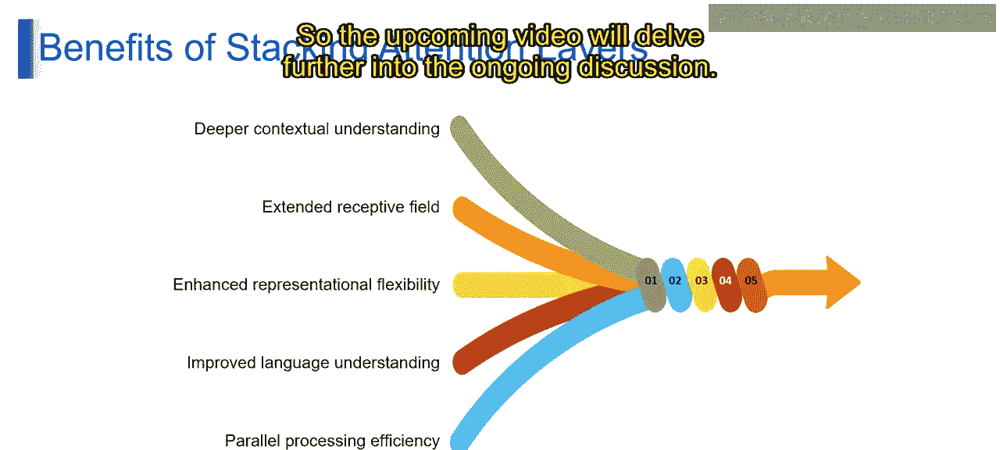

# 第二三四部分 57：堆叠注意力层


在本节课中，我们将要学习**堆叠注意力层**的概念、作用及其在大型语言模型中的重要性。通过理解这一机制，你将能够掌握如何利用它来提升模型的文本生成能力。

## 概述


堆叠注意力层是大型语言模型架构中的一个核心概念。它指的是将多个注意力层按顺序排列，每一层的输出作为下一层的输入。这个过程类似于建造一栋多层建筑，每一层都基于前一层的理解进行深化和提炼，从而使模型能够迭代式地精炼其对输入序列的理解，捕捉数据中复杂的依赖关系和细微差别。

## 堆叠注意力层的视觉化表示

上一节我们介绍了堆叠注意力层的基本概念，本节中我们来看看它在模型架构中的具体体现，以BERT模型为例。


上图展示了BERT模型的编码器结构。一个编码器层通常包含两个子层：

1.  **多头注意力层**
2.  **前馈神经网络层**

这些子层通过残差连接和层归一化技术堆叠在一起。具体结构可以表示为伪代码：

```python
# 第二三四部分 编码器层结构示意
class EncoderLayer:
    def forward(self, x):
        # 子层1：多头注意力 + 加法和归一化
        attention_output = MultiHeadAttention(x)
        x = LayerNorm(x + attention_output)  # 残差连接与层归一化

        # 子层2：前馈网络 + 加法和归一化
        ff_output = FeedForwardNetwork(x)
        output = LayerNorm(x + ff_output)  # 残差连接与层归一化
        return output
```

以下是编码器层各组成部分的详细说明：

*   **多头注意力层**：该层允许模型同时关注输入序列的不同部分。它通过多个“注意力头”实现，每个头专注于词语之间关系的不同方面。
*   **前馈层**：这是一个简单的全连接神经网络，用于学习输入序列中词语之间的非线性关系。
*   **加法和归一化**：这分别指残差连接和层归一化。残差连接将子层的输出与其输入相加，有助于梯度流动；层归一化则对子层的激活值进行标准化，以稳定训练过程。

堆叠的层数取决于具体的BERT模型变体。例如，**BERT Base**模型包含12个这样的编码器层，而**BERT Large**模型则包含24层。层数越多，模型能学习到的关系越复杂，但同时也意味着更多的参数和计算量。

## 堆叠注意力层的优势

理解了其结构后，我们来看看堆叠注意力层能为模型带来哪些关键好处。以下是其主要优势：

*   **更深层的上下文理解**：这就像阅读一个故事并试图理解人物和情节。堆叠注意力层如同逐层深入故事的每个层面，使模型能够在不同理解层次上捕捉更丰富的上下文、细微差别和细节。
*   **扩展的感受野**：想象用透镜观察风景的不同部分。堆叠注意力层就像拥有多个透镜，每个聚焦于特定区域。这扩展了模型的“视野”，使其能涵盖输入序列中更广泛的信息。
*   **增强的表征灵活性**：设想一个模型需要理解各种写作风格。堆叠注意力层通过容纳输入的不同方面提供了灵活性，使模型能够适应并以不同方式（从正式到非正式语言）表征信息。
*   **改进的语言理解**：考虑一个通过例子学习语言的学生。堆叠注意力层允许模型从多个角度学习，从而提升其对语言细微差别、语义乃至句法结构的整体理解。
*   **并行处理效率**：这类似于高效的团队协作。想象一个团队处理项目，每个成员并发地处理特定任务。堆叠注意力层允许模型通过将工作负载分布到多个层，来高效地并行处理信息，从而增强其理解和生成文本的能力。

## 总结

本节课中我们一起学习了**堆叠注意力层**。我们了解到，它是通过将多个注意力机制层顺序连接，使模型能够像剥洋葱一样，逐层深化对输入序列的理解。我们以BERT模型为例，剖析了编码器层的具体构成，包括多头注意力、前馈网络以及残差连接和层归一化。最后，我们总结了堆叠注意力层带来的五大优势：更深层的上下文理解、更广的感受野、更灵活的表征能力、更强的语言理解力以及更高的并行处理效率。这些特性共同作用，使得现代大型语言模型能够生成如此准确和流畅的文本。



