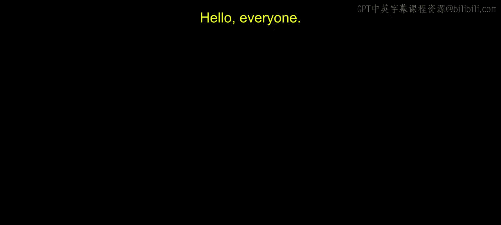
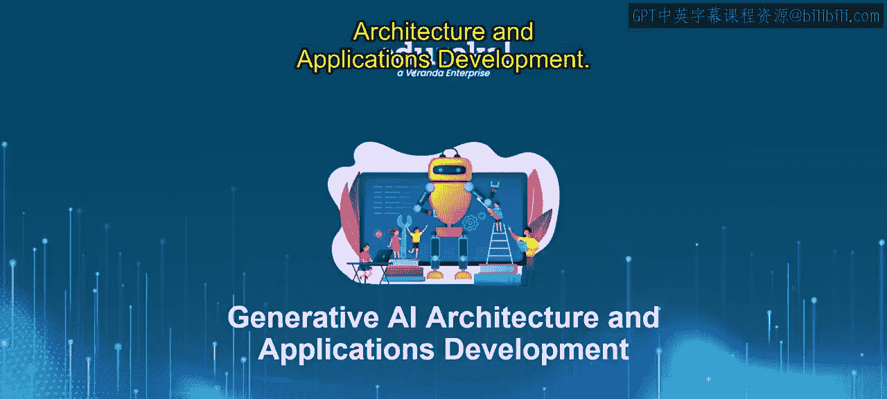
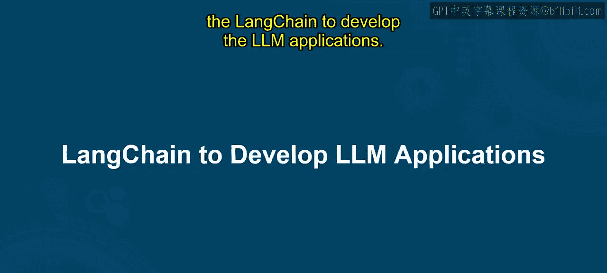
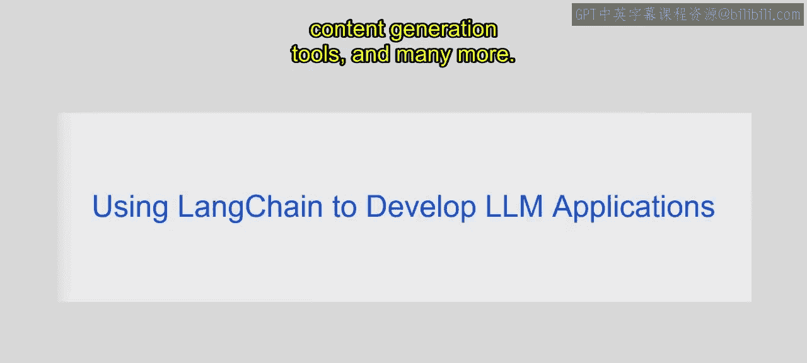
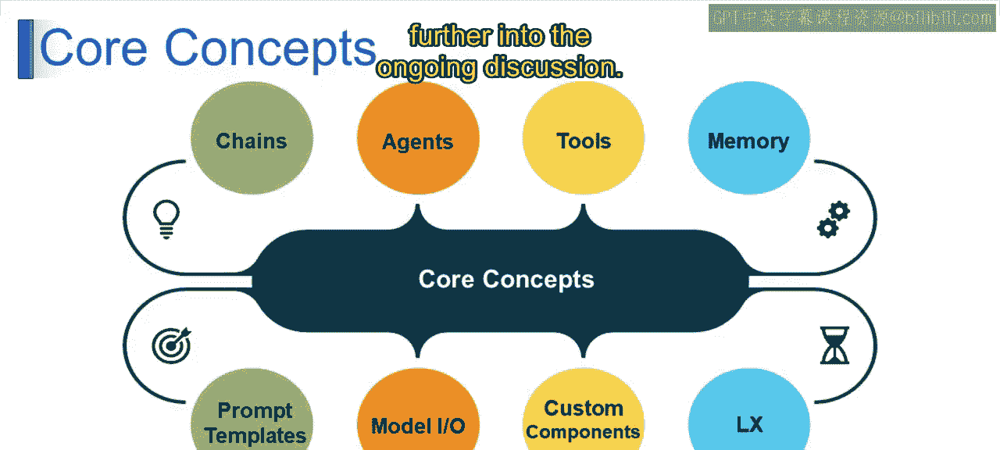

# 第二三四部分 59：使用LangChain开发LLM应用

## 概述

在本节课中，我们将学习什么是LangChain，以及它如何与大型语言模型（LLMs）协同工作来开发应用程序。课程结束时，你将能够理解并使用LangChain来开发基础的LLM应用。

---

## 什么是LangChain？🤔

想象你有一位擅长讲故事的朋友。每次你给出一个主题，他都能构思出精彩的故事。LangChain就像一个神奇的工具，让你能与这位“智能故事讲述者”（即LLM）对话，并将它的叙述转化为有用的东西，例如游戏或问答机器。

*   **你的超级有创造力的朋友**：在这里，这位朋友就是**大型语言模型（LLM）**。它是一个充满想法和故事的计算机程序，足够智能，能够理解你的话语并像朋友一样用新的话语回应。
*   **聊天工具**：这个工具就是**LangChain**。它帮助你与那位超级有创造力的朋友（LLM）交流。LangChain帮助你下达指令，并理解你的朋友（计算机程序）的回应。它甚至能记住过去的对话，让故事变得更好。
*   **酷炫的应用**：这就是**LLM应用程序**。真正的魔法发生在这里。通过使用LangChain与你的超级智能、有创造力的朋友聊天，你可以创建很棒的应用。例如，一个根据你的选择编造有趣故事的游戏，或者一个能巧妙回答你问题的程序。

因此，LangChain将理解和创造语言的超能力转化为了有用的应用程序。

---

## LangChain的技术定义

LangChain是一个**开源框架**。可以把它看作程序员的工具箱。它提供了使用大型语言模型构建应用程序的工具。这些模型是幕后的“大脑”，经过海量文本数据训练，能够像人类一样理解和回应语言。

以下是LangChain的关键组成部分概览：
*   **框架**：提供结构化的开发方式。
*   **开源**：代码公开，可自由使用和修改。
*   **大型语言模型**：作为核心“智能”引擎。

借助LangChain，程序员可以创建聊天机器人、问答系统、内容生成工具等。

---

## LangChain的核心构建模块🧱

上一节我们介绍了LangChain的基本概念，本节中我们来看看构成它的核心构建模块。以下是LangChain的一些核心构建块：

**链（Chain）**
想象一个连锁反应，一个事件导致另一个事件。在LangChain中，链是核心的工作流概念，它将不同的组件像乐高积木一样连接起来。例如，一个链可能涉及：向LLM发送提示词 -> 构建其响应 -> 然后使用该响应生成另一个提示词。

**代理（Agent）**
代理就像你的LLM应用程序中的“经理”。它们处理诸如连接到LLM、发送提示词和接收响应等任务。它们充当你的应用程序与强大的LLM之间的中介。

**工具（Tools）**
LangChain提供了各种工具，在你的应用程序中执行特定功能。这些可能包括用于数据处理、文本操作或为你的应用程序格式化LLM输出的工具。

**记忆（Memory）**
就像你在对话中会记住事情一样，LangChain的记忆组件允许你的应用程序存储来自过去与LLM交互的信息。这对于需要上下文的任务很有帮助，例如构建一个能记住过去对话的聊天机器人。

**提示词模板（Prompt Templates）**
这些是用于向LLM下达指令的预定义结构。可以把它们想象成烹饪的食谱。它们可以节省时间，并在为LLM制作提示词时确保一致性。

**模型输入/输出（Model I/O）**
这指的是LangChain中处理与不同LLM提供商通信的组件。它确保与各种LLM API的兼容性。

**自定义组件（Custom Components）**
LangChain的开源特性允许开发人员创建自己的自定义组件，以满足其应用程序中的特定需求。

**表达式语言（Expression Language）**
这也被称为**LCEL**。这是LangChain中的一个强大功能，允许创建更复杂和动态的提示词。它就像拥有一种专门为与大型语言模型集成而设计的编程语言。

通过将这些核心构建模块组合在一起，程序员可以创建复杂的LLM应用程序，以独特的方式与世界互动。LangChain提供了一个灵活且用户友好的环境来释放LLM的潜力。它还在不断扩展，例如LangSmith等工具。

---

## 总结

本节课中，我们一起学习了LangChain的基础知识。我们了解到LangChain是一个用于开发LLM应用的开源框架，它通过链、代理、工具、记忆等核心模块，简化了与大型语言模型的交互和复杂应用的构建流程。这使得开发者能够更高效地将LLM的智能转化为实际可用的应用程序。