# 第二三四部分 60：LLM的核心概念与应用领域 🧠

在本节课中，我们将要学习大型语言模型的核心概念，并了解它们在不同领域中的实际应用。我们将从LangChain框架如何将LLM作为基础构建块讲起，逐步探讨其链式能力、数据感知特性以及为开发者带来的便利。

---

### 从构建块到复杂应用

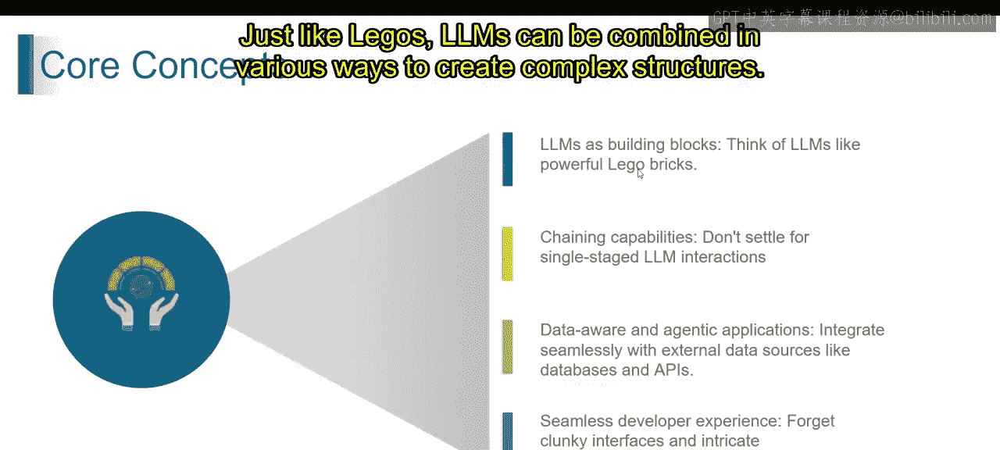

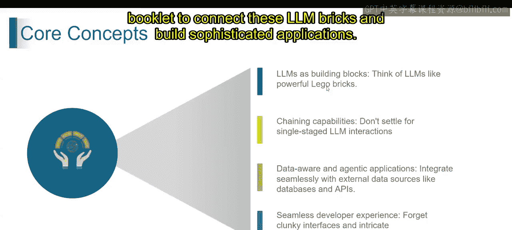

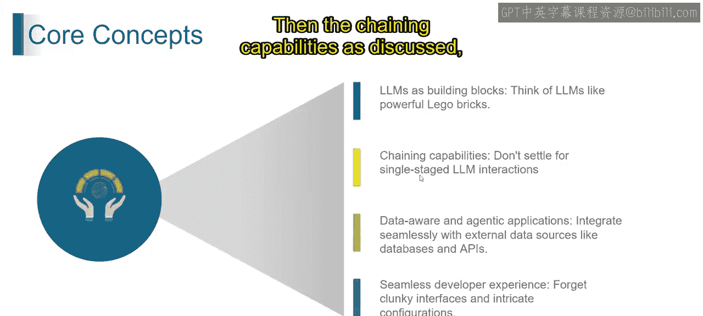

上一节我们介绍了生成式AI的基础，本节中我们来看看LLM如何作为核心构建块来创建复杂应用。

想象大型语言模型就像功能强大的乐高积木。与乐高类似，LLM可以通过多种方式组合，以构建复杂的结构。**LangChain** 提供了工具和指令，就像乐高的说明书一样，用于连接这些LLM积木，从而构建出精密的应用程序。

### 链式能力：构建多步骤交互

LLM不满足于简单的一次性交互。LangChain的链式能力允许你将多个提示和LLM交互串联并操控起来。

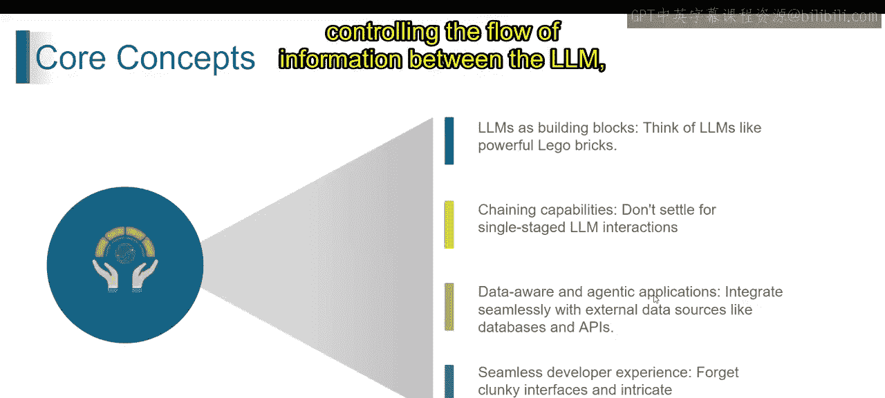

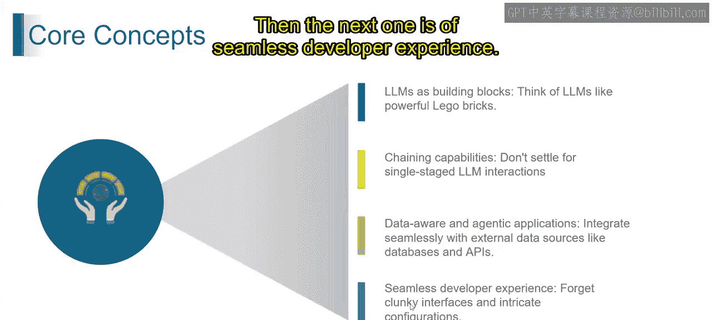

这就像搭建一个多步骤的乐高作品。你可以引导LLM完成整个对话流程，根据它的回答提出后续问题，从而创造更具互动性和动态性的体验。

### 数据感知与智能体应用

思考不应局限于LLM本身。LangChain允许你将应用程序与外部数据源（如数据库）集成，这使得你的应用具备了数据感知能力。

这就像一个可以与其他玩具或建筑材料互动的乐高套装。LangChain的智能体应用扮演着管理者的角色，控制着LLM、你的应用程序和外部数据源之间的信息流。

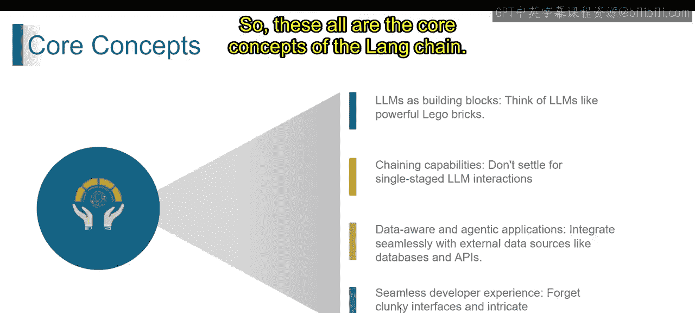

### 无缝的开发者体验

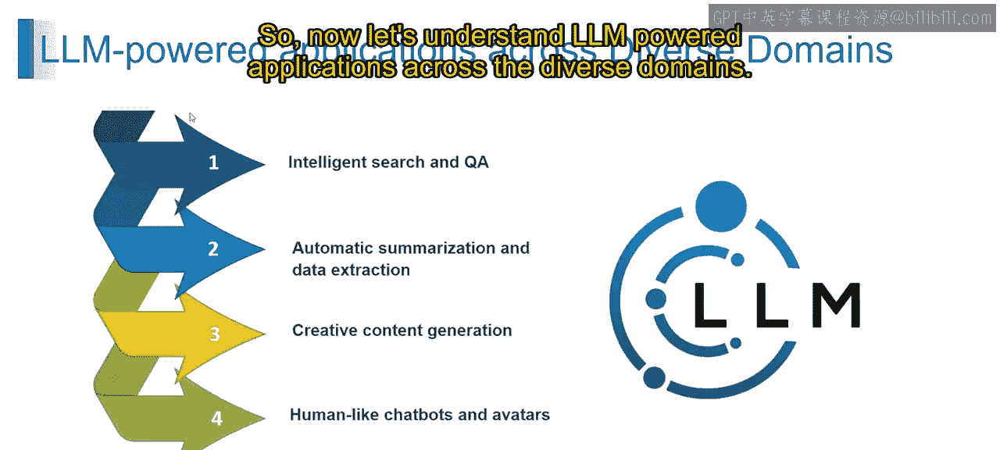

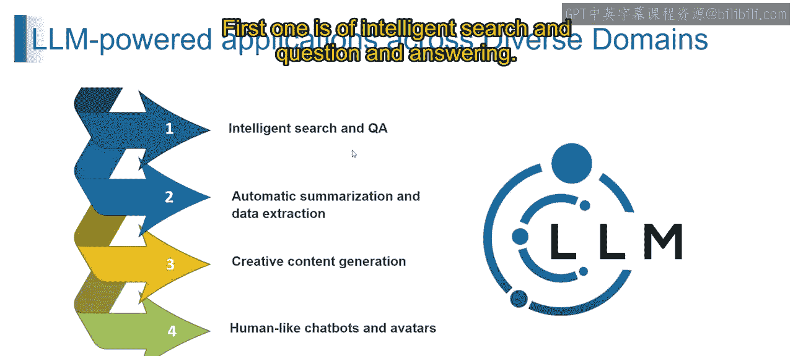

忘掉笨拙的界面和复杂的配置。LangChain是为开发者设计的，它提供了一个用户友好且文档完善的框架。

可以将其理解为一套易于理解和组装的乐高套装，即使是初学者也能上手。这让开发者能够专注于构建应用程序，而不会被技术细节所困扰。

本质上，LangChain为开发者提供了一个强大且易用的环境，以释放LLM的潜力并创建创新的应用程序。以上便是LangChain的核心概念。

---

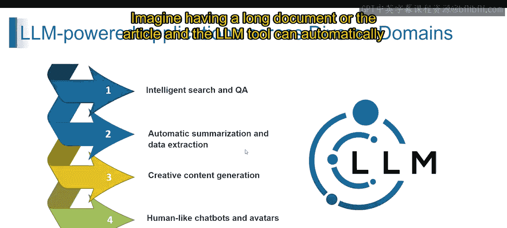

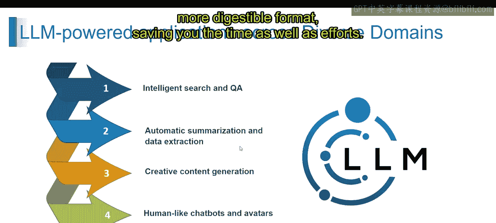

### 跨领域的LLM驱动应用

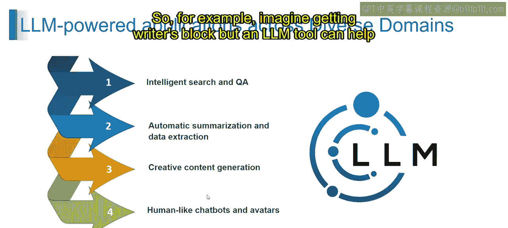

理解了核心概念后，现在让我们看看LLM驱动的应用在哪些主要领域大放异彩。

以下是LLM技术的一些关键应用领域：

*   **智能搜索与问答**：想象一下在网络上搜索信息，但得到的不是一堆链接，而是清晰简洁的答案。LLM在海量文本数据上训练，使其能够理解你搜索查询的含义并找到相关信息，然后利用其知识直接回答问题，就像一个超级搜索引擎。
*   **自动摘要与数据提取**：想象一下，面对长文档或文章，LLM工具可以自动创建抓住要点的简短摘要。LLM能够分析大量文本并识别关键信息，然后将这些信息浓缩成更短、更易消化的格式，从而节省你的时间和精力。
*   **创意内容生成**：例如，想象一下遇到写作瓶颈时，LLM工具可以帮助你构思想法，甚至撰写不同创意文本格式，如诗歌、代码脚本或音乐片段。LLM在训练过程中接触了大量创意文本，这使它们能够学习不同的写作风格，并根据你的提示和指令生成新的创意文本格式。
*   **类人聊天机器人与虚拟形象**：想象一下与一个虚拟助手对话，它能理解你的问题并以自然、类人的方式回应，而不是像机器人。由于LLM在对话数据上训练，使其能够理解人类语言的细微差别。由LLM驱动的聊天机器人和虚拟形象可以进行有意义的对话、回答你的查询，甚至提供情感支持。

这些只是LLM技术潜在应用的少数例子，并且该领域还在不断演进。通过将LLM的强大能力与LangChain等开发框架相结合，你可以在更多样化的领域中创建更具创新性和实用性的应用。

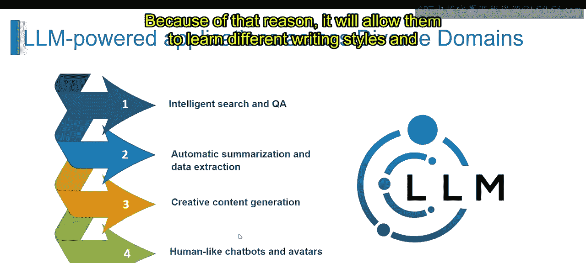

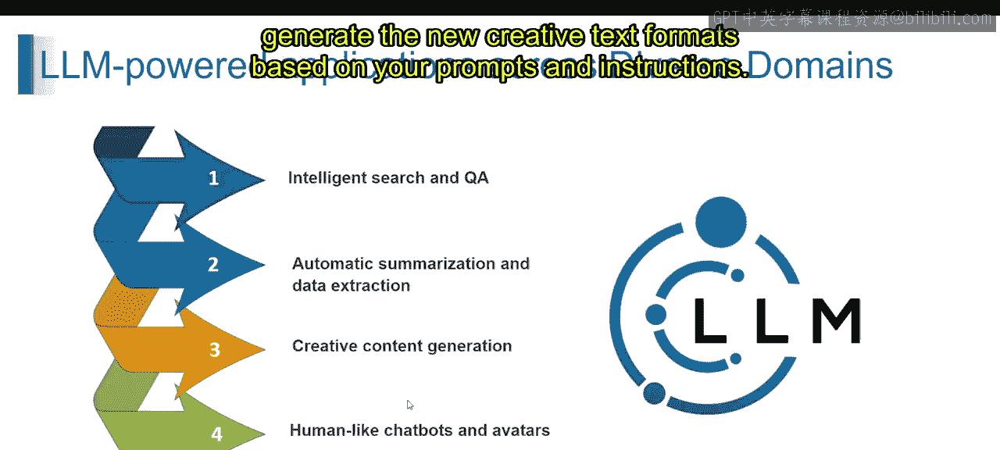

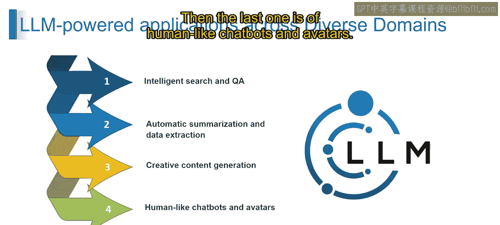

---

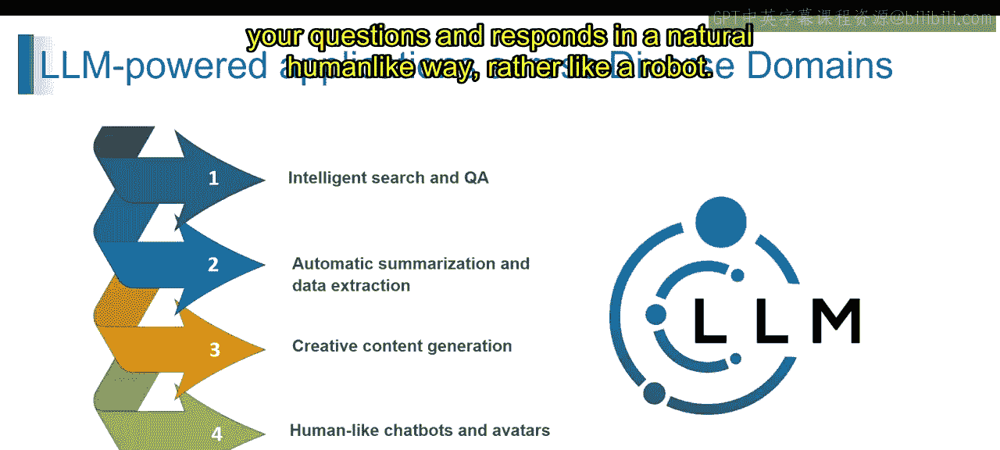

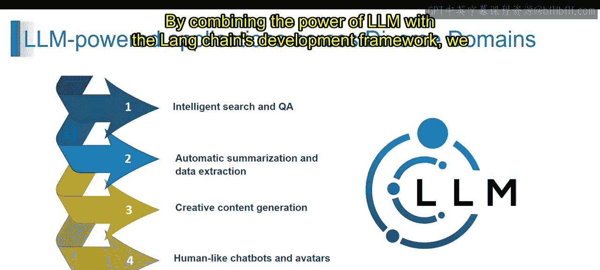

### 总结

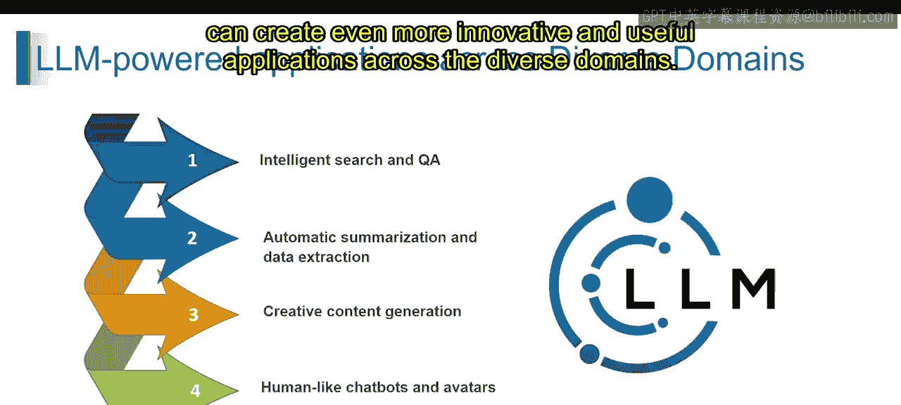

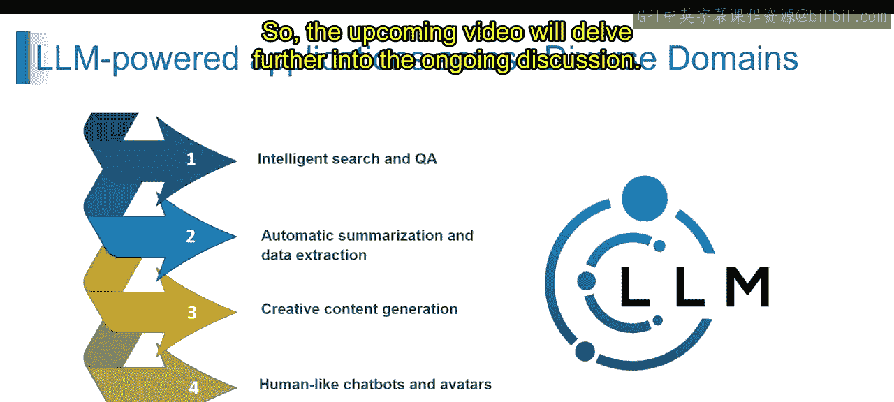

本节课中我们一起学习了大型语言模型作为应用构建块的核心概念，以及LangChain框架如何通过链式能力、数据集成和友好的开发者体验来赋能应用开发。我们还探讨了LLM在智能搜索、自动摘要、创意生成和对话交互等多个关键领域的实际应用。这些知识为我们进一步深入LLM的应用开发奠定了坚实的基础。接下来的课程将继续深入这一主题。